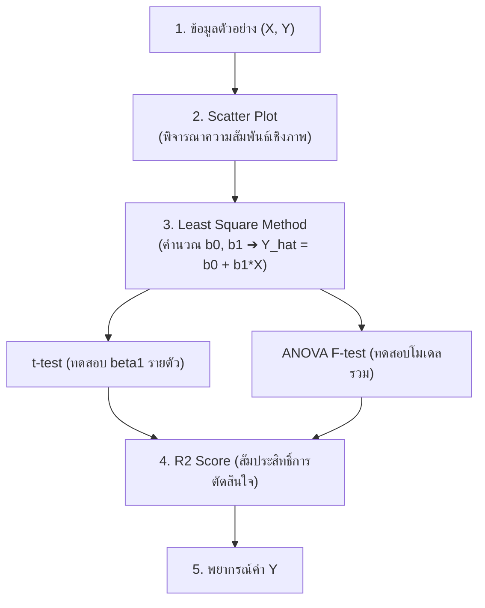

# DATA ANALYTICS - Week 06: Regression Analysis (Simple Linear)

> **วิชา:** DATA ANALYTICS AND PROGRAMMING | **สถาบัน:** คณะเทคโนโลยีสารสนเทศ
> **Source:** `Resources/Books/DATA ANALYTICS AND PROGRAMMING/Concept/data analysis6_69 st.pdf` (39 slides)

---

## Part 1: Macro Architecture & Overview

**Regression Analysis (การวิเคราะห์ความถดถอย)** คือเทคนิคทางสถิติที่ใช้ศึกษาความสัมพันธ์ระหว่างตัวแปรตั้งแต่ 2 ตัวขึ้นไป โดยมีวัตถุประสงค์หลักคือ **การพยากรณ์ (Forecasting)** ค่าของตัวแปรหนึ่ง (Y) จากตัวแปรอื่น (X) ที่ทราบล่วงหน้า เทคนิคนี้เป็นรากฐานของ Machine Learning แบบ Supervised Learning และใช้กว้างขวางในธุรกิจ วิทยาศาสตร์ และวิศวกรรม



### ตารางเปรียบเทียบประเภทการพยากรณ์

| ประเภท | หลักการ | ตัวอย่าง |
| :--- | :--- | :--- |
| **Time-Series Forecasting** | ใช้ข้อมูลในอดีตของตัวแปรเดิม | ยอดขายเดือนหน้า จากข้อมูลย้อนหลัง |
| **Causal Forecasting** | ใช้ปัจจัยที่สัมพันธ์กับตัวแปรที่ต้องการ | ยอดขายจากงบโฆษณา |

### ตารางเปรียบเทียบประเภท Regression

| ประเภท | จำนวน X | รูปสมการ |
| :--- | :--- | :--- |
| **Simple Linear Regression** | 1 ตัว | Yᵢ = β₀ + β₁Xᵢ + eᵢ |
| **Multiple Linear Regression** | k ตัว | Yᵢ = β₀ + β₁X₁ + ... + βₖXₖ + eᵢ |
| **Non-Linear Regression** | 1+ ตัว | ความสัมพันธ์ไม่เป็นเส้นตรง |

---

## Part 2: Module-by-Module Deep Dive

### 2.1 Simple Linear Regression — โครงสร้างสมการ

> **Simple Linear Regression** คือการวิเคราะห์ความสัมพันธ์ระหว่างตัวแปร 2 ตัว (X และ Y) โดยสมมติว่าความสัมพันธ์อยู่ในรูปเชิงเส้น (Linear)

#### ตัวแปรในสมการ

| สัญลักษณ์ | ชื่อ | ความหมาย |
| :--- | :--- | :--- |
| `Yᵢ` | Dependent Variable (ตัวแปรตาม) | ค่าที่ต้องการพยากรณ์ |
| `Xᵢ` | Independent Variable (ตัวแปรอิสระ) | ค่าที่ทราบหรือกำหนดไว้ล่วงหน้า |
| `β₀` | Y-intercept | ค่า Y เมื่อ X = 0 (ส่วนตัดแกน Y) |
| `β₁` | Slope / Regression Coefficient | อัตราการเปลี่ยนของ Y เมื่อ X เพิ่ม 1 หน่วย |
| `eᵢ` | Error Term (ความคลาดเคลื่อน) | ส่วนที่โมเดลอธิบายไม่ได้ |

**สมการถดถอยของประชากร:**
```
Yᵢ = β₀ + β₁Xᵢ + eᵢ    ; i = 1, 2, ..., N
```

**สมการถดถอยของตัวอย่าง (ค่าประมาณ):**
```
Ŷ = b₀ + b₁x
```

#### การตีความ β₁

| เงื่อนไข | ความหมาย |
| :--- | :--- |
| β₁ > 0 | X และ Y สัมพันธ์ทิศทางเดียวกัน (X↑ → Y↑) |
| β₁ < 0 | X และ Y สัมพันธ์ทิศทางตรงข้าม (X↑ → Y↓) |
| β₁ ≈ 0 | X และ Y มีความสัมพันธ์น้อยมาก |
| β₁ = 0 | X และ Y ไม่มีความสัมพันธ์เลย |

#### สมมติฐาน (Assumptions)

1. ค่า X ต้องกำหนดไว้ล่วงหน้า (Fixed)
2. eᵢ และ eⱼ เป็นอิสระต่อกัน (Independence)
3. eᵢ ~ N(0, σ²) — มีการแจกแจงปกติ ค่าเฉลี่ย = 0

---

### 2.2 Least Square Method — การประมาณค่าพารามิเตอร์

> **Least Square Method (วิธีกำลังสองน้อยที่สุด)** หาค่า b₀ และ b₁ ที่ทำให้ Σeᵢ² มีค่าต่ำสุด

**สูตรคำนวณ:**
```
SSₓₓ = Σxᵢ² - (Σxᵢ)²/n

SSₓᵧ = Σxᵢyᵢ - (Σxᵢ)(Σyᵢ)/n

b₁ = SSₓᵧ / SSₓₓ

b₀ = ȳ - b₁x̄
```

#### ตัวอย่าง: ยอดขาย Shampoo กับงบโฆษณาวิทยุ (10 เดือน)

| ตัวแปร | คำอธิบาย | หน่วย |
| :--- | :--- | :--- |
| Y | ยอดขาย | 10,000 บาท |
| X | ค่าโฆษณาวิทยุ | 10,000 บาท |

```
ผลรวม: Σx = 9.4,  Σy = 959,  Σxy = 924.8,  Σx² = 9.28,  n = 10

SSₓₓ = 9.28 - (9.4²/10) = 0.444
SSₓᵧ = 924.8 - (9.4 × 959/10) = 23.34

b₁ = 23.34 / 0.444 = 52.57 → ค่าโฆษณา 1 หมื่นบาท = ยอดขายเพิ่ม 52.57 หมื่นบาท
x̄ = 0.94,  ȳ = 95.9
b₀ = 95.9 - 52.57(0.94) = 46.48

∴ สมการถดถอย:  Y = 46.48 + 52.57x
```

**การตีความ:** เพิ่มงบโฆษณาวิทยุ 10,000 บาท → ยอดขายเพิ่มขึ้น **525,700 บาท**

---

### 2.3 การทดสอบสมมติฐาน

#### t-test สำหรับ β₁ (ทดสอบว่ามีความสัมพันธ์หรือไม่)

```
H₀: β₁ = 0   (ไม่มีความสัมพันธ์เชิงเส้น)
H₁: β₁ ≠ 0

t_cal = b₁ / Sb₁

โดยที่  S² = (SSᵧᵧ - b₁·SSₓᵧ) / (n-2)
        Sb₁ = S / √SSₓₓ
```

**เขตปฏิเสธ:** ปฏิเสธ H₀ ถ้า |t_cal| > t(α/2, n-2) หรือ Sig < α

**ผลตัวอย่าง:**
```
SSᵧᵧ = 93569 - (959²/10) = 1600.9
S² = (1600.9 - 52.57×23.34) / 8 = 46.74  →  S = 6.84
t_cal = 52.57 / (6.84/√0.444) = 5.12

5.12 > t(0.025, 8) = 2.31  →  ปฏิเสธ H₀
∴ X และ Y สัมพันธ์กันเชิงเส้น ที่ระดับนัยสำคัญ 0.05
```

#### ANOVA F-test สำหรับทั้งโมเดล

| แหล่งความผันแปร | DF | SS | MS | F |
| :--- | :--- | :--- | :--- | :--- |
| Regression | 1 | SSR = 1226.93 | MSR = 1226.93 | 26.24 |
| Error | n-2 = 8 | SSE = 373.97 | MSE = 46.75 | — |
| Total | n-1 = 9 | SST = 1600.90 | — | — |

```
F_cal = 26.24 > F(0.05; 1, 8) = 5.32  →  ปฏิเสธ H₀
∴ ผลเหมือนกับ t-test (F = t²)
```

#### t-test สำหรับ β₀

```
H₀: β₀ = 0  →  H₁: β₀ ≠ 0
t_cal = b₀ / Sb₀ = 46.48 / 9.88 = 4.70
4.70 > 2.31  →  ปฏิเสธ H₀  ∴ กราฟไม่ผ่านจุดกำเนิด
```

---

### 2.4 Coefficient of Determination (R²)

> **R²** คือสัดส่วนที่ X อธิบายการเปลี่ยนแปลงของ Y ได้ (0 ≤ R² ≤ 1)

```
R² = SSR / SST = 1226.93 / 1600.9 = 0.766

∴ ค่าโฆษณาอธิบายยอดขายได้ 76.6%
```

**ผลจาก SPSS:**

| R | R² | Adjusted R² | Std. Error |
| :--- | :--- | :--- | :--- |
| 0.875 | 0.766 | 0.737 | 6.837 |

**การพยากรณ์:** โฆษณา 7,000 บาท (X = 0.7):
```
Y = 46.48 + 52.57(0.7) = 83.28 หมื่นบาท = 832,800 บาท
```

---

### 2.5 ขั้นตอนสรุป

```text
1. ตรวจว่า X, Y เป็นตัวแปรเชิงปริมาณ
2. วาด Scatter Plot → ดูรูปแบบความสัมพันธ์
3. ตรวจสอบ Assumptions
4. คำนวณ b₀, b₁ (Least Square)
5. ทดสอบ β₁ และ β₀
6. คำนวณ R²
7. ใช้สมการพยากรณ์ Y จาก X
```

---

## Part 3: Quick Reference & Exam Cheat Sheet

### Checklist สรุปหัวใจสำคัญก่อนสอบ

* [ ] **ตัวแปร:** Y = Dependent, X = Independent — ต้องเป็น Quantitative ทั้งคู่
* [ ] **สมการ:** Ŷ = b₀ + b₁x (ตัวอย่าง), Yᵢ = β₀ + β₁Xᵢ + eᵢ (ประชากร)
* [ ] **b₁ = SSₓᵧ/SSₓₓ** → ค่าความชัน
* [ ] **b₀ = ȳ - b₁x̄** → จุดตัดแกน Y
* [ ] **t-test β₁:** H₀: β₁=0 → ปฏิเสธ = มีความสัมพันธ์เชิงเส้น
* [ ] **F-test ANOVA:** เทียบเท่า t-test สำหรับ β₁ (F = t²)
* [ ] **R² = SSR/SST:** ยิ่งใกล้ 1 ยิ่งดี

### สรุปสูตรสำคัญ

| สูตร | ความหมาย |
| :--- | :--- |
| `SSₓₓ = Σx² - (Σx)²/n` | Sum of Squares ของ X |
| `SSₓᵧ = Σxy - (Σx)(Σy)/n` | Sum of Cross Products |
| `b₁ = SSₓᵧ / SSₓₓ` | Slope |
| `b₀ = ȳ - b₁x̄` | Intercept |
| `S² = (SSᵧᵧ - b₁SSₓᵧ)/(n-2)` | MSE |
| `R² = SSR/SST` | Goodness of Fit |

### Concept Map

```text
Simple Linear Regression
├── สมการ: Ŷ = b₀ + b₁x
├── Least Square Method
│   ├── SSₓₓ, SSₓᵧ
│   ├── b₁ = SSₓᵧ/SSₓₓ
│   └── b₀ = ȳ - b₁x̄
├── Hypothesis Testing
│   ├── t-test (β₀, β₁)
│   └── ANOVA F-test
└── R² → Goodness of Fit
```

---

## ⚠️ Common Pitfalls & Exam Traps

* **β₁ = 0 ≠ ไม่มีความสัมพันธ์ใดๆ:** แค่ไม่มีความสัมพันธ์เชิงเส้น อาจมีแบบ Non-Linear ได้
* **R² สูง ≠ โมเดลดีเสมอ:** ต้องทดสอบ Significance ด้วย — R² ที่สูงแต่ไม่ Significant ไม่มีประโยชน์
* **หน่วยของ b₀ และ b₁:** ต้องมีหน่วยเดียวกับ Y เสมอ
* **Regression ≠ Causation:** ความสัมพันธ์ไม่ได้หมายความว่า X เป็นสาเหตุของ Y
* **DF ของ Error = n-2:** ต้องมีข้อมูลอย่างน้อย n > 2 จึงจะทดสอบได้
* **ตรวจ Scatter Plot ก่อนเสมอ:** ถ้าความสัมพันธ์ไม่เป็นเส้นตรง ไม่ควรใช้ Linear Regression

---

## เอกสารเชื่อมโยง (Wiki-Style Backlinks)

* **วิชาและหัวข้อที่เกี่ยวข้อง:**
  * [[Chapter 07 Multiple Regression Analysis]] (ต่อยอดจาก Simple → Multiple Regression)
  * [[Chapter 08 Discriminant Analysis]] (จำแนกกลุ่ม ใช้แนวคิดคล้าย Regression)
  * [[Chapter 10 Time Series and Forecasting]] (อีกแนวทางการพยากรณ์)

* **แหล่งข้อมูล:**
  * Source: `Resources/Books/DATA ANALYTICS AND PROGRAMMING/Concept/data analysis6_69 st.pdf` (39 slides, คณะเทคโนโลยีสารสนเทศ)
