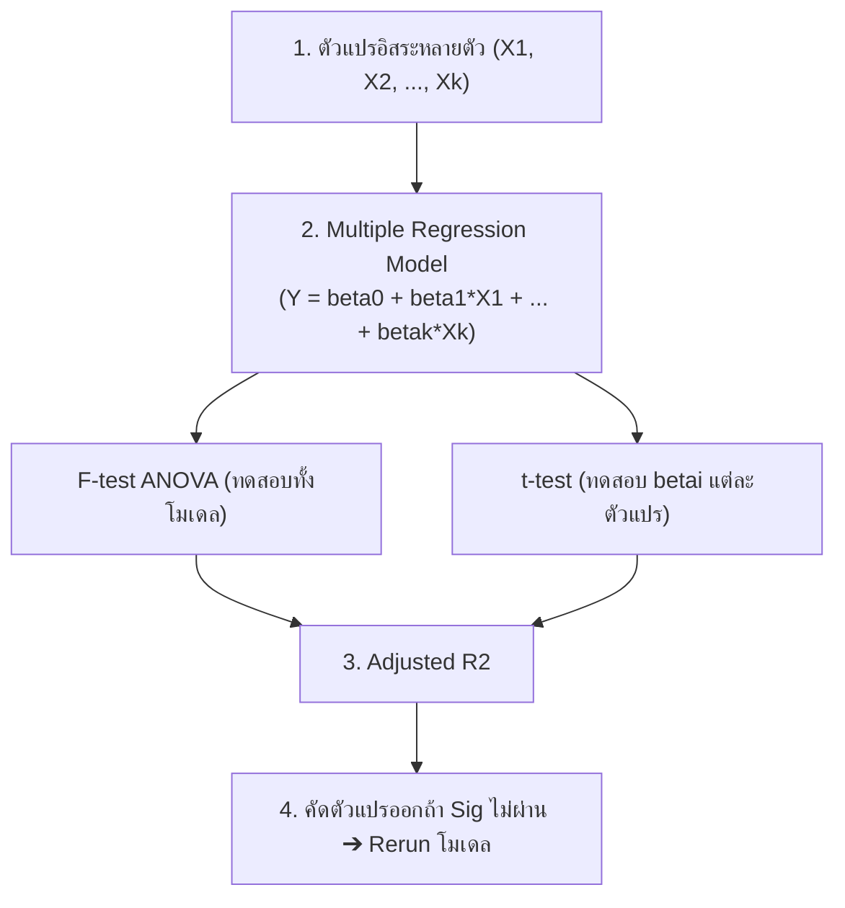

# DATA ANALYTICS - Week 07: Multiple Regression Analysis

> **วิชา:** DATA ANALYTICS AND PROGRAMMING | **สถาบัน:** คณะเทคโนโลยีสารสนเทศ
> **Source:** `Resources/Books/DATA ANALYTICS AND PROGRAMMING/Concept/data analysis7_69 st.pdf` (35 slides)

---

## Part 1: Macro Architecture & Overview

**Multiple Regression Analysis (การวิเคราะห์ความถดถอยเชิงซ้อน/เชิงพหุ)** คือส่วนขยายของ Simple Linear Regression ที่ใช้ตัวแปรอิสระ (X) หลายตัวพร้อมกันในการอธิบายและพยากรณ์ค่าตัวแปรตาม (Y) แนวคิดนี้สำคัญมากเพราะในความเป็นจริง ปรากฏการณ์ต่างๆ มักถูกกำหนดโดยหลายปัจจัยพร้อมกัน ไม่ใช่ปัจจัยเดียว เช่น ต้นทุนการผลิตขึ้นอยู่กับทั้งปริมาณวัตถุดิบ เวลาเครื่องจักร และต้นทุนคงที่



### ตารางเปรียบเทียบ Simple vs Multiple Regression

| Feature | Simple Linear | Multiple Linear |
| :--- | :--- | :--- |
| จำนวน X | 1 ตัว | k ตัว (k ≥ 2) |
| สมการ | Ŷ = b₀ + b₁x | Ŷ = b₀ + b₁x₁ + ... + bₖxₖ |
| การทดสอบ | t-test β₁ | F-test + t-test แต่ละ βᵢ |
| Goodness of Fit | R² | **Adjusted R²** (ใช้แทน R²) |
| DF Error | n-2 | n-k-1 |

---

## Part 2: Module-by-Module Deep Dive

### 2.1 สมการถดถอยเชิงซ้อน

> **Multiple Regression** คือ: Yᵢ = β₀ + β₁X₁ᵢ + β₂X₂ᵢ + ... + βₖXₖᵢ + eᵢ

#### ความหมายของ βᵢ (Partial Regression Coefficient)

> **Partial Regression Coefficient (βᵢ)** คืออัตราการเปลี่ยนแปลงของ Y เมื่อ Xᵢ เพิ่ม 1 หน่วย **โดยที่ตัวแปร X ตัวอื่นๆ คงที่**

**ตัวอย่าง:**
```
ค่าใช้จ่าย = β₀ + β₁(รายได้) + β₂(อายุ) + e

ถ้า β₁ = 0.2:  รายได้เพิ่ม 1 บาท → ซื้อหนังสือเพิ่ม 0.2 บาท (อายุคงที่)
ถ้า β₂ = 10:  อายุเพิ่ม 1 ปี   → ซื้อหนังสือเพิ่ม 10 บาท (รายได้คงที่)
```

#### สมมติฐาน (Assumptions)

1. ความคลาดเคลื่อน eᵢ ~ N(0, σ²)
2. Variance ของ eᵢ คงที่ (Homoscedasticity)
3. eᵢ และ eⱼ เป็นอิสระต่อกัน
4. **X ตัวอิสระต้องไม่สัมพันธ์กันเอง** → ถ้าสัมพันธ์กัน เรียกว่า **Multicollinearity**

---

### 2.2 การประมาณค่าพารามิเตอร์ (Least Square Method)

ใช้วิธีเดียวกับ Simple Regression แต่ต้องแก้สมการเป็นระบบ Matrix → ในทางปฏิบัติใช้ **SPSS** คำนวณ

**สมการของตัวอย่าง:**
```
Ŷ = b₀ + b₁x₁ + b₂x₂ + ... + bₖxₖ
```

---

### 2.3 เทคนิคการเลือกตัวแปรอิสระเข้าสมการ (Variable Selection)

| เทคนิค | วิธีการ | เหมาะกับ |
| :--- | :--- | :--- |
| **Enter** | นำตัวแปรทั้งหมดที่กำหนดเข้าพร้อมกัน | ผู้วิจัยกำหนดตัวแปรได้ชัดเจน |
| **Forward** | เริ่มจากไม่มีตัวแปร → เพิ่มทีละตัว | ต้องการโมเดลประหยัด |
| **Backward** | เริ่มจากทุกตัวแปร → ตัดทีละตัว | มีตัวแปรจำนวนมาก |
| **Stepwise** | ผสม Forward + Backward | ทั่วไป (นิยมที่สุด) |
| **Remove** | ผู้วิจัยกำหนดตัวแปรที่จะเอาออก | ต้องการทดสอบ hypothesis เฉพาะ |

---

### 2.4 ANOVA F-test — ทดสอบทั้งโมเดล

```
H₀: β₁ = β₂ = ... = βₖ = 0  (ไม่มีตัวแปรใดสัมพันธ์กับ Y)
H₁: มี βᵢ อย่างน้อย 1 ตัวที่ ≠ 0
```

| แหล่งแปรปรวน | DF | SS | MS | F |
| :--- | :--- | :--- | :--- | :--- |
| Regression | k | SSR | MSR = SSR/k | MSR/MSE |
| Error | n-k-1 | SSE | MSE = SSE/(n-k-1) | — |
| Total | n-1 | SST | — | — |

**เขตปฏิเสธ:** ปฏิเสธ H₀ ถ้า F_cal > F(α; k, n-k-1) หรือ **Sig < α**

---

### 2.5 t-test — ทดสอบ βᵢ รายตัว

> ทำหลัง F-test ถ้าปฏิเสธ H₀ → ต้องหาว่า βᵢ ตัวใดบ้างที่ ≠ 0

```
H₀: βᵢ = 0    H₁: βᵢ ≠ 0
t_cal = bᵢ / Sbᵢ

เขตปฏิเสธ: |t_cal| > t(α/2, n-k-1)  หรือ  Sig < α
```

**กฎสำคัญ:** ถ้าตัวแปร X ตัวใดไม่ Significant → ต้องเอาออกและ **Run โมเดลใหม่**

---

### 2.6 Adjusted R² — ค่าความเหมาะสมของโมเดล

> เนื่องจากการเพิ่มตัวแปร X จะทำให้ R² เพิ่มขึ้นเสมอ (แม้ X ตัวใหม่ไม่สัมพันธ์กับ Y) → ใช้ **Adjusted R²** แทน

```
Adjusted R² = 1 - (n-1)/(n-k-1) × (1 - R²)
```

**กฎ:** Multiple Regression ใช้ **Adjusted R²** เสมอ (ไม่ใช้ R²)

---

### 2.7 ตัวอย่างสมบูรณ์: ต้นทุนผลิตกล่องกระดาษ

**ตัวแปร:**
- Y = ต้นทุนผลิตกล่อง (1,000 บาท)
- X₁ = ปริมาณกระดาษ (ตัน)
- X₂ = เวลาที่ใช้เครื่องจักร (ชั่วโมง)
- X₃ = ต้นทุนคงที่ (1,000 บาท)

**สมการเริ่มต้น (3 ตัวแปร):**
```
Y = 60.721 + 0.961x₁ + 2.068x₂ + 0.540x₃
Adjusted R² = 0.999 = 99.9%
```

**ผลการทดสอบ β₃ (ต้นทุนคงที่):**
```
t = 1.224,  Sig = 0.235 > 0.05  →  ยอมรับ H₀  →  β₃ = 0
∴ ต้นทุนคงที่ไม่สัมพันธ์กับต้นทุนผลิต → ต้องเอาออก
```

**สมการสุดท้าย (2 ตัวแปร หลัง Rerun):**
```
Y = 52.065 + 0.945x₁ + 2.415x₂
Adjusted R² = 0.999 = 99.9%

ผล F-test: F = 11217.345,  Sig = 0.000 < 0.05  →  ปฏิเสธ H₀
∴ ทั้ง X₁ และ X₂ สัมพันธ์กับต้นทุน
```

---

### 2.8 ขั้นตอนการวิเคราะห์ Multiple Regression

```text
1. กำหนดตัวแปร X และ Y
2. ตรวจสอบ Assumptions
3. สร้างสมการ Y = β₀ + β₁X₁ + ... + βₖXₖ + e
4. ประมาณค่า b₀, b₁, ..., bₖ ด้วย SPSS
5. ทดสอบ F-test (ทั้งโมเดล)
6. ทดสอบ β₀
7. ทดสอบ βᵢ แต่ละตัว → ถ้าไม่ Sig ให้เอาออกแล้ว Rerun
8. คำนวณ Adjusted R²
```

---

## Part 3: Quick Reference & Exam Cheat Sheet

### Checklist สรุปหัวใจสำคัญก่อนสอบ

* [ ] **สมการ:** Ŷ = b₀ + b₁x₁ + b₂x₂ + ... + bₖxₖ
* [ ] **βᵢ:** อัตราการเปลี่ยน Y เมื่อ Xᵢ +1 หน่วย **โดยที่ X ตัวอื่นคงที่**
* [ ] **F-test ก่อน:** H₀: β₁=β₂=...=βₖ=0 → ถ้าปฏิเสธ ค่อย t-test แต่ละตัว
* [ ] **Multicollinearity:** X สัมพันธ์กันเอง = ปัญหา ต้องตรวจสอบ
* [ ] **Adjusted R² ≠ R²:** Multiple ใช้ Adjusted เสมอ
* [ ] **ตัวแปรที่ไม่ Sig ต้องเอาออกแล้ว Rerun**

### สรุปสูตร/ค่าสำคัญ

| ค่า | DF | สูตร |
| :--- | :--- | :--- |
| MSR | — | SSR / k |
| MSE | n-k-1 | SSE / (n-k-1) |
| F_cal | — | MSR / MSE |
| t_cal (βᵢ) | n-k-1 | bᵢ / Sbᵢ |
| Adjusted R² | — | 1 - (n-1)/(n-k-1)×(1-R²) |

### Concept Map

```text
Multiple Regression
├── สมการ: Y = β₀ + β₁X₁ + ... + βₖXₖ + e
├── Parameter Estimation (SPSS)
├── Variable Selection
│   ├── Enter, Forward, Backward, Stepwise, Remove
├── F-test (ทั้งโมเดล) ← ทำก่อนเสมอ
├── t-test (ทีละ βᵢ)  ← ถ้า F-test ปฏิเสธ H₀
│   └── ถ้า βᵢ ไม่ Sig → เอาออก → Rerun
└── Adjusted R²     ← ไม่ใช้ R² ธรรมดา
```

---

## ⚠️ Common Pitfalls & Exam Traps

* **ห้ามดู R² ใน Multiple Regression:** ต้องใช้ **Adjusted R²** เสมอ เพราะ R² เพิ่มขึ้นทุกครั้งที่เพิ่ม X แม้ X นั้นไม่มีประโยชน์
* **Multicollinearity:** ถ้า X สัมพันธ์กันเอง ค่า b จะไม่เสถียร ทำให้ผลทดสอบคลาดเคลื่อน
* **ต้อง Rerun หลังเอา X ออก:** หลังจากตัดตัวแปรที่ไม่ Significant ออก ต้อง Run SPSS ใหม่เสมอ ไม่ใช่แก้แค่สมการ
* **F-test ก่อน t-test เสมอ:** ถ้า F-test ยอมรับ H₀ ไม่ต้องทำ t-test แต่ละตัวอีก
* **βᵢ ตีความ "เมื่อ X อื่นคงที่":** ห้ามตีความ βᵢ โดยไม่ระบุ Ceteris Paribus

---

## เอกสารเชื่อมโยง (Wiki-Style Backlinks)

* **วิชาและหัวข้อที่เกี่ยวข้อง:**
  * [[Chapter 06 Regression Analysis]] (ต้นทางของ Simple Linear Regression)
  * [[Chapter 08 Discriminant Analysis]] (จำแนกกลุ่ม — ใช้หลักคิดคล้าย Regression)

* **แหล่งข้อมูล:**
  * Source: `Resources/Books/DATA ANALYTICS AND PROGRAMMING/Concept/data analysis7_69 st.pdf` (35 slides, คณะเทคโนโลยีสารสนเทศ)
