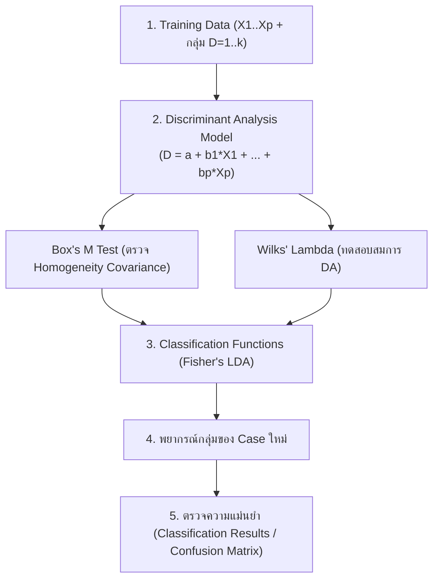

# DATA ANALYTICS - Week 08: Discriminant Analysis (DA)

> **วิชา:** DATA ANALYTICS AND PROGRAMMING | **สถาบัน:** คณะเทคโนโลยีสารสนเทศ
> **Source:** `Resources/Books/DATA ANALYTICS AND PROGRAMMING/Concept/data analysis8_69 st.pdf` (31 slides)

---

## Part 1: Macro Architecture & Overview

**Discriminant Analysis (การวิเคราะห์จำแนกกลุ่ม)** คือเทคนิคทางสถิติที่ใช้ในกรณีที่ตัวแปรตาม (Y) เป็น **ตัวแปรเชิงกลุ่ม (Categorical)** ซึ่งแตกต่างจาก Regression ที่ Y เป็นตัวแปรเชิงปริมาณ DA มีวัตถุประสงค์ 2 ด้านหลักคือ: (1) ศึกษาว่าตัวแปรใดมีบทบาทสำคัญในการแยกกลุ่ม และ (2) สร้างสมการเพื่อพยากรณ์กลุ่มของ Case ใหม่



### ตารางเปรียบเทียบ Regression vs Discriminant Analysis

| Feature | Regression | Discriminant Analysis |
| :--- | :--- | :--- |
| ตัวแปรตาม Y | Quantitative (เชิงปริมาณ) | Categorical (เชิงกลุ่ม) |
| วัตถุประสงค์ | พยากรณ์ค่า Y | จำแนกกลุ่ม / พยากรณ์กลุ่ม |
| สมการ | Ŷ = b₀ + b₁x₁ + ... | D = a + b₁x₁ + ... |
| การทดสอบ | F-test + t-test | Wilks' Lambda + t-test (Sig) |
| Output หลัก | ค่า Ŷ | Discriminant Score + กลุ่มที่พยากรณ์ |

---

## Part 2: Module-by-Module Deep Dive

### 2.1 ความรู้พื้นฐาน Discriminant Analysis

#### ลักษณะตัวแปร

| ตัวแปร | ประเภท | คำอธิบาย |
| :--- | :--- | :--- |
| **D (หรือ Y)** | Categorical | กลุ่มที่ case อยู่ (เช่น 1=ไม่เสี่ยง, 2=เสี่ยง) |
| **X₁, ..., Xₚ** | Quantitative | ตัวแปรอิสระที่คาดว่าจะแยกกลุ่มได้ |

**กฎสำคัญ:**
- แต่ละ case อยู่ได้กลุ่มเดียว
- ถ้า X เป็น Categorical ต้องแปลงเป็น **Dummy Variable** ก่อน
- การแบ่งกลุ่มต้องทำ **ก่อน** ที่จะใช้ DA

#### ตัวอย่างการใช้งาน

| สถานการณ์ | ตัวแปรตาม D | ตัวแปร X |
| :--- | :--- | :--- |
| จำแนกคนไข้โรคหัวใจ | 1=ไม่เป็น, 2=เป็น | อายุ, น้ำหนัก, Cholesterol |
| ประเมินพนักงานขาย | 1=ดีเยี่ยม, 2=ชมเชย, 3=ธรรมดา | ยอดขาย, อายุงาน, การศึกษา |
| คุณภาพลูกหนี้ธนาคาร | 1=ลูกหนี้ปกติ, 2=มีปัญหา | ปริมาณหนี้, รายได้, อาชีพ |

---

### 2.2 สมการจำแนกกลุ่ม (Discriminant Function)

**สมการของประชากร:**
```
D = β₀ + β₁X₁ + β₂X₂ + ... + βₚXₚ + e    ......(1)
```

**สมการประมาณจากตัวอย่าง:**
```
D̂ = a + b₁x₁ + b₂x₂ + ... + bₚxₚ    ......(2)
```

ค่า D̂ ที่ได้เรียกว่า **Discriminant Score** — ใช้เปรียบเทียบเพื่อตัดสินว่า case ควรอยู่กลุ่มใด

> **เป้าหมายของการประมาณ:** ทำให้ความแตกต่างระหว่างกลุ่มมีมากที่สุด

---

### 2.3 เงื่อนไข (Assumptions)

1. ตัวแปรอิสระทุกตัวในแต่ละกลุ่ม → **Multivariate Normal Distribution**
2. **Variance-Covariance Matrix ของทุกกลุ่มต้องเท่ากัน:** Σ₁ = Σ₂ = ... = Σₖ
3. ตัวแปรอิสระแต่ละตัวต้องไม่สัมพันธ์กันเอง

**การตรวจเงื่อนไขข้อ 2 ด้วย Box's M Test:**
```
H₀: Σ₁ = Σ₂    H₁: Σ₁ ≠ Σ₂

ตัวอย่าง: Box's M = 36.49, Sig = 0.100
0.100 > 0.05  →  ไม่ปฏิเสธ H₀  →  ∑ เท่ากัน → เงื่อนไขผ่าน
```

---

### 2.4 ขั้นตอนการจำแนก

```text
1. กำหนดกลุ่มประชากร (อย่างน้อย 2 กลุ่ม)
2. เลือกตัวแปรอิสระที่คาดว่าจะช่วยจำแนก
3. ตรวจสอบเงื่อนไข (Box's M Test)
4. วิเคราะห์ผล → หา Discriminant Function
5. ตรวจว่าตัวแปรใด Significant
6. สร้างสมการจำแนก
7. ทดสอบความเชื่อถือได้ (Classification Results)
```

---

### 2.5 การตรวจผลจาก SPSS

#### ตาราง Group Statistics
แสดงค่าเฉลี่ย และ SD ของแต่ละตัวแปรแยกตามกลุ่ม — ดูว่าค่าเฉลี่ยของแต่ละกลุ่มต่างกันมากไหม

#### ตาราง Tests of Equality of Group Means
```
H₀: µ(ตัวแปร, กลุ่ม 1) = µ(ตัวแปร, กลุ่ม 2)

ถ้า Sig < 0.05 → ตัวแปรนั้นช่วยแยกกลุ่มได้ → ควรเก็บไว้ในสมการ
```

#### ตาราง Wilks' Lambda
ทดสอบว่าสมการ DA ที่สร้างสามารถจำแนกความแตกต่างระหว่างกลุ่มได้หรือไม่
```
Sig < 0.05 → สมการ DA จำแนกกลุ่มได้ (ปฏิเสธ H₀)
```

#### ตาราง Canonical Discriminant Function Coefficients
ค่าสัมประสิทธิ์ a, b₁, b₂, ... สำหรับสมการ D̂ = a + b₁x₁ + ...

```
ตัวอย่าง: D̂ = -6.242 + 0.049·Size + 0.304·Revenue + 0.366·Years + 0.266·Product
```

#### ตาราง Standardized Canonical Discriminant Function Coefficients
ค่าสัมประสิทธิ์แบบมาตรฐาน → ใช้เปรียบเทียบว่า **ตัวแปรใดมีอิทธิพลต่อการจำแนกมากสุด**

#### ตาราง Classification Function Coefficients (Fisher's Linear DA)
แสดงสมการสำหรับแต่ละกลุ่ม → ใช้พยากรณ์ Case ใหม่

```
ตัวอย่าง:
D₁(Not Interest) = -18.373 + 0.307·Size - 0.372·Revenue + 3.79·Years + 1.493·Product
D₂(Interest)     = -41.397 + 0.474·Size + 0.673·Revenue + 5.049·Years + 2.407·Product
```

---

### 2.6 วิธีการพยากรณ์ Case ใหม่

| วิธี | หลักการ |
| :--- | :--- |
| **Maximum Likelihood** | คำนวณ Posterior Probability → เลือกกลุ่มที่ probability สูงสุด |
| **Distance Function** | คำนวณระยะห่างจาก Case ใหม่ถึง Centroid ของแต่ละกลุ่ม → เลือกกลุ่มที่ใกล้ที่สุด |
| **Linear Classification** | คำนวณ D Score จากสมการแต่ละกลุ่ม → เลือกกลุ่มที่ D Score สูงสุด |

**ตัวอย่าง Linear Classification:**
```
Case ใหม่: Size=54, Revenue=5, Year=6, Product=6

D̂(Not Interest) = -18.373 + 0.307(54) - 0.372(5) + 3.79(6) + 1.493(6) = 28.043
D̂(Interest)     = -41.397 + 0.474(54) + 0.673(5) + 5.049(6) + 2.407(6) = 32.3

32.3 > 28.043  →  จัด case นี้เป็นกลุ่ม Interest
```

---

### 2.7 การประเมินความแม่นยำของสมการ

| วิธีประเมิน | คำอธิบาย |
| :--- | :--- |
| **ใช้ข้อมูลทั้งหมด** | สร้างสมการจากข้อมูลทั้งหมด แล้วพยากรณ์ข้อมูลเดิมนั้น |
| **Train/Test Split** | แบ่งข้อมูลเป็น Training และ Testing Set |
| **Leave-One-Out (n-1)** | ใช้ข้อมูล n-1 หน่วยสร้างสมการ → พยากรณ์หน่วยที่เหลือ ทำ n ครั้ง |

ดูผลใน **Classification Results Table** → ดูสัดส่วน Case ที่จำแนกได้ถูกต้อง

---

## Part 3: Quick Reference & Exam Cheat Sheet

### Checklist สรุปหัวใจสำคัญก่อนสอบ

* [ ] **DA ใช้เมื่อ:** ตัวแปรตาม D เป็น Categorical (กลุ่ม) ไม่ใช่ Quantitative
* [ ] **ตัวแปรอิสระ X:** ต้องเป็น Quantitative (Categorical → Dummy Variable)
* [ ] **Box's M Test:** ตรวจเงื่อนไข Σ₁ = Σ₂ (Sig > 0.05 = ผ่าน)
* [ ] **Wilks' Lambda:** ทดสอบว่าสมการ DA ใช้ได้ (Sig < 0.05 = ใช้ได้)
* [ ] **Discriminant Score D̂:** คำนวณแล้วเปรียบเทียบระหว่างกลุ่ม
* [ ] **Classification Results:** ดูความแม่นยำของการจำแนก

### สรุปขั้นตอนสำคัญ

| ขั้น | การดำเนินการ | ผลที่ตรวจ |
| :--- | :--- | :--- |
| 1 | ตรวจเงื่อนไข | Box's M Sig > 0.05 |
| 2 | Group Statistics | ค่าเฉลี่ยต่างกันหรือไม่ |
| 3 | Tests of Equality | Sig < 0.05 = ตัวแปรช่วยแยกได้ |
| 4 | Wilks' Lambda | Sig < 0.05 = สมการใช้ได้ |
| 5 | Discriminant Function | สมการ D̂ |
| 6 | Classification Function | สมการแต่ละกลุ่มสำหรับพยากรณ์ |
| 7 | Classification Results | ความแม่นยำ (%) |

### Concept Map

```text
Discriminant Analysis
├── ตัวแปรตาม D = Categorical
├── Assumptions
│   ├── Multivariate Normal
│   ├── Equal Covariance (Box's M)
│   └── X ไม่สัมพันธ์กันเอง
├── Discriminant Function: D̂ = a + b₁x₁ + ...
│   └── วัตถุประสงค์: maximize separation between groups
├── Testing
│   ├── Box's M (เงื่อนไข)
│   ├── Tests of Equality (ทีละตัวแปร)
│   └── Wilks' Lambda (ทั้งสมการ)
└── Classification
    ├── Maximum Likelihood
    ├── Distance Function
    └── Fisher's Linear Classification
```

---

## ⚠️ Common Pitfalls & Exam Traps

* **DA ≠ Regression:** DA ใช้เมื่อ Y เป็น Categorical ถ้า Y เป็น Quantitative → ใช้ Regression
* **Box's M ปฏิเสธ H₀:** ถ้า Sig < 0.05 → เงื่อนไขไม่ผ่าน ต้องระวังการแปลผล
* **Standardized Coefficient ≠ Unstandardized:** Standardized ใช้เปรียบเทียบความสำคัญ แต่ Unstandardized ใช้สร้างสมการ
* **Classification Results ≠ R²:** เป็นสัดส่วน Case ที่จำแนกถูก ไม่ใช่ค่า Goodness of Fit แบบ R²
* **กลุ่มต้องกำหนดก่อน:** DA ไม่สร้างกลุ่มเอง ต้องกำหนดกลุ่มมาก่อน (ต่างจาก Cluster Analysis)
* **Case อยู่ได้กลุ่มเดียว:** ถ้าต้องการจัด case ที่อยู่ได้หลายกลุ่ม ต้องใช้วิธีอื่น

---

## เอกสารเชื่อมโยง (Wiki-Style Backlinks)

* **วิชาและหัวข้อที่เกี่ยวข้อง:**
  * [[Chapter 06 Regression Analysis]] (Regression ใช้เมื่อ Y เป็น Quantitative)
  * [[Chapter 07 Multiple Regression Analysis]] (Multiple Regression — ใช้แนวคิดสมการคล้ายกัน)

* **แหล่งข้อมูล:**
  * Source: `Resources/Books/DATA ANALYTICS AND PROGRAMMING/Concept/data analysis8_69 st.pdf` (31 slides, คณะเทคโนโลยีสารสนเทศ)
