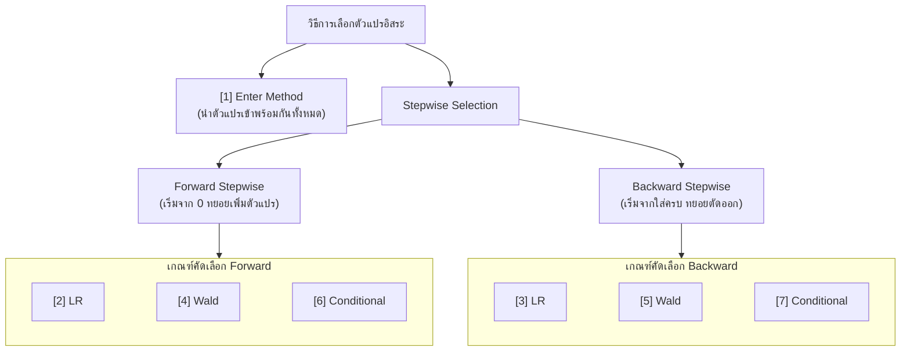

# DATA ANALYTICS AND PROGRAMMING - Chapter 09: Logistic Regression Analysis

> **วิชา:** DATA ANALYTICS AND PROGRAMMING (Business Data Analytics) | **สถาบัน:** คณะเทคโนโลยีสารสนเทศ, KMITL
> **Source:** `Resources/Books/DATA ANALYTICS AND PROGRAMMING/Concept/data analysis9_69 st.pdf` (48 slides)

---

## Part 1: Macro Architecture & Overview

**การวิเคราะห์ความถดถอยโลจิสติค (Logistic Regression Analysis)** เป็นเทคนิคการวิเคราะห์ทางสถิติและการเรียนรู้ของเครื่อง (Machine Learning) ที่ใช้ศึกษาความสัมพันธ์ระหว่างตัวแปรอิสระ (Independent Variables) กับตัวแปรตาม (Dependent Variable) ที่เป็น **ตัวแปรเชิงคุณภาพ (Categorical Variable)** เพื่อพยากรณ์ความน่าจะเป็นหรือโอกาส (Probability) ที่แต่ละหน่วยข้อมูลจะถูกจัดจำแนกให้อยู่ในกลุ่มใดกลุ่มหนึ่ง แตกต่างจากการถดถอยเชิงเส้น (Linear Regression) แบบดั้งเดิมที่ใช้พยากรณ์ค่าต่อเนื่อง โดย Logistic Regression จะอาศัย **ฟังก์ชันซิกมอยด์ (Sigmoid / Logistic Function)** และการแปลงเป็น **Logit (Log of Odds)** เพื่อจำกัดขอบเขตของผลลัพธ์ให้อยู่ในช่วง $[0, 1]$ เสมอ และประมาณค่าพารามิเตอร์ด้วยวิธี **Maximum Likelihood Estimation (MLE)**



1. **Enter:** นำตัวแปรอิสระทั้งหมดที่กำหนดไว้เข้าสู่สมการพร้อมกันในขั้นตอนเดียว
2. **Forward Stepwise (Likelihood Ratio - LR):** คัดเลือกตัวแปรเข้าทีละตัว โดยพิจารณาตัวแปรที่ทำให้ค่า Likelihood Ratio เปลี่ยนแปลงอย่างมีนัยสำคัญที่สุด
3. **Backward Stepwise (Likelihood Ratio - LR):** ใส่ตัวแปรทั้งหมดเข้าสมการก่อน แล้วทยอยตัดตัวแปรที่ไม่มีนัยสำคัญออกตามเกณฑ์ Likelihood Ratio
4. **Forward Stepwise (Wald):** คัดเลือกตัวแปรเข้าทีละตัวโดยใช้ค่าสถิติ Wald
5. **Backward Stepwise (Wald):** ทยอยคัดตัวแปรออกทีละตัวโดยใช้ค่าสถิติ Wald
6. **Forward Stepwise (Conditional):** คัดเลือกตัวแปรเข้าโดยใช้ความน่าจะเป็นแบบมีเงื่อนไขของตัวแปร
7. **Backward Stepwise (Conditional):** ทยอยคัดตัวแปรออกโดยใช้เกณฑ์ Conditional Parameter

---

### 2.6 ตัวอย่างการคำนวณด้วยตนเอง (Hand Calculation Example)

#### โจทย์ตัวอย่างจากสไลด์ (Slide 21–22)
> ศึกษาความแตกต่างของการจ่ายเงินปันผลของบริษัทในตลาดหลักทรัพย์ โดยสุ่มตัวอย่างบริษัทที่มีการจ่ายเงินปันผล 20 บริษัท และไม่จ่ายเงินปันผล 20 บริษัท กำหนดตัวแปรดังนี้:
> - **ตัวแปรตาม ($Y$):** $1$ ถ้าปีที่แล้วจ่ายเงินปันผล, $0$ ถ้าปีที่แล้วไม่จ่ายเงินปันผล
> - **ตัวแปรอิสระ ($\text{Size}$):** $1$ ถ้าทุนจดทะเบียน $> 1,000$ ล้านบาท (บริษัทขนาดใหญ่), $0$ ถ้าทุนจดทะเบียน $\le 1,000$ ล้านบาท (บริษัทขนาดเล็ก)
> - ผลการประมาณค่าสัมประสิทธิ์ได้: $b_0 = -1.163$ และ $b_1 = 1.322$
>
> **จงหา:** Logistic Response Function, Odds, และ Logit Function

#### ขั้นตอนการแสดงวิธีทำ

**1. หาสมการ Logistic Response Function:**
$$\hat{P}(Y=1) = \frac{1}{1 + e^{-(b_0 + b_1 \cdot \text{Size})}} = \frac{1}{1 + e^{-(-1.163 + 1.322 \cdot \text{Size})}}$$

- **กรณีบริษัทขนาดเล็ก ($\text{Size} = 0$):**
$$\hat{P}(Y=1) = \frac{1}{1 + e^{-(-1.163)}} = \frac{1}{1 + e^{1.163}} = \frac{1}{1 + 3.1996} = \frac{1}{4.1996} \approx 0.2381 \text{ (23.81\%)}$$
- **กรณีบริษัทขนาดใหญ่ ($\text{Size} = 1$):**
$$W = -1.163 + 1.322(1) = 0.159$$
$$\hat{P}(Y=1) = \frac{1}{1 + e^{-0.159}} = \frac{1}{1 + 0.8530} = \frac{1}{1.8530} \approx 0.5397 \text{ (53.97\%)}$$

**2. หาสมการ Odds:**
$$\text{Odds} = e^{b_0 + b_1 \cdot \text{Size}} = e^{-1.163 + 1.322 \cdot \text{Size}}$$

- **Odds ของบริษัทขนาดเล็ก ($\text{Size} = 0$):**
$$\text{Odds}_0 = e^{-1.163} \approx 0.3125$$
*(โอกาสที่บริษัทเล็กจะจ่ายเงินปันผลคิดเป็น 0.3125 เท่าของโอกาสที่จะไม่จ่าย)*
- **Odds ของบริษัทขนาดใหญ่ ($\text{Size} = 1$):**
$$\text{Odds}_1 = e^{-1.163 + 1.322} = e^{0.159} \approx 1.1723$$
*(โอกาสที่บริษัทใหญ่จะจ่ายเงินปันผลคิดเป็น 1.1723 เท่าของโอกาสที่จะไม่จ่าย)*
- **Odds Ratio ($\text{OR} = \text{Exp}(b_1)$):**
$$\text{OR} = \frac{\text{Odds}_1}{\text{Odds}_0} = \frac{1.1723}{0.3125} = e^{1.322} \approx 3.7509$$
*(บริษัทขนาดใหญ่มีโอกาส (Odds) ในการจ่ายเงินปันผลเป็น **3.75 เท่า** ของบริษัทขนาดเล็ก)*

**3. หาสมการ Logit Function:**
$$\ln(\text{Odds}) = b_0 + b_1 \cdot \text{Size} = -1.163 + 1.322 \cdot \text{Size}$$

---

### 2.7 กรณีศึกษาและการแปลผลจากโปรแกรม SPSS: การพยากรณ์โรคหัวใจ

#### รายละเอียดชุดข้อมูลตัวอย่าง (Slide 27)
- **กลุ่มตัวอย่าง:** คนไข้ 200 คนที่มารับการตรวจที่โรงพยาบาลแห่งหนึ่ง
- **ตัวแปรตาม ($Y$):** การเป็นโรคหัวใจ ($0$ = ไม่เป็น [110 คน], $1$ = เป็น [90 คน])
- **ตัวแปรอิสระเชิงคุณภาพ 4 ตัว (แปลงเป็น Dummy 6 ตัวแปร):**
  - เพศ (1 ตัวแปร: หญิง = 1, ชาย = 0)
  - รายได้ (3 ตัวแปร: รายได้ 1, รายได้ 2, รายได้ 3 โดย ต่ำกว่า 10,000 เป็น Reference)
  - เบาหวาน (1 ตัวแปร: เป็น = 1, ไม่เป็น = 0)
  - กรรมพันธุ์ (1 ตัวแปร: มี = 1, ไม่มี = 0)
- **ตัวแปรอิสระเชิงปริมาณ 7 ตัว:** อายุ, น้ำหนัก, โคเลสเตอรอล, ไตรกลีเซอร์ไรด์, กลูโคส, ความดันบน, ความดันล่าง

---

#### ขั้นตอนที่ 1: วิเคราะห์แบบจำลองเริ่มต้น Step 0 (Beginning Block / Intercept-Only)
ในขั้นตอนนี้ยังไม่มีตัวแปรอิสระใดๆ เข้าสู่สมการ มีเฉพาะค่าคงที่ ($b_0$)

**1. ตารางที่ 1: Iteration History (Step 0)**
- รอบที่ 1: $b_0 = -0.200$, $-2LL = 275.256$
- รอบที่ 2: $b_0 = -0.201$, $-2LL = 275.256$
- เมื่อทำมาถึงรอบที่ 2 ค่า $b_0$ เปลี่ยนแปลงเพียงเล็กน้อยและ $-2LL$ คงที่ การประมาณค่าจึงยุติลงที่ $-2LL = 275.256$
- ความน่าจะเป็นเฉลี่ยของการเป็นโรคหัวใจ:
$$\hat{P}(Y=1) = \frac{1}{1 + e^{-(-0.201)}} = \frac{1}{1 + e^{0.201}} = \frac{1}{1 + 1.2226} \approx 0.45 \text{ (90/200 คน)}$$

**2. ตารางที่ 2: Variables in the Equation (Step 0)**
- Constant $B = -0.201, \text{S.E.} = 0.142, \text{Wald} = 1.993, df = 1, \text{Sig.} = 0.158, \text{Exp}(B) = 0.818$
- ค่า $\text{Sig.} = 0.158 > 0.05$ แสดงว่ายังไม่มีหลักฐานเพียงพอที่จะปฏิเสธ $H_0$ สรุปว่าค่าคงที่ $\beta_0$ ไม่แตกต่างจาก 0 อย่างมีนัยสำคัญ

**3. ตารางที่ 3: Classification Table (Step 0)**
- เมื่อไม่มีตัวแปรอิสระ โมเดลจะทายกลุ่มที่มีจำนวนมากกว่าเป็นหลัก (ทายทุกคนว่า "ไม่เป็นโรคหัวใจ")
- ทายถูกต้อง 110 คนจาก 200 คน $\rightarrow$ ความถูกต้องรวม (**Overall Percentage Correct**) เท่ากับ **55.0%** (เป็นเกณฑ์มาตรฐานขั้นต่ำ / Baseline)

---

#### ขั้นตอนที่ 2: วิเคราะห์แบบจำลองตัวแปรอิสระ 13 ตัว (Step 1 Full Model, Method = Enter)
นำตัวแปรอิสระทั้ง 13 ตัว (หลังการทำ Dummy Coding) เข้าสู่สมการพร้อมกัน

```text
W = β0 + β1(เพศ) + β2(รายได้1) + β3(รายได้2) + β4(รายได้3) + β5(อายุ)
    + β6(น้ำหนัก) + β7(โคเลสเตอรอล) + β8(ไตรกลีเซอร์ไรด์) + β9(กลูโคส)
    + β10(ความดันบน) + β11(ความดันล่าง) + β12(เบาหวาน) + β13(กรรมพันธุ์)
```

**1. ตารางที่ 4: Omnibus Tests of Model Coefficients**
- $\text{Model } \chi^2 = 179.163, df = 13, \text{Sig.} = 0.000$
- ผลต่างของ $-2LL$ ระหว่าง Step 0 (275.256) และ Step 1 (96.092) คือ $275.256 - 96.092 = 179.164$
- ค่า $\text{Sig.} = 0.000 < 0.05$ ปฏิเสธ $H_0$ สรุปว่า เมื่อเพิ่มตัวแปรทั้ง 13 ตัวแล้ว โมเดลมีประสิทธิภาพในการพยากรณ์ดีขึ้นอย่างมีนัยสำคัญทางสถิติ

**2. ตารางที่ 5: Hosmer and Lemeshow Test**
- $\chi^2 = 15.284, df = 8, \text{Sig.} = 0.054$
- ค่า $\text{Sig.} = 0.054 > 0.05$ จึง **ไม่สามารถปฏิเสธ $H_0$ ได้** ยืนยันว่า **แบบจำลองมีความเหมาะสมและสอดคล้องกับข้อมูลจริง**

**3. ตารางที่ 6: Model Summary**
- $-2 \text{ Log likelihood} = 96.092$ (ลดลงอย่างมากจาก 275.256)
- $\text{Cox \& Snell } R^2 = 0.592$
- $\text{Nagelkerke } R^2 = 0.792$ (ตัวแปรทั้ง 13 ตัวสามารถร่วมกันอธิบายความผันแปรของโอกาสการเกิดโรคหัวใจได้ถึง 79.2%)

**4. ตารางที่ 7: Classification Table**
- ทำนายกลุ่ม "ไม่เป็นโรคหัวใจ" ถูกต้อง 103 จาก 110 คน (93.6%)
- ทำนายกลุ่ม "เป็นโรคหัวใจ" ถูกต้อง 76 จาก 90 คน (84.4%)
- ความถูกต้องรวม (**Overall Percentage Correct**) เพิ่มขึ้นเป็น **89.5%** (ดีขึ้นกว่า Step 0 ที่ได้ 55.0% อย่างชัดเจน)

**5. ตารางที่ 8: Variables in the Equation (คัดกรองตัวแปรที่มีนัยสำคัญ)**

| ตัวแปร | $B$ | S.E. | Wald | $df$ | Sig. | $\text{Exp}(B)$ | 95% C.I. for $\text{Exp}(B)$ | ผลการทดสอบ ($\alpha = 0.05$) |
| :--- | :---: | :---: | :---: | :---: | :---: | :---: | :---: | :--- |
| เพศ | 0.395 | 0.734 | 0.289 | 1 | 0.591 | 1.484 | [0.352, 6.254] | ไม่ Sig |
| รายได้รวม | | | 2.166 | 3 | 0.539 | | | ไม่ Sig |
| - รายได้(1) | 0.222 | 0.847 | 0.069 | 1 | 0.793 | 1.248 | [0.237, 6.569] | ไม่ Sig |
| - รายได้(2) | 0.983 | 0.884 | 1.235 | 1 | 0.266 | 2.671 | [0.472, 15.104] | ไม่ Sig |
| - รายได้(3) | -0.043 | 0.927 | 0.002 | 1 | 0.963 | 0.958 | [0.156, 5.898] | ไม่ Sig |
| **อายุ** | **0.118** | **0.039** | **8.952** | **1** | **0.003** | **1.125** | **[1.042, 1.216]** | **Sig ($\text{p} < 0.05$)** |
| น้ำหนัก | 0.040 | 0.037 | 1.185 | 1 | 0.276 | 1.041 | [0.968, 1.119] | ไม่ Sig |
| โคเลสเตอรอล | -0.022 | 0.013 | 2.732 | 1 | 0.098 | 0.978 | [0.953, 1.004] | ไม่ Sig |
| **ไตรกลีเซอร์ไรด์** | **0.074** | **0.018** | **17.873** | **1** | **0.000** | **1.077** | **[1.041, 1.115]** | **Sig ($\text{p} < 0.05$)** |
| **กลูโคส** | **-0.083** | **0.028** | **8.577** | **1** | **0.003** | **0.920** | **[0.870, 0.973]** | **Sig ($\text{p} < 0.05$)** |
| ความดันบน | -0.019 | 0.047 | 0.158 | 1 | 0.691 | 0.982 | [0.896, 1.076] | ไม่ Sig |
| ความดันล่าง | -0.002 | 0.053 | 0.002 | 1 | 0.967 | 0.998 | [0.900, 1.106] | ไม่ Sig |
| **เบาหวาน** | **4.680** | **1.692** | **7.656** | **1** | **0.006** | **107.797** | **[3.915, 2967.81]** | **Sig ($\text{p} < 0.05$)** |
| **กรรมพันธุ์** | **2.687** | **0.702** | **14.630** | **1** | **0.000** | **14.687** | **[3.707, 58.193]** | **Sig ($\text{p} < 0.05$)** |
| Constant | -3.544 | 5.442 | 0.424 | 1 | 0.515 | 0.029 | | ไม่ Sig |

พบว่ามีตัวแปรที่มีนัยสำคัญทางสถิติเพียง **5 ตัวแปร** ได้แก่ **อายุ, ไตรกลีเซอร์ไรด์, กลูโคส, เบาหวาน, และกรรมพันธุ์** ผู้วิเคราะห์จึงทำการสร้างโมเดลใหม่โดยพิจารณาเฉพาะ 5 ตัวแปรนี้ (Reduced Model)

---

#### ขั้นตอนที่ 3: วิเคราะห์แบบจำลองลดทอน 5 ตัวแปร (Reduced Model, Method = Enter)

**1. ตารางที่ 9: Iteration History**
- กระบวนการประมาณค่าด้วย MLE ลู่เข้าสู่คำตอบในรอบที่ 7 ยุติลงเนื่องจากค่าพารามิเตอร์เปลี่ยนแปลงน้อยกว่า 0.001 โดยได้ค่า $-2LL = 101.770$

**2. ตารางที่ 10: Omnibus Tests of Model Coefficients**
- $\text{Model } \chi^2 = 173.486, df = 5, \text{Sig.} = 0.000$ ปฏิเสธ $H_0$ โมเดล 5 ตัวแปรมีนัยสำคัญทางสถิติสูงมาก

**3. ตารางที่ 11: Hosmer and Lemeshow Test**
- $\chi^2 = 15.2551, df = 8, \text{Sig.} = 0.055 > 0.05$ โมเดลมีความเหมาะสม สอดคล้องกับข้อมูลจริง

**4. ตารางที่ 12: Model Summary**
- $-2 \text{ Log likelihood} = 101.770$
- $\text{Cox \& Snell } R^2 = 0.580$ (ตัวแปรทั้ง 5 ตัวอธิบายโอกาสเกิดโรคหัวใจได้ร้อยละ 58.0)
- $\text{Nagelkerke } R^2 = 0.776$ (อธิบายได้ร้อยละ 77.6)

**5. ตารางที่ 14: Classification Table**
- ทำนายกลุ่ม "ไม่เป็นโรคหัวใจ" ถูกต้อง 105 จาก 110 คน (95.5%)
- ทำนายกลุ่ม "เป็นโรคหัวใจ" ถูกต้อง 79 จาก 90 คน (87.8%)
- ความถูกต้องรวม (**Overall Percentage Correct**) เท่ากับ **92.0%** (แม่นยำสูงกว่าโมเดล 13 ตัวแปร!)

**6. ตารางที่ 13: Variables in the Equation และสมการทำนาย**

| ตัวแปร | $B$ | S.E. | Wald | $df$ | Sig. | $\text{Exp}(B)$ | 95% C.I. for $\text{Exp}(B)$ |
| :--- | :---: | :---: | :---: | :---: | :---: | :---: | :---: |
| **อายุ** | 0.093 | 0.027 | 12.193 | 1 | 0.000 | **1.098** | [1.042, 1.157] |
| **ไตรกลีเซอร์ไรด์** | 0.065 | 0.015 | 17.585 | 1 | 0.000 | **1.067** | [1.035, 1.099] |
| **กลูโคส** | -0.077 | 0.026 | 8.969 | 1 | 0.003 | **0.926** | [0.881, 0.974] |
| **เบาหวาน** | 4.258 | 1.493 | 8.134 | 1 | 0.004 | **70.693** | [3.788, 1319.30] |
| **กรรมพันธุ์** | 2.272 | 0.617 | 13.554 | 1 | 0.000 | **9.697** | [2.893, 32.503] |
| Constant | -6.248 | 2.214 | 7.960 | 1 | 0.005 | 0.002 | |

**สมการพยากรณ์ความน่าจะเป็น:**
$$\hat{W} = -6.248 + 0.093(\text{อายุ}) + 0.065(\text{ไตรกลีเซอร์ไรด์}) - 0.077(\text{กลูโคส}) + 4.258(\text{เบาหวาน}) + 2.272(\text{กรรมพันธุ์})$$

$$\hat{P}(\text{เป็นโรคหัวใจ} = 1) = \frac{1}{1 + e^{-\hat{W}}} = \frac{1}{1 + e^{-(-6.248 + 0.093\text{อายุ} + 0.065\text{ไตรกลีเซอร์ไรด์} - 0.077\text{กลูโคส} + 4.258\text{เบาหวาน} + 2.272\text{กรรมพันธุ์})}}$$

#### การแปลผลค่า $\text{Exp}(B)$ (Odds Ratio) อย่างละเอียด (Slide 41, 47)
หลักการตีความค่า $\text{Exp}(b_i) = e^{b_i}$:
1. **ถ้า $b_i > 0 \implies e^{b_i} > 1$:** เมื่อ $X_i$ เพิ่มขึ้น 1 หน่วย จะส่งผลให้ Odds ของการเกิดโรคหัวใจ **เพิ่มขึ้น**
2. **ถ้า $b_i < 0 \implies e^{b_i} < 1$:** เมื่อ $X_i$ เพิ่มขึ้น 1 หน่วย จะส่งผลให้ Odds ของการเกิดโรคหัวใจ **ลดลง**
3. **ถ้า $b_i = 0 \implies e^{b_i} = 1$:** เมื่อ $X_i$ เพิ่มขึ้น 1 หน่วย Odds ของการเกิดโรคหัวใจ **ไม่เปลี่ยนแปลง**

**การแปลผลรายตัวแปรในโมเดล:**
1. **เบาหวาน ($\text{Exp}(B) = 70.693$):** เมื่อควบคุมปัจจัยอื่นให้คงที่ คนไข้ที่ **เป็นโรคเบาหวาน** มีโอกาส (Odds) ในการเป็นโรคหัวใจเป็น **70.693 เท่า** ของคนไข้ที่ไม่เป็นโรคเบาหวาน
2. **กรรมพันธุ์ ($\text{Exp}(B) = 9.697$):** คนไข้ที่ **มีประวัติกรรมพันธุ์** มีโอกาส (Odds) ในการเป็นโรคหัวใจเป็น **9.697 เท่า** ของคนไข้ที่ไม่มีประวัติกรรมพันธุ์
3. **อายุ ($\text{Exp}(B) = 1.098$):** ทุกๆ 1 ปีที่คนไข้อายุเพิ่มขึ้น โอกาส (Odds) ในการเป็นโรคหัวใจจะเพิ่มขึ้นเป็น **1.098 เท่า** (หรือเพิ่มขึ้นร้อยละ $9.8\%$)
4. **ไตรกลีเซอร์ไรด์ ($\text{Exp}(B) = 1.067$):** ทุกๆ 1 หน่วยของไตรกลีเซอร์ไรด์ที่เพิ่มขึ้น โอกาส (Odds) ในการเป็นโรคหัวใจจะเพิ่มขึ้นเป็น **1.067 เท่า** (เพิ่มขึ้นร้อยละ $6.7\%$)
5. **กลูโคส ($\text{Exp}(B) = 0.926$):** ทุกๆ 1 หน่วยของกลูโคสที่เพิ่มขึ้น โอกาส (Odds) ในการเป็นโรคหัวใจจะเป็น **0.926 เท่า** (หรือลดลงร้อยละ $1 - 0.926 = 7.4\%$)

---

## Part 3: Quick Reference & Exam Cheat Sheet

### Checklist สรุปหัวใจสำคัญก่อนสอบ
- [ ] **Logistic vs. Linear:** จำให้แม่นว่า Logistic ทำนาย "ความน่าจะเป็น (Probability)" ของกลุ่ม ($0 \le P \le 1$) ไม่ใช่ค่าต่อเนื่อง
- [ ] **Sigmoid Curve:** ฟังก์ชัน $P = \frac{1}{1 + e^{-W}}$ ป้องกันไม่ให้ค่าทำนายหลุดออกนอกช่วง $[0, 1]$
- [ ] **Odds Formula:** $\text{Odds} = \frac{P}{1-P}$ (โอกาสเกิด เทียบกับ โอกาสไม่เกิด)
- [ ] **Logit Link:** $\ln(\text{Odds}) = W = \beta_0 + \sum \beta_i X_i$ คือการแปลง Odds ให้เป็นสมการเชิงเส้น
- [ ] **Dummy Coding Rule:** ถ้าตัวแปรเชิงกลุ่มมี $k$ ระดับ ต้องสร้าง Dummy Variables จำนวน $k - 1$ ตัวเสมอ
- [ ] **Omnibus Test:** สถิติ Model $\chi^2$ ต้องการให้ $\text{Sig.} < 0.05$ เพื่อปฏิเสธ $H_0$ ยืนยันว่าโมเดลดีขึ้นจาก Step 0
- [ ] **Hosmer-Lemeshow Trap:** ต้องการให้ $\text{Sig.} > 0.05$ (ยอมรับ $H_0$) เพื่อสรุปว่าโมเดลมีความเหมาะสม
- [ ] **Wald Test:** ทดสอบนัยสำคัญรายตัวแปร ใช้สถิติ $\left(\frac{b}{\text{S.E.}}\right)^2$ ถ้า $\text{Sig.} < 0.05$ แปลว่าตัวแปรนั้นมีนัยสำคัญ
- [ ] **Odds Ratio ($\text{Exp}(B)$):** ถ้ามากกว่า 1 = เสี่ยงเพิ่ม, ถ้าน้อยกว่า 1 = เสี่ยงลด, เท่ากับ 1 = ไม่มีผล

### สรุปสูตรและ Notation ที่สำคัญ

| สัญลักษณ์ / สูตร | ชื่อทางสถิติ | ความหมายและการนำไปใช้ |
| :--- | :--- | :--- |
| $P(Y=1) = \frac{1}{1 + e^{-W}}$ | **Logistic Response Function** | คำนวณความน่าจะเป็นของการเกิดเหตุการณ์ โดย $W = \beta_0 + \sum \beta_i X_i$ |
| $\text{Odds} = \frac{P}{1 - P}$ | **Odds (อัตราต่อรอง)** | อัตราส่วนความน่าจะเป็นเกิดเหตุการณ์ต่อไม่เกิดเหตุการณ์ ($0 \le \text{Odds} < \infty$) |
| $\text{Logit}(P) = \ln(\text{Odds})$ | **Logit Function** | ฟังก์ชันแปลง Odds ด้วย Natural Log เพื่อสร้างความสัมพันธ์เชิงเส้นกับตัวแปรอิสระ |
| $\text{OR} = e^{b_i} = \text{Exp}(B)$ | **Odds Ratio** | อัตราส่วน Odds เมื่อ $X_i$ เพิ่มขึ้น 1 หน่วย เทียบกับก่อนเพิ่ม |
| $\text{Wald} = \left(\frac{b_i}{\text{S.E.}_{b_i}}\right)^2$ | **Wald Statistic** | ทดสอบนัยสำคัญของค่าสัมประสิทธิ์ตัวแปร $X_i$ ($df=1$) |
| $-2LL = -2 \ln(\text{Likelihood})$ | **-2 Log Likelihood** | สถิติวัดความไม่สอดคล้องของโมเดล (Badness of Fit) ยิ่งน้อยยิ่งดี |
| $\text{Model } \chi^2 = (-2LL_0) - (-2LL_1)$ | **Model Chi-Square** | ทดสอบประสิทธิภาพรวมของโมเดลเทียบกับโมเดลว่าง (Omnibus Test) |

### Concept Map

```text
Logistic Regression Architecture
├── 1. Problem Framing
│   ├── Target: Binary (0/1) or Multinomial (>2 categories)
│   └── Goal: Estimate Event Probability P(Y=1) within [0, 1]
│
├── 2. Mathematical Engine
│   ├── Probability Space: 0 <= P <= 1
│   ├── Odds Space: Odds = P / (1 - P)  [0 to +inf]
│   └── Logit Space: ln(Odds) = b0 + b1*X1 + ... [ -inf to +inf ] (Linear!)
│
├── 3. Data Preprocessing
│   ├── Numerical Features: Enter directly
│   └── Categorical Features: Dummy Coding (k - 1 variables, reference = 0)
│
├── 4. Estimation & Model Selection
│   ├── Parameter Estimation: Maximum Likelihood Estimation (MLE via Iterations)
│   └── Selection Strategies: Enter vs Stepwise (Forward/Backward by LR, Wald, Cond)
│
└── 5. Model Diagnostics & Interpretation
    ├── Model Level
    │   ├── Badness of Fit: -2LL (Lowest is best)
    │   ├── Improvement: Omnibus Test (Sig < 0.05)
    │   ├── Goodness of Fit: Hosmer-Lemeshow (Sig > 0.05 is good!)
    │   └── Explanatory Power: Cox & Snell R², Nagelkerke R²
    ├── Variable Level
    │   ├── Significance: Wald Test (Sig < 0.05)
    │   └── Effect Size: Exp(B) = Odds Ratio (OR > 1: เพิ่ม, OR < 1: ลด)
    └── Decision Level
        └── Classification Table: Accuracy, Sensitivity, Specificity
```

### ตารางสรุปกฎการตัดสินใจทางสถิติในห้องสอบ (Exam Decision Rules)

| ผลการวิเคราะห์ / ตาราง SPSS | สถิติที่ต้องดู | สมมติฐานหลัก ($H_0$) | เกณฑ์ที่ต้องการเพื่อให้โมเดลดี |
| :--- | :--- | :--- | :--- |
| **Omnibus Tests of Model Coefficients** | Model Chi-Square | ตัวแปรทั้งหมดไม่มีผล ($\beta_1 = \dots = \beta_p = 0$) | **$\text{Sig.} < 0.05$** (ปฏิเสธ $H_0$ โมเดลมีประโยชน์) |
| **Hosmer and Lemeshow Test** | Chi-Square | โมเดลมีความเหมาะสม สอดคล้องกับข้อมูลจริง | **$\text{Sig.} > 0.05$** (ยอมรับ $H_0$ ยืนยันว่าโมเดล Fit) |
| **Variables in the Equation (รายตัว)** | Wald Test | ตัวแปรนั้นไม่มีผล ($\beta_i = 0$) | **$\text{Sig.} < 0.05$** (ปฏิเสธ $H_0$ ตัวแปรนั้นมีผลจริง) |
| **Iteration History** | $-2 \text{ Log Likelihood}$ | - | ค่า $-2LL$ ต้องลดลงเรื่อยๆ จนคงที่ (Convergence) |

---

## ⚠️ Common Pitfalls & Exam Traps

* **กับดักสับสนระหว่างความน่าจะเป็น ($P$) กับอัตราต่อรอง ($\text{Odds}$):** 
  ความน่าจะเป็นมีค่าระหว่าง $0$ ถึง $1$ เสมอ เช่น $P = 0.8$ แต่ Odds คือ $\frac{P}{1-P} = \frac{0.8}{0.2} = 4$ เท่า (มีค่าตั้งแต่ $0$ ถึง $\infty$) ห้ามตอบค่า Odds เป็นเปอร์เซ็นต์ความน่าจะเป็นเด็ดขาด
* **กับดักการแปลผลค่า Sig ของ Hosmer-Lemeshow สลับกับ Omnibus Test (พบบ่อยที่สุดในข้อสอบ):**
  ในการทดสอบสถิติทั่วไป (เช่น Omnibus, Wald) เรามักมองหา $\text{Sig.} < 0.05$ เพื่อปฏิเสธ $H_0$ แต่สำหรับ **Hosmer-Lemeshow Test สมมติฐาน $H_0$ คือ "โมเดลเหมาะสม" ดังนั้นเราจึงต้องการให้ $\text{Sig.} > 0.05$ เพื่อไม่ให้ปฏิเสธ $H_0$** หาก $\text{Sig.} < 0.05$ จะแปลว่าโมเดลไม่สอดคล้องกับข้อมูล!
* **กับดักการตีความค่า $\text{Exp}(B)$ ที่น้อยกว่า 1:**
  เมื่อค่าสัมประสิทธิ์ $b_i < 0$ ค่า $\text{Exp}(b_i)$ จะมีค่าอยู่ระหว่าง $0$ ถึง $1$ (เช่น $\text{Exp}(B) = 0.926$) ไม่ใช่ค่าติดลบ! หมายถึงเมื่อ $X$ เพิ่ม 1 หน่วย โอกาส (Odds) ในการเกิดเหตุการณ์จะลดลงเหลือ $0.926$ เท่าของเดิม หรือลดลงไป $1 - 0.926 = 7.4\%$
* **กับดัก Dummy Variable Trap:**
  หากตัวแปรเชิงกลุ่มมี $k$ กลุ่ม การใส่ตัวแปรหุ่นครบทั้ง $k$ ตัวเข้าไปในสมการที่มีค่าคงที่ (Constant) จะทำให้เกิดปัญหา Perfect Multicollinearity (ตัวแปรสัมพันธ์กันสมบูรณ์จนไม่สามารถหา Inverse เมทริกซ์ได้) จึงต้องตัดออก 1 กลุ่มเสมอเพื่อเป็นกลุ่มอ้างอิง
* **ความเข้าใจผิดเรื่อง $R^2$ ใน Logistic Regression:**
  Logistic Regression ไม่มีค่า $R^2$ แท้จริงเหมือน OLS Linear Regression ค่า Cox & Snell หรือ Nagelkerke เป็นเพียง **Pseudo $R^2$** เท่านั้น ไม่สามารถแปลผลเป็นสัดส่วนความแปรปรวนของตัวแปรตามได้ตรงไปตรงมาเหมือน Linear Regression

---

## เอกสารเชื่อมโยง (Wiki-Style Backlinks)

* **วิชาและหัวข้อที่เกี่ยวข้อง:**
  * [[Chapter 08 Linear Regression]] (พื้นฐานการวิเคราะห์การถดถอยเชิงเส้น และข้อจำกัดที่นำไปสู่การพัฒนา Logistic Regression)
  * [[Chapter 10 Discriminant Analysis]] (เทคนิคการจำแนกกลุ่มแบบ Supervised Learning ทางสถิติอีกวิธีหนึ่งสำหรับตัวแปรตามเชิงกลุ่ม)
  * [[Probability and Statistics]] (ทฤษฎีความน่าจะเป็น การแจกแจงทวินาม การอนุมานสถิติ และการทดสอบสมมติฐาน Chi-Square)
  * [[Linear Algebra]] (ระบบสมการเชิงเส้น เมทริกซ์ และการคำนวณ Gradient/Hessian ในอัลกอริทึม Optimization ของ MLE)
  * [[Data & AI Engineer Skill Matrix]] (ทักษะด้าน Classification, Predictive Modeling, และการประเมินผล Model Performance ในงาน Data Science)

* **แหล่งข้อมูล:**
  * Source: `Resources/Books/DATA ANALYTICS AND PROGRAMMING/Concept/data analysis9_69 st.pdf` (48 slides, คณะเทคโนโลยีสารสนเทศ KMITL)
  * Reference: Hosmer, D. W., Lemeshow, S., & Sturdivant, R. X. (2013) — *Applied Logistic Regression* (3rd ed.)
  * Reference: Hair, J. F., Black, W. C., Babin, B. J., & Anderson, R. E. (2019) — *Multivariate Data Analysis* (8th ed.)
