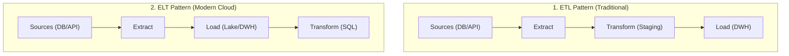
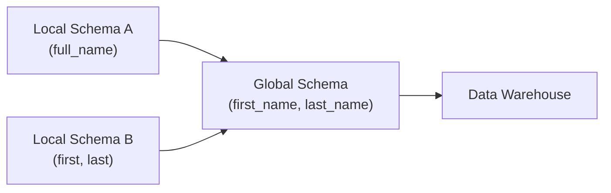
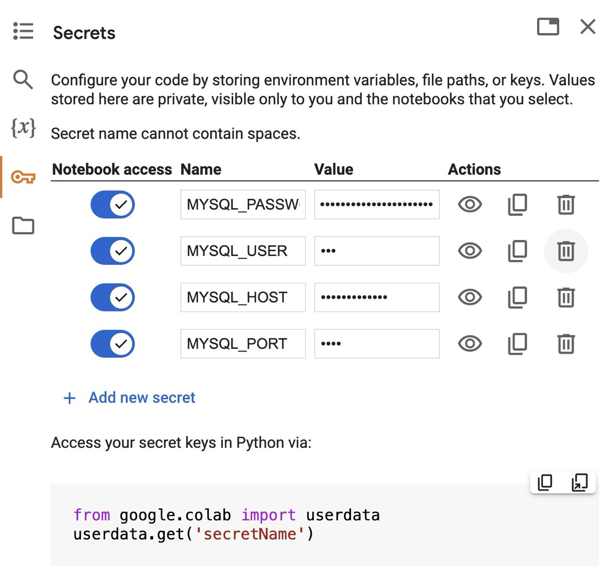

# Data Engineer - Chapter 01: Data Collection

> **วิชา:** Road to Data Engineer 3.0 (R2DE 3.0) | **ผู้สอน:** DataTH
> **Source:** `Resources/Books/DataEngineer/1_Data_Collection.pdf` (39 slides)
> **หมายเหตุ:** ส่วนที่ติดป้าย `[เสริมนอกสไลด์]` คือความรู้ที่ผู้เขียนโน้ตเพิ่มเอง

---

## Part 1: Macro Architecture & Overview

ลองนึกถึง **ระบบประปา**: น้ำ (ข้อมูล) ต้องถูกสูบจากแหล่งน้ำ (Data Source) ผ่านท่อ (Pipeline) ผ่านการกรอง (Transform) แล้วไปเก็บที่ถังพัก (Staging / Destination) ก่อนส่งให้บ้านแต่ละหลัง Chapter 1 สอนว่า "ท่อ" นี้ออกแบบอย่างไร และเมื่อข้อมูลมาจากหลายแหล่งที่หน้าตาไม่เหมือนกัน เราจะ **Integrate** ให้เป็นชุดเดียวกันได้อย่างไร



### ตารางเปรียบเทียบ ETL vs ELT vs Reverse ETL

| Feature | ETL | ELT | Reverse ETL |
| :--- | :--- | :--- | :--- |
| **ลำดับ** | Extract → Transform → Load | Extract → Load → Transform | Warehouse → ระบบปฏิบัติการ |
| **Transform ทำที่ไหน** | ระหว่างทาง (Staging) | ที่ปลายทาง (เช่น Warehouse) | - |
| **จุดเด่น** | ข้อมูลที่โหลดสะอาดแล้ว | เก็บข้อมูลดิบไว้ ยืดหยุ่น เร็วกับ Cloud DWH `[เสริมนอกสไลด์]` | ส่งผลวิเคราะห์กลับไปใช้งานจริง |
| **ตัวอย่าง** | สร้าง Pipeline ด้วย Python | โหลดไฟล์ลง BigQuery แล้วใช้ SQL แปลง | ส่ง Segment ลูกค้าไปที่ Tool การตลาด |

---

## Part 2: Module-by-Module Deep Dive

### 2.1 Data Pipeline คืออะไร และทำไมต้องมี

> **Data Pipeline** = ท่อลำเลียงข้อมูลจากแหล่งข้อมูล (Data Source) ไปยังปลายทาง

**ทำไมต้องมี (ตามสไลด์):**
* **Integration:** เป็นตัวกลางรวมข้อมูลจากหลายแหล่งเข้าด้วยกัน
* **Automation:** ทำให้ท่อทำงานอัตโนมัติ ไม่ต้องให้คนมานั่งดึงไฟล์ส่งอีเมลทุกวัน

**ตัวอย่าง:** ฝ่ายขายขอยอดขายรายวันทุกเช้า ถ้าไม่มี Pipeline คนต้อง export CSV ด้วยมือทุกวัน ถ้ามี Pipeline ข้อมูลถูกดึง สรุป และวางลง Dashboard ก่อนใครเข้างาน

---

### 2.2 องค์ประกอบ E, T, L

| ขั้น | ความหมาย | ตัวอย่างงาน |
| :--- | :--- | :--- |
| **E = Extract** | ดึงข้อมูลจาก Business Data / Customer Data / ระบบต้นทาง | `SELECT` จาก Database, เรียก API, อ่านไฟล์ |
| **T = Transform** | เปลี่ยนข้อมูลให้อยู่ในรูปที่ต้องการ หลากหลายรูปแบบ | ล้างค่าผิด, แปลงชนิดข้อมูล, Join, Aggregate |
| **L = Load** | นำข้อมูลจาก **Staging Area** เข้าสู่ระบบปลายทาง (Destination) | เขียนลง Data Lake / Warehouse |

> **Staging Area** คือพื้นที่พักข้อมูลชั่วคราวระหว่างทาง ก่อนโหลดเข้าปลายทางจริง ช่วยให้ถ้าขั้น Transform พลาด ไม่ต้องไปดึงจาก Source ใหม่ทุกครั้ง `[เหตุผลเสริมนอกสไลด์]`

#### ETL vs ELT ต่างกันอย่างไร

* **ETL:** Transform ก่อนโหลด ปลายทางได้ข้อมูลที่จัดแล้ว เหมาะเมื่อปลายทางไม่ได้แรงพอจะ Transform เอง หรือต้องตัดข้อมูลสำคัญ (เช่น PII) ก่อนเข้าระบบ `[เสริมนอกสไลด์]`
* **ELT:** โหลดข้อมูลดิบเข้าปลายทางก่อน แล้ว Transform ด้วยพลังของปลายทาง (นิยมกับ Cloud Data Warehouse ที่ประมวลผลขนาดใหญ่ได้เร็ว)

#### Reverse ETL

แนวคิดใหม่ ส่งข้อมูลที่รวบรวมและวิเคราะห์แล้วใน Warehouse **กลับ** ไปที่ Tool ต่างๆ เช่น CRM หรือระบบโฆษณา เพื่อให้ฝ่ายธุรกิจใช้งานทันที

---

### 2.3 Key Considerations / Trade-offs

สไลด์ระบุปัจจัยที่ต้องชั่งน้ำหนักเมื่อออกแบบ Pipeline โดยเริ่มจาก **Accuracy** (ความถูกต้องของข้อมูล) `[ปัจจัยอื่นที่ตามมาในสไลด์ ให้ตรวจดูที่ P.16 ในไฟล์ PDF]`

| ปัจจัยที่ควรชั่งน้ำหนัก | ตัวอย่างคำถามออกแบบ |
| :--- | :--- |
| **Accuracy** | ข้อมูลที่ได้ถูกต้องครบหรือไม่ |
| **Latency** `[เสริมนอกสไลด์]` | ข้อมูลต้องมาถึงเร็วแค่ไหน (วินาที หรือรายวัน) |
| **Cost** `[เสริมนอกสไลด์]` | จ่ายค่า Compute/Storage คุ้มกับคุณค่าหรือไม่ |

> หลักคิดแบบ DE: ไม่มี Pipeline ที่ "ดีที่สุด" มีแต่ "เหมาะกับโจทย์และงบที่สุด"

---

### 2.4 ประเภทของ Data Pipeline และการประมวลผล

#### การโหลดข้อมูล

| ประเภท | ความหมาย | ใช้เมื่อ |
| :--- | :--- | :--- |
| **Initial / Historical / Full Load** | โหลดข้อมูลทั้งหมด | ตั้งระบบครั้งแรก หรือข้อมูลน้อย |
| **Incremental Load** `[เสริมนอกสไลด์]` | โหลดเฉพาะส่วนที่เพิ่ม/เปลี่ยน | ข้อมูลใหญ่ ต้องการประหยัดเวลา |

#### ประเภทการประมวลผล (Processing)

| ประเภท | ความหมาย (ตามสไลด์) | ตัวอย่าง |
| :--- | :--- | :--- |
| **Batch** | Scheduled ดึงตามช่วงเวลาที่กำหนด | รายงานยอดขายรายวัน |
| **Streaming / Real-time** `[เสริมนอกสไลด์]` | ประมวลผลทันทีที่ข้อมูลเกิด | ตรวจจับธุรกรรมผิดปกติ |

#### เครื่องมือสร้าง Data Pipeline

สไลด์แบ่งเป็นกลุ่ม เช่น **Pre-built connectors** (เครื่องมือสำเร็จรูป ไม่ต้องเขียนโค้ด) และกลุ่มที่เขียนโค้ดเอง (เช่น Python) การเลือกขึ้นกับทักษะทีม งบ และความซับซ้อนของงาน (Fivetran, Airbyte ใน CH7)

---

### 2.5 Data Integration

> **Data Integration** = การนำข้อมูลจากหลายแหล่งมารวมเป็นข้อมูลชุดเดียวกัน ให้เห็นภาพรวมทั้งหมด

**แหล่งข้อมูลที่พบ:** Database, Data Warehouse, Data Lake, ไฟล์, **API** (ช่องทางให้โปรแกรมคุยกันได้ เช่น Python ดึงข้อมูลสภาพอากาศจาก API ของกรมอุตุนิยมวิทยา)

#### ประเภทหลักของ Data Integration

| ประเภท | ปัญหาที่แก้ | ตัวอย่าง |
| :--- | :--- | :--- |
| **Schema Integration** | โครงสร้างข้อมูลต่างกัน | ระบบ A เก็บ `full_name` เดียว ระบบ B แยก `first_name`, `last_name` |
| **Value Integration** | ค่าของข้อมูลเดียวกันไม่ตรงกัน | `M/F` vs `Male/Female` |

#### Schema Integration ทำอย่างไร

เข้าใจโครงสร้างในแต่ละแหล่ง (**Local Schema**) แล้วออกแบบ **Global Schema** กลางที่ทุกแหล่ง map เข้ามาได้



ปัญหาที่พบ: **Structure Conflict** (โครงสร้างไม่เหมือนกัน เช่นระบบหนึ่งเก็บทุกอย่างในตารางเดียว อีกระบบแยกหลายตาราง)

#### Value Integration

ปัญหาหลัก: ข้อมูลเดียวกันแต่ค่าไม่เหมือนกัน เช่น เพศ, หน่วยเงิน, รูปแบบวันที่ ต้องกำหนด **มาตรฐานกลาง** แล้วแปลงทุกแหล่งให้ตรงกัน

```python
# [เสริมนอกสไลด์] ตัวอย่าง Value Integration: ทำให้ค่าเพศจาก 2 ระบบเป็นมาตรฐานเดียว
import polars as pl

df = pl.DataFrame({"gender": ["M", "F", "Male", "female"]})
df = df.with_columns(
    pl.col("gender").str.to_lowercase().replace_strict(
        {"m": "male", "male": "male", "f": "female", "female": "female"}
    ).alias("gender_std")  # ใช้ค่ากลางเดียวกันทั้งตาราง
)
print(df)
```

---

### 2.6 Workshop 1: Data Collection with Python

* **แหล่งเรียนรู้ & โน้ตบุ๊กปฏิบัติการ:** [Google Colab - Workshop 1 (กด File > Save a copy in Drive)](https://colab.research.google.com/drive/1O4k37OvuBw1YlGcRPV17vIVbS6lJIZxX?usp=sharing)
* **ที่มาของชุดข้อมูล (Dataset Background):** ดัดแปลงมาจาก [Kaggle: E-commerce Business Transaction Dataset](https://www.kaggle.com/datasets/gabrielramos87/an-online-shop-business/data) โดยจำลองแบ่งข้อมูลออกเป็น 3 ตารางบน Relational Database เพื่อให้ฝึกฝนการทำ Data Integration & Collection เสมือนระบบงานจริง
* **โจทย์:** ดึงข้อมูลธุรกรรมจาก MySQL Database และดึงอัตราแลกเปลี่ยนค่าเงิน GBP เป็น THB จาก REST API เพื่อรวมและแปลงข้อมูลยอดขายให้พร้อมสำหรับการนำไป Clean ใน [[Chapter 02 - Data Cleansing with Spark]]

---

#### 2.6.1 แหล่งข้อมูลต้นทาง (Source Ingestion Specification)

1. **MySQL Database:**
   * **Host:** `34.136.184.58` | **Port:** `3306` | **Database:** `r2de3` | **Charset:** `utf8mb4`
   * **Credentials:** User `r2de3`, Password `Roady-to-DE-star-3.0`
   * **ตารางที่ใช้งาน:**
     * `r2de3.transaction`: บันทึกธุรกรรม (`TransactionNo`, `Date`, `ProductNo`, `Price`, `Quantity`, `CustomerNo`)
     * `r2de3.product`: ข้อมูลสินค้า (`ProductNo`, `ProductName`)
     * `r2de3.customer`: ข้อมูลลูกค้า (`CustomerNo`, `Country`, `Name`)

   > 🔒 **Security Best Practice (Colab Secrets & Credential Isolation):**
   > * **ห้าม** Hardcode รหัสผ่านลงในโค้ด และ **ห้าม** Commit Credential ขึ้น Git เด็ดขาด
   > * บน Google Colab ให้ใส่ค่าลงในแท็บ **Secrets (ไอคอนรูปกุญแจ 🔑)** และเปิดสวิตช์ **Notebook access** ให้เป็นสีฟ้า เพื่อเรียกใช้ผ่าน `google.colab.userdata`
   >
   > 

2. **REST API อัตราแลกเปลี่ยนเงิน (Currency Conversion API):**
   * **Endpoint:** `https://r2de3-currency-api-vmftiryt6q-as.a.run.app/gbp_thb` (HTTP GET)
   * **รูปแบบข้อมูล (JSON):**
     ```json
     [
       {"date": "2023-05-01", "gbp_thb": 42.761, "id": "ebf2"},
       {"date": "2023-05-02", "gbp_thb": 42.477, "id": "101a"}
     ]
     ```

---

#### 2.6.2 โค้ดปฏิบัติการเต็มตามลำดับขั้นตอน (Step-by-Step Implementation)

##### Step 1: ดึงข้อมูลจาก MySQL ด้วย PyMySQL & SQLAlchemy
```python
# 1. ติดตั้ง driver สำหรับ MySQL
!pip install pymysql

import sqlalchemy
import pandas as pd
from google.colab import userdata

# 2. ดึง Credential จาก Colab Secrets ป้องกันการ Hardcode
class Config:
    MYSQL_HOST = userdata.get("MYSQL_HOST")
    MYSQL_PORT = userdata.get("MYSQL_PORT")  # 3306
    MYSQL_USER = userdata.get("MYSQL_USER")
    MYSQL_PASSWORD = userdata.get("MYSQL_PASSWORD")
    MYSQL_DB = 'r2de3'
    MYSQL_CHARSET = 'utf8mb4'

# 3. สร้าง Connection Engine
engine = sqlalchemy.create_engine(
    "mysql+pymysql://{user}:{password}@{host}:{port}/{db}".format(
        user=Config.MYSQL_USER,
        password=Config.MYSQL_PASSWORD,
        host=Config.MYSQL_HOST,
        port=Config.MYSQL_PORT,
        db=Config.MYSQL_DB,
    )
)

# 4. สำรวจ Schema ด้วย Context Manager (จะปิด cursor ให้อัตโนมัติ)
with engine.connect() as connection:
    tables = connection.execute(sqlalchemy.text("show tables;")).fetchall()
    desc_tx = connection.execute(sqlalchemy.text("describe transaction")).fetchall()
    print("Tables:", tables)

# 5. Query ข้อมูลเข้าสู่ Pandas DataFrame (วิธีที่สะดวกที่สุด: pd.read_sql)
product = pd.read_sql("SELECT * FROM r2de3.product", engine).set_index("ProductNo")
customer = pd.read_sql("SELECT * FROM r2de3.customer", engine)
transaction = pd.read_sql("SELECT * FROM r2de3.transaction", engine)

# 6. Merge ตารางทั้ง 3 เข้าด้วยกัน
merged_transaction = transaction.merge(
    product, how="left", left_on="ProductNo", right_on="ProductNo"
).merge(
    customer, how="left", left_on="CustomerNo", right_on="CustomerNo"
)
```

##### Step 2: ดึงข้อมูลค่าเงินจาก REST API ด้วย Requests
```python
import requests

url = "https://r2de3-currency-api-vmftiryt6q-as.a.run.app/gbp_thb"
response = requests.get(url)
result_conversion_rate = response.json()

# แปลงเป็น DataFrame และปรับประเภท Date
conversion_rate = pd.DataFrame(result_conversion_rate).drop(columns=['id'])
conversion_rate['date'] = pd.to_datetime(conversion_rate['date'])
```

##### Step 3: ผสานข้อมูล (Join & Calculate)
```python
# รวมข้อมูลธุรกรรมเข้ากับอัตราแลกเปลี่ยนตามวัน
final_df = merged_transaction.merge(
    conversion_rate, how="left", left_on="Date", right_on="date"
)

# คำนวณยอดขายรวมหน่วยปอนด์ (total_amount) และแปลงเป็นเงินบาท (thb_amount)
final_df["total_amount"] = final_df["Price"] * final_df["Quantity"]
final_df["thb_amount"] = final_df["total_amount"] * final_df["gbp_thb"]

# ทางเลือกเสริม: คำนวณด้วย .apply() และ lambda function
# final_df["thb_amount"] = final_df.apply(lambda row: row["total_amount"] * row["gbp_thb"], axis=1)

# ทำความสะอาดคอลัมน์และเปลี่ยนชื่อเป็นรูปแบบมาตรฐาน (Lowercase + _id)
final_df = final_df.drop(["date", "gbp_thb"], axis=1)
final_df.columns = [
    'transaction_id', 'date', 'product_id', 'price', 'quantity', 'customer_id',
    'product_name', 'customer_country', 'customer_name', 'total_amount', 'thb_amount'
]
```

##### Step 4: ส่งออกไฟล์ผลลัพธ์ (Output Data)
```python
# 1. ส่งออกเป็น Parquet (แนะนำสำหรับ Data Pipeline ไม่เก็บ index เพื่อลดขนาด)
final_df.to_parquet("output.parquet", index=False)

# 2. ส่งออกเป็น CSV สำหรับการตรวจสอบเบื้องต้น
final_df.to_csv("output.csv", index=False)

# 3. ตรวจสอบความถูกต้องของไฟล์ Parquet ที่สร้างขึ้น
check_parquet = pd.read_parquet("output.parquet")
print("Data rows:", len(check_parquet))
```

---

#### 2.6.3 ส่วนขยายเชิงลึก (Workshop 1 Bonuses)

##### Bonus 1: Benchmark ประสิทธิภาพ Pandas vs Polars
Polars เขียนด้วยภาษา Rust และทำงานแบบ Multithreaded ช่วยให้การ Join และ Export ข้อมูลเร็วกว่า Pandas อย่างมีนัยสำคัญ:
```python
import polars as pl

# แปลงจาก Pandas DataFrame เป็น Polars DataFrame
customer_pl = pl.from_pandas(customer)
product_pl = pl.from_pandas(product, include_index=True)
transaction_pl = pl.from_pandas(transaction)
conversion_rate_pl = pl.from_pandas(conversion_rate)

# ทำงานแบบ Join และ Write Parquet ด้วย Polars
joined_pl = transaction_pl.join(
    product_pl, on="ProductNo", how="left"
).join(
    customer_pl, on="CustomerNo", how="left"
).join(
    conversion_rate_pl, left_on="Date", right_on="date", how="left"
)

joined_pl.write_parquet("test_polars.parquet")
```

##### Bonus 2: Query ไฟล์ Parquet ในเครื่องด้วย DuckDB (In-Process OLAP)
ไม่ต้องสร้าง Database Server ให้ยุ่งยาก สามารถใช้ DuckDB รัน SQL บนไฟล์ Parquet ได้ทันที:
```python
import duckdb

# รัน SQL ตรงไปยังไฟล์ Parquet ใน Local
duckdb.sql('SELECT * FROM "output.parquet" LIMIT 5')
duckdb.sql('SELECT customer_country, SUM(thb_amount) AS revenue FROM "output.parquet" GROUP BY 1 ORDER BY 2 DESC')
```

##### Bonus 3: Production Secret Management ด้วย `.env` และ `python-dotenv`
ในกรณีทำงานบน Local หรือ Server ที่ไม่ใช่ Colab:
```python
# ติดตั้งไลบรารี
!pip install python-dotenv

# สร้างไฟล์ .env (อย่าลืมใส่ .env ใน .gitignore เด็ดขาด)
# HOST=34.136.184.58
# PORT=3306
# PASSWORD=xxxx

import os
from dotenv import load_dotenv

load_dotenv()  # โหลดตัวแปรจาก .env เข้า environment variables

# ข้อควรระวัง: os.getenv จะคืนค่าเป็น string เสมอ หากเป็นตัวเลขต้อง cast เช่น int()
db_host = os.getenv("HOST")
db_port = int(os.getenv("PORT", 3306))
```

---

## Part 3: Quick Reference & Exam Cheat Sheet

### Checklist สรุปหัวใจสำคัญ
* [ ] **Data Pipeline:** ท่อลำเลียงข้อมูล Source → Destination มี Integration + Automation
* [ ] **E/T/L:** Extract ดึง, Transform แปลง, Load ใส่ปลายทาง (ผ่าน Staging Area)
* [ ] **ETL vs ELT:** ต่างที่ลำดับและที่ที่ Transform
* [ ] **Reverse ETL:** ส่งข้อมูลจาก Warehouse กลับไป Tool ธุรกิจ
* [ ] **Batch vs Streaming:** ตามเวลา vs ทันที
* [ ] **Schema vs Value Integration:** โครงสร้างต่างกัน vs ค่าต่างกัน
* [ ] **Local Schema → Global Schema**

### สรุปแนวคิดสำคัญ

| คำ | ความหมาย |
| :--- | :--- |
| `E → T → L` | ETL แปลงก่อนโหลด |
| `E → L → T` | ELT โหลดก่อนแล้วแปลงที่ปลายทาง |
| `Local → Global Schema` | แก้ปัญหา Structure Conflict |

### Concept Map

```text
Data Collection
├── Data Pipeline (Integration, Automation)
│   ├── ETL / ELT / Reverse ETL
│   ├── Load: Full / Incremental
│   └── Processing: Batch / Streaming
└── Data Integration
    ├── Schema Integration (Local → Global, Structure Conflict)
    └── Value Integration (ค่าเดียวกัน แต่ต่างรูป)
```

---

## ⚠️ Common Pitfalls & Exam Traps

* **"ETL กับ ELT เหมือนกัน แค่สลับตัวอักษร":** ต่างที่ **ที่ที่ Transform เกิดขึ้น** ซึ่งกระทบสถาปัตยกรรมและค่าใช้จ่าย
* **"Reverse ETL คือการย้อนกลับ Pipeline เดิม":** ไม่ใช่ เป็นการส่งผลจาก Warehouse ไปยังระบบปฏิบัติการอื่น
* **"โหลดทั้งหมดทุกครั้งง่ายสุดและดีสุด":** Full Load สิ้นเปลืองเมื่อข้อมูลใหญ่ ควรพิจารณา Incremental `[เสริมนอกสไลด์]`
* **"Schema Integration กับ Value Integration คืออย่างเดียวกัน":** อย่างแรกคือ "โครงสร้าง" อย่างหลังคือ "ค่าข้างใน"
* **"ดึงข้อมูลเสร็จก็จบ":** ต้องคิดเรื่อง Accuracy และความพร้อมของข้อมูลสำหรับขั้นถัดไปด้วย

---

## เอกสารเชื่อมโยง (Wiki-Style Backlinks)
* **วิชาและหัวข้อที่เกี่ยวข้อง:**
  * [[Chapter 00 - Intro to Data Engineering]] (พื้นฐาน Data Types, Storage ที่ Pipeline ต้องเชื่อม)
  * [[Chapter 02 - Data Cleansing with Spark]] (ขั้น Transform: ล้างข้อมูลหลังดึงมา)
  * [[Chapter 04 - Data Pipeline Orchestration with Airflow]] (ทำให้ Pipeline รันอัตโนมัติ)
  * [[Chapter 01 Introduction to Database System & Relational Model]] (เข้าใจ Schema และ Relational DB ที่เป็น Source)

* **แหล่งข้อมูล:**
  * Source: `Resources/Books/DataEngineer/1_Data_Collection.pdf` (39 slides, DataTH)
  * Reference: Kleppmann (2017) — *Designing Data-Intensive Applications* `[เสริมนอกสไลด์]`
