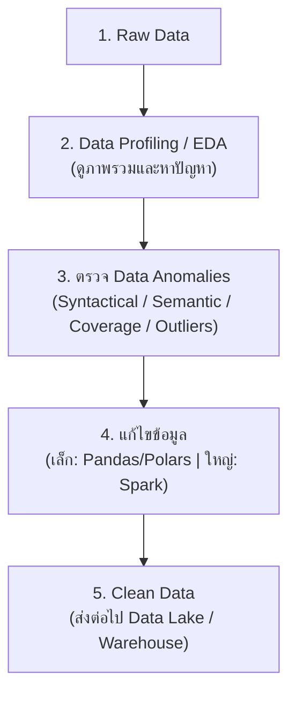
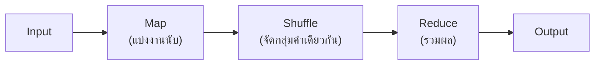

# Data Engineer - Chapter 02: Data Cleansing with Spark

> **วิชา:** Road to Data Engineer 3.0 (R2DE 3.0) | **ผู้สอน:** DataTH
> **Source:** `Resources/Books/DataEngineer/2_Data_Cleansing_with_Spark.pdf` (61 slides)
> **หมายเหตุ:** ส่วนที่ติดป้าย `[เสริมนอกสไลด์]` คือความรู้ที่ผู้เขียนโน้ตเพิ่มเอง

---

## Part 1: Macro Architecture & Overview

ลองนึกถึง **การล้างผัก** ก่อนทำอาหาร: ถ้าผักมีดินติดอยู่ ต่อให้เชฟเก่งแค่ไหนอาหารก็ไม่อร่อย ข้อมูลก็เช่นกัน ถ้าเข้าไปในระบบทั้งที่ผิดพลาด ผลวิเคราะห์ทุกอย่างจะผิดตาม (**Garbage In, Garbage Out**) Chapter 2 แบ่งเป็น 2 ท่อน: (1) **ทฤษฎีคุณภาพข้อมูลและวิธีหาความผิดปกติ** (2) **เครื่องมือประมวลผลข้อมูลขนาดใหญ่แบบกระจาย: Apache Spark**



### ตารางเปรียบเทียบเครื่องมือตามขนาดข้อมูล

| ขนาดข้อมูล | เครื่องมือที่เหมาะ | เหตุผล |
| :--- | :--- | :--- |
| เล็ก (ไม่กี่ MB) | Pandas, Polars | เครื่องเดียวเพียงพอ ง่ายและเร็ว |
| ใหญ่ (เกินหน่วยความจำเครื่องเดียว) | Apache Spark | กระจายงานไปหลายเครื่อง |

---

## Part 2: Module-by-Module Deep Dive

### 2.1 Data Cleansing & Data Quality

> **Data Cleansing** = การพัฒนาคุณภาพข้อมูลโดยค้นหาและแก้ไขความผิดพลาดในข้อมูล

**ทำไมสำคัญ (ตามสไลด์):**
* Data Scientist ส่วนใหญ่ใช้เวลาไปกับการทำความสะอาดข้อมูล (อ้างผลสำรวจ Forbes)
* ข้อมูลที่ไม่สะอาดมีราคาแพง (สไลด์ยกตัวอย่างความเสียหายของเศรษฐกิจอเมริกาปี 2016)
* ตัวอย่างต้นเหตุ: ข้อมูลจากแบบสำรวจกระดาษ → คนพิมพ์เข้าระบบผิด

**ทำไม Data Cleaning ถึงยาก:** เป็นกระบวนการที่ **ไม่มีวันจบสิ้น** ข้อมูลใหม่เข้ามาตลอดจึงต้องมีวงจร Data Auditing → Workflow → ตรวจซ้ำ

#### Data Quality: คุณภาพข้อมูลที่ดีคืออะไร

สไลด์เริ่มที่ **Completeness** (ข้อมูลครบ ไม่มีค่าว่าง) `[เสริมนอกสไลด์: มิติอื่นที่นิยมใช้ ได้แก่ Accuracy, Consistency, Validity, Timeliness, Uniqueness]`

| มิติ | ถามว่า | ตัวอย่างข้อมูลที่ไม่ผ่าน |
| :--- | :--- | :--- |
| **Completeness** | ครบไหม | อีเมลลูกค้าเป็นค่าว่าง |
| **Accuracy** `[เสริม]` | ตรงความจริงไหม | อายุ 200 ปี |
| **Consistency** `[เสริม]` | ตรงกันทุกระบบไหม | เบอร์โทรต่างกันในสองระบบ |
| **Validity** `[เสริม]` | ตามรูปแบบที่กำหนดไหม | อีเมลไม่มี `@` |
| **Uniqueness** `[เสริม]` | ซ้ำไหม | ลูกค้าคนเดียวมี 2 record |

#### เครื่องมือกำกับดูแลข้อมูล 3 ตัว

| เครื่องมือ | คืออะไร (ตามสไลด์) | ใช้ทำอะไร |
| :--- | :--- | :--- |
| **Data Dictionary** | ไฟล์รวบรวมรายละเอียดของทุกคอลัมน์ในตาราง | ให้ทุกคนในองค์กรเข้าใจคอลัมน์ตรงกัน |
| **Data Catalog** | แหล่งรวมข้อมูลและ metadata ทั้งหมด | ให้ฝั่ง Business และ Tech ค้นหาข้อมูลได้ |
| **Data Lineage** | การเดินทางของข้อมูลตั้งแต่ต้นจนจบ | ตรวจสอบย้อนหลังว่าตัวเลขมาจากไหน |

**ตัวอย่าง Data Dictionary `[เสริมนอกสไลด์]`:**

| Column | Type | ความหมาย | ค่าที่ยอมรับ |
| :--- | :--- | :--- | :--- |
| `gender` | string | เพศลูกค้า | `male`, `female`, `other` |
| `thb_amount` | float | ยอดซื้อเป็นบาท | >= 0 |

---

### 2.2 EDA & Data Profiling

> **Data Profiling** = การดูภาพรวมของข้อมูลเพื่อหาว่ามีปัญหาอะไรกับข้อมูลหรือไม่ (ตัวอย่างในสไลด์ใช้ข้อมูล Hotel Booking)

> **Exploratory Data Analysis (EDA)** = การวิเคราะห์ข้อมูลเชิงสำรวจ ใช้เทคนิคและกราฟเพื่อทำความรู้จักข้อมูล

#### ประเภทของ EDA (2 คำถามแบ่งหมวด)

| | ตัวเลข | กราฟิก |
| :--- | :--- | :--- |
| **ตัวอย่าง** | Descriptive Statistics (ค่าเฉลี่ย สูงสุด ต่ำสุด) | Histogram, **Boxplot**, **Scatterplot** |

* **Boxplot:** แสดงการกระจายตัวและค่าที่เกินปกติมาก (Outliers)
* **Scatterplot:** ใช้หาความสัมพันธ์ระหว่าง 2 ตัวแปร

```python
# [เสริมนอกสไลด์] Data Profiling เบื้องต้นด้วย Pandas
import pandas as pd

df = pd.read_csv("hotel_bookings.csv")
print(df.shape)                    # จำนวนแถว/คอลัมน์
print(df.dtypes)                   # ชนิดข้อมูลแต่ละคอลัมน์
print(df.isna().sum())             # นับค่าว่างต่อคอลัมน์
print(df.describe())               # สถิติพื้นฐาน (mean, min, max, quartile)
```

---

### 2.3 Data Anomalies (ความผิดปกติของข้อมูล)

| ประเภท | สาเหตุ | ตัวอย่าง | วิธีจัดการ |
| :--- | :--- | :--- | :--- |
| **Syntactical** | ผิดพลาดตอนกรอก (สะกดผิด รูปแบบผิด) | `Bangkk`, ` Bangkok ` | Regex, trim, standardize |
| **Semantic** | ค่าไม่ตรงเงื่อนไขธุรกิจ (Integrity Constraints) | อายุติดลบ, วันเช็คเอาต์ก่อนเช็คอิน | ตรวจกฎธุรกิจ แล้วแก้/ตัดทิ้ง |
| **Coverage (Missing)** | ข้อมูลหาย | `NULL` | ลบ/เติมค่า ตามประเภทการหาย |
| **Outliers** | ค่าห่างจากส่วนใหญ่มาก | ราคาห้อง 1,000,000 บาท | ตรวจด้วยสถิติ/กราฟ แล้วตัดสินใจ |

#### Regular Expression (Regex)

> **Regex** = pattern สำหรับค้นหาตัวหนังสือ เป็นเครื่องมือหลักตรวจ Syntactical/Semantic Anomalies

```python
# [เสริมนอกสไลด์] ตรวจรูปแบบอีเมลและเบอร์โทรด้วย Regex
import re
email_ok = re.fullmatch(r"[\w.+-]+@[\w-]+\.[\w.]+", "test@example.com")  # ผ่านถ้าไม่ใช่ None
phone_ok = re.fullmatch(r"0\d{9}", "0812345678")                         # เบอร์ไทย 10 หลักขึ้นต้น 0
```

#### Missing Values: MAR vs MNAR

| แบบ | ชื่อเต็ม | ความหมาย | ตัวอย่าง `[เสริมนอกสไลด์]` |
| :--- | :--- | :--- | :--- |
| **MAR** | Missing At Random | หายโดยบังเอิญ | เครื่องส่งข้อมูลขัดข้องชั่วคราว |
| **MNAR** | Missing Not At Random | หายอย่างมีสาเหตุ | คนรายได้สูงไม่ยอมกรอกรายได้ |

> **ทำไมต้องแยก:** ถ้าหายอย่างมีสาเหตุ การเติมค่าเฉลี่ยจะทำให้ผลวิเคราะห์เอนเอียง ควรเข้าใจสาเหตุก่อนตัดสินใจ

#### Outliers

ค่าที่ห่างจากส่วนใหญ่มาก อาจเกิดจากข้อมูลผิด **หรือ** ค่าจริงที่หายากก็ได้ `[เสริมนอกสไลด์: เทคนิคทั่วไป เช่น กฎ IQR]`

$$IQR = Q3 - Q1,\quad \text{Outlier ถ้า } x < Q1 - 1.5\,IQR \ \text{หรือ}\ x > Q3 + 1.5\,IQR$$


---

### 2.4 Distributed Data Processing

> **Distributed Data Processing** = กระจายงานประมวลผลไปหลายเครื่องทำงานพร้อมกัน

**เปรียบเทียบตามสไลด์ (Word Count):** นับคำในหนังสือเล่มหนึ่ง ถ้าใช้ผู้เชี่ยวชาญคนเดียวนับทั้งเล่มจะช้า แต่ถ้าแบ่งหนังสือเป็นหลายส่วนให้หลายคนนับพร้อมกัน แล้วเอาผลมารวม จะเสร็จเร็วกว่ามาก

#### Hadoop MapReduce

ส่วนหนึ่งของ Hadoop เป็นวิธี Distributed Processing ที่ได้รับความนิยมมากในช่วงก่อนหน้า



> **ข้อจำกัด `[เสริมนอกสไลด์]`:** MapReduce มักเขียนผลกลางลงดิสก์ระหว่างขั้นตอน จึงช้ากว่าแนวทางประมวลผลในหน่วยความจำอย่าง Spark

---

### 2.5 Apache Spark

> **Apache Spark** = เทคโนโลยี Distributed Data Processing สำหรับข้อมูลขนาดใหญ่ คิดค้นโดย University of California (ตามสไลด์: ปี 2014)

**Module ที่มากับ Spark:** Spark SQL (เขียน SQL), และอื่นๆ ที่สไลด์ P.43 แสดง `[เช่น Streaming, MLlib, GraphX — เสริมนอกสไลด์]`

#### ประเภทข้อมูลใน Spark

| ประเภท | ลักษณะ | การใช้งาน |
| :--- | :--- | :--- |
| **RDD** (Resilient Distributed Datasets) | วิธีเก็บข้อมูลพื้นฐานของ Spark | ใช้ค่อนข้างยาก |
| **DataFrame** | เก็บเป็นตาราง คล้าย Pandas/R | ใช้ง่าย ใช้มากที่สุดในงาน DE |
| **Dataset** (Java/Scala) | DataFrame ที่มี type | ภาษา Java/Scala เท่านั้น |

**Transformation vs Action (RDD):**

| | Transformation | Action |
| :--- | :--- | :--- |
| **ทำอะไร** | กำหนดว่าจะแปลงข้อมูลอย่างไร | สั่งให้คำนวณและคืนผล |
| **ตัวอย่าง** | `filter`, `map` | `count`, `collect` |
| **พฤติกรรม `[เสริมนอกสไลด์]`** | Lazy: ยังไม่คำนวณทันที | Eager: ทำให้งานรันจริง |

> สไลด์ยังระบุว่า Spark เพิ่มคำสั่งแบบ Pandas ให้ใช้ เช่น `.read_csv()`, `.sort_values()`, `drop()` (Pandas API on Spark)

#### Spark SQL

ใช้ SQL ดึงข้อมูลจาก Spark DataFrame ได้โดยตรง เหมาะถ้าคุ้นกับ SQL ([[LAB 8 - SQL GROUP BY and Aggregate Functions]])

```python
# [เสริมนอกสไลด์] ตัวอย่าง PySpark: โหลด ล้าง และสรุปข้อมูล
from pyspark.sql import SparkSession, functions as F

spark = SparkSession.builder.appName("cleansing").getOrCreate()

df = spark.read.csv("transactions.csv", header=True, inferSchema=True)   # โหลดเป็น DataFrame

clean = (
    df.dropDuplicates()                                  # ตัดแถวซ้ำ
      .filter(F.col("amount") >= 0)                      # ตัดค่าติดลบ (Semantic Anomaly)
      .withColumn("city", F.trim(F.initcap("city")))     # ทำตัวสะกดให้เป็นรูปแบบเดียวกัน
      .fillna({"coupon": "NONE"})                        # เติมค่าว่าง
)

clean.createOrReplaceTempView("t")
spark.sql("SELECT city, SUM(amount) FROM t GROUP BY city").show()   # Action: สั่งคำนวณจริง
```

#### วิธีใช้งาน Spark 3 แบบ

| วิธี | ข้อดี | ข้อเสีย |
| :--- | :--- | :--- |
| ติดตั้งบนคอมพิวเตอร์เอง | ควบคุมเอง | ติดตั้ง/ดูแลเยอะ ระบบแต่ละเครื่องต่างกัน |
| ใช้ Cloud (เช่น Google Dataproc, **Databricks**) | ติดตั้งง่าย | พึ่ง Cloud (ดู [[Chapter 03 - Cloud Computing and Bash]]) |
| `[วิธีที่ 3 ดูสไลด์ P.50-51]` | | |

**Databricks:** Data Platform ออนไลน์ที่สร้างโดยทีมผู้พัฒนา Spark

#### เลือกเครื่องมืออย่างไร (สไลด์ P.54)

* คอมพิวเตอร์เครื่องเดียว + ข้อมูลน้อย → Pandas / Polars
* ข้อมูลใหญ่เกินเครื่องเดียว → Spark

---

### 2.6 Workshop 2: Data Cleansing with Spark

* **แหล่งเรียนรู้ & โน้ตบุ๊กปฏิบัติการ:** [Google Colab - Workshop 2 (กด File > Save a copy in Drive)](https://colab.research.google.com/drive/18lqcIn47PfOXcFQSghlfW_9sSwXfMin2)
* **บริบทธุรกิจ (Business Context):** บริษัท Chic & Cozy มีข้อมูลธุรกรรมการค้าปลีกปริมาณมหาศาลจาก Workshop 1 แต่พบปัญหาข้อมูลผิดรูป สะกดผิด และค่าสูญหาย Data Engineer จึงต้องทำความสะอาดด้วย Apache Spark เพื่อเตรียมข้อมูลให้พร้อมก่อนส่งต่อไปยัง Cloud Storage และ BigQuery Data Warehouse ใน [[Chapter 03 - Cloud Computing and Bash]] และ [[Chapter 05 - Data Warehouse with BigQuery]]

---

#### 2.6.1 การติดตั้งและสร้าง SparkSession (Spark 4.x / PySpark)

```python
# 1. ติดตั้ง Java 17 (สำหรับ Spark 4.x) และ PySpark บน Google Colab
!apt-get update -qq
!apt-get install openjdk-17-jdk-headless -qq > /dev/null

import os
os.environ["JAVA_HOME"] = "/usr/lib/jvm/java-17-openjdk-amd64"

!pip uninstall -y -q pyspark py4j 2>/dev/null || true
!pip install -q pyspark==4.1.2

# 2. เริ่มต้นสร้าง SparkSession แบบ Local Multi-Core
from pyspark.sql import SparkSession
from pyspark.sql import functions as f
from pyspark.sql.functions import col, sum, when

spark = SparkSession.builder \
    .master("local[*]") \
    .appName("Road to Data Engineer 3.0 - Workshop 2") \
    .getOrCreate()

# 3. ดาวน์โหลดไฟล์ข้อมูล Parquet จาก Workshop 1 ที่มี Anomaly จำลอง
!wget https://file.designil.com/f/6BamyF+ -O w2_input.parquet
dt = spark.read.parquet('w2_input.parquet')
print(f"Total Rows: {dt.count()}, Total Columns: {len(dt.columns)}")
```

---

#### 2.6.2 การทำ Data Profiling (สำรวจสถิติและตรวจหา Missing Values)

การทำความเข้าใจภาพรวมข้อมูลเพื่อวางแผนจุดที่ต้องตรวจสอบ:
```python
# 1. ตรวจสอบ Schema และ Data Types
dt.printSchema()

# 2. สรุปข้อมูลสถิติเบื้องต้น (Count, Mean, Stddev, Min, Max, Percentiles)
dt.summary().show()

# 3. ตรวจสอบหา Missing Value (Exercise 1)
# พบว่า customer_id มีจำนวนแถวไม่ครบเท่าคอลัมน์อื่น
dt.summary("count").show()

# กรองดูแถวที่เป็น Null
dt.where(dt.customer_id.isNull()).show(5)
```

> 💡 **Bonus Tool (ydata-profiling):**
> สามารถสร้างรายงาน EDA อัตโนมัติในคลิกเดียวด้วย:
> ```python
> !pip install ydata-profiling==4.18.4
> from ydata_profiling import ProfileReport
> profile = ProfileReport(dt.toPandas(), title="Profiling Report")
> profile
> ```

---

#### 2.6.3 การทำ Exploratory Data Analysis (EDA)

##### 1. Non-Graphical EDA (ใช้ Spark Filter/Where)
```python
# ค้นหาธุรกรรมราคาสูง
dt.where(dt.price >= 100).show(5)

# นับธุรกรรมตามเงื่อนไขเวลา (Exercise 2)
may_count = dt.where(dt.date.startswith("2024-05")).count()
june_count = dt.where(dt.date.startswith("2024-06")).count()
print(f"May 2024: {may_count}, June 2024: {june_count}")
```

##### 2. Graphical EDA (แปลงเป็น Pandas เพื่อ Plot ด้วย Seaborn & Matplotlib)
```python
import seaborn as sns
import matplotlib.pyplot as plt

dt_pd = dt.toPandas()

# Plot 1: Boxplot ดูการกระจายตัวของราคา
sns.boxplot(x=dt_pd['price'])

# Plot 2: Histogram ซูมดูช่วงราคาต่ำกว่า 40 ปอนด์ (Exercise 3)
sns.histplot(dt_pd[dt_pd['price'] < 40]['price'], bins=10)

# Plot 3: Scatterplot ดูความสัมพันธ์ระหว่าง Quantity และ Price
sns.scatterplot(x=dt_pd.quantity, y=dt_pd.price)
```

---

#### 2.6.4 ขั้นตอนการล้างข้อมูลตาม 5 ความผิดปกติ (Data Cleansing Deep Dive)

##### ปัญหาที่ 1: Data Type ไม่ถูกต้อง (String → Timestamp)
คอลัมน์ `date` ถูกอ่านเป็น String ต้องแปลงเป็น Timestamp มาตรฐาน:
```python
# แปลงคอลัมน์ date เป็น timestamp
dt_clean = dt.withColumn("date", f.to_timestamp(dt.date, 'yyyy-MM-dd'))

# ตรวจสอบช่วงวันที่ของข้อมูลด้วย Min และ Max
dt_clean.select(f.min(dt_clean.date), f.max(dt_clean.date)).show()

# ประโยชน์: สามารถใช้ Date functions เช่น f.dayofmonth, f.month, f.year ในการ Filter ได้ทันที
first_half_jan = dt_clean.where(
    (f.dayofmonth(dt_clean.date) <= 15) & (f.month(dt_clean.date) == 1) & (f.year(dt_clean.date) == 2024)
).count()
```

##### ปัญหาที่ 2: Syntactical Anomalies (Lexical Errors - คำสะกดผิด)
ตรวจสอบรายชื่อประเทศใน `customer_country` พบคำว่า `'Japane'`:
```python
# สำรวจชื่อประเทศทั้งหมดแบบเรียงลำดับ
dt_clean.select("customer_country").distinct().sort("customer_country").show(40)

# แก้ไขคำสะกดผิดด้วย when...otherwise (Exercise 4)
dt_clean_country = dt_clean.withColumn(
    "customer_country_update",
    when(dt_clean['customer_country'] == 'Japane', 'Japan').otherwise(dt_clean['customer_country'])
)

# ลบคอลัมน์เก่าและเปลี่ยนชื่อคอลัมน์ใหม่ให้เหมือนเดิม
dt_clean_v2 = dt_clean_country.drop("customer_country").withColumnRenamed('customer_country_update', 'customer_country')
```

##### ปัญหาที่ 3: Semantic Anomalies (Integrity Constraints - รหัสสินค้าเกินมาตรฐาน)
รหัส `product_id` มาตรฐานต้องยาว 5 ตัวอักษร แต่พบว่ามีรหัสยาวเกิน 5 ตัว (เช่น `15044A`, `15044C` มีตัวอักษรระบุสีหรือ Variation ต่อท้าย):
```python
# 1. ตรวจสอบสัดส่วนรหัสที่ถูกต้องตาม Regular Expression ^.{5}$ (Exercise 5)
valid_ratio = dt_clean_v2.where(dt_clean_v2["product_id"].rlike("^.{5}$")).count() / dt_clean_v2.count()
print("Valid Product ID Ratio:", valid_ratio)  # พบผิดปกติประมาณ 10%

# 2. ค้นหาแถวที่ผิดปกติด้วย .subtract()
dt_correct = dt_clean_v2.filter(dt_clean_v2["product_id"].rlike("^.{5}$"))
dt_incorrect = dt_clean_v2.subtract(dt_correct)
dt_incorrect.select("product_id", "product_name").show(5, truncate=False)

# 3. ตัดให้เหลือเฉพาะรหัสสินค้า 5 ตัวแรกด้วย f.substring
dt_clean_v3 = dt_clean_v2.withColumn('product_id', f.substring('product_id', 1, 5))
```

##### ปัญหาที่ 4: Missing Values (จัดการค่าว่าง NULL)
ตรวจพบ `customer_id` เป็นค่าว่าง:
```python
# 1. นับจำนวน Null ในทุกคอลัมน์ด้วย List Comprehension
dt_nulllist = dt_clean_v3.select([
    sum(col(c).isNull().cast("int")).alias(c) for c in dt_clean_v3.columns
])
dt_nulllist.show()

# 2. แทนค่า NULL ของ customer_id ด้วย '00000' ตามข้อกำหนดของทีม Data Analyst (Exercise 6)
dt_clean_v4 = dt_clean_v3.withColumn(
    "customer_id",
    when(dt_clean_v3['customer_id'].isNull(), '00000').otherwise(dt_clean_v3['customer_id'])
)
```

##### ปัญหาที่ 5: Outliers (ค่าสุดโต่ง)
จากการพล็อต Boxplot พบสินค้าที่ `price > 600`:
```python
# ตรวจสอบสินค้าที่ราคาสูงเกิน 600 ปอนด์
dt_clean_v4.where(dt_clean_v4.price > 600).select("product_id", "product_name", "price").distinct().show(truncate=False)
```
> 🔍 **การตัดสินใจทางธุรกิจ (Business Decision):**
> สินค้าดังกล่าวคือ "ตู้เก็บของโบราณสไตล์วินเทจ (Vintage Storage Cabinet)" ซึ่งเป็นเฟอร์นิเจอร์ชิ้นใหญ่และมีมูลค่าสูงตามธรรมชาติ **จึงเป็น Outlier แท้จริงที่ไม่ใช่ข้อมูลผิดพลาด และไม่ต้องลบหรือแก้ไขใดๆ**

---

#### 2.6.5 ทางเลือกเสริม: การทำ Data Cleansing ด้วย Spark SQL

สามารถสร้าง `TempView` แล้วเขียน SQL ที่คุ้นเคยเพื่อ Clean ข้อมูลได้เช่นกัน:
```python
# สร้าง View ในหน่วยความจำ Spark
dt.createOrReplaceTempView("data")

# แก้ไขคำสะกดผิดและตัดรหัสสินค้าด้วย Spark SQL
dt_sql_cleaned = spark.sql("""
SELECT
    transaction_id,
    to_timestamp(date, 'yyyy-MM-dd') AS date,
    CASE
        WHEN length(product_id) > 5 THEN substr(product_id, 1, 5)
        ELSE product_id
    END AS product_id,
    price,
    quantity,
    COALESCE(customer_id, '00000') AS customer_id,
    product_name,
    CASE WHEN customer_country = 'Japane' THEN 'Japan' ELSE customer_country END AS customer_country,
    customer_name,
    total_amount,
    thb_amount
FROM data
""")

# ตรวจสอบว่าไม่มี product_id ผิดรูปแบบหลงเหลืออยู่ (Exercise 7)
dt_sql_cleaned.filter(~dt_sql_cleaned["product_id"].rlike("^.{5}$")).show()
```

---

#### 2.6.6 การส่งออกข้อมูลที่สะอาดแล้ว (Data Export)

```python
# 1. ส่งออกเป็น Parquet (แนะนำมากที่สุดสำหรับ Data Lake/Warehouse)
# ตั้ง mode("overwrite") ป้องกัน Error PATH_ALREADY_EXISTS
dt_clean_v4.write.mode("overwrite").parquet("cleaned_data_output.parquet")

# ทดสอบอ่านไฟล์ Parquet กลับมาเช็คความสมบูรณ์
dt_verified = spark.read.parquet("cleaned_data_output.parquet")
print("Verified Rows:", dt_verified.count())

# 2. ส่งออกเป็น CSV (กรณีต้องส่งต่อให้ทีมอื่น)
dt_clean_v4.write.mode("overwrite").csv('cleaned_data.csv', header=True)

# 3. ส่งออกเป็น Excel (ใช้ toPandas เหมาะสำหรับข้อมูลสรุปขนาดเล็ก)
# dt_clean_v4.limit(1000).toPandas().to_excel("sample_output.xlsx", index=False)
```

---

## Part 3: Quick Reference & Exam Cheat Sheet

### Checklist สรุปหัวใจสำคัญ
* [ ] **Garbage In, Garbage Out:** ข้อมูลไม่สะอาด = ผลวิเคราะห์ผิด
* [ ] **Data Dictionary / Catalog / Lineage:** นิยามคอลัมน์ / ที่ค้นหาข้อมูล / เส้นทางข้อมูล
* [ ] **Data Profiling vs EDA:** ดูภาพรวมหาปัญหา vs สำรวจเชิงลึก
* [ ] **4 Anomalies:** Syntactical, Semantic, Coverage (Missing), Outliers
* [ ] **MAR vs MNAR:** หายบังเอิญ vs หายมีสาเหตุ
* [ ] **Spark:** กระจายงานหลายเครื่อง; RDD/DataFrame/Spark SQL
* [ ] **Transformation vs Action**

### Decision Rules

```text
ข้อมูลเล็ก เครื่องเดียวพอ         → Pandas / Polars
ข้อมูลใหญ่เกินเครื่องเดียว         → Spark
ตัวสะกด/รูปแบบผิด                  → Regex + Standardize
ค่าผิดเงื่อนไขธุรกิจ              → ตรวจ Integrity Constraints
ค่าหาย                            → ถามก่อน: MAR หรือ MNAR?
```

### Concept Map

```text
Data Cleansing
├── Data Quality (Completeness, ...)
│   └── Dictionary / Catalog / Lineage
├── Profiling & EDA (ตัวเลข / กราฟิก)
├── Anomalies (Syntactical, Semantic, Missing, Outliers)
└── Processing
    ├── Small → Pandas / Polars
    └── Big → Distributed: MapReduce → Spark (RDD, DataFrame, SQL)
```

---

## ⚠️ Common Pitfalls & Exam Traps

* **"Missing Values ลบทิ้งหมดก็จบ":** ถ้าเป็น MNAR การลบหรือเติมค่ามั่วทำให้ผลเอนเอียง ต้องเข้าใจสาเหตุก่อน
* **"Outlier คือข้อมูลผิดเสมอ":** อาจเป็นค่าจริงที่หายาก (เช่น ลูกค้าซื้อเยอะผิดปกติ) ต้องดูบริบทธุรกิจ
* **"Transformation สั่งแล้วคำนวณทันที":** Transformation เป็น Lazy ต้องมี Action ถึงจะประมวลผลจริง `[เสริมนอกสไลด์]`
* **"Spark เร็วกว่า Pandas เสมอ":** กับข้อมูลเล็ก Spark มี overhead จึงอาจช้ากว่า เลือกให้เหมาะกับขนาดข้อมูล
* **"Syntactical กับ Semantic Anomaly คืออย่างเดียวกัน":** Syntactical = รูปแบบ/สะกดผิด; Semantic = ค่าไม่สมเหตุสมผลตามกฎธุรกิจ
* **"Data Dictionary = Data Catalog":** Dictionary อธิบายคอลัมน์ในตาราง Catalog รวม metadata ทั้งองค์กรไว้ค้นหา

---

## เอกสารเชื่อมโยง (Wiki-Style Backlinks)
* **วิชาและหัวข้อที่เกี่ยวข้อง:**
  * [[Chapter 01 - Data Collection]] (ขั้นก่อนหน้า: ข้อมูลที่ดึงมาเป็นอินพุตของบทนี้)
  * [[Chapter 03 - Cloud Computing and Bash]] (ใช้ Cloud รัน Spark เช่น Dataproc/Databricks)
  * [[Chapter 05 - Data Warehouse with BigQuery]] (ปลายทางของข้อมูลที่ล้างแล้ว)
  * [[LAB 8 - SQL GROUP BY and Aggregate Functions]] (พื้นฐาน SQL ที่ใช้ใน Spark SQL)

* **แหล่งข้อมูล:**
  * Source: `Resources/Books/DataEngineer/2_Data_Cleansing_with_Spark.pdf` (61 slides, DataTH)
  * Reference: Zaharia et al. — *Apache Spark* (spark.apache.org/docs) `[เสริมนอกสไลด์]`
