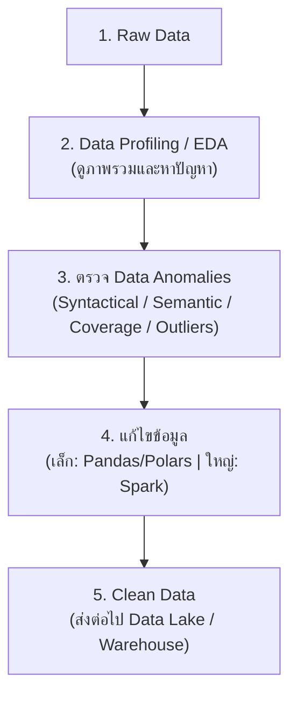
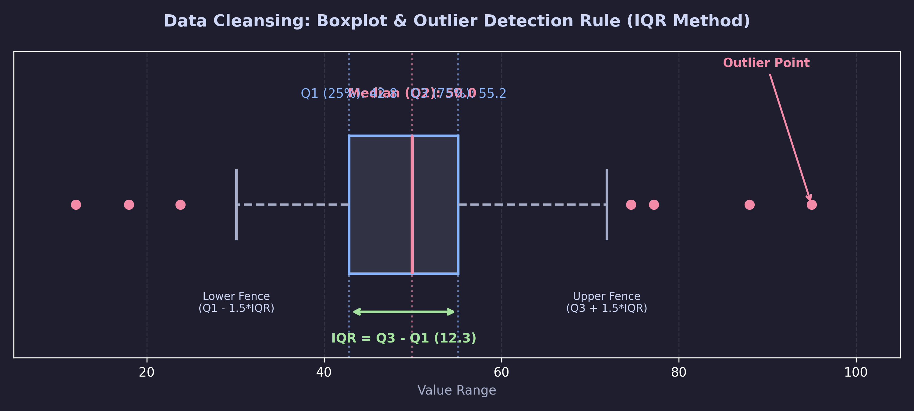
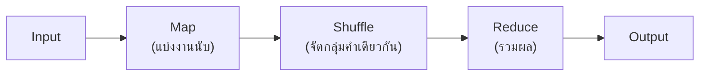

# Data Engineer - Chapter 02: Data Cleansing with Spark

> **วิชา:** Road to Data Engineer 3.0 (R2DE 3.0) | **ผู้สอน:** DataTH
> **Source:** `Resources/Books/DataEngineer/2_Data_Cleansing_with_Spark.pdf` (61 slides)
> **หมายเหตุ:** ส่วนที่ติดป้าย `[เสริมนอกสไลด์]` คือความรู้ที่ผู้เขียนโน้ตเพิ่มเอง

---

## Part 1: Macro Architecture & Overview

ลองนึกถึง **การล้างผัก** ก่อนทำอาหาร: ถ้าผักมีดินติดอยู่ ต่อให้เชฟเก่งแค่ไหนอาหารก็ไม่อร่อย ข้อมูลก็เช่นกัน ถ้าเข้าไปในระบบทั้งที่ผิดพลาด ผลวิเคราะห์ทุกอย่างจะผิดตาม (**Garbage In, Garbage Out**) Chapter 2 แบ่งเป็น 2 ท่อน: (1) **ทฤษฎีคุณภาพข้อมูลและวิธีหาความผิดปกติ** (2) **เครื่องมือประมวลผลข้อมูลขนาดใหญ่แบบกระจาย: Apache Spark**



### ตารางเปรียบเทียบเครื่องมือตามขนาดข้อมูล

| ขนาดข้อมูล | เครื่องมือที่เหมาะ | เหตุผล |
| :--- | :--- | :--- |
| เล็ก (ไม่กี่ MB) | Pandas, Polars | เครื่องเดียวเพียงพอ ง่ายและเร็ว |
| ใหญ่ (เกินหน่วยความจำเครื่องเดียว) | Apache Spark | กระจายงานไปหลายเครื่อง |

---

## Part 2: Module-by-Module Deep Dive

### 2.1 Data Cleansing & Data Quality

> **Data Cleansing** = การพัฒนาคุณภาพข้อมูลโดยค้นหาและแก้ไขความผิดพลาดในข้อมูล

**ทำไมสำคัญ (ตามสไลด์):**
* Data Scientist ส่วนใหญ่ใช้เวลาไปกับการทำความสะอาดข้อมูล (อ้างผลสำรวจ Forbes)
* ข้อมูลที่ไม่สะอาดมีราคาแพง (สไลด์ยกตัวอย่างความเสียหายของเศรษฐกิจอเมริกาปี 2016)
* ตัวอย่างต้นเหตุ: ข้อมูลจากแบบสำรวจกระดาษ → คนพิมพ์เข้าระบบผิด

**ทำไม Data Cleaning ถึงยาก:** เป็นกระบวนการที่ **ไม่มีวันจบสิ้น** ข้อมูลใหม่เข้ามาตลอดจึงต้องมีวงจร Data Auditing → Workflow → ตรวจซ้ำ

#### Data Quality: คุณภาพข้อมูลที่ดีคืออะไร

สไลด์เริ่มที่ **Completeness** (ข้อมูลครบ ไม่มีค่าว่าง) `[เสริมนอกสไลด์: มิติอื่นที่นิยมใช้ ได้แก่ Accuracy, Consistency, Validity, Timeliness, Uniqueness]`

| มิติ | ถามว่า | ตัวอย่างข้อมูลที่ไม่ผ่าน |
| :--- | :--- | :--- |
| **Completeness** | ครบไหม | อีเมลลูกค้าเป็นค่าว่าง |
| **Accuracy** `[เสริม]` | ตรงความจริงไหม | อายุ 200 ปี |
| **Consistency** `[เสริม]` | ตรงกันทุกระบบไหม | เบอร์โทรต่างกันในสองระบบ |
| **Validity** `[เสริม]` | ตามรูปแบบที่กำหนดไหม | อีเมลไม่มี `@` |
| **Uniqueness** `[เสริม]` | ซ้ำไหม | ลูกค้าคนเดียวมี 2 record |

#### เครื่องมือกำกับดูแลข้อมูล 3 ตัว

| เครื่องมือ | คืออะไร (ตามสไลด์) | ใช้ทำอะไร |
| :--- | :--- | :--- |
| **Data Dictionary** | ไฟล์รวบรวมรายละเอียดของทุกคอลัมน์ในตาราง | ให้ทุกคนในองค์กรเข้าใจคอลัมน์ตรงกัน |
| **Data Catalog** | แหล่งรวมข้อมูลและ metadata ทั้งหมด | ให้ฝั่ง Business และ Tech ค้นหาข้อมูลได้ |
| **Data Lineage** | การเดินทางของข้อมูลตั้งแต่ต้นจนจบ | ตรวจสอบย้อนหลังว่าตัวเลขมาจากไหน |

**ตัวอย่าง Data Dictionary `[เสริมนอกสไลด์]`:**

| Column | Type | ความหมาย | ค่าที่ยอมรับ |
| :--- | :--- | :--- | :--- |
| `gender` | string | เพศลูกค้า | `male`, `female`, `other` |
| `thb_amount` | float | ยอดซื้อเป็นบาท | >= 0 |

---

### 2.2 EDA & Data Profiling

> **Data Profiling** = การดูภาพรวมของข้อมูลเพื่อหาว่ามีปัญหาอะไรกับข้อมูลหรือไม่ (ตัวอย่างในสไลด์ใช้ข้อมูล Hotel Booking)

> **Exploratory Data Analysis (EDA)** = การวิเคราะห์ข้อมูลเชิงสำรวจ ใช้เทคนิคและกราฟเพื่อทำความรู้จักข้อมูล

#### ประเภทของ EDA (2 คำถามแบ่งหมวด)

| | ตัวเลข | กราฟิก |
| :--- | :--- | :--- |
| **ตัวอย่าง** | Descriptive Statistics (ค่าเฉลี่ย สูงสุด ต่ำสุด) | Histogram, **Boxplot**, **Scatterplot** |

* **Boxplot:** แสดงการกระจายตัวและค่าที่เกินปกติมาก (Outliers)
* **Scatterplot:** ใช้หาความสัมพันธ์ระหว่าง 2 ตัวแปร

```python
# [เสริมนอกสไลด์] Data Profiling เบื้องต้นด้วย Pandas
import pandas as pd

df = pd.read_csv("hotel_bookings.csv")
print(df.shape)                    # จำนวนแถว/คอลัมน์
print(df.dtypes)                   # ชนิดข้อมูลแต่ละคอลัมน์
print(df.isna().sum())             # นับค่าว่างต่อคอลัมน์
print(df.describe())               # สถิติพื้นฐาน (mean, min, max, quartile)
```

---

### 2.3 Data Anomalies (ความผิดปกติของข้อมูล)

| ประเภท | สาเหตุ | ตัวอย่าง | วิธีจัดการ |
| :--- | :--- | :--- | :--- |
| **Syntactical** | ผิดพลาดตอนกรอก (สะกดผิด รูปแบบผิด) | `Bangkk`, ` Bangkok ` | Regex, trim, standardize |
| **Semantic** | ค่าไม่ตรงเงื่อนไขธุรกิจ (Integrity Constraints) | อายุติดลบ, วันเช็คเอาต์ก่อนเช็คอิน | ตรวจกฎธุรกิจ แล้วแก้/ตัดทิ้ง |
| **Coverage (Missing)** | ข้อมูลหาย | `NULL` | ลบ/เติมค่า ตามประเภทการหาย |
| **Outliers** | ค่าห่างจากส่วนใหญ่มาก | ราคาห้อง 1,000,000 บาท | ตรวจด้วยสถิติ/กราฟ แล้วตัดสินใจ |

#### Regular Expression (Regex)

> **Regex** = pattern สำหรับค้นหาตัวหนังสือ เป็นเครื่องมือหลักตรวจ Syntactical/Semantic Anomalies

```python
# [เสริมนอกสไลด์] ตรวจรูปแบบอีเมลและเบอร์โทรด้วย Regex
import re
email_ok = re.fullmatch(r"[\w.+-]+@[\w-]+\.[\w.]+", "test@example.com")  # ผ่านถ้าไม่ใช่ None
phone_ok = re.fullmatch(r"0\d{9}", "0812345678")                         # เบอร์ไทย 10 หลักขึ้นต้น 0
```

#### Missing Values: MAR vs MNAR

| แบบ | ชื่อเต็ม | ความหมาย | ตัวอย่าง `[เสริมนอกสไลด์]` |
| :--- | :--- | :--- | :--- |
| **MAR** | Missing At Random | หายโดยบังเอิญ | เครื่องส่งข้อมูลขัดข้องชั่วคราว |
| **MNAR** | Missing Not At Random | หายอย่างมีสาเหตุ | คนรายได้สูงไม่ยอมกรอกรายได้ |

> **ทำไมต้องแยก:** ถ้าหายอย่างมีสาเหตุ การเติมค่าเฉลี่ยจะทำให้ผลวิเคราะห์เอนเอียง ควรเข้าใจสาเหตุก่อนตัดสินใจ

#### Outliers

ค่าที่ห่างจากส่วนใหญ่มาก อาจเกิดจากข้อมูลผิด **หรือ** ค่าจริงที่หายากก็ได้ `[เสริมนอกสไลด์: เทคนิคทั่วไป เช่น กฎ IQR]`

$$IQR = Q3 - Q1,\quad \text{Outlier ถ้า } x < Q1 - 1.5\,IQR \ \text{หรือ}\ x > Q3 + 1.5\,IQR$$



---

### 2.4 Distributed Data Processing

> **Distributed Data Processing** = กระจายงานประมวลผลไปหลายเครื่องทำงานพร้อมกัน

**เปรียบเทียบตามสไลด์ (Word Count):** นับคำในหนังสือเล่มหนึ่ง ถ้าใช้ผู้เชี่ยวชาญคนเดียวนับทั้งเล่มจะช้า แต่ถ้าแบ่งหนังสือเป็นหลายส่วนให้หลายคนนับพร้อมกัน แล้วเอาผลมารวม จะเสร็จเร็วกว่ามาก

#### Hadoop MapReduce

ส่วนหนึ่งของ Hadoop เป็นวิธี Distributed Processing ที่ได้รับความนิยมมากในช่วงก่อนหน้า



> **ข้อจำกัด `[เสริมนอกสไลด์]`:** MapReduce มักเขียนผลกลางลงดิสก์ระหว่างขั้นตอน จึงช้ากว่าแนวทางประมวลผลในหน่วยความจำอย่าง Spark

---

### 2.5 Apache Spark

> **Apache Spark** = เทคโนโลยี Distributed Data Processing สำหรับข้อมูลขนาดใหญ่ คิดค้นโดย University of California (ตามสไลด์: ปี 2014)

**Module ที่มากับ Spark:** Spark SQL (เขียน SQL), และอื่นๆ ที่สไลด์ P.43 แสดง `[เช่น Streaming, MLlib, GraphX — เสริมนอกสไลด์]`

#### ประเภทข้อมูลใน Spark

| ประเภท | ลักษณะ | การใช้งาน |
| :--- | :--- | :--- |
| **RDD** (Resilient Distributed Datasets) | วิธีเก็บข้อมูลพื้นฐานของ Spark | ใช้ค่อนข้างยาก |
| **DataFrame** | เก็บเป็นตาราง คล้าย Pandas/R | ใช้ง่าย ใช้มากที่สุดในงาน DE |
| **Dataset** (Java/Scala) | DataFrame ที่มี type | ภาษา Java/Scala เท่านั้น |

**Transformation vs Action (RDD):**

| | Transformation | Action |
| :--- | :--- | :--- |
| **ทำอะไร** | กำหนดว่าจะแปลงข้อมูลอย่างไร | สั่งให้คำนวณและคืนผล |
| **ตัวอย่าง** | `filter`, `map` | `count`, `collect` |
| **พฤติกรรม `[เสริมนอกสไลด์]`** | Lazy: ยังไม่คำนวณทันที | Eager: ทำให้งานรันจริง |

> สไลด์ยังระบุว่า Spark เพิ่มคำสั่งแบบ Pandas ให้ใช้ เช่น `.read_csv()`, `.sort_values()`, `drop()` (Pandas API on Spark)

#### Spark SQL

ใช้ SQL ดึงข้อมูลจาก Spark DataFrame ได้โดยตรง เหมาะถ้าคุ้นกับ SQL ([[LAB 8 - SQL GROUP BY and Aggregate Functions]])

```python
# [เสริมนอกสไลด์] ตัวอย่าง PySpark: โหลด ล้าง และสรุปข้อมูล
from pyspark.sql import SparkSession, functions as F

spark = SparkSession.builder.appName("cleansing").getOrCreate()

df = spark.read.csv("transactions.csv", header=True, inferSchema=True)   # โหลดเป็น DataFrame

clean = (
    df.dropDuplicates()                                  # ตัดแถวซ้ำ
      .filter(F.col("amount") >= 0)                      # ตัดค่าติดลบ (Semantic Anomaly)
      .withColumn("city", F.trim(F.initcap("city")))     # ทำตัวสะกดให้เป็นรูปแบบเดียวกัน
      .fillna({"coupon": "NONE"})                        # เติมค่าว่าง
)

clean.createOrReplaceTempView("t")
spark.sql("SELECT city, SUM(amount) FROM t GROUP BY city").show()   # Action: สั่งคำนวณจริง
```

#### วิธีใช้งาน Spark 3 แบบ

| วิธี | ข้อดี | ข้อเสีย |
| :--- | :--- | :--- |
| ติดตั้งบนคอมพิวเตอร์เอง | ควบคุมเอง | ติดตั้ง/ดูแลเยอะ ระบบแต่ละเครื่องต่างกัน |
| ใช้ Cloud (เช่น Google Dataproc, **Databricks**) | ติดตั้งง่าย | พึ่ง Cloud (ดู [[Chapter 03 - Cloud Computing and Bash]]) |
| `[วิธีที่ 3 ดูสไลด์ P.50-51]` | | |

**Databricks:** Data Platform ออนไลน์ที่สร้างโดยทีมผู้พัฒนา Spark

#### เลือกเครื่องมืออย่างไร (สไลด์ P.54)

* คอมพิวเตอร์เครื่องเดียว + ข้อมูลน้อย → Pandas / Polars
* ข้อมูลใหญ่เกินเครื่องเดียว → Spark

---

### 2.6 Workshop 2: Data Cleansing with Spark

* **แหล่งเรียนรู้ & โน้ตบุ๊กปฏิบัติการ:** [Google Colab - Workshop 2 (กด File > Save a copy in Drive)](https://colab.research.google.com/drive/18lqcIn47PfOXcFQSghlfW_9sSwXfMin2)
* **เป้าหมาย:** นำข้อมูลที่ได้จาก Workshop 1 (Transactions, Products, Customer) มาทำความสะอาดด้วย Apache Spark บน Colab โดยปฏิบัติตามหลักการ Data Profiling และจัดการ Anomalies ทั้ง 4 ประเภท

#### ขั้นตอนการปฏิบัติการ (Implementation Pipeline):

1. **ติดตั้งและสร้าง SparkSession บน Colab:**
   ```python
   !pip install pyspark
   from pyspark.sql import SparkSession
   from pyspark.sql import functions as F
   from pyspark.sql.types import *

   spark = SparkSession.builder.appName("R2DE3_Workshop2").getOrCreate()
   ```

2. **Data Ingestion & Profiling (สำรวจหาความผิดปกติ):**
   * โหลดไฟล์ข้อมูลเข้า Spark DataFrame: `df = spark.read.csv("...", header=True, inferSchema=True)`
   * ตรวจสอบ Schema: `df.printSchema()`
   * ดูภาพรวมสถิติ: `df.describe().show()`
   * ตรวจสอบค่า Missing (Coverage Anomalies): นับค่า `null` ในแต่ละคอลัมน์ด้วย `F.count(F.when(F.isnan(c) | F.col(c).isNull(), c))`

3. **Data Cleansing & Transformation (แก้ไขปัญหาตาม 4 Anomalies):**
   * **Syntactical Anomaly:** ปรับรูปแบบวันที่ให้เป็นมาตรฐานเดียวกันด้วย `F.to_date(F.col("Date"), "yyyy-MM-dd")`
   * **Semantic Anomaly:** ตรวจสอบความถูกต้องของรหัส เช่น `Country` หรือ `ProductNo` ที่ไม่ตรงกับ Business Rules
   * **Coverage Anomaly (Missing Values):** จัดการค่าสูญหายด้วยกลยุทธ์ที่เหมาะสม เช่น ใช้ `df.dropna(subset=["CustomerID"])` หรือแทนค่า Default ด้วย `df.fillna()`
   * **Outliers / Integrity Constraints:** กรองข้อมูลที่ผิดธรรมชาติ เช่น จำนวนสินค้าติดลบ `df.filter(F.col("Quantity") > 0)`

4. **Export Cleaned Data:**
   * บันทึกข้อมูลที่สะอาดแล้วในรูปแบบ Parquet เพื่อคงโครงสร้าง Data Types และเพิ่มประสิทธิภาพการประมวลผลสำหรับขั้นตอนถัดไป ([[Chapter 03 - Cloud Computing and Bash]])

---

## Part 3: Quick Reference & Exam Cheat Sheet

### Checklist สรุปหัวใจสำคัญ
* [ ] **Garbage In, Garbage Out:** ข้อมูลไม่สะอาด = ผลวิเคราะห์ผิด
* [ ] **Data Dictionary / Catalog / Lineage:** นิยามคอลัมน์ / ที่ค้นหาข้อมูล / เส้นทางข้อมูล
* [ ] **Data Profiling vs EDA:** ดูภาพรวมหาปัญหา vs สำรวจเชิงลึก
* [ ] **4 Anomalies:** Syntactical, Semantic, Coverage (Missing), Outliers
* [ ] **MAR vs MNAR:** หายบังเอิญ vs หายมีสาเหตุ
* [ ] **Spark:** กระจายงานหลายเครื่อง; RDD/DataFrame/Spark SQL
* [ ] **Transformation vs Action**

### Decision Rules

```text
ข้อมูลเล็ก เครื่องเดียวพอ         → Pandas / Polars
ข้อมูลใหญ่เกินเครื่องเดียว         → Spark
ตัวสะกด/รูปแบบผิด                  → Regex + Standardize
ค่าผิดเงื่อนไขธุรกิจ              → ตรวจ Integrity Constraints
ค่าหาย                            → ถามก่อน: MAR หรือ MNAR?
```

### Concept Map

```text
Data Cleansing
├── Data Quality (Completeness, ...)
│   └── Dictionary / Catalog / Lineage
├── Profiling & EDA (ตัวเลข / กราฟิก)
├── Anomalies (Syntactical, Semantic, Missing, Outliers)
└── Processing
    ├── Small → Pandas / Polars
    └── Big → Distributed: MapReduce → Spark (RDD, DataFrame, SQL)
```

---

## ⚠️ Common Pitfalls & Exam Traps

* **"Missing Values ลบทิ้งหมดก็จบ":** ถ้าเป็น MNAR การลบหรือเติมค่ามั่วทำให้ผลเอนเอียง ต้องเข้าใจสาเหตุก่อน
* **"Outlier คือข้อมูลผิดเสมอ":** อาจเป็นค่าจริงที่หายาก (เช่น ลูกค้าซื้อเยอะผิดปกติ) ต้องดูบริบทธุรกิจ
* **"Transformation สั่งแล้วคำนวณทันที":** Transformation เป็น Lazy ต้องมี Action ถึงจะประมวลผลจริง `[เสริมนอกสไลด์]`
* **"Spark เร็วกว่า Pandas เสมอ":** กับข้อมูลเล็ก Spark มี overhead จึงอาจช้ากว่า เลือกให้เหมาะกับขนาดข้อมูล
* **"Syntactical กับ Semantic Anomaly คืออย่างเดียวกัน":** Syntactical = รูปแบบ/สะกดผิด; Semantic = ค่าไม่สมเหตุสมผลตามกฎธุรกิจ
* **"Data Dictionary = Data Catalog":** Dictionary อธิบายคอลัมน์ในตาราง Catalog รวม metadata ทั้งองค์กรไว้ค้นหา

---

## เอกสารเชื่อมโยง (Wiki-Style Backlinks)
* **วิชาและหัวข้อที่เกี่ยวข้อง:**
  * [[Chapter 01 - Data Collection]] (ขั้นก่อนหน้า: ข้อมูลที่ดึงมาเป็นอินพุตของบทนี้)
  * [[Chapter 03 - Cloud Computing and Bash]] (ใช้ Cloud รัน Spark เช่น Dataproc/Databricks)
  * [[Chapter 05 - Data Warehouse with BigQuery]] (ปลายทางของข้อมูลที่ล้างแล้ว)
  * [[LAB 8 - SQL GROUP BY and Aggregate Functions]] (พื้นฐาน SQL ที่ใช้ใน Spark SQL)

* **แหล่งข้อมูล:**
  * Source: `Resources/Books/DataEngineer/2_Data_Cleansing_with_Spark.pdf` (61 slides, DataTH)
  * Reference: Zaharia et al. — *Apache Spark* (spark.apache.org/docs) `[เสริมนอกสไลด์]`
