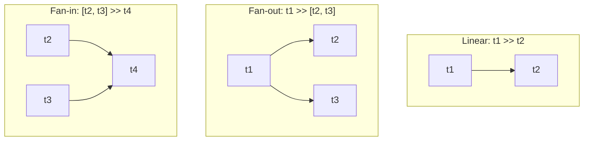

# Data Engineer - Chapter 04: Data Pipeline Orchestration with Airflow

> **วิชา:** Road to Data Engineer 3.0 (R2DE 3.0) | **ผู้สอน:** DataTH
> **Source:** `Resources/Books/DataEngineer/4Airflow.pdf` (79 slides)
> **หมายเหตุ:** ส่วนที่ติดป้าย `[เสริมนอกสไลด์]` คือความรู้ที่ผู้เขียนโน้ตเพิ่มเอง

---

## Part 1: Macro Architecture & Overview

ลองนึกถึง **ผู้จัดการวงออร์เคสตรา**: นักดนตรีแต่ละคน (Task) เก่งของตัวเอง แต่ต้องมีคนบอกว่าใครเริ่มเมื่อไร ใครรอใคร และถ้าใครเล่นผิดจะทำอย่างไร Chapter 4 คือการสร้าง "ผู้จัดการ" ให้ Pipeline ด้วย **Apache Airflow** (รันบน **Google Cloud Composer**) เพื่อให้ Pipeline ทำงานอัตโนมัติ ตรวจสอบสถานะได้ และจัดการ Dependency ระหว่างงาน

```text
          ┌────────────── Airflow ──────────────┐
          │  Web UI ◄──► Metadata DB            │
          │     ▲             ▲                 │
          │  Scheduler ──► Workers (รัน Task)   │
          │     │                               │
          │   DAG:  [extract] ──► [transform] ──► [load]
          └────────────────────────────────────┘
Google Cloud Composer = Airflow ที่ Google ติดตั้งและดูแลให้ (ใช้ GCS เก็บไฟล์ DAG)
```

### ตารางเปรียบเทียบเครื่องมือ Orchestration

| Feature | Cron | Apache Airflow |
| :--- | :--- | :--- |
| **แนวคิด** | ตั้งเวลารันคำสั่งง่ายๆ (มากับ Linux) | จัดการ Pipeline ทั้งชุดเป็นกราฟ |
| **Dependency ระหว่างงาน** | ไม่มีในตัว | มี (กำหนดด้วย DAG) |
| **UI ตรวจสอบสถานะ** | ไม่มี | มี Web UI |
| **เหมาะกับ** | งานเดี่ยวๆ ง่ายๆ | Pipeline หลายขั้นที่ต้องเชื่อมกัน |

---

## Part 2: Module-by-Module Deep Dive

### 2.1 สร้าง Cloud Composer Cluster (ก่อนเริ่มเรียน)

สไลด์ให้สร้าง Composer Environment ไว้ก่อนเพราะใช้เวลานาน ขั้นตอนหลัก: Enable Cloud Composer API (ครั้งแรก) → Create Environment (Composer 2 ต้อง Grant permission ผ่านหน้า IAM) → รอสร้างเสร็จ

> **คำเตือน `[เสริมนอกสไลด์]`:** Composer เป็นบริการที่คิดเงินตามเวลาที่เปิดอยู่ เมื่อจบ Workshop ควรลบ Environment และดูค่าใช้จ่ายใน Billing

---

### 2.2 Data Pipeline Orchestration คืออะไร

**Automation** ทำให้ Pipeline ทำงานเองอัตโนมัติ แต่เมื่อข้อมูลหลากหลายขึ้น Pipeline ก็เพิ่มขึ้นและมี **Dependency** (การพึ่งพา) ระหว่างกัน เช่น "ต้องรอ Pipeline A เสร็จก่อน B ถึงเริ่มได้" จึงต้องมีตัวจัดการ

> **Orchestration** = การจัดตาราง ควบคุมลำดับ ติดตามสถานะ และจัดการข้อผิดพลาดของ Data Pipeline หลายตัวให้ทำงานประสานกัน

**แบบเก่า: Cron** เครื่องมือตั้งเวลาที่มากับ Linux ใช้ง่ายแต่จัดการ Dependency ไม่ได้

**เครื่องมือสมัยใหม่ในสไลด์:** Azkaban (เริ่มโดย LinkedIn เหมาะกับ Hadoop), Airflow และอื่นๆ `[ตัวอย่างอื่นเสริมนอกสไลด์: Luigi, Prefect, Dagster]`

---

### 2.3 Apache Airflow

> **Apache Airflow** = เครื่องมือที่ Airbnb สร้างปี 2015 เพื่อทำ Data Pipeline Orchestration (Open-source ใช้ได้ทั้งบนเครื่องตัวเอง on-premise และ Cloud ตามที่สไลด์ CH5 ย้ำ)

**Airbnb ใช้ Airflow ทำอะไร (ตามสไลด์):** Data Cleansing, ตรวจคุณภาพข้อมูล และงานอื่นๆ ที่เป็น Pipeline

**Community:** มีผู้กดดาวบน GitHub มากกว่า 35,000+ (ตัวเลข ณ เวลาที่ทำสไลด์) และมีงานประจำปี **Airflow Summit**

#### 2.3.1 ส่วนประกอบของ Airflow

| ส่วนประกอบ | หน้าที่ `[คำอธิบายเสริมนอกสไลด์]` |
| :--- | :--- |
| **Web UI** | ดู/ควบคุม DAG เปิด-ปิด ดู Schedule และผลการรันในอดีต |
| **Scheduler** | ตัดสินว่า Task ไหนถึงเวลารัน |
| **Workers** | ทำงานจริงของแต่ละ Task |
| **Metadata Database** | เก็บสถานะการรันและการตั้งค่า |
| **CLI** | สั่งงาน Pipeline ผ่านคำสั่ง |
| **Providers** | ตัวเชื่อมต่อกับระบบอื่นๆ มากมาย (GCP, AWS, MySQL ฯลฯ) |

#### 2.3.2 DAG: หัวใจของ Airflow

> **DAG (Directed Acyclic Graph)** = กราฟที่มีทิศทางและ **ไม่วนกลับ** (วิ่งทางเดียว) 1 Data Pipeline ใน Airflow = 1 DAG

```text
ผิด (มีวงวน — ไม่ใช่ DAG):      ถูก (DAG):
 A ──► B ──► C                    A ──► B ──┬──► D
 ▲           │                          │      ▲
 └───────────┘                          └──► C ┘
```

* **Task:** หน่วยงานย่อยใน DAG
* **Task Status:** แต่ละ Task มีสถานะกำกับ (เช่น สำเร็จ ล้มเหลว กำลังรัน) ดูได้ใน UI
* **Task หลัก 2 แบบ (สไลด์):** **Operator** (ทำงาน) และ **Sensor** (รอเงื่อนไข)
* **Graph View:** ดูโครงสร้าง DAG ว่าแต่ละ Task ต่อกันอย่างไร
* **TaskGroup:** รวม Task ที่เกี่ยวข้องเป็นกลุ่มย่อยเพื่อให้ DAG อ่านง่าย

**ตัวอย่าง ETL DAG (สไลด์ P.28):** E (Extract) → T (Transform) → L (Load) แต่ละขั้นเป็น 1 Task

#### 2.3.3 Airflow แบบ Managed

| บริการ | ผู้ให้ | จุดเด่น |
| :--- | :--- | :--- |
| **Cloud Composer** | Google Cloud | ติดตั้งดูแลให้ ใช้ร่วมกับ GCS/BigQuery ง่าย |
| **Astro** | Astronomer | สำหรับคนไม่อยากติด Vendor Lock-in กับ Google |
| **Amazon MWAA** | AWS | Airflow บน AWS |

**โบนัส:** ใน Extra Chapter มีสอน Airflow on Docker ติดตั้งบนเครื่องตัวเอง

---

### 2.4 สร้าง Airflow DAG

#### 2.4.1 โครงสร้างไฟล์ DAG (5 ขั้นตอนตามสไลด์)

| ขั้น | ทำอะไร |
| :--- | :--- |
| 1. **Importing Modules** | import DAG และ Operator ที่ต้องใช้ |
| 2. **Default Arguments** | config กลางที่ใช้กับทุก Task ถ้าไม่ได้เขียนทับ |
| 3. **Instantiate a DAG** | สร้าง DAG object (ตั้ง schedule, ชื่อ ฯลฯ) |
| 4. **Tasks** | สร้าง Operator โดยมี `task_id` ไม่ซ้ำกัน |
| 5. **Setting up Dependencies** | กำหนดลำดับ Task |

```python
# ตัวอย่าง DAG ง่ายๆ (อิงโครงสร้างตามสไลด์: import → default_args → DAG → tasks → dependencies)
from datetime import datetime, timedelta
from airflow import DAG
from airflow.operators.bash import BashOperator   # สไลด์ใช้ BashOperator เป็นตัวอย่าง

default_args = {                       # config กลางใช้ร่วมกันทุก Task
    "owner": "me",
    "retries": 1,                      # ล้มเหลวแล้วลองใหม่ 1 ครั้ง [ค่าตัวอย่าง]
    "retry_delay": timedelta(minutes=5),
}

with DAG(
    dag_id="hello_pipeline",           # ชื่อ DAG ต้องไม่ซ้ำ
    default_args=default_args,
    start_date=datetime(2024, 5, 1),
    schedule_interval="@daily",        # ใช้ Preset หรือ Cron ได้ (เช่น "0 6 * * *")
    catchup=False,                     # ไม่รันย้อนหลังทุกวันที่ผ่านมา [เสริมนอกสไลด์]
) as dag:
    t1 = BashOperator(task_id="say_hello", bash_command="echo 'Hello World'")
    t2 = BashOperator(task_id="say_bye", bash_command="echo 'Bye'")

    t1 >> t2                           # t1 ต้องเสร็จก่อน t2 เริ่ม
```

> **หมายเหตุ `[เสริมนอกสไลด์]`:** ชื่อพารามิเตอร์ schedule ใน Airflow รุ่นใหม่เปลี่ยนเป็น `schedule` ถ้าเวอร์ชันของ Composer ที่ใช้ต่างกัน ให้ตรวจเอกสารตามเวอร์ชัน (สไลด์มีหน้า Cloud Composer แต่ละ version ต่างกันอย่างไร)

#### 2.4.2 Schedule Interval และแนวคิด ETL ของ Airflow

* ใช้ **Preset** หรือ **Cron expression** ได้ (สไลด์แนะนำ crontab.guru ช่วยสร้าง Cron)
* Airflow ออกแบบตามแนวคิดว่า ETL ของช่วงเวลาหนึ่ง จะรัน **เมื่อช่วงเวลานั้นสิ้นสุดแล้ว** (เช่น ETL ของวันนี้ต้องรอข้อมูลครบทั้งวัน ก่อนรัน)

#### 2.4.3 Operator ที่พบบ่อย

| Operator | ใช้ทำอะไร |
| :--- | :--- |
| `BashOperator` | รันคำสั่ง Bash (`bash_command`) |
| `PythonOperator` / TaskFlow `[เสริม]` | รันฟังก์ชัน Python |
| `EmptyOperator` / `DummyOperator` | ไม่ทำอะไร ใช้เป็นจุดรวม/แยกใน DAG |

#### 2.4.4 Dependencies

```python
t1 >> t2            # t1 ก่อน t2 (เรียงลำดับ)
t1 >> [t2, t3]      # Fan-out: t1 เสร็จแล้ว t2 และ t3 รันพร้อมกัน
[t2, t3] >> t4      # Fan-in:  t2 และ t3 เสร็จทั้งคู่ถึงรัน t4
```



#### 2.4.5 Bonus: Atomic & Idempotent

| หลักการ | ความหมาย `[คำอธิบายขยายนอกสไลด์]` | ตัวอย่าง |
| :--- | :--- | :--- |
| **Atomic** | Task ทำสำเร็จทั้งหมดหรือไม่ทำเลย | ไม่โหลดข้อมูลแค่ครึ่งเดียว |
| **Idempotent** | รันซ้ำกี่ครั้งผลลัพธ์ก็เหมือนเดิม | โหลดข้อมูลของวันที่ X ด้วยการ "แทนที่" ไม่ใช่ "เพิ่มต่อท้าย" |

> **ทำไมสำคัญ:** Pipeline ล้มกลางทางเป็นเรื่องปกติ ถ้า Idempotent เราสั่ง rerun ได้อย่างมั่นใจโดยข้อมูลไม่ซ้ำ

---

### 2.5 Workshop 4: Automated Data Pipeline with Airflow

**ลำดับ (ตามสไลด์):**

1. จัดการ Composer environment และติดตั้ง **Python packages** (ใช้เวลาราว 7-10 นาที)
2. `git clone` ไฟล์โปรเจกต์ (r2de3-workshops) จาก GitHub
3. เปิด Airflow UI
4. Upload ไฟล์ DAG ไปที่โฟลเดอร์ `dags` ใน GCS ของ Composer (`/home/airflow/gcs/dags/`)
5. ทำ Exercise: **Simple Pipeline (TaskFlow)**, **Fan-out Pipeline**, **Fan-in Pipeline** (ใช้ `EmptyOperator`/`DummyOperator`)
6. ใช้ **GCS mount** ใน Composer: `/home/airflow/gcs/data/` ตรงกับ `gs://[CLOUD_COMPOSER_BUCKET]/data/`
7. สร้าง **Connection** (เช่น MySQL) ให้ Airflow เชื่อมต่อระบบอื่น
8. Bonus: เขียนคำอธิบาย DAG ด้วย `doc_md`

> **Connection:** การเชื่อมต่อ Airflow เข้ากับระบบอื่น และเก็บข้อมูลเชื่อมต่อไว้ให้ DAG ใช้ `[หลักปฏิบัติเสริมนอกสไลด์: ห้ามเขียนรหัสผ่านในโค้ด DAG ให้เก็บใน Connection/Secret Manager]`

---

## Part 3: Quick Reference & Exam Cheat Sheet

### Checklist สรุปหัวใจสำคัญ
* [ ] **Orchestration:** จัดตาราง ลำดับ สถานะ ของหลาย Pipeline
* [ ] **Cron vs Airflow:** Cron ไม่มี Dependency/UI
* [ ] **DAG:** กราฟทิศทางเดียว ไม่วนกลับ = 1 Pipeline
* [ ] **Task / Operator / Sensor**
* [ ] **Managed Airflow:** Composer (GCP), Astro, MWAA (AWS)
* [ ] **5 ขั้นเขียน DAG:** Import → Default Args → DAG → Tasks → Dependencies
* [ ] **Schedule:** Preset / Cron
* [ ] **Fan-out / Fan-in**
* [ ] **Atomic & Idempotent**

### สรุป Syntax สำคัญ

| Syntax | ความหมาย |
| :--- | :--- |
| `t1 >> t2` | t1 ก่อน t2 |
| `t1 >> [t2, t3]` | Fan-out |
| `[t2, t3] >> t4` | Fan-in |
| `/home/airflow/gcs/dags/` | โฟลเดอร์วางไฟล์ DAG ใน Composer |

### If you see X → think Y

```text
ต้องรัน Pipeline ทุกวันอัตโนมัติ + ต้องรอ Task ก่อนหน้า → Airflow DAG
รันซ้ำแล้วข้อมูลซ้ำ                                        → Pipeline ไม่ Idempotent
ต้องรอไฟล์มาก่อนเริ่ม                                       → Sensor
```

### Concept Map

```text
Orchestration
├── Cron (ง่าย ไม่มี Dependency)
└── Airflow
    ├── Components: Web UI, Scheduler, Workers, Metadata DB, Providers
    ├── DAG ──► Tasks (Operator / Sensor) ──► Dependencies
    ├── Managed: Composer / Astro / MWAA
    └── Best Practice: Atomic, Idempotent
```

---

## ⚠️ Common Pitfalls & Exam Traps

* **"DAG คือ Task ตัวหนึ่ง":** DAG คือ "Pipeline ทั้งชุด" ส่วน Task เป็นหน่วยย่อยใน DAG
* **"DAG วนซ้ำได้ถ้าจำเป็น":** ต้อง **Acyclic** เสมอ ถ้าต้องการรันซ้ำ ให้ใช้ Schedule ไม่ใช่วงวนใน DAG
* **"Airflow ประมวลผลข้อมูลเอง":** Airflow เป็นตัวสั่งงานและติดตามสถานะ งานประมวลผลหนักควรทำโดยเครื่องมืออื่น (Spark, BigQuery) `[เสริมนอกสไลด์]`
* **"ไฟล์ DAG อยู่ที่ไหนก็ได้":** ใน Composer ต้อง Upload ไปที่โฟลเดอร์ `dags` ของ GCS Bucket ที่ผูกกับ Environment
* **"รันซ้ำไม่มีผลเสีย":** ถ้า Task ไม่ Idempotent เช่น `INSERT` ต่อท้าย รันซ้ำจะทำให้ข้อมูลซ้ำ
* **"ตั้ง schedule แล้วรันตอนถึงเวลาเริ่ม":** Airflow รันเมื่อ **ช่วงเวลานั้นสิ้นสุด** ไม่ใช่ตอนเริ่ม

---

## เอกสารเชื่อมโยง (Wiki-Style Backlinks)
* **วิชาและหัวข้อที่เกี่ยวข้อง:**
  * [[Chapter 01 - Data Collection]] (แนวคิด Pipeline และ ETL ที่ Airflow ทำให้อัตโนมัติ)
  * [[Chapter 03 - Cloud Computing and Bash]] (GCS, Cloud Shell, Bash ที่ใช้ใน Workshop)
  * [[Chapter 05 - Data Warehouse with BigQuery]] (ต่อยอด DAG ให้โหลดข้อมูลเข้า BigQuery)
  * [[Chapter 07 - Advanced Data Engineering]] (Git, Docker, Kubernetes ที่เกี่ยวกับการ Deploy Airflow)

* **แหล่งข้อมูล:**
  * Source: `Resources/Books/DataEngineer/4Airflow.pdf` (79 slides, DataTH)
  * Reference: Apache Airflow Documentation (airflow.apache.org) `[เสริมนอกสไลด์]`
