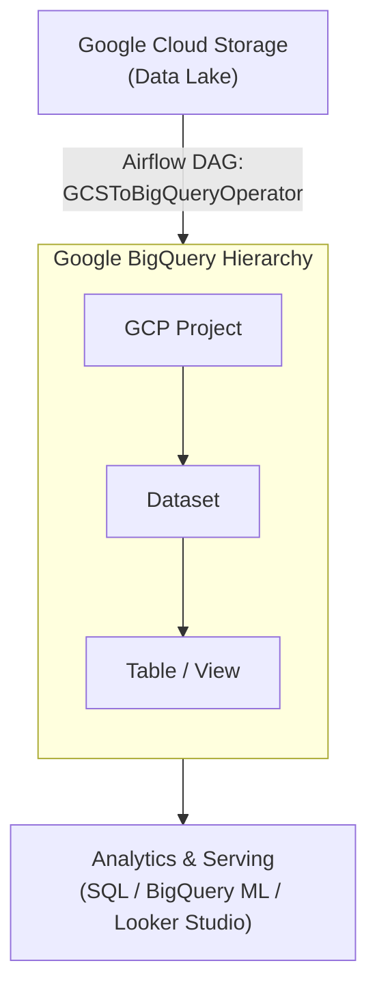

# Data Engineer - Chapter 05: Data Warehouse with BigQuery

> **วิชา:** Road to Data Engineer 3.0 (R2DE 3.0) | **ผู้สอน:** DataTH
> **Source:** `Resources/Books/DataEngineer/5BigQuery.pdf` (88 slides)
> **หมายเหตุ:** ส่วนที่ติดป้าย `[เสริมนอกสไลด์]` คือความรู้ที่ผู้เขียนโน้ตเพิ่มเอง

---

## Part 1: Macro Architecture & Overview

ถ้า **Data Lake** คือโกดังที่กองของทุกอย่างไว้ **Data Warehouse** ก็คือ "ห้องสมุดที่จัดชั้นเรียบร้อย" พร้อมให้ค้นหาและวิเคราะห์ได้เร็ว Chapter 5 สอนแนวคิดของ Data Warehouse (Normalization/Denormalization, Columnar Storage, View, Partition) แล้วพาไปใช้ **Google BigQuery** ซึ่งเป็น **Serverless Data Warehouse** และปิดด้วยการต่อ Airflow ให้โหลดข้อมูลจาก GCS เข้า BigQuery อัตโนมัติ



### ตารางเปรียบเทียบ Normalize vs Denormalize

| Feature | Normalize | Denormalize |
| :--- | :--- | :--- |
| **แนวคิด** | แบ่งข้อมูลเป็นหลายตาราง ไม่เก็บซ้ำ | เก็บทุกอย่างในตารางเดียว |
| **พื้นที่เก็บ** | ประหยัด | สิ้นเปลืองกว่า (เว้นแต่ใช้ Columnar) |
| **การดึงข้อมูล** | ต้อง `JOIN` (ช้าเมื่อข้อมูลใหญ่) | ไม่ต้อง JOIN เร็ว |
| **เหมาะกับ** | ระบบ OLTP | Data Warehouse (OLAP) |

---

## Part 2: Module-by-Module Deep Dive

### 2.1 Recap: ทบทวนก่อนเข้าเรื่อง

| หัวข้อทบทวน | สรุป |
| :--- | :--- |
| **OLTP vs OLAP** | OLTP → Database; OLAP → Data Warehouse |
| **Data Warehouse** | เก็บ Structured ขนาดใหญ่ ส่วนมาก historical data ไม่เปลี่ยนแปลง |
| **เครื่องมือสร้าง Pipeline** | Pre-built connectors vs เขียนเอง |
| **Airflow** | Open-source ใช้ได้ทั้ง local, on-premise และ Cloud (Composer) |

---

### 2.2 Concept ของ Data Warehouse

#### 2.2.1 Normalization vs Denormalization

> **Normalization** = เทคนิคแบ่งข้อมูลเป็นหลายตาราง เพื่อไม่ให้เก็บข้อมูลซ้ำซ้อน ประหยัดพื้นที่ แลกกับต้อง **JOIN** ตอนดึงข้อมูล (ยิ่งตารางใหญ่ยิ่งช้า)

> **Denormalization** = เก็บข้อมูลทุกอย่างไว้ในตารางเดียว

**ตัวอย่าง `[เสริมนอกสไลด์]`:**

```text
Normalized:                         Denormalized:
 orders(order_id, customer_id)       sales(order_id, customer_name, city, product, amount)
 customers(customer_id, name, city)
 products(product_id, ...)
→ ต้อง JOIN 3 ตาราง                 → อ่านตารางเดียวจบ
```

**แล้วทำไม Denormalize แล้วยังประหยัดพื้นที่ได้?** คำตอบคือ **Columnar Storage**

#### 2.2.2 Row-based vs Columnar Storage

| | Row-based (ฐานข้อมูลทั่วไป) | Columnar (BigQuery, Redshift, Snowflake) |
| :--- | :--- | :--- |
| **เก็บอย่างไร** | เก็บเป็นแถวต่อกัน | เก็บแยกตามคอลัมน์ |
| **เหมาะกับ** | อ่าน/เขียนทีละ record | วิเคราะห์ (สรุปคอลัมน์เดียวทั้งตาราง) |
| **ข้อดี** | OLTP เร็ว | อ่านเฉพาะคอลัมน์ที่ต้องใช้ ค่าซ้ำในคอลัมน์บีบอัดได้ดี `[เสริมนอกสไลด์]` |

```text
ข้อมูล:  (1,A,100) (2,A,200) (3,B,300)

Row-based :  [1 A 100][2 A 200][3 B 300]
Columnar  :  [1 2 3] [A A B] [100 200 300]    ← "A A" บีบอัดได้
```

> **ตัวอย่าง:** คำสั่ง `SELECT SUM(amount) FROM sales` Columnar อ่านเฉพาะคอลัมน์ `amount` ไม่ต้องอ่านคอลัมน์อื่น

#### 2.2.3 Data Warehouse vs Data Mart

> **Data Mart** = ส่วนย่อยของ Warehouse ที่จัดให้เหมาะกับฝ่ายใดฝ่ายหนึ่ง เช่น Sales Mart

#### 2.2.4 Table vs View vs Materialized View

| | Table | View | Materialized View |
| :--- | :--- | :--- | :--- |
| **คืออะไร** | ตารางเก็บข้อมูลจริง | การเขียน SQL บันทึกไว้เป็นชื่อเรียกใช้ง่าย | View ที่เก็บผลลัพธ์ไว้ล่วงหน้า |
| **เขียนข้อมูลใส่** | ได้ | **ไม่ได้ (SELECT อย่างเดียว)** | ไม่ได้ |
| **ข้อมูล** | จริง | สดใหม่อัตโนมัติ ข้อมูลใหญ่คำนวณนาน | เร็วกว่า |

```sql
-- สร้าง View แล้วเรียกใช้เหมือน Table (ตัวอย่างตามสไลด์)
CREATE VIEW vw_customer_purchase AS
SELECT customer_id, SUM(amount) AS total_amount   -- [คอลัมน์ตัวอย่าง]
FROM transaction
GROUP BY customer_id;

SELECT * FROM vw_customer_purchase;               -- เรียกใช้เหมือน Table
```

#### 2.2.5 Index & Partitioning (Recap)

* **Partition:** แบ่งข้อมูลเป็นกลุ่มย่อย เช่น ตามวันที่ ข้อมูลวันเดียวกันอยู่ด้วยกัน
* **Index:** จดจำว่าแถวไหนอยู่ตรงไหน เพื่อเข้าถึงเร็วขึ้น

```sql
-- [เสริมนอกสไลด์] Query ที่ใช้ Partition ช่วย: ระบุเงื่อนไขวันที่ให้อ่านเฉพาะ partition ที่จำเป็น
SELECT * FROM scores WHERE exam_date = '2024-06-01';
```

หนังสือแนะนำเรื่องออกแบบ Data Warehouse ดูสไลด์ P.27

---

### 2.3 Google BigQuery

> **BigQuery** = Serverless Data Warehouse ของ Google Cloud Platform รองรับข้อมูลมหาศาล เขียน SQL Query ได้ทันที เริ่มต้นง่าย

**ข้อดี-ข้อเสีย:** สไลด์มีตารางสรุปที่ P.30 `[ข้อดีโดยทั่วไป: ไม่ต้องดูแล Server, ขยายอัตโนมัติ; ข้อเสียที่ควรระวัง: ค่าใช้จ่ายขึ้นกับการ Query — เสริมนอกสไลด์]`

#### 2.3.1 โครงสร้างการเข้าถึง

```text
Project  >  Dataset  >  Table
```

* **Project:** ระดับบนสุด (ผูกกับ Billing)
* **Dataset:** กลุ่มของตาราง (กำหนด Data Location)
* **Table:** ตารางข้อมูล

**ชนิดข้อมูลที่ใช้บ่อย:** ตัวเลข ข้อความ วันที่/เวลา ฯลฯ (สไลด์ P.32)

#### 2.3.2 ที่เก็บข้อมูลของ Table

| ประเภท | คำอธิบาย |
| :--- | :--- |
| **Native table** | เก็บข้อมูลภายใน BigQuery ประสิทธิภาพและอ่านเร็วสุด |
| **External query** | ใช้ `EXTERNAL_QUERY` ไป Query SQL database อื่นใน Google Cloud (เช่น Cloud SQL) โดยไม่ต้องย้ายข้อมูลเข้ามา |

#### 2.3.3 การคิดเงินของ BigQuery

| ส่วน | รายละเอียด (ตามสไลด์) |
| :--- | :--- |
| **On-demand: ค่า Query (Analysis)** | คิดตามข้อมูลที่ Query อ่าน |
| **On-demand: ค่า Storage** | คิดตามพื้นที่เก็บ |
| **ค่าโหลดข้อมูล (Ingestion)** | Batch Insert (โหลดทีละก้อน) vs แบบอื่นที่คิดเงินต่างกัน (P.36) |
| **Workload Management / Editions** | วิธีคิดเงินขั้นสูง สลับระหว่าง 2 วิธีได้ตอนใช้จริง |

> **ราคาจริงเปลี่ยนได้ ให้ดูหน้า Pricing ทางการของ Google Cloud** (ไม่ระบุตัวเลขในโน้ต)

**เทคนิคลดค่าใช้จ่าย:**
1. ใช้ **Preview tab** เมื่อต้องการดู data เพราะฟรี (ตามสไลด์)
2. BigQuery มี **Cache** ไม่เสียเงินถ้า Query เดิมซ้ำภายใน 24 ชั่วโมง (BigQuery ไม่การันตีเรื่องเวลา)
3. `[เสริมนอกสไลด์]` เลือกเฉพาะคอลัมน์ที่ต้องใช้ แทน `SELECT *` เพราะเป็น Columnar จึงคิดตามคอลัมน์ที่อ่าน
4. `[เสริมนอกสไลด์]` ใช้เงื่อนไข Partition ใน `WHERE`

```sql
-- ไม่ดี: อ่านทุกคอลัมน์ (ค่าใช้จ่ายสูง)
SELECT * FROM workshop.transaction;

-- ดีกว่า: อ่านเฉพาะคอลัมน์ที่ต้องใช้
SELECT date, thb_amount FROM workshop.transaction;
```

#### 2.3.4 การแชร์และสิทธิ์

แชร์ได้ทั้งระดับ Project, Dataset, Table หรือ View โดยอ้างอิง Google Account (เช่น Gmail)

#### 2.3.5 BigQuery ML

สร้าง Machine Learning model ด้วย **SQL** ลดขั้นตอนให้ง่ายขึ้น (รองรับโมเดลหลายประเภท ตัวอย่างดู P.43)

```sql
-- [เสริมนอกสไลด์] แนวคิดการสร้างโมเดลด้วย SQL ใน BigQuery ML
CREATE OR REPLACE MODEL `my_dataset.sales_model`
OPTIONS (model_type = 'linear_reg', input_label_cols = ['thb_amount']) AS
SELECT quantity, unit_price, thb_amount FROM `my_dataset.transaction`;
```

---

### 2.4 3 วิธี Load Data เข้า BigQuery

| # | วิธี | ลักษณะ |
| :--- | :--- | :--- |
| 1 | **Console (Web UI)** | Manual, ทำครั้งเดียว/ทดลอง |
| 2 | **`bq load`** ใน BashOperator | Automatic ผ่านคำสั่ง CLI |
| 3 | **`GCSToBigQueryOperator`** | Automatic ผ่าน Airflow Provider (ทางที่ Workshop เน้น) |

```python
# ตัวอย่างโหลดไฟล์จาก GCS เข้า BigQuery ด้วย Airflow Operator (ชื่อ import ตามสไลด์)
from airflow.providers.google.cloud.transfers.gcs_to_bigquery import GCSToBigQueryOperator

load_to_bq = GCSToBigQueryOperator(
    task_id="load_to_bq",
    bucket="<BUCKET_NAME>",                          # ใส่ชื่อ bucket ของคุณ
    source_objects=["data/transaction.parquet"],     # [path ตัวอย่าง]
    destination_project_dataset_table="workshop.transaction",
    source_format="PARQUET",
    write_disposition="WRITE_TRUNCATE",              # [เสริม] เขียนทับ ช่วยให้ rerun แล้วไม่ซ้ำ (Idempotent)
)
```

> **สังเกต:** `WRITE_TRUNCATE` ทำให้รันซ้ำแล้วผลเท่าเดิม เชื่อมกับหลัก Idempotent ใน [[Chapter 04 - Data Pipeline Orchestration with Airflow]]

---

### 2.5 Workshop 5: Data Warehouse with BigQuery

**โจทย์ (ตามสไลด์):** มีข้อมูลใน GCS และมี Airflow แล้ว จะทำให้ข้อมูลเข้า Data Warehouse **อัตโนมัติ** ได้อย่างไร

| ขั้น | ทำอะไร |
| :--- | :--- |
| 1 | สร้าง **Dataset** ใน BigQuery (เลือก Data location ให้สอดคล้องกับที่เก็บข้อมูล) |
| 2.1 | Manual: Import ข้อมูลผ่าน Console จาก GCS |
| 3 | ทดสอบ Query เช่น `SELECT count(distinct date) FROM workshop.transaction;` |
| 2.2 | Automatic: ใช้ `bq load` ใน `BashOperator` |
| 2.3 | Automatic: ใช้ `GCSToBigQueryOperator` |

> **ทำไมต้อง Manual ก่อน Automatic:** ทำมือให้เห็นผลลัพธ์ที่ถูกต้อง แล้วค่อยแปลงเป็น Task เพื่อรู้ว่าอะไรคือ "ผลลัพธ์ที่คาดหวัง"

**Bonus Tools:** `bigframes` ไลบรารี Python เขียน DataFrame แบบ Pandas แต่รัน Job บน BigQuery

---

### 2.6 Bonus: Google's Data Cloud

#### 2.6.1 Data Lakehouse & BigLake

> **Data Lakehouse** = สถาปัตยกรรมที่ผสมจุดเด่นของ Data Lake และ Data Warehouse เพื่อจัดการและวิเคราะห์ข้อมูลได้ยืดหยุ่นขึ้น

| | Data Lake | Data Warehouse | Lakehouse |
| :--- | :--- | :--- | :--- |
| **จุดเด่น** | เก็บไฟล์ทุกรูปแบบ ราคาถูก | Query เร็ว มีโครงสร้าง | รวมทั้งสองอย่าง |

> **BigLake** = Storage Engine ที่สร้าง connection ให้ใช้ความสามารถ storage ของ BigQuery ได้ แม้ข้อมูลอยู่ที่ Cloud Storage

* **BigLake Table:** ระบบเก็บไฟล์ที่เชื่อมกับ BigQuery โดยตรง อ่านไฟล์ด้วย BigQuery ได้
* **Main Features (ตามสไลด์):** Fine-grain security (ระดับ Column ฯลฯ), รองรับหลาย data formats และหลาย Data Source
* **Apache Iceberg:** สไลด์แสดงตัวอย่างสร้างตาราง Iceberg ด้วย Dataproc Spark

#### 2.6.2 Dataplex & Analytics Hub

| บริการ | ใช้ทำอะไร (ตามสไลด์) |
| :--- | :--- |
| **Dataplex** | รวมศูนย์ Data ทั้งหมดบน Google (Data Mesh / Data Fabric) รวมข้อมูลจากหลายที่ทั้ง On-premise และ Cloud |
| **Analytics Hub** | แชร์ข้อมูล |

---

## Part 3: Quick Reference & Exam Cheat Sheet

### Checklist สรุปหัวใจสำคัญ
* [ ] **OLTP vs OLAP** → Database vs Data Warehouse
* [ ] **Normalize vs Denormalize:** JOIN เยอะ vs ตารางเดียว
* [ ] **Columnar Storage:** ทำให้ Denormalize แล้วยังประหยัดและเร็ว
* [ ] **Data Warehouse vs Data Mart**
* [ ] **Table / View / Materialized View**
* [ ] **Partition / Index**
* [ ] **BigQuery:** Serverless, `Project > Dataset > Table`
* [ ] **Native vs External (`EXTERNAL_QUERY`)**
* [ ] **ราคา:** Query + Storage + Ingestion, Cache 24 ชม., Preview ฟรี
* [ ] **BigQuery ML:** สร้างโมเดลด้วย SQL
* [ ] **3 วิธี Load:** Console / `bq load` / `GCSToBigQueryOperator`
* [ ] **Lakehouse / BigLake / Dataplex / Analytics Hub**

### Decision Rules

```text
อยากเห็น data ตัวอย่างโดยไม่เสียเงิน     → Preview tab
Query ซ้ำเดิมภายใน 24 ชม.                 → Cache (ไม่คิดเงิน)
View ช้าเพราะข้อมูลใหญ่                    → Materialized View
ต้อง Query ข้อมูลบน GCS ด้วยพลัง BigQuery → BigLake
```

### Concept Map

```text
Data Warehouse
├── แนวคิด: Normalize/Denormalize, Columnar, Mart, View, Partition/Index
├── BigQuery: Project>Dataset>Table, Native/External, Pricing, Share, BQML
├── Load: Console / bq load / GCSToBigQueryOperator
└── Lakehouse Ecosystem: BigLake, Iceberg, Dataplex, Analytics Hub
```

---

## ⚠️ Common Pitfalls & Exam Traps

* **"Denormalize เปลืองพื้นที่เสมอ":** กับ Columnar Storage ค่าซ้ำในคอลัมน์บีบอัดได้ดี จึงเปลืองน้อยกว่าที่คิด
* **"View เก็บข้อมูลไว้เอง":** View เป็นแค่ SQL ที่บันทึกชื่อไว้ คำนวณสดทุกครั้ง ส่วนที่เก็บผลไว้คือ Materialized View
* **"`SELECT *` กับ `LIMIT` ทำให้ถูกลง":** BigQuery คิดตามข้อมูลที่อ่าน `LIMIT` ไม่ลดค่า scan `[เสริมนอกสไลด์]` ให้เลือกคอลัมน์ที่จำเป็นและใช้ Preview แทน
* **"BigQuery ไม่ต้องดูแลอะไรเลย":** ยังต้องออกแบบ Dataset/Location/สิทธิ์ และคุมค่าใช้จ่ายเอง
* **"Dataset คนละ Location Query ข้ามกันได้ง่าย":** สไลด์เตือนว่า Data location สำคัญ ต้องสอดคล้องกัน (ระหว่าง Dataset และข้อมูลต้นทาง)
* **"BigQuery เหมาะกับงาน OLTP ของ App":** BigQuery คือ OLAP ใช้วิเคราะห์ ไม่ใช่แทน Database ของ App `[เสริมนอกสไลด์]`

---

## เอกสารเชื่อมโยง (Wiki-Style Backlinks)
* **วิชาและหัวข้อที่เกี่ยวข้อง:**
  * [[Chapter 04 - Data Pipeline Orchestration with Airflow]] (DAG ที่ใช้โหลดข้อมูลเข้า BigQuery)
  * [[Chapter 06 - Report & Dashboard with Looker Studio]] (ใช้ BigQuery table/view เป็น Data Source)
  * [[Chapter 03 - Cloud Computing and Bash]] (GCS ต้นทางข้อมูล)
  * [[Chapter 01 Introduction to Database System & Relational Model]] (ทฤษฎี Relational / Normalization)
  * [[LAB 8 - SQL GROUP BY and Aggregate Functions]] (SQL ที่ใช้ Query ใน BigQuery)

* **แหล่งข้อมูล:**
  * Source: `Resources/Books/DataEngineer/5BigQuery.pdf` (88 slides, DataTH)
  * Reference: Google Cloud Documentation — BigQuery (cloud.google.com/bigquery/docs) `[เสริมนอกสไลด์]`
