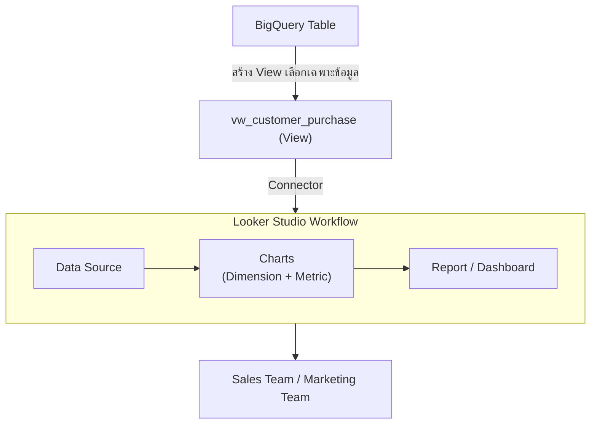
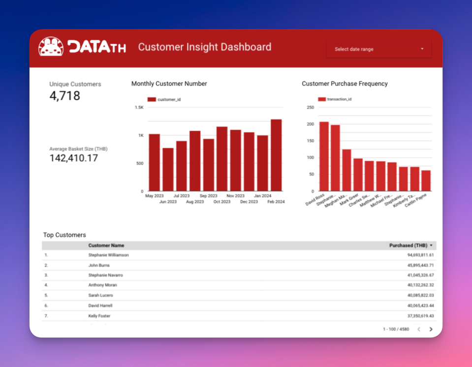
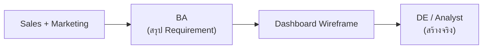

# Data Engineer - Chapter 06: Report & Dashboard with Looker Studio

> **วิชา:** Road to Data Engineer 3.0 (R2DE 3.0) | **ผู้สอน:** DataTH
> **Source:** `Resources/Books/DataEngineer/6LookerStudio.pdf` (71 slides)
> **หมายเหตุ:** ส่วนที่ติดป้าย `[เสริมนอกสไลด์]` คือความรู้ที่ผู้เขียนโน้ตเพิ่มเอง

---

## Part 1: Macro Architecture & Overview

ข้อมูลที่ดีที่สุดก็ไร้ค่า ถ้าคนตัดสินใจ "มองไม่เห็น" Chapter 6 คือ **ขั้นสุดท้ายของท่อ**: เปลี่ยนข้อมูลใน BigQuery ให้เป็นกราฟและ Dashboard ที่ฝ่ายธุรกิจเปิดดูเองได้ ด้วย **Looker Studio** (เครื่องมือ Data Visualisation ออนไลน์ฟรีจาก Google) และจบด้วยการทำ Mission แรกให้สำเร็จ



### ตารางเปรียบเทียบ Report vs Dashboard

| Feature | Report | Dashboard |
| :--- | :--- | :--- |
| **ลักษณะ** | นำข้อมูลมาวิเคราะห์ ใส่ทั้งตัวหนังสือและกราฟ | ดึงข้อมูลสำคัญมาใส่หน้าจอเดียว |
| **ตอบคำถามแบบ** | ครั้งเดียว (Ad-hoc) | คำถามสำคัญต่อธุรกิจ (Operation) ที่ต้องตอบบ่อย |
| **ผู้ใช้** | ผู้ขอวิเคราะห์ | ดูคำตอบได้เองรวดเร็ว |

---

## Part 2: Module-by-Module Deep Dive

### 2.1 Basic Data Visualisation สำหรับ Data Engineer

> **Data Visualisation** = การแปลงข้อมูลให้เป็นกราฟเพื่อให้เข้าใจง่ายขึ้น ถือเป็นขั้นสุดท้ายของงาน Data Science (สไลด์ระบุว่า "Visualization" เป็นการเขียนแบบอเมริกัน)

**ประโยชน์ทางธุรกิจ (ตามสไลด์):** ช่วยให้เข้าใจข้อมูลเร็ว และ **ช่วยค้นหาความผิดปกติของข้อมูล** `[ข้อสังเกตเสริมนอกสไลด์: DE ใช้กราฟตรวจ Pipeline ว่าข้อมูลหายหรือเพี้ยนได้ด้วย]`

**ทำไมต้องนำเสนอข้อมูล:** ผู้ใช้ปลายทางไม่ได้เขียน SQL ต้องมีหน้าจอที่ดูง่าย

#### ประเภทเครื่องมือ Data Visualisation

| ประเภท | ตัวอย่าง | เหมาะกับ |
| :--- | :--- | :--- |
| **1) Spreadsheet Tool** | Google Sheets, Excel | Visualisation เบื้องต้น ข้อมูลเล็ก |
| **2) BI Tool** (Business Intelligence) | Looker Studio, Power BI | ข้อมูลใหญ่/ซับซ้อน ออกแบบมาเพื่อ Visualisation โดยเฉพาะ |
| **3) เขียนโปรแกรมเอง** | Python (matplotlib) ฯลฯ | ควบคุมได้เต็มที่ ต้องเขียนโค้ด |

**หน้าที่ของ DE ด้าน Visualisation:** DE มักไม่ใช่คนออกแบบกราฟเอง แต่ต้องเตรียมข้อมูลให้พร้อมและเชื่อมต่อ `[รายละเอียดดูสไลด์ P.18]`

> **Tip จากสไลด์ (Bonus):** Startup ใหม่ใช้ Spreadsheet Tool พล็อตกราฟก็เพียงพอ ไม่จำเป็นต้องซื้อ BI Tool ราคาแพงตั้งแต่ต้น

---

### 2.2 Looker Studio

#### 2.2.1 สถาปัตยกรรมและองค์ประกอบ

| ส่วนประกอบ | คืออะไร |
| :--- | :--- |
| **Connector** | โปรแกรมดึงข้อมูลเข้า Looker Studio มีทั้งแบบมาตรฐานและบริการเสริม (เช่น Supermetrics ที่ดึง Marketing Data) |
| **Data Set** | ข้อมูลตัวจริง เช่น BigQuery, Google Analytics, MySQL |
| **Data Source** | ตัวกลางที่ Looker Studio ใช้อ้างอิงข้อมูล `[ความต่างอธิบายขยายนอกสไลด์: Data Source เก็บการตั้งค่า field/type ที่ผูกกับ Data Set]` |
| **Report & Pages** | Report = รายงานออนไลน์ ตั้งแต่แบบไม่อัปเดตจนเป็น Interactive Dashboard; 1 Page = 1 Dashboard |
| **Chart** | เลือกเพิ่มได้จากเมนู Insert มีให้เลือกมากมาย |

#### 2.2.2 Dimension & Metric

| | Dimension | Metric |
| :--- | :--- | :--- |
| **ความหมาย** | ค่าสำหรับ **จัดกลุ่ม** ข้อมูล (ตัวหนังสือ ตัวเลข วันที่ ฯลฯ) | ค่าตัวเลขที่ **วัด/คำนวณ** |
| **ตัวอย่าง** | วันที่, หมวดสินค้า, ประเทศ | ยอดขายรวม `SUM(thb_amount)`, จำนวนการซื้อ |
| **ใน Chart** | แกน X / การแบ่งกลุ่ม | แกน Y / ค่าที่แสดง |

```text
ตัวอย่าง: กราฟแท่ง "ยอดขายรายเดือน"
Dimension = เดือน  (แกน X)
Metric    = SUM(thb_amount) (แกน Y)
```

> **วิธีจำ:** Dimension = "ตามอะไร" (by month, by country); Metric = "วัดอะไร" (revenue, count)

#### 2.2.3 ฟีเจอร์ที่น่าสนใจ

| ฟีเจอร์ | ทำอะไร |
| :--- | :--- |
| **Calculated Field** | เขียนสมการจากข้อมูลที่มี สร้างคอลัมน์ใหม่ที่ต้องการ |
| **Parameter** | สร้างตัวแปรให้ผู้ใช้กรอกค่าเอง |
| **Make Report Level** | ทำให้บางส่วนของ Page ปรากฏทุกหน้า (เช่น โลโก้/ตัวกรอง) |
| **Section / Header / Divider** | จัดหลายหน้าให้เป็นระเบียบใน 1 Report |
| **Template & Community Visualisations** | ใช้แม่แบบ/กราฟที่ชุมชนทำ (lookerstudio.google.com/gallery) |

```text
-- ตัวอย่าง Calculated Field (สูตรตามแนวสไลด์)
SUM(thb_amount)                       -- ยอดขายรวม
```

**Bonus ในสไลด์:** Gemini in Looker (สร้าง Dashboard ด้วยการพิมพ์บอก), Looker Studio Pro (คิดเงินต่อคน/โปรเจกต์ เพิ่มฟีเจอร์สำหรับองค์กร)

---

### 2.3 Workshop 6: Data Visualisation with Looker Studio

#### 2.3.1 Input / Output
* **Input:** ข้อมูลใน BigQuery (Table จาก Workshop 5 หรือใช้ไฟล์ Parquet สำรอง `workshop4_output.parquet` อัปโหลดสร้าง Table ใหม่)
* **Output:** Report และ Interactive Dashboard ออนไลน์บน Looker Studio
* **แดชบอร์ดตัวอย่างที่สร้างเสร็จสมบูรณ์:** [คลิกเปิดดู Live Dashboard บน Looker Studio](https://lookerstudio.google.com/reporting/097af711-c110-4512-84f4-c80422a46a50)



#### 2.3.2 การเชื่อมกับฝั่งธุรกิจ (Recap Mission)

สไลด์แนะนำตัวละคร **Business Analyst (BA)** คือคนที่คุยกับฝั่ง Business ว่าต้องการอะไร ทำไม แล้วถ่ายทอดมายังทีมข้อมูล



**Dashboard Wireframe จาก BA:**
1. **Sales Performance Dashboard:** ข้อมูลการขาย (ยอดขายรวม, แนวโน้มรายวัน, สินค้าขายดี)
2. **Customer Insights Dashboard:** ข้อมูลลูกค้า (ประเทศของลูกค้า, ความถี่ในการซื้อ)

> **หลักคิด:** เริ่มจาก Requirement ทางธุรกิจ → Wireframe → Data → Dashboard ไม่ใช่เริ่มจากกราฟสวยๆ

#### 2.3.3 ขั้นตอนการปฏิบัติการจริง

| ขั้น | ทำอะไร | หมายเหตุ |
| :--- | :--- | :--- |
| **1** | เตรียม Table ใน BigQuery | ข้ามได้ถ้าทำ Workshop 5 เสร็จแล้ว (หรือใช้ไฟล์ `workshop4_output.parquet`) |
| **2** | **สร้าง View** ให้ Data Analyst | กรองข้อมูลและแปลง Data Types ให้อยู่ในฟอร์แมตที่ Looker Studio อ่านได้ทันที |
| **3** | เชื่อมต่อ Looker Studio กับ View | สร้าง Data Source ใหม่โดยเลือก Connector เป็น BigQuery |
| **4** | สร้าง **Dashboard 1: Sales Performance** | รวม Scorecard, Time Series Chart, และ Bar Chart สินค้าขายดี |
| **5** | สร้าง **Dashboard 2: Customer Insights** | เจาะลึกรายประเทศและพฤติกรรมลูกค้า |
| **6** | Bonus: Parameter + Calculated Field | เพิ่มตัวกรอง (Filter Controls) และ Calculated Fields เช่น อัตราการเติบโต |

```sql
-- โค้ดสร้าง View สำหรับ Workshop 6 (BigQuery SQL)
CREATE OR REPLACE VIEW `road-to-data-engineer-sql-db.r2de3_mock.ws6_view`
AS
SELECT
  -- แปลง Microseconds จาก Parquet ให้กลายเป็น TIMESTAMP มาตรฐาน
  TIMESTAMP_MICROS(CAST(date / 1000 AS INT64)) AS date_converted
  ,thb_amount
  ,transaction_id
  ,product_id
  ,product_name
  ,quantity
  ,customer_id
  ,customer_name
  ,customer_country
FROM `road-to-data-engineer-sql-db.r2de3_mock.ws4_output`
WHERE total_amount > 0;  -- กรองตัดรายการคืนเงินหรือยอดขายติดลบออก
```

> 💡 **ทำไมต้องแปลง `TIMESTAMP_MICROS` และสร้าง View ก่อน:**
> 1. **Timestamp Conversion:** ไฟล์ Parquet มักเก็บ Timestamp ในรูปแบบ Unix Integer (Microseconds) การใช้ `TIMESTAMP_MICROS(CAST(date / 1000 AS INT64))` ทำให้ Looker Studio รู้จักว่าเป็น Date/Time และพล็อตแกนเวลาได้ถูกต้องอัตโนมัติ
> 2. **Business Rule Isolation:** การใส่ `WHERE total_amount > 0` ไว้ที่ View ทำให้ Dashboard ทุกหน้าได้ตัวเลขยอดขายที่สะอาดตรงกัน โดยไม่ต้องไปเขียน Filter ซ้ำในแต่ละกราฟ
> 3. **Data Governance & Security:** ซ่อนโครงสร้างตารางหลัก ให้ Business / BI เห็นเฉพาะฟิลด์ที่ได้รับอนุญาต

#### 2.3.4 การคำนวณใน Dashboard (ตามสไลด์ P.59)

1. คำนวณผลรวมยอดขาย: `SUM(thb_amount)`
2. คำนวณจำนวนการซื้อ (Transaction Count): `COUNT(DISTINCT transaction_id)`
3. คำนวณจำนวนลูกค้า (Customer Count): `COUNT(DISTINCT customer_id)`

---

### 2.4 หลังจบ Workshop

* **สิ่งที่ได้เรียน:** ตั้งแต่ Collect → Cleanse → Cloud → Pipeline → Warehouse → Dashboard = โปรเจกต์ DE แรกสำเร็จ
* **[สำคัญ] ลบ Project ใน Google Cloud:** ถ้าต้องการมั่นใจว่าบัตรไม่โดนตัดเงิน ให้ลบ Project ออก (สไลด์แนะนำให้ก็อปโค้ดที่ใช้เก็บไว้ก่อน)
* **Data Visualisation Tips:** ดูแนวทางสร้าง visualisation ที่ดีได้ที่แหล่งอ้างอิงในสไลด์ (github.com/cxli233/FriendsDontLetFriends)

---

## Part 3: Quick Reference & Exam Cheat Sheet

### Checklist สรุปหัวใจสำคัญ
* [ ] **Visualisation:** ขั้นสุดท้ายแปลงข้อมูลเป็นกราฟ
* [ ] **Report vs Dashboard:** Ad-hoc vs ติดตามสม่ำเสมอ
* [ ] **3 ประเภทเครื่องมือ:** Spreadsheet / BI / เขียนโค้ด
* [ ] **Looker Studio:** Connector, Data Set, Data Source, Report, Page
* [ ] **Dimension vs Metric**
* [ ] **Calculated Field / Parameter / Report-level / Section**
* [ ] **BA:** ถ่ายทอด Requirement เป็น Wireframe
* [ ] **สร้าง View ก่อนทำ Dashboard**
* [ ] **ลบ Project หลังจบ** กันโดนตัดเงิน

### สรุปแนวคิด

| คำ | ความหมาย |
| :--- | :--- |
| Dimension | ใช้ "จัดกลุ่ม" |
| Metric | ใช้ "วัด/คำนวณ" |
| `SUM(thb_amount)` | ยอดขายรวม |

### Concept Map

```text
Data Visualisation
├── Report (Ad-hoc)  /  Dashboard (Operation)
├── Tools: Spreadsheet / BI (Looker Studio, Power BI) / Code
└── Looker Studio
    ├── Connector → Data Set/Source → Report/Page → Chart
    ├── Dimension + Metric
    └── Calculated Field, Parameter, Report-level, Section
Workshop 6: BigQuery → View → Dashboard 1 (Sales) + Dashboard 2 (Customer)
```

---

## ⚠️ Common Pitfalls & Exam Traps

* **"Report กับ Dashboard เหมือนกัน":** Report ตอบคำถามเฉพาะครั้ง; Dashboard ตอบคำถามสำคัญที่ต้องดูบ่อยบนหน้าจอเดียว
* **"Dimension กับ Metric สลับกันได้":** ถ้าเอาตัวเลขไปจัดกลุ่มหรือเอาข้อความไปรวมค่า กราฟจะผิด ต้องแยกบทบาทให้ถูก
* **"ต่อ Looker Studio เข้า Table ดิบโดยตรงก็พอ":** ควรสร้าง View เพื่อจำกัดข้อมูลและรวมตรรกะไว้ที่เดียว `[เสริมนอกสไลด์]`
* **"จบ Workshop แล้วไม่ต้องทำอะไร":** ต้องลบ/ปิด Resource บน Google Cloud มิฉะนั้นอาจถูกคิดเงิน
* **"ต้องซื้อ BI Tool แพงๆ เสมอ":** ธุรกิจเริ่มต้นใช้ Spreadsheet พล็อตกราฟได้ ตามที่สไลด์แนะนำ
* **"สร้างกราฟก่อน ค่อยถามว่าต้องการอะไร":** เริ่มจาก Business Requirement/Wireframe จาก BA เสมอ

---

## เอกสารเชื่อมโยง (Wiki-Style Backlinks)
* **วิชาและหัวข้อที่เกี่ยวข้อง:**
  * [[Chapter 05 - Data Warehouse with BigQuery]] (แหล่งข้อมูลและ View ที่ Dashboard ใช้)
  * [[Chapter 00 - Intro to Data Engineering]] (Mission แรกที่ Workshop ทั้งหมดต่อกัน)
  * [[Chapter 07 - Advanced Data Engineering]] (บทต่อไป: หัวข้อขั้นสูง และ Career Path)
  * [[Chapter 02 - Data Cleansing with Spark]] (EDA และกราฟ Boxplot/Scatterplot ที่เกี่ยวข้องกับ Visualisation)

* **แหล่งข้อมูล:**
  * Source: `Resources/Books/DataEngineer/6LookerStudio.pdf` (71 slides, DataTH)
  * Reference: Looker Studio Help (support.google.com/looker-studio) `[เสริมนอกสไลด์]`
