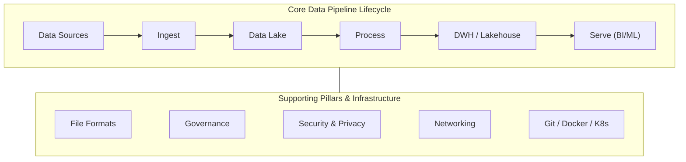

# Data Engineer - Chapter 07: Advanced Data Engineering

> **วิชา:** Road to Data Engineer 3.0 (R2DE 3.0) | **ผู้สอน:** DataTH
> **Source:** `Resources/Books/DataEngineer/7AdvancedTopics.pdf` (132 slides)
> **หมายเหตุ:** ส่วนที่ติดป้าย `[เสริมนอกสไลด์]` คือความรู้ที่ผู้เขียนโน้ตเพิ่มเอง

---

## Part 1: Macro Architecture & Overview

Chapter 1-6 คือการสร้าง "ท่อแรก" ที่ทำงานได้ Chapter 7 ขยายมุมมองสู่ **โลกจริง**: องค์กรจริงออกแบบ Data Architecture อย่างไร ไฟล์ข้อมูลควรเก็บเป็นรูปแบบไหน ข้อมูลส่วนบุคคลต้องปกป้องอย่างไร Data Warehouse ยุคใหม่เป็นอย่างไร DE ต้องรู้เรื่อง Git/Docker/ML แค่ไหน และสุดท้าย **จะวางเส้นทางอาชีพ ทำ Resume Portfolio และเตรียมสัมภาษณ์อย่างไร**



### ตารางเปรียบเทียบ File Format

| Format | ลักษณะ | จุดเด่น | เหมาะกับ |
| :--- | :--- | :--- | :--- |
| **CSV** | Text, คั่นด้วยจุลภาค | เรียบง่าย เปิดได้ทุกที่ (Excel/Sheets) | แลกเปลี่ยนข้อมูลเล็กๆ |
| **Parquet** | Columnar | เก็บข้อมูลได้เล็ก ใช้พื้นที่น้อย | งานวิเคราะห์ |
| **ORC** | Row Columnar (Optimized) | ขนาดเล็ก เข้าถึงเร็ว | ระบบ Hadoop/Hive `[เสริมนอกสไลด์]` |
| **Avro** | เขียนเร็ว มี schema ในไฟล์เสมอ | Schema ฝังในไฟล์ | การเขียน/ส่งข้อมูลต่อเนื่อง |

> **คำแนะนำเบื้องต้นในสไลด์:** "อันไหนก็ได้ที่ไม่ใช่ CSV"

---

## Part 2: Module-by-Module Deep Dive

### 2.1 งาน End-to-end และ Technology Stack

สไลด์ย้อนภาพรวมการทำงานกับข้อมูลตั้งแต่ **Data Sources → Destination** และ Technology Stack ทุกชั้น (Data Lake, Data Processing, Orchestration, Warehouse, Visualisation) แล้วชี้ **Data & AI Landscape 2024** เป็นแผนที่เครื่องมือ

**Case Study ระบบ Data ของบริษัทต่างๆ:**

| บริษัท | ปีที่อ้างอิง | สิ่งที่น่าศึกษา |
| :--- | :--- | :--- |
| **NocNoc** | 2023 | Data Lakehouse บน AWS (บทความเต็มตามลิงก์ในสไลด์) |
| **LINE MAN Wongnai** | 2022 | Data Stack ของบริษัท |
| **Meta** | - | Data Engineering ระดับใหญ่ |

> **วิธีใช้ Case Study:** ไม่ต้องจำชื่อเครื่องมือ ให้ดูว่า **ปัญหาอะไร → เลือกชั้นไหน → ทำไม** แล้วเทียบกับ Tech Stack ใน Chapter 0-6

---

### 2.2 Efficient Data Files

| Format | รายละเอียดตามสไลด์ | อธิบายเสริม `[เสริมนอกสไลด์]` |
| :--- | :--- | :--- |
| **Spreadsheet (Excel/Sheets)** | การเก็บข้อมูลเริ่มต้นของทุกองค์กร ส่งลิงก์/ไฟล์กันได้ | ไม่เหมาะกับข้อมูลใหญ่ |
| **CSV** | นามสกุลยอดนิยมเพราะเรียบง่าย save ออกจาก Excel/Sheets ได้ | ไม่เก็บ type ในไฟล์ ต้องเดาจากข้อความ |
| **Parquet** | Columnar Storage ใช้พื้นที่น้อย | อ่านเฉพาะคอลัมน์ที่ต้องใช้ได้ |
| **ORC** | row columnar จัดเก็บให้เล็กและเข้าถึงเร็วที่สุด | |
| **Avro** | เขียนได้รวดเร็ว เก็บ schema ไว้ในไฟล์เสมอ | ใช้บ่อยกับข้อมูล Streaming |
| **Apache Arrow** | library กลางแปลงข้อมูลหลายรูปแบบเป็น format กลาง | In-memory columnar ส่งข้อมูลข้ามเครื่องมือได้เร็ว |

```python
# [เสริมนอกสไลด์] แปลง CSV เป็น Parquet ด้วย Polars ลดขนาดและเก็บ type
import polars as pl

df = pl.read_csv("transactions.csv")          # อ่าน CSV
df.write_parquet("transactions.parquet")      # เขียนเป็น Parquet (Columnar, บีบอัด)

# อ่านเฉพาะคอลัมน์ที่ต้องการ (เร็วกว่าและใช้หน่วยความจำน้อยกว่า CSV)
small = pl.read_parquet("transactions.parquet", columns=["date", "thb_amount"])
```

เชื่อมโยง: Parquet คือรูปแบบไฟล์ที่ใช้ใน Workshop 6 ([[Chapter 06 - Report & Dashboard with Looker Studio]]) และเชื่อมกับแนวคิด Columnar ใน [[Chapter 05 - Data Warehouse with BigQuery]]

---

### 2.3 Networking, Data Governance, Security & Privacy

#### 2.3.1 Networking Design

ออกแบบการทำงานร่วมกันระหว่างแต่ละระบบ (หรือในระบบเดียวกัน) ให้เสถียร `[แนวคิดเสริมนอกสไลด์: ควบคุมว่าระบบใดคุยกับระบบใดได้ ผ่านเครือข่ายส่วนตัว/ไฟร์วอลล์ แทนการเปิดสาธารณะ]`

#### 2.3.2 Data Governance

> **Data Governance** = การจัดการข้อมูลตั้งแต่ต้นจนจบ ตั้งแต่นำเข้าถึงจัดเก็บและนำไปใช้ เพื่อให้ธุรกิจใช้ประโยชน์ได้สูงสุด

* **เครื่องมือแนะนำในสไลด์:** Apache Atlas (เครื่องมือจัดการ metadata)
* เชื่อมโยงกับ Data Dictionary/Catalog/Lineage ใน [[Chapter 02 - Data Cleansing with Spark]] และ Dataplex ใน [[Chapter 05 - Data Warehouse with BigQuery]]

#### 2.3.3 Data Security & Privacy

* **Data Breach** = ข้อมูลรั่วไหล สไลด์ระบุว่ากรณีใหญ่ๆ มาจากองค์กรใหญ่ เช่น Facebook
* **PII (Personally Identifiable Information)** = ข้อมูลที่ระบุตัวบุคคลได้

| กฎหมาย | ขอบเขต | หมายเหตุ |
| :--- | :--- | :--- |
| **GDPR** | ยุโรป | |
| **PDPA** | ประเทศไทย | เริ่มใช้งาน 1 มิถุนายน พ.ศ. 2565 (ตามสไลด์) |

**แนวทางปฏิบัติ `[เสริมนอกสไลด์]`:**

| หลักการ | ตัวอย่าง |
| :--- | :--- |
| ให้สิทธิ์เท่าที่จำเป็น (Least Privilege) | Analyst เห็นเฉพาะ View ที่ไม่มี PII |
| ปกปิด/แฮชข้อมูลละเอียดอ่อน | แฮช `email` ก่อนเข้า Warehouse |
| เข้ารหัสข้อมูล | เปิด Encryption at rest/in transit |
| ไม่เขียนรหัสผ่านลงโค้ด | ใช้ Secret Manager / Airflow Connection |

> สไลด์อ้างอิง **Data Protection Guideline** จากหน่วยงานของสิงคโปร์ (Data Protection by Design) เป็นแหล่งศึกษาเพิ่ม

---

### 2.4 Modern Data Warehouse

| รุ่น | ลักษณะ | ตัวอย่าง |
| :--- | :--- | :--- |
| **แบบดั้งเดิม** | Storage และ Compute อยู่บนเครื่องเดียวกัน | SQL Server, Oracle, Teradata |
| **แบบใหม่ (Cloud)** | สร้างมาสำหรับ Cloud แยก Storage กับ Compute | **Snowflake** (เข้าตลาดหุ้นปี 2020), BigQuery |

**Snowflake (ตามสไลด์):** แยก Storage กับ Compute, Near-zero Management (แทบไม่ต้องดูแลเอง)

**MotherDuck:** Serverless Data Analytics Platform ที่ใช้ **DuckDB** เป็น Engine หลัก เน้นใช้งานง่ายและ collaborate ได้ (เชื่อมกับ DuckDB ใน [[Chapter 01 - Data Collection]])

> **ทำไมต้องแยก Storage กับ Compute `[เสริมนอกสไลด์]`:** ปรับขนาดทั้งสองส่วนแยกกัน เก็บข้อมูลมากไม่ต้องจ่ายค่า Compute เพิ่ม และเพิ่ม Compute ชั่วคราวเมื่อต้อง Query หนักได้

#### New Architecture: Data Lakehouse และ Open Table Format

แนวคิดดึงข้อมูลโดยตรงจาก Data Lake (เทียบกับ BigLake ใน CH5)

| เทคโนโลยี | คำอธิบายตามสไลด์ |
| :--- | :--- |
| **Delta Lake** | Open-source storage layer โดย Databricks ดูข้อมูลในอดีตได้ (**Time Travel**) ใช้ร่วมกับ Spark/Databricks |
| **Apache Hudi** | (Hadoop Upserts Deletes and Incrementals) สไลด์ยกข่าว Notion ย้ายจาก Snowflake + Fivetran ไป Hudi ลดค่าใช้จ่ายได้มาก |
| **Apache Iceberg** | ทำให้หลายระบบ เช่น Spark, Snowflake ทำงานบนข้อมูลชุดเดียวกันได้ |

**เครื่องมือดึงข้อมูลอัตโนมัติแบบไม่ต้องเขียนโค้ด:** **Fivetran**, **Airbyte** (ตรงกับ "Pre-built connectors" ใน CH1)

---

### 2.5 Software Engineering (and Container)

DE ต้องทำงานร่วมกับ Software Engineer จึงควรเข้าใจเครื่องมือพื้นฐานของสายนั้น

| เครื่องมือ | ทำอะไร | ตัวอย่างการใช้ใน DE `[เสริมนอกสไลด์]` |
| :--- | :--- | :--- |
| **Git** (Version Control) | เก็บประวัติแก้ไขโค้ด ทำงานร่วมกันเป็นทีม (Git Flow) | เก็บไฟล์ DAG ใน Repository แทนก็อปไฟล์ไปมา |
| **Docker / Container** | แพ็กโปรแกรมพร้อม environment ไปรันที่ไหนก็เหมือนเดิม (ต่างจาก VM แบบดั้งเดิม) | ติดตั้ง Airflow บนเครื่องตัวเอง |
| **Kubernetes** | **Container Orchestration** จัดการ Container จำนวนมาก | ที่อยู่เบื้องหลัง Composer ในหลายกรณี |

```bash
# [เสริมนอกสไลด์] ลำดับคำสั่ง Git พื้นฐานที่ DE ใช้ทุกวัน
git clone https://github.com/<user>/<repo>.git   # ดึงโปรเจกต์มา (เหมือน Workshop 4)
git checkout -b feature/new-dag                  # แตก branch ทำงานใหม่
git add dags/new_dag.py                          # เตรียมไฟล์
git commit -m "Add daily sales DAG"              # บันทึกการเปลี่ยนแปลง
git push origin feature/new-dag                  # ส่งขึ้น remote เพื่อ review
```

สไลด์ชี้ Extra Chapter: Advanced Git + CI/CD

---

### 2.6 Machine Learning Model & Data Engineer

> **Machine Learning (ML)** = การที่คอมพิวเตอร์ "เรียนรู้" จากข้อมูลผ่าน algorithm ต่างๆ

| คำ | ความหมาย |
| :--- | :--- |
| **AI** | Artificial Intelligence (ภาพรวมกว้างสุด) |
| **ML** | Machine Learning (ส่วนหนึ่งของ AI) |
| **DL** | Deep Learning (ส่วนหนึ่งของ ML) `[ลำดับขอบเขตเป็นความรู้ทั่วไป — เสริมนอกสไลด์]` |

* **Model Development Life Cycle (MDLC):** วงจรพัฒนาโมเดล มีผู้เกี่ยวข้อง เช่น Research Scientist
* **ตำแหน่งของ DE:** เตรียมข้อมูลและสร้าง Pipeline ให้ Model ใช้งานได้
* **AutoML:** บริการ ML + Data Engineering แบบตัวเดียวจบ สร้างโมเดลง่ายๆ (สไลด์ตัวอย่าง Google Vision AutoML)
* **ต่อยอด:** สไลด์โปรโมตคอร์ส **Road to Machine Learning Engineer (R2MLE)** ของ DataTH `[เป็นเนื้อหาโฆษณาคอร์ส ไม่ใช่เนื้อหาวิชาการ]`

---

### 2.7 Data Engineer Career Path

#### 2.7.1 ตัวอย่าง Job Description

สไลด์แสดง JD จากบริษัท Consulting (ไทย) และ Product Company (Mobile App ยอดนิยมของไทย) ให้เห็นว่าความคาดหวังต่างกันตามประเภทบริษัท

#### 2.7.2 DE ไปทำอะไรต่อได้

| เส้นทาง | สิ่งที่เปลี่ยนไป |
| :--- | :--- |
| **ETL Engineer / ETL Developer** | เน้น Stored Procedures และ End-to-end Data Pipeline |
| **Analytics Engineer** | ใกล้ชิดงาน Data Analyst และการวิเคราะห์ข้อมูล |
| **Machine Learning Engineer** | เน้นการนำ Model ไปใช้งาน |
| **Data Architect** (คนออกแบบ) / **Data Platform Engineer** (คนทำ) | ออกแบบ/สร้างแพลตฟอร์มข้อมูลระดับองค์กร |

**Certificates:** Cloud (AWS, GCP, Azure) และ Hadoop Certificates

---

### 2.8 Prepare for Resume & Interview

#### 2.8.1 Resume

* ควรเรียงหัวข้อตามที่สไลด์ระบุ และ **จบใน 1 หน้า ไม่ต้องมีรูปหรือการตกแต่ง**
* `[เสริมนอกสไลด์]` เขียนผลงานให้เห็นผลลัพธ์ เช่น "ลดเวลาโหลดข้อมูลจาก 2 ชม. เหลือ 20 นาที" แทนการบอกแค่ "ใช้ Airflow"

#### 2.8.2 Interview

| ประเภท | หมายเหตุ |
| :--- | :--- |
| **Pre-screening / Phone interview** | คัดกรองเบื้องต้น |
| ประเภทอื่นๆ | ดูสไลด์ P.79 |

**เตรียมอะไรจาก R2DE:** ฝึกอธิบายการออกแบบ Flow ข้อมูลตั้งแต่ต้นจนจบ (ตรงกับ Mission ที่ทำ) และทบทวนด้วย **Workbook** ท้ายแต่ละบท

**เทคนิคตอบ: STAR Method `[รายละเอียดเสริมนอกสไลด์]`**

| ตัวอักษร | ความหมาย | ตัวอย่างสั้น |
| :--- | :--- | :--- |
| **S** | Situation | Pipeline รายวันล้มเหลวบ่อย |
| **T** | Task | ต้องทำให้รันเสร็จก่อน 8 โมง |
| **A** | Action | เพิ่ม Retry, ปรับ Idempotent, ใส่ Monitoring |
| **R** | Result | ความสำเร็จเพิ่มจาก 85% เป็น 99% (ตัวเลขตัวอย่าง) |

#### 2.8.3 Portfolio

สร้างเว็บ/Blog เพื่อปล่อยงาน เลือกโจทย์จากชีวิตประจำวัน หา Public Dataset จาก Kaggle เป็นต้น

---

### 2.9 Skill Sets 2024 และ Next Step

* **Data Engineering Lifecycle** (ภาพจากหนังสือ *Fundamentals of Data Engineering*)
* **ทักษะพื้นฐาน:** Python & SQL และ Command-line (Bash) `[ลำดับทักษะอื่นดูสไลด์ P.88]`
* **องค์กรที่ควรรู้จัก:** Apache Software Foundation, CNCF (Cloud Native Computing Foundation), Linux Foundation (AI & Data)
* **เรียนต่อ:** หนังสือ/เว็บ (เช่น Fundamentals of Data Engineering), YouTube, O'Reilly, Community "Data Engineer Thailand", GitHub

> เนื้อหาท้ายบทมี Career Journey ของทีมสอน และโปรโมชันคอร์สต่อยอด ซึ่งไม่ใช่เนื้อหาวิชา จึงไม่สรุปในโน้ตนี้

---

## Part 3: Quick Reference & Exam Cheat Sheet

### Checklist สรุปหัวใจสำคัญ
* [ ] **File Formats:** CSV (ง่ายแต่ไม่เก็บ type), Parquet/ORC (Columnar), Avro (มี schema ในไฟล์), Arrow (format กลางใน memory)
* [ ] **Data Governance** และเครื่องมืออย่าง Apache Atlas
* [ ] **PII** และกฎหมาย **GDPR** / **PDPA**
* [ ] **Modern DWH:** แยก Storage/Compute (Snowflake), MotherDuck/DuckDB
* [ ] **Lakehouse:** Delta Lake, Hudi, Iceberg
* [ ] **Fivetran / Airbyte:** ดึงข้อมูลแบบไม่เขียนโค้ด
* [ ] **Git / Docker / Kubernetes**
* [ ] **AI > ML > DL** และบทบาท DE กับ ML
* [ ] **Career:** ETL Engineer, Analytics Eng., ML Eng., Data Architect/Platform Eng.
* [ ] **Resume 1 หน้า**, STAR method, Portfolio

### If you see X → think Y

```text
ไฟล์ข้อมูลใหญ่ ใช้วิเคราะห์                 → Parquet (ไม่ใช่ CSV)
ต้องส่งข้อมูลแบบมี schema ติดไปกับไฟล์     → Avro
อยากย้อนดูข้อมูลในอดีตบน Data Lake         → Delta Lake (Time Travel)
ข้อมูลมีชื่อ/เลขบัตร                        → PII → GDPR/PDPA, จำกัดสิทธิ์
```

### Concept Map

```text
Advanced DE
├── Architecture: Case Study, Modern DWH, Lakehouse (Delta/Hudi/Iceberg)
├── Data: File Formats, Governance, Security & Privacy (PII, GDPR, PDPA)
├── Engineering: Git, Docker, Kubernetes, Fivetran/Airbyte
├── ML: AI > ML > DL, MDLC, AutoML
└── Career: Path, Resume, STAR, Portfolio, Community
```

---

## ⚠️ Common Pitfalls & Exam Traps

* **"CSV เก็บข้อมูลได้ดีที่สุดเพราะเปิดง่าย":** ง่ายแต่ไม่มี type ในไฟล์ ขนาดใหญ่ และไม่ใช่ Columnar สไลด์แนะนำให้ใช้อย่างอื่นนอกจาก CSV
* **"Parquet กับ Avro เหมือนกัน":** Parquet = Columnar เหมาะวิเคราะห์; Avro = เขียนเร็ว มี schema ในไฟล์ (Row-based `[เสริมนอกสไลด์]`)
* **"Data Lakehouse คือชื่อเรียก Data Warehouse ใหม่":** คือสถาปัตยกรรมที่ใช้ข้อมูลบน Data Lake โดยเพิ่มความสามารถแบบ Warehouse ผ่าน Open Table Format
* **"PII คือเฉพาะเลขบัตรประชาชน":** PII คือข้อมูลที่ **ระบุตัวบุคคลได้** ทุกประเภท `[ตัวอย่างเพิ่มเติมดูสไลด์ P.32]`
* **"PDPA เหมือน GDPR ทุกประการ":** เป็นคนละกฎหมาย (ไทย vs ยุโรป) แม้มีหลักการคล้ายกัน `[เสริมนอกสไลด์]`
* **"DE ไม่ต้องรู้ Git/Docker":** งาน DE ต้องทำงานเป็นทีมและ deploy ระบบ เครื่องมือเหล่านี้จึงเป็นพื้นฐาน
* **"Resume ยิ่งยาวยิ่งดี":** สไลด์แนะนำ 1 หน้า ไม่ต้องมีรูปหรือตกแต่ง

---

## เอกสารเชื่อมโยง (Wiki-Style Backlinks)
* **วิชาและหัวข้อที่เกี่ยวข้อง:**
  * [[Chapter 00 - Intro to Data Engineering]] (ภาพรวมบทบาท DE และ Tech Stack ที่บทนี้ขยายต่อ)
  * [[Chapter 02 - Data Cleansing with Spark]] (Data Catalog/Lineage ที่เชื่อมกับ Governance)
  * [[Chapter 04 - Data Pipeline Orchestration with Airflow]] (Git/Docker กับการ deploy Airflow)
  * [[Chapter 05 - Data Warehouse with BigQuery]] (Lakehouse, BigLake, Iceberg, Dataplex)
  * [[Chapter 06 - Report & Dashboard with Looker Studio]] (ใช้ไฟล์ Parquet และ Mission ที่สำเร็จแล้ว)
  * [[Data & AI Engineer Skill Matrix]] (ติดตามทักษะที่ต้องฝึกเพื่อเส้นทางอาชีพ)

* **แหล่งข้อมูล:**
  * Source: `Resources/Books/DataEngineer/7AdvancedTopics.pdf` (132 slides, DataTH)
  * Reference: Reis & Housley (2022) — *Fundamentals of Data Engineering* (O'Reilly) `[อ้างอิงในสไลด์]`
