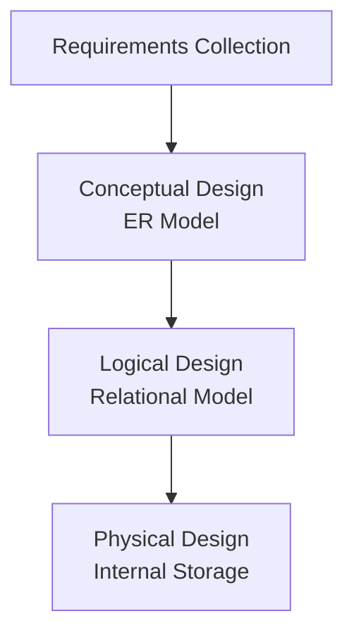

# Database - Chapter 02: Conceptual Database Design (ER Model)

**วิชา:** Database System Concept (06066300)
**สถาบัน:** Faculty of Information Technology, KMITL
**Source:** `Resources/Books/Database/Database_Concept_02.pdf` (62 pages)

## Part 1: Macro Architecture & Overview

การออกแบบฐานข้อมูล (Database Design) มีความสำคัญอย่างยิ่ง เพราะหากออกแบบไม่ดีจะนำไปสู่ความผิดปกติของข้อมูล (Data Anomalies) และความไม่สอดคล้องกัน (Data Inconsistency) ซึ่งส่งผลเสียต่อการบริหารจัดการองค์กร

### Database Design Processes
กระบวนการออกแบบฐานข้อมูลมี 4 ขั้นตอนหลัก:
1. **Requirements Collection and Analysis**: สัมภาษณ์ผู้ใช้ รวบรวมความต้องการด้านข้อมูล (Data Requirement) และฟังก์ชัน (Functional Requirement)
2. **Conceptual Design**: ออกแบบโครงสร้างระดับแนวคิด (Conceptual Schema) มักใช้ **ER Model** (เป็นอิสระจาก DBMS - DBMS-independent) เพื่อง่ายต่อการสื่อสารกับ User
3. **Logical Design (Data Model Mapping)**: แปลง Conceptual Model เป็นโครงสร้างตาราง (Relational Model) (DBMS-specific)
4. **Physical Design**: ออกแบบโครงสร้างจัดเก็บจริงในคอมพิวเตอร์ เช่น Index, การเข้าถึง, โครงสร้างไฟล์ และเขียนโปรแกรม (Transaction Implementation)

---

## Part 2: Module-by-Module Deep Dive

### 2.1 Entity Relationship (ER) Model
แบบจำลองเชิงแนวคิดที่ได้รับความนิยมที่สุด แสดงผลผ่าน ER Diagram เพื่ออธิบายข้อมูล

#### เอนทิตี (Entity) และ ชนิดของแอตทริบิวต์ (Attributes)
- **Entity**: สิ่งที่มีอยู่จริงที่ต้องการเก็บข้อมูล (เช่น พนักงาน, วิชา) 
- **Attributes**: คุณสมบัติที่ใช้อธิบาย Entity แบ่งตามชนิดดังนี้:
  - **Composite attributes**: แบ่งย่อยได้อีก (เช่น ที่อยู่ -> ถนน, แขวง, เขต)
  - **Atomic attributes**: แบ่งย่อยไม่ได้แล้ว (เช่น เพศ)
  - **Single-valued**: มีค่าเดียว (เช่น อายุ)
  - **Multi-valued**: มีหลายค่า (เช่น ระดับการศึกษา: ป.ตรี, ป.โท)
  - **Stored attributes**: จัดเก็บโดยตรง (เช่น วันเกิด)
  - **Derived attributes**: คํานวณมาจาก Attribute อื่น (เช่น อายุ คำนวณจากวันเกิด)
- **Null Values**: ค่าว่าง (อาจเกิดจาก Not applicable, Not known, หรือ Missing)

#### Key Attributes (Identifier)
- **Key attributes**: ค่าที่ใช้ระบุความแตกต่างของแต่ละ Entity (Uniqueness) และต้องไม่มีฟิลด์ที่เกินความจำเป็น (Minimality)
- **Composite Key**: คีย์ที่ประกอบด้วยแอตทริบิวต์มากกว่า 1 ตัว
- **Candidate keys**: Entity หนึ่งๆ อาจมีคีย์ได้หลายตัว (เช่น รหัสพนักงาน และ เลขบัตรประชาชน)

### 2.2 Relationship Types
ความสัมพันธ์ระหว่างเอนทิตี (Relationship Set) มี Degree (จำนวน Entity type ที่เข้าร่วม) ได้แก่:
- **Binary relationship** (Degree 2): ความสัมพันธ์ระหว่าง 2 เอนทิตี เช่น EMPLOYEE กับ DEPARTMENT
- **Ternary relationship** (Degree 3): ความสัมพันธ์ระหว่าง 3 เอนทิตี เช่น SUPPLIER, PROJECT, PART
- **Recursive Relationship**: เอนทิตีมีความสัมพันธ์กับตัวมันเอง เช่น พนักงานเป็นหัวหน้าของพนักงานด้วยกันเอง

### 2.3 Constraints on Relationship Types
#### Cardinality Ratio (อัตราส่วนความสัมพันธ์)
- **1:1 (One-to-One)**: เอนทิตีหนึ่งสัมพันธ์กับอีกเอนทิตีหนึ่งแบบ 1 ต่อ 1
- **1:N (One-to-Many)**: 1 ส่วนงาน มี พนักงานหลายคน
- **M:N (Many-to-Many)**: พนักงานหลายคน ทำงานได้หลายโครงการ

#### Participation Constraints (เงื่อนไขการมีส่วนร่วม)
- **Total Participation (เส้นคู่)**: ทุกเอนทิตีต้องเข้าร่วมในความสัมพันธ์ (เช่น พนักงานทุกคน *ต้อง* สังกัดแผนก)
- **Partial Participation (เส้นเดี่ยว)**: บางเอนทิตีเท่านั้นที่เข้าร่วม (เช่น มีพนักงาน *บางคน* เท่านั้นที่เป็นผู้บริหาร)

### 2.4 Strong and Weak Entity Types
- **Strong Entity**: มีคีย์เป็นของตนเอง หรือ regular entity type
- **Weak Entity**: ไม่มีคีย์เป็นของตนเอง ต้องพึ่งพาการมีอยู่ของ Strong Entity (Existence Dependencies) ผ่านความสัมพันธ์แบบ **Identifying Relationship**
- Weak Entity จะใช้ **Partial Key** (ขีดเส้นใต้ปะ) ร่วมกับ Primary Key ของ Strong Entity ในการระบุตัวตนให้เป็นเอกลักษณ์ (เช่น ตึก-ห้อง: หายเลขห้องเป็น Partial Key)

### 2.5 UML Class Diagram vs ER Model
UML Class Diagram ใช้ใน Object-Oriented Software Engineering (OOSE) โดยแต่ละ Class เทียบเท่ากับ Entity Type แต่ UML จะมี **Operations (Methods)** รวมอยู่ด้วย และความสัมพันธ์เรียกว่า **Multiplicity** (เช่น `1..1`, `1..*`)

---

## Part 3: Quick Reference & Exam Cheat Sheet

### สัญลักษณ์ ER Diagram (Chen Model)
- **Entity**: สี่เหลี่ยมผืนผ้า (Rectangle)
- **Weak Entity**: สี่เหลี่ยมผืนผ้าขอบคู่ (Double Rectangle)
- **Relationship**: สี่เหลี่ยมข้าวหลามตัด (Diamond)
- **Identifying Relationship**: สี่เหลี่ยมข้าวหลามตัดขอบคู่
- **Attribute**: วงรี (Oval)
- **Key Attribute**: วงรี มีขีดเส้นใต้ชื่อ
- **Multi-valued Attribute**: วงรีขอบคู่
- **Derived Attribute**: วงรีเส้นประ
- **Total Participation**: เส้นคู่เชื่อมระหว่าง Entity กับ Relationship

### การตั้งชื่อที่เหมาะสมใน ER Diagram
- **Entity**: คำนามเอกพจน์ (Singular noun), ตัวพิมพ์ใหญ่ทั้งหมด (Uppercase) (e.g. EMPLOYEE)
- **Relationship**: คำกริยา (Verb)
- **Attribute**: ขึ้นต้นตัวอักษรใหญ่ ตามด้วยตัวอักษรเล็ก (Capital letters) (e.g. Name)

---

## ⚠️ Common Pitfalls & Exam Traps

- **สับสนระหว่าง Derived กับ Multi-valued Attributes**: 
  - *Derived* (เส้นประ) คือหาค่าได้จากตัวอื่น (เช่น อายุได้จากวันเกิด) 
  - *Multi-valued* (วงรีขอบคู่) คือตัวที่ตัวมันเองเก็บค่าได้มากกว่า 1 ค่านัยสำคัญต่อ 1 Record (เช่น เบอร์โทรศัพท์, ระดับการศึกษา)
- **ลืมระบุคุณสมบัติของ Weak Entity ให้ครบถ้วน**: การวาด Weak Entity ในข้อสอบ ต้องมี Identifying Relationship (ข้าวหลามตัดขอบคู่) พร้อมด้วย Total Participation (เส้นคู่) กลับไปยัง Strong Entity เสมอ และต้องมี Partial key
- **Crow's Foot vs Chen Model**: Crow's Foot เป็นแบบจำลองกึ่ง Implementation (มักผ่าน Normalization แล้ว) จึง *ไม่มีความสัมพันธ์แบบ M:N* โดยตรง ในขณะที่ Chen Model (ระดับ Conceptual) ยังคงเขียน M:N ได้
- **Ternary vs Binary Relationship**: การแยก Ternary (3-ทาง) ออกเป็น Binary 3 คู่ อาจให้ความหมายทางตรรกะที่แตกต่างกัน ต้องพิจารณาบริบทโจทย์ให้ถี่ถ้วน

---

## เอกสารเชื่อมโยง (Wiki-Style Backlinks)
- [[Database - Chapter 01 Introduction to Database System & Relational Model]] (พื้นฐานภาพรวมของระบบฐานข้อมูลเชิงสัมพันธ์ก่อนจะเข้าสู่กระบวนการออกแบบโมเดล)
