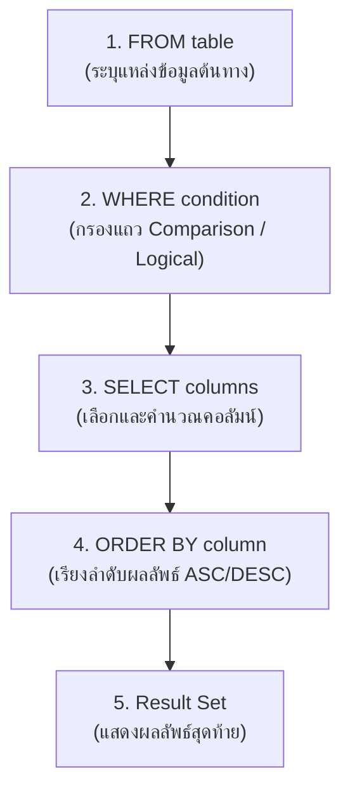

# Database - LAB 5: SQL SELECT with Conditions

> **วิชา:** 06066300 Database System Concept | **สถาบัน:** มหาวิทยาลัย
> **Source:** `Resources/Books/Database/lab DB/DB66-LAB 5-SQL-Select conditions (1).pdf`
> ⚠️ **[Source: generated — not verified against original document]**
> *PDF extraction failed (Docling timeout). เนื้อหาสร้างจาก SQL standard curriculum knowledge.*

---

## Part 1: Macro Architecture & Overview

LAB 5 ต่อยอดจาก LAB 4 (SELECT พื้นฐาน) โดยเพิ่ม **เงื่อนไข (Conditions)** ในการกรองและเรียงลำดับข้อมูล ซึ่งเป็นหัวใจของ SQL ในการดึงข้อมูลเฉพาะที่ต้องการจากตารางขนาดใหญ่



### ตารางเปรียบเทียบ Operator ที่ใช้ใน WHERE

| กลุ่ม          | Operator                        | ตัวอย่าง                         |
| :------------- | :------------------------------ | :------------------------------- |
| **Comparison** | `=`, `!=`, `<`, `>`, `<=`, `>=` | `salary > 5000`                  |
| **Range**      | `BETWEEN ... AND ...`           | `salary BETWEEN 3000 AND 8000`   |
| **List**       | `IN (...)`, `NOT IN (...)`      | `dept_id IN (10, 20, 30)`        |
| **Pattern**    | `LIKE`, `NOT LIKE`              | `last_name LIKE 'S%'`            |
| **NULL check** | `IS NULL`, `IS NOT NULL`        | `manager_id IS NULL`             |
| **Logical**    | `AND`, `OR`, `NOT`              | `salary > 5000 AND dept_id = 10` |

---

## Part 2: Module-by-Module Deep Dive

### 2.1 WHERE Clause และ Comparison Operators

> **WHERE** คือ clause ที่ใช้กรองแถวข้อมูล — SQL จะ evaluate เงื่อนไข WHERE สำหรับทุกแถว แถวที่เงื่อนไข `TRUE` จะปรากฏในผลลัพธ์

```sql
-- Syntax
SELECT column1, column2
FROM table
WHERE condition;
```

**Comparison Operators:**

| Operator | ความหมาย | ตัวอย่าง |
| :--- | :--- | :--- |
| `=` | เท่ากับ | `WHERE department_id = 10` |
| `!=` หรือ `<>` | ไม่เท่ากับ | `WHERE salary != 5000` |
| `>` | มากกว่า | `WHERE salary > 8000` |
| `<` | น้อยกว่า | `WHERE salary < 3000` |
| `>=` | มากกว่าหรือเท่ากับ | `WHERE salary >= 5000` |
| `<=` | น้อยกว่าหรือเท่ากับ | `WHERE salary <= 10000` |

```sql
-- ตัวอย่าง: พนักงานที่เงินเดือน > 10,000
SELECT first_name, last_name, salary
FROM employees
WHERE salary > 10000;

-- ตัวอย่าง: พนักงานที่ไม่อยู่แผนก 50
SELECT first_name, department_id
FROM employees
WHERE department_id <> 50;

-- เปรียบเทียบข้อความ (case-sensitive ใน Oracle)
SELECT first_name, job_id
FROM employees
WHERE job_id = 'IT_PROG';
```

---

### 2.2 BETWEEN ... AND ...

> **BETWEEN** ใช้กรองค่าในช่วงที่กำหนด — **inclusive** ทั้งสองขอบ (รวมค่าต่ำสุดและสูงสุดด้วย)

```sql
-- Syntax
WHERE column BETWEEN low_value AND high_value
-- เทียบเท่ากับ: WHERE column >= low_value AND column <= high_value

-- ตัวอย่าง: พนักงานที่เงินเดือนอยู่ในช่วง 5,000 - 10,000
SELECT first_name, last_name, salary
FROM employees
WHERE salary BETWEEN 5000 AND 10000;

-- ใช้กับวันที่
SELECT first_name, hire_date
FROM employees
WHERE hire_date BETWEEN '01-JAN-2000' AND '31-DEC-2005';

-- NOT BETWEEN: นอกช่วง
SELECT first_name, salary
FROM employees
WHERE salary NOT BETWEEN 5000 AND 10000;
```

---

### 2.3 IN และ NOT IN

> **IN** ใช้ตรวจสอบว่าค่าอยู่ใน list ที่กำหนดหรือไม่ — เทียบเท่าการใช้ `OR` หลายตัว

```sql
-- Syntax
WHERE column IN (value1, value2, value3, ...)

-- ตัวอย่าง: พนักงานที่อยู่ในแผนก 10, 20 หรือ 30
SELECT first_name, last_name, department_id
FROM employees
WHERE department_id IN (10, 20, 30);
-- เทียบเท่า: WHERE department_id = 10 OR department_id = 20 OR department_id = 30

-- NOT IN: ไม่อยู่ใน list
SELECT first_name, job_id
FROM employees
WHERE job_id NOT IN ('IT_PROG', 'AD_VP', 'ST_CLERK');

-- ใช้กับข้อความ
SELECT first_name, last_name
FROM employees
WHERE last_name IN ('King', 'Abel', 'Taylor');
```

---

### 2.4 LIKE และ Pattern Matching

> **LIKE** ใช้สำหรับค้นหาข้อความที่ตรงกับ pattern (รูปแบบ) มี Wildcard 2 ตัว:
> - `%` (Percent) — แทนที่อักขระ **ศูนย์ตัวขึ้นไป**
> - `_` (Underscore) — แทนที่อักขระ **1 ตัวพอดี**

```sql
-- Syntax
WHERE column LIKE 'pattern'
```

**ตัวอย่าง pattern ต่างๆ:**

```sql
-- ขึ้นต้นด้วย 'S'
WHERE last_name LIKE 'S%'          -- Smith, Stevens, Sun, S...

-- ลงท้ายด้วย 'n'
WHERE last_name LIKE '%n'          -- ...Johnson, Wilson, Chen

-- มีคำว่า 'al' อยู่ที่ไหนก็ได้
WHERE last_name LIKE '%al%'        -- Taylor, Abel, Caldwell

-- ตัวที่ 2 เป็น 'o' (_แทน 1 ตัวพอดี)
WHERE last_name LIKE '_o%'         -- Doe → 2nd char = 'o'

-- ชื่อที่มีความยาว 4 ตัวพอดี
WHERE first_name LIKE '____'       -- 4 underscores

-- NOT LIKE: ไม่ตรง pattern
WHERE last_name NOT LIKE 'A%'      -- ไม่ขึ้นต้นด้วย 'A'
```

**ตัวอย่างจริง:**

```sql
-- พนักงานที่ job_id ขึ้นต้นด้วย 'IT'
SELECT first_name, last_name, job_id
FROM employees
WHERE job_id LIKE 'IT%';

-- พนักงานที่ชื่อมีตัว 'a' หรือ 'A' (case-insensitive ใช้ UPPER/LOWER)
SELECT first_name
FROM employees
WHERE UPPER(first_name) LIKE '%A%';
```

---

### 2.5 IS NULL และ IS NOT NULL

> `NULL` คือค่าที่ **ไม่ทราบ / ไม่มีข้อมูล** — ไม่ใช่ 0 หรือ empty string
> **ใช้ `col = NULL` ไม่ได้เด็ดขาด** ต้องใช้ `IS NULL` เท่านั้น

```sql
-- ✅ ถูกต้อง
WHERE manager_id IS NULL         -- หาแถวที่ไม่มีค่า
WHERE manager_id IS NOT NULL     -- หาแถวที่มีค่า

-- ❌ ผิด — ใช้ไม่ได้ ผลลัพธ์เป็น 0 แถวเสมอ
WHERE manager_id = NULL          -- WRONG
WHERE manager_id != NULL         -- WRONG
```

**ตัวอย่าง:**

```sql
-- พนักงานที่ไม่มีหัวหน้า (CEO หรือ Top-level)
SELECT first_name, last_name
FROM employees
WHERE manager_id IS NULL;

-- พนักงานที่ยังไม่มีค่า commission
SELECT first_name, commission_pct
FROM employees
WHERE commission_pct IS NULL;

-- พนักงานที่มีค่า commission (มีข้อมูล)
SELECT first_name, salary, commission_pct
FROM employees
WHERE commission_pct IS NOT NULL;
```

---

### 2.6 Logical Operators: AND, OR, NOT

> ใช้รวมเงื่อนไขหลายข้อเข้าด้วยกัน **ลำดับความสำคัญ (Precedence):** NOT > AND > OR

```sql
-- AND: ต้องจริงทุกเงื่อนไข
SELECT first_name, salary, department_id
FROM employees
WHERE salary > 5000 AND department_id = 80;

-- OR: จริงอย่างน้อยหนึ่งเงื่อนไข
SELECT first_name, salary, department_id
FROM employees
WHERE salary > 15000 OR department_id = 90;

-- NOT: ผกผันเงื่อนไข
SELECT first_name, job_id
FROM employees
WHERE NOT job_id = 'SA_REP';

-- ผสม AND และ OR — ต้องใช้วงเล็บเพื่อควบคุม precedence
SELECT first_name, salary, department_id
FROM employees
WHERE (department_id = 80 OR department_id = 90)
  AND salary > 10000;
```

**ตาราง Truth Table:**

| A | B | A AND B | A OR B |
| :--- | :--- | :--- | :--- |
| TRUE | TRUE | TRUE | TRUE |
| TRUE | FALSE | FALSE | TRUE |
| FALSE | TRUE | FALSE | TRUE |
| FALSE | FALSE | FALSE | FALSE |

---

### 2.7 ORDER BY

> **ORDER BY** ใช้เรียงลำดับผลลัพธ์ — เป็น clause **สุดท้าย** ของ SELECT statement
> - `ASC` — เรียงจากน้อยไปมาก (ค่า default ถ้าไม่ระบุ)
> - `DESC` — เรียงจากมากไปน้อย

```sql
-- Syntax
SELECT columns
FROM table
WHERE condition
ORDER BY column1 [ASC|DESC], column2 [ASC|DESC], ...;
```

**ตัวอย่าง:**

```sql
-- เรียงตามเงินเดือนมากไปน้อย
SELECT first_name, last_name, salary
FROM employees
ORDER BY salary DESC;

-- เรียงตามแผนก ASC แล้วเงินเดือน DESC (multi-column sort)
SELECT first_name, department_id, salary
FROM employees
ORDER BY department_id ASC, salary DESC;

-- เรียงตามหมายเลข column ใน SELECT (position)
SELECT first_name, last_name, salary
FROM employees
ORDER BY 3 DESC;  -- 3 คือ salary ซึ่งเป็น column ที่ 3 ใน SELECT

-- เรียงตาม Alias
SELECT first_name, salary * 12 AS annual_salary
FROM employees
ORDER BY annual_salary DESC;
```

---

### 2.8 การรวม Conditions ทั้งหมด

```sql
-- Query ที่ใช้ Conditions หลายแบบพร้อมกัน
SELECT first_name, last_name, salary, department_id, hire_date
FROM employees
WHERE salary BETWEEN 5000 AND 15000      -- BETWEEN
  AND department_id IN (50, 80, 90)      -- IN
  AND last_name LIKE 'A%'               -- LIKE
  AND commission_pct IS NOT NULL         -- IS NOT NULL
ORDER BY salary DESC, last_name ASC;     -- ORDER BY
```

---

## Part 3: Quick Reference & Exam Cheat Sheet

### Checklist สรุปหัวใจสำคัญก่อนสอบ

- [ ] **Comparison operators:** `=`, `!=`, `<>`, `>`, `<`, `>=`, `<=` — ใช้ได้กับ number, string, date
- [ ] **BETWEEN:** inclusive ทั้งสองขอบ — `BETWEEN 5000 AND 10000` รวม 5000 และ 10000
- [ ] **IN:** เทียบเท่า OR หลายตัว — `IN (10, 20, 30)` เทียบเท่า `col = 10 OR col = 20 OR col = 30`
- [ ] **LIKE Wildcards:** `%` = หลายตัว, `_` = 1 ตัวพอดี
- [ ] **NULL:** ใช้ `IS NULL` / `IS NOT NULL` เท่านั้น — ห้ามใช้ `col = NULL`
- [ ] **AND vs OR Precedence:** AND มีลำดับสูงกว่า OR — ใช้วงเล็บถ้าไม่แน่ใจ
- [ ] **ORDER BY:** ASC (default), DESC — อยู่ท้ายสุดของ query เสมอ

### สรุป Syntax Pattern

```sql
SELECT   col1, col2, col3
FROM     table_name
WHERE    col1 = value                     -- Comparison
     AND col2 BETWEEN val1 AND val2       -- Range
     AND col3 IN (a, b, c)               -- List
     AND col4 LIKE 'pattern%'            -- Pattern
     AND col5 IS NOT NULL                -- NULL check
ORDER BY col1 DESC, col2 ASC;            -- Sort
```

### Wildcard Reference

| Pattern | Match Example | Not Match |
| :--- | :--- | :--- |
| `'S%'` | Smith, Sun, S | Abel |
| `'%son'` | Johnson, Wilson | Smith |
| `'%al%'` | Taylor, Abel | Smith |
| `'_o%'` | Doe, Fox | Smith |
| `'____'` | Abel, King (4 chars) | Smith (5 chars) |

---

## ⚠️ Common Pitfalls & Exam Traps

- **`col = NULL` ใช้ไม่ได้:** `WHERE column = NULL` จะ return 0 แถวเสมอ เพราะ NULL ไม่เท่ากับอะไรแม้แต่ NULL เอง — ใช้ `IS NULL` เท่านั้น
- **BETWEEN เป็น inclusive:** `BETWEEN 5000 AND 10000` รวม 5000 และ 10000 ในผลลัพธ์ด้วย
- **LIKE case-sensitive ใน Oracle:** `LIKE 'smith%'` ≠ `LIKE 'Smith%'` — ใช้ `UPPER()` หรือ `LOWER()` ถ้าต้องการ case-insensitive
- **AND มี precedence สูงกว่า OR:** `WHERE a OR b AND c` = `WHERE a OR (b AND c)` ไม่ใช่ `WHERE (a OR b) AND c` — ใส่วงเล็บเสมอ
- **NOT IN กับ NULL:** ถ้า list ใน NOT IN มี NULL อยู่ด้วย จะ return 0 แถวเสมอ
- **ORDER BY column position:** `ORDER BY 2` หมายถึง column ที่ 2 ใน SELECT — ควรใช้ชื่อ column จริงเพื่อความชัดเจน
- **String ใน WHERE ต้องใช้ single quote:** `WHERE last_name = 'King'` ไม่ใช่ double quote

---

## แบบฝึกหัด (Practice Exercises)

ใช้ Schema: `employees` (HR Schema)

### ระดับ Basic

**ข้อ 1:** แสดง first_name, last_name และ salary ของพนักงานทุกคนที่มีเงินเดือนมากกว่า 8,000 เรียงตามเงินเดือนจากมากไปน้อย

**ข้อ 2:** หาพนักงานที่ทำงานใน department_id 10, 20 หรือ 30 (ใช้ IN)

**ข้อ 3:** หาพนักงานที่ชื่อ (first_name) ขึ้นต้นด้วยตัว 'J' (ใช้ LIKE)

### ระดับ Intermediate

**ข้อ 4:** หาพนักงานที่มีเงินเดือนอยู่ในช่วง 5,000 ถึง 10,000 บาท (ใช้ BETWEEN)

**ข้อ 5:** หาพนักงานที่ **ยังไม่มี commission** (commission_pct เป็น NULL)

**ข้อ 6:** หาพนักงานที่ชื่อ (last_name) มีตัวอักษร 'a' เป็นตัวที่ 2 และตามด้วยอะไรก็ได้ (ใช้ `_a%`)

### ระดับ Application

**ข้อ 7:** แสดงพนักงานที่อยู่ใน department 80 หรือ 90 **และ** มีเงินเดือนมากกว่า 10,000 เรียงตาม department_id ASC แล้วตามด้วย salary DESC

**ข้อ 8:** หาพนักงานที่ job_id ขึ้นต้นด้วย 'SA' (Sales) **แต่ไม่ใช่** 'SA_MAN' แสดง first_name, job_id, salary

---

### เฉลย

```sql
-- ข้อ 1: salary > 8000 ORDER BY salary DESC
SELECT first_name, last_name, salary
FROM employees
WHERE salary > 8000
ORDER BY salary DESC;

-- ข้อ 2: department IN (10, 20, 30)
SELECT first_name, last_name, department_id
FROM employees
WHERE department_id IN (10, 20, 30);

-- ข้อ 3: ชื่อขึ้นต้นด้วย 'J'
SELECT first_name, last_name
FROM employees
WHERE first_name LIKE 'J%';

-- ข้อ 4: BETWEEN 5000 AND 10000
SELECT first_name, last_name, salary
FROM employees
WHERE salary BETWEEN 5000 AND 10000;

-- ข้อ 5: commission_pct IS NULL
SELECT first_name, last_name, commission_pct
FROM employees
WHERE commission_pct IS NULL;

-- ข้อ 6: ตัวที่ 2 เป็น 'a'
SELECT first_name, last_name
FROM employees
WHERE last_name LIKE '_a%';

-- ข้อ 7: AND + OR ใช้วงเล็บ + ORDER BY หลาย column
SELECT first_name, last_name, department_id, salary
FROM employees
WHERE (department_id = 80 OR department_id = 90)
  AND salary > 10000
ORDER BY department_id ASC, salary DESC;

-- ข้อ 8: LIKE + NOT = ผสม conditions
SELECT first_name, job_id, salary
FROM employees
WHERE job_id LIKE 'SA%'
  AND job_id != 'SA_MAN';
```

---

## เอกสารเชื่อมโยง (Wiki-Style Backlinks)

- **วิชาและหัวข้อที่เกี่ยวข้อง:**
  - [[LAB 4 - SQL SELECT]] (SELECT พื้นฐานก่อนเรียน Conditions)
  - [[LAB 6 - SQL JOIN (Inner, Cross, Natural, Self)]] (JOIN ใช้ ON condition — คล้ายกับ WHERE)
  - [[LAB 8 - SQL GROUP BY and Aggregate Functions]] (WHERE กรองแถวก่อน GROUP BY เสมอ)
  - [[LAB 9 - SQL Subqueries]] (Subquery ใช้ Operators เหล่านี้ใน WHERE ของ Inner Query ด้วย)

- **แหล่งข้อมูล:**
  - Source: `Resources/Books/Database/lab DB/DB66-LAB 5-SQL-Select conditions (1).pdf`
  - ⚠️ **[Source: generated — not verified against original document]**
    *PDF extraction failed (Docling timeout 3 min). เนื้อหาสร้างจาก SQL standard curriculum knowledge (HR Schema / Oracle SQL).*
