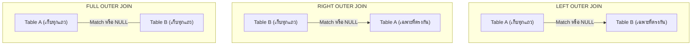

# Database - LAB 7: SQL OUTER JOIN (Left, Right, Full Outer Join)

> **วิชา:** 06066300 Database System Concept | **สถาบัน:** มหาวิทยาลัย
> **Source:** `Resources/Books/Database/lab DB/DB66-LAB 7-Outer Join.pdf`

---

## Part 1: Macro Architecture & Overview

**OUTER JOIN** คือส่วนขยายของ INNER JOIN ที่รักษาแถวซึ่ง **ไม่มีคู่ match** ไว้ในผลลัพธ์ด้วย แทนที่จะตัดทิ้งเหมือน INNER JOIN ช่องที่ไม่มีข้อมูลจะถูกเติมด้วย `NULL` OUTER JOIN สำคัญมากสำหรับ Reporting และการตรวจสอบข้อมูลที่ขาดหายไป



### ตารางเปรียบเทียบ OUTER JOIN ทั้ง 3 ชนิด

| JOIN Type | แถวที่เก็บ | NULL ปรากฏที่ไหน | Use Case |
| :--- | :--- | :--- | :--- |
| **LEFT OUTER JOIN** | ทุกแถวของ Left table | คอลัมน์จาก Right table | หา record ที่ไม่มีความสัมพันธ์ทางขวา |
| **RIGHT OUTER JOIN** | ทุกแถวของ Right table | คอลัมน์จาก Left table | หา record ที่ไม่มีความสัมพันธ์ทางซ้าย |
| **FULL OUTER JOIN** | ทุกแถวของทั้งสองตาราง | ทั้งสองฝั่ง | หา record ที่ไม่มี match ในทั้งสองตาราง |

---

## Part 2: Module-by-Module Deep Dive

### 2.1 LEFT OUTER JOIN

> **LEFT OUTER JOIN** (หรือ `LEFT JOIN`) คือการ JOIN ที่ return **ทุกแถวจาก Left table** และ match ที่ตรงจาก Right table ถ้าแถวใน Left ไม่มีคู่ใน Right ช่องของ Right จะเป็น `NULL`

```sql
-- Syntax
SELECT columns
FROM left_table
LEFT OUTER JOIN right_table ON left_table.key = right_table.key;

-- หรือย่อ (OUTER เป็น optional)
SELECT columns
FROM left_table
LEFT JOIN right_table ON left_table.key = right_table.key;
```

**ตัวอย่าง: แสดงพนักงานทุกคน แม้บางคนยังไม่มีแผนก**

```sql
-- พนักงานที่ department_id = NULL จะยังปรากฏ
-- แต่ department_name จะเป็น NULL
SELECT e.first_name, e.last_name, d.department_name
FROM employees e
LEFT JOIN departments d ON e.department_id = d.department_id;

-- ผลลัพธ์:
-- Smith    | Sales
-- Johnson  | IT
-- Doe      | NULL   ← ยังไม่มีแผนก
```

**เทคนิค: หาแถวที่ไม่มีคู่ match**

```sql
-- หาพนักงานที่ไม่มีแผนก (department_id เป็น NULL หรือไม่มีใน departments)
SELECT e.first_name, e.last_name
FROM employees e
LEFT JOIN departments d ON e.department_id = d.department_id
WHERE d.department_id IS NULL;  -- กรองเฉพาะที่ไม่มีคู่
```

---

### 2.2 RIGHT OUTER JOIN

> **RIGHT OUTER JOIN** (หรือ `RIGHT JOIN`) คือตรงข้ามกับ LEFT JOIN — return **ทุกแถวจาก Right table** ช่องของ Left ที่ไม่มีคู่จะเป็น `NULL`

```sql
-- Syntax
SELECT columns
FROM left_table
RIGHT OUTER JOIN right_table ON left_table.key = right_table.key;
```

**ตัวอย่าง: แสดงทุกแผนก แม้บางแผนกไม่มีพนักงาน**

```sql
-- แผนกที่ไม่มีพนักงานจะยังปรากฏ แต่ first_name จะเป็น NULL
SELECT e.first_name, e.last_name, d.department_name
FROM employees e
RIGHT JOIN departments d ON e.department_id = d.department_id;

-- ผลลัพธ์:
-- Smith    | Sales
-- Johnson  | IT
-- NULL     | Legal     ← แผนกที่ยังไม่มีพนักงาน
```

> 💡 **Tip:** RIGHT JOIN สามารถเขียนใหม่เป็น LEFT JOIN ได้เสมอโดยสลับลำดับตาราง — ในทางปฏิบัติ Developer มักใช้ LEFT JOIN เป็นหลัก

---

### 2.3 FULL OUTER JOIN

> **FULL OUTER JOIN** คือการรวม LEFT และ RIGHT JOIN เข้าด้วยกัน — return **ทุกแถวจากทั้งสองตาราง** แถวที่ไม่มีคู่ match จะมี `NULL` ในช่องของอีกฝั่ง

```sql
-- Syntax
SELECT columns
FROM left_table
FULL OUTER JOIN right_table ON left_table.key = right_table.key;

-- หรือย่อ
FULL JOIN
```

**ตัวอย่าง:**

```sql
-- แสดงทั้งพนักงานที่ไม่มีแผนก AND แผนกที่ไม่มีพนักงาน
SELECT e.first_name, e.last_name, d.department_name
FROM employees e
FULL OUTER JOIN departments d ON e.department_id = d.department_id;

-- ผลลัพธ์:
-- Smith    | Sales
-- Johnson  | IT
-- Doe      | NULL     ← พนักงานที่ไม่มีแผนก
-- NULL     | Legal    ← แผนกที่ไม่มีพนักงาน
```

**หา unmatched records จากทั้งสองฝั่ง:**

```sql
SELECT e.first_name, d.department_name
FROM employees e
FULL OUTER JOIN departments d ON e.department_id = d.department_id
WHERE e.employee_id IS NULL   -- แผนกที่ไม่มีพนักงาน
   OR d.department_id IS NULL; -- พนักงานที่ไม่มีแผนก
```

---

### 2.4 OUTER JOIN กับ SELF JOIN

สามารถรวม OUTER JOIN กับ SELF JOIN ได้ เช่น แสดงพนักงานทุกคนรวมถึง CEO ที่ไม่มีหัวหน้า

```sql
-- SELF JOIN แบบ INNER จะไม่แสดง CEO (manager_id = NULL)
-- เปลี่ยนเป็น LEFT JOIN เพื่อรวม CEO ด้วย
SELECT 
    e.first_name  AS employee_name,
    m.first_name  AS manager_name
FROM employees e
LEFT JOIN employees m ON e.manager_id = m.employee_id;

-- CEO จะปรากฏโดย manager_name = NULL
```

---

### 2.5 เปรียบเทียบ INNER vs OUTER JOIN

```sql
-- กรณีทดสอบ:
-- employees: 107 rows (บางคนไม่มี department)
-- departments: 27 rows (บางแผนกไม่มีพนักงาน)

-- INNER JOIN → ได้เฉพาะที่ match ทั้งคู่
SELECT COUNT(*) FROM employees e
INNER JOIN departments d ON e.department_id = d.department_id;
-- ได้น้อยกว่า 107

-- LEFT JOIN → ได้ทุก employee
SELECT COUNT(*) FROM employees e
LEFT JOIN departments d ON e.department_id = d.department_id;
-- ได้ครบ 107

-- RIGHT JOIN → ได้ทุก department
SELECT COUNT(*) FROM employees e
RIGHT JOIN departments d ON e.department_id = d.department_id;
-- อาจได้มากกว่า 107 ถ้าหลายคนอยู่แผนกเดียวกัน
```

---

## Part 3: Quick Reference & Exam Cheat Sheet

### Checklist สรุปหัวใจสำคัญก่อนสอบ

- [ ] **LEFT JOIN:** เก็บทุกแถวของ Left table — Right ที่ไม่ match จะเป็น NULL
- [ ] **RIGHT JOIN:** เก็บทุกแถวของ Right table — Left ที่ไม่ match จะเป็น NULL
- [ ] **FULL OUTER JOIN:** เก็บทุกแถวจากทั้งสองตาราง — ช่องที่ไม่มีคู่เป็น NULL
- [ ] **หา unmatched records:** ใช้ LEFT/RIGHT JOIN แล้วกรองด้วย `WHERE otherside.key IS NULL`
- [ ] **RIGHT JOIN แปลงเป็น LEFT JOIN:** สลับลำดับตารางและเงื่อนไข
- [ ] **OUTER keyword:** เป็น optional — `LEFT JOIN` = `LEFT OUTER JOIN`

### สรุป Syntax Pattern

| JOIN Type | Syntax |
| :--- | :--- |
| LEFT JOIN | `FROM A LEFT JOIN B ON A.key = B.key` |
| RIGHT JOIN | `FROM A RIGHT JOIN B ON A.key = B.key` |
| FULL OUTER JOIN | `FROM A FULL OUTER JOIN B ON A.key = B.key` |
| หา unmatched | `LEFT JOIN ... WHERE B.key IS NULL` |

### Concept Map — ความครอบคลุมของ JOIN แต่ละแบบ

```text
ข้อมูลทั้งหมด
├── CROSS JOIN .............. A × B (ทุก combination)
├── FULL OUTER JOIN ........ A ∪ B (ทุก row จากทั้งสองฝั่ง)
├── LEFT JOIN .............. A ทั้งหมด + match จาก B
├── RIGHT JOIN ............. B ทั้งหมด + match จาก A
└── INNER JOIN ............. A ∩ B (เฉพาะที่ match)
```

---

## ⚠️ Common Pitfalls & Exam Traps

- **สับสน LEFT/RIGHT:** LEFT JOIN เก็บ Left table ทั้งหมด ไม่ใช่ Right — จำโดยดูว่า "ตารางไหนต้องได้ครบ" คือ LEFT
- **ลืมกรอง IS NULL เมื่อหา unmatched:** ถ้าแค่ LEFT JOIN โดยไม่กรอง `WHERE B.key IS NULL` จะได้ผลรวมทั้ง matched และ unmatched
- **NULL ในเงื่อนไข WHERE:** `WHERE column = NULL` ผิดเสมอ — ต้องใช้ `WHERE column IS NULL`
- **FULL OUTER JOIN บางระบบไม่รองรับ:** MySQL ไม่มี FULL OUTER JOIN โดยตรง ต้องใช้ `UNION` ของ LEFT JOIN และ RIGHT JOIN แทน
- **COUNT(*) vs COUNT(column) ใน OUTER JOIN:** `COUNT(*)` นับรวม NULL แต่ `COUNT(column)` ไม่นับ NULL — ผลลัพธ์ต่างกัน

---

## แบบฝึกหัด (Practice Exercises)

ใช้ Schema: `employees`, `departments`, `locations` (HR Schema)

### ระดับ Basic

**ข้อ 1:** แสดงพนักงานทุกคน (first_name, last_name) พร้อมชื่อแผนก — รวมพนักงานที่ยังไม่มีแผนกด้วย

**ข้อ 2:** แสดงแผนกทุกแผนก (department_name) พร้อมชื่อพนักงาน — รวมแผนกที่ยังไม่มีพนักงานด้วย

**ข้อ 3:** แสดงพนักงานทุกคนพร้อมชื่อหัวหน้า รวม CEO ที่ไม่มีหัวหน้าด้วย

### ระดับ Intermediate

**ข้อ 4:** หาชื่อพนักงานที่ **ยังไม่ได้อยู่ในแผนกใด** (department_id เป็น NULL หรือ department ไม่มีอยู่)

**ข้อ 5:** หาชื่อแผนกที่ **ยังไม่มีพนักงานสักคน**

**ข้อ 6:** แสดงข้อมูลทั้งพนักงานที่ไม่มีแผนก AND แผนกที่ไม่มีพนักงาน ในผลลัพธ์เดียวกัน

### ระดับ Application

**ข้อ 7:** เขียน Query แสดง department_name และจำนวนพนักงานในแต่ละแผนก รวมถึงแผนกที่ไม่มีพนักงานด้วย (ควรแสดงเป็น 0 ไม่ใช่ NULL)

---

### เฉลย

```sql
-- ข้อ 1: LEFT JOIN — พนักงานทุกคน รวมที่ไม่มีแผนก
SELECT e.first_name, e.last_name, d.department_name
FROM employees e
LEFT JOIN departments d ON e.department_id = d.department_id;

-- ข้อ 2: RIGHT JOIN — แผนกทุกแผนก รวมที่ไม่มีพนักงาน
SELECT e.first_name, e.last_name, d.department_name
FROM employees e
RIGHT JOIN departments d ON e.department_id = d.department_id;

-- ข้อ 3: SELF LEFT JOIN — รวม CEO ที่ไม่มีหัวหน้า
SELECT e.first_name AS employee, m.first_name AS manager
FROM employees e
LEFT JOIN employees m ON e.manager_id = m.employee_id;

-- ข้อ 4: พนักงานที่ไม่มีแผนก
SELECT e.first_name, e.last_name
FROM employees e
LEFT JOIN departments d ON e.department_id = d.department_id
WHERE d.department_id IS NULL;

-- ข้อ 5: แผนกที่ไม่มีพนักงาน
SELECT d.department_name
FROM employees e
RIGHT JOIN departments d ON e.department_id = d.department_id
WHERE e.employee_id IS NULL;

-- ข้อ 6: FULL OUTER JOIN — ทั้งสองฝั่งที่ไม่มีคู่
SELECT e.first_name, d.department_name
FROM employees e
FULL OUTER JOIN departments d ON e.department_id = d.department_id
WHERE e.employee_id IS NULL OR d.department_id IS NULL;

-- ข้อ 7: จำนวนพนักงานต่อแผนก รวมแผนกที่ว่าง
SELECT d.department_name, COUNT(e.employee_id) AS emp_count
FROM employees e
RIGHT JOIN departments d ON e.department_id = d.department_id
GROUP BY d.department_name;
-- COUNT(e.employee_id) จะเป็น 0 สำหรับแผนกที่ไม่มีพนักงาน (ไม่นับ NULL)
```

---

## เอกสารเชื่อมโยง (Wiki-Style Backlinks)

- **วิชาและหัวข้อที่เกี่ยวข้อง:**
  - [[LAB 6 - SQL JOIN (Inner, Cross, Natural, Self)]] (INNER JOIN ที่เป็นพื้นฐานของ OUTER JOIN)
  - [[LAB 8 - SQL GROUP BY and Aggregate Functions]] (GROUP BY มักใช้ร่วมกับ OUTER JOIN เพื่อ Reporting)
  - [[LAB 9 - SQL Subqueries]] (Subquery เป็นอีกวิธีหา unmatched records)

- **แหล่งข้อมูล:**
  - Source: `Resources/Books/Database/lab DB/DB66-LAB 7-Outer Join.pdf`
