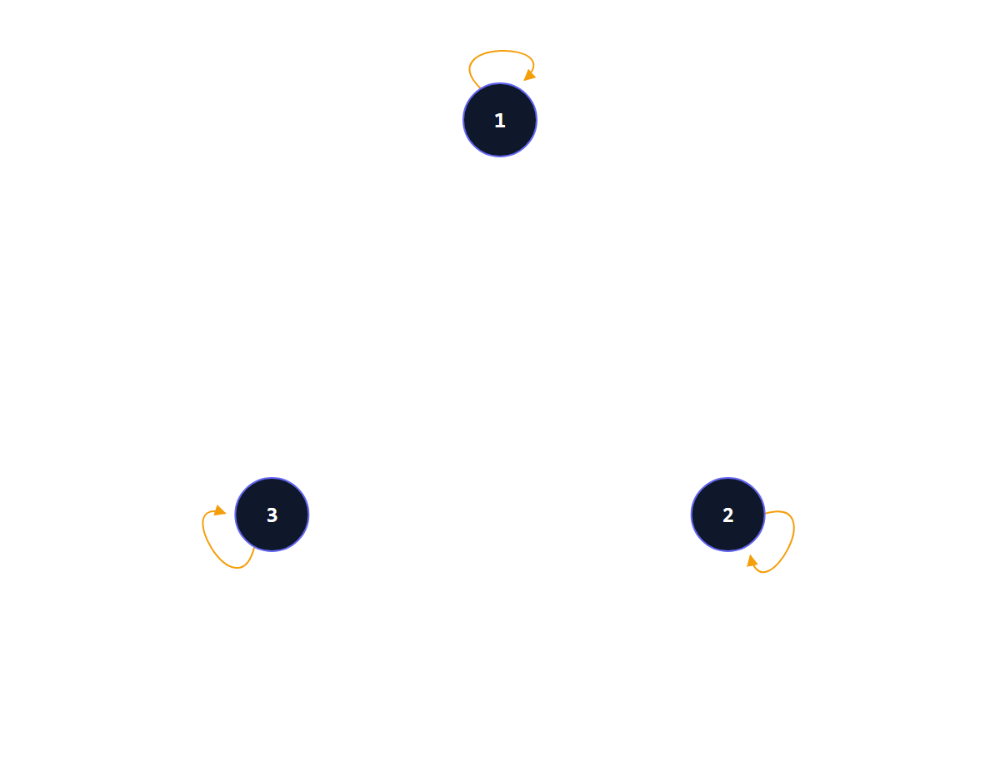
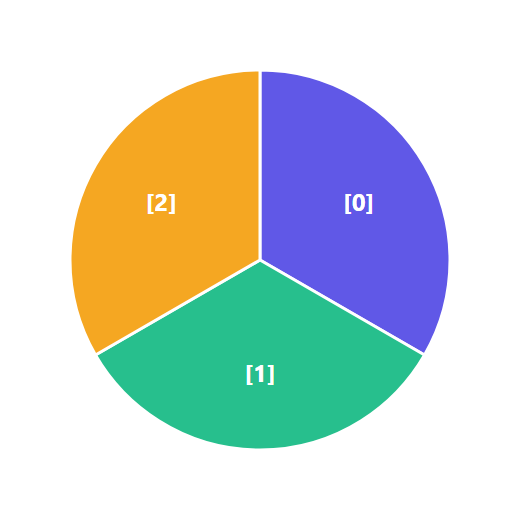

# Discrete Mathematics - Week 10: Properties of Relations

**วิชา:** Discrete Mathematics
**สถาบัน:** มหาวิทยาลัย (Sirasit Lochanachit, PhD)
**Source:** `Resources/Books/Discrete Mathematics/myDiscrete_Week10.pdf` (58 pages, slides)  
**Reference เพิ่มเติม:** `Resources/References/ระบบเรียนรู้เรื่องความสัมพันธ์แบบโต้ตอบ (Relations Interactive Guide) 1.md` & `2.md` (Interactive Guide, noswolf.github.io)

---

## Part 1: Macro Architecture & Overview

```
Properties of Relations
├── 1. Reflexive    — ทุก element สัมพันธ์กับตัวเอง
├── 2. Symmetric    — ถ้า (a,b)∈R แล้ว (b,a)∈R
├── 3. Antisymmetric— ถ้า (a,b) และ (b,a)∈R แล้ว a=b
├── 4. Transitive   — ถ้า (a,b) และ (b,c)∈R แล้ว (a,c)∈R
└── 5. Equivalence Relation = Reflexive + Symmetric + Transitive
    └── Equivalence Classes [a]_R
```

---

## Part 2: Deep Dive

### 1. Reflexive Relations (ความสัมพันธ์แบบ Reflexive)

> **นิยาม:** $R$ เป็น **reflexive** ถ้า $(a, a) \in R$ สำหรับทุก $a \in A$

$$\forall a \big[(a, a) \in R\big]$$

ทุก element ต้องสัมพันธ์กับ **ตัวเอง**


*💡 สังเกตเส้นห่วงกลม (Self-loops) จะต้องปรากฏขึ้นครบถ้วนทุกโหนดในเซต*

**ตัวอย่าง** บน $\{1, 2, 3, 4\}$:

| Relation | Reflexive? | เหตุผล |
|:---:|:---:|:---|
| $R_1 = \{(1,1),(1,2),(2,1),(2,2),(3,4),(4,1),(4,4)\}$ | ❌ | ขาด $(3,3)$ |
| $R_2 = \{(1,1),(1,2),(2,1)\}$ | ❌ | ขาด $(2,2),(3,3),(4,4)$ |
| $R_3 = \{(1,1),(1,2),(1,4),(2,1),(2,2),(3,3),(4,1),(4,4)\}$ | ✅ | มี $(1,1),(2,2),(3,3),(4,4)$ ครบ |
| $R_4 = \{(2,1),(3,1),(3,2),(4,1),(4,2),(4,3)\}$ | ❌ | ไม่มี $(a,a)$ เลย |
| $R_5 = \{(1,1),(1,2),\ldots,(4,4)\}$ | ✅ | มี $(1,1),(2,2),(3,3),(4,4)$ ครบ |
| $R_6 = \{(3,4)\}$ | ❌ | ขาดทุก $(a,a)$ |

**ตัวอย่าง** บนจำนวนเต็ม:

| Relation | Reflexive? | เหตุผล |
|:---:|:---:|:---|
| $R_1$: $a \leq b$ | ✅ | $a \leq a$ เสมอ |
| $R_2$: $a > b$ | ❌ | $a > a$ เป็นเท็จ |
| $R_3$: $a = b$ หรือ $a = -b$ | ✅ | $a = a$ เสมอ |
| $R_4$: $a = b$ | ✅ | $a = a$ เสมอ |
| $R_5$: $a = b+1$ | ❌ | $a \neq a+1$ |
| $R_6$: $a + b \leq 3$ | ❌ | เมื่อ $a = 2$: $2+2=4 > 3$ |

---

### 2. Symmetric Relations (ความสัมพันธ์แบบ Symmetric)

> **นิยาม:** $R$ เป็น **symmetric** ถ้า $(b,a) \in R$ ทุกครั้งที่ $(a,b) \in R$

$$\forall a \forall b \big[(a,b) \in R \rightarrow (b,a) \in R\big]$$

ถ้า a สัมพันธ์กับ b แล้ว b ต้องสัมพันธ์กับ a ด้วย → ความสัมพันธ์แบบ **mutual** (เช่น เพื่อน)

**ตัวอย่าง** บน $\{1, 2, 3, 4\}$:

| Relation | Symmetric? | เหตุผล |
|:---:|:---:|:---|
| $R_1$ | ❌ | มี $(3,4)$ แต่ไม่มี $(4,3)$ |
| $R_2 = \{(1,1),(1,2),(2,1)\}$ | ✅ | ทุก pair มี pair กลับ |
| $R_3$ | ✅ | มี $(1,2)$ และ $(2,1)$, $(1,4)$ และ $(4,1)$ ครบ |
| $R_4$ | ❌ | มี $(2,1)$ แต่ไม่มี $(1,2)$ |
| $R_5$ | ❌ | มี $(1,2)$ แต่ไม่มี $(2,1)$ |
| $R_6 = \{(3,4)\}$ | ❌ | มี $(3,4)$ แต่ไม่มี $(4,3)$ |

**ตัวอย่าง** บนจำนวนเต็ม:

| Relation | Symmetric? | เหตุผล |
|:---:|:---:|:---|
| $R_1$: $a \leq b$ | ❌ | $1 \leq 2$ แต่ $2 \not\leq 1$ |
| $R_2$: $a > b$ | ❌ | $2 > 1$ แต่ $1 \not> 2$ |
| $R_3$: $a = b$ หรือ $a = -b$ | ✅ | ถ้า $a = -b$ แล้ว $b = -a$ |
| $R_4$: $a = b$ | ✅ | ถ้า $a = b$ แล้ว $b = a$ |
| $R_5$: $a = b+1$ | ❌ | ถ้า $a = b+1$ แล้ว $b \neq a+1$ |
| $R_6$: $a+b \leq 3$ | ✅ | $a+b = b+a$ เสมอ |

---

### 3. Antisymmetric Relations (ความสัมพันธ์แบบ Antisymmetric)

> **นิยาม:** $R$ เป็น **antisymmetric** ถ้า $(a,b) \in R$ และ $(b,a) \in R$ แล้ว $a = b$

$$\forall a \forall b \big[(a,b) \in R \wedge (b,a) \in R \rightarrow (a = b)\big]$$

กล่าวอีกนัยหนึ่ง: ไม่มีสอง element ต่างกันที่ **สัมพันธ์กันทั้งสองทาง**

> ⚠️ **Antisymmetric ≠ ไม่ Symmetric!** — relation สามารถเป็น symmetric และ antisymmetric พร้อมกันได้ (ถ้า R มีแต่ $(a,a)$)

**ตัวอย่าง** บน $\{1, 2, 3, 4\}$:

| Relation | Antisymmetric? | เหตุผล |
|:---:|:---:|:---|
| $R_1$ | ❌ | มี $(1,2)$ และ $(2,1)$ แต่ $1 \neq 2$ |
| $R_2 = \{(1,1),(1,2),(2,1)\}$ | ❌ | มี $(1,2)$ และ $(2,1)$ แต่ $1 \neq 2$ |
| $R_3$ | ❌ | มี $(1,2)$ และ $(2,1)$ แต่ $1 \neq 2$ |
| $R_4 = \{(2,1),(3,1),(3,2),(4,1),(4,2),(4,3)\}$ | ✅ | ไม่มีคู่ $(b,a)$ สำหรับ $a \neq b$ ใด ๆ |
| $R_5$ | ✅ | เป็น "≤" บนตัวเลข — ไม่มีสองทาง |
| $R_6 = \{(3,4)\}$ | ✅ | ไม่มี $(4,3)$ ดังนั้น antisymmetric |

**ตัวอย่าง** บนจำนวนเต็ม:

| Relation | Antisymmetric? | เหตุผล |
|:---:|:---:|:---|
| $R_1$: $a \leq b$ | ✅ | ถ้า $a \leq b$ และ $b \leq a$ แล้ว $a = b$ |
| $R_2$: $a > b$ | ✅ | ถ้า $a > b$ และ $b > a$ → ขัดแย้ง |
| $R_3$: $a = b$ หรือ $a = -b$ | ❌ | $(1,-1)$ และ $(-1,1)$ อยู่ใน R แต่ $1 \neq -1$ |
| $R_4$: $a = b$ | ✅ | $(a,b) \in R$ ต่อเมื่อ $a = b$ |
| $R_5$: $a = b+1$ | ✅ | ถ้า $a=b+1$ และ $b=a+1$ → $a = a+2$ ขัดแย้ง |
| $R_6$: $a+b \leq 3$ | ❌ | $(1,2)$ และ $(2,1)$ ∈ R แต่ $1 \neq 2$ |

---

### 4. Transitive Relations (ความสัมพันธ์แบบ Transitive)

> **นิยาม:** $R$ เป็น **transitive** ถ้าเมื่อ $(a,b) \in R$ และ $(b,c) \in R$ แล้ว $(a,c) \in R$

$$\forall a \forall b \forall c \big[(a,b) \in R \wedge (b,c) \in R \rightarrow (a,c) \in R\big]$$

ถ้า a→b และ b→c แล้ว a→c ต้องมีด้วย (เหมือน "การเดินทางผ่าน")

**ตัวอย่าง** บน $\{1, 2, 3, 4\}$:

| Relation | Transitive? | เหตุผล |
|:---:|:---:|:---|
| $R_1$ | ❌ | $(3,4)$ และ $(4,1)$ อยู่ใน R แต่ $(3,1)$ ไม่อยู่ |
| $R_2 = \{(1,1),(1,2),(2,1)\}$ | ❌ | $(1,2)$ และ $(2,1)$ อยู่ใน R แต่ $(1,1)$ — wait มีอยู่แล้ว; ต้องตรวจ $(2,1)$ และ $(1,2)$ → ต้องมี $(2,2)$ — ไม่มี ❌ |
| $R_4 = \{(2,1),(3,1),(3,2),(4,1),(4,2),(4,3)\}$ | ✅ | ตรวจสอบทุก path: ไม่มีการ "ข้าม" ที่หายไป |
| $R_5$ | ✅ | $a \leq b$, $b \leq c$ → $a \leq c$ |
| $R_6 = \{(3,4)\}$ | ✅ | ไม่มีคู่ที่ต้องตรวจ transitive |

**ตัวอย่าง** บนจำนวนเต็ม:

| Relation | Transitive? | เหตุผล |
|:---:|:---:|:---|
| $R_1$: $a \leq b$ | ✅ | $a \leq b, b \leq c \Rightarrow a \leq c$ |
| $R_2$: $a > b$ | ✅ | $a > b, b > c \Rightarrow a > c$ |
| $R_3$: $a = b$ หรือ $a = -b$ | ❌ | $(1,-1) \in R$, $(-1,-1) \in R$ แต่ $(1,-1)$ — wait: $(1,-1)$ และ $(-1,-1)$ → ต้องมี $(1,-1)$ — มีอยู่แล้ว ✅ แต่ $(2,-2)$ และ $(-2,2)$ → ต้องมี $(2,2)$ ✅ — **ต้องพิสูจน์รอบคอบ** |
| $R_4$: $a = b$ | ✅ | $a=b, b=c \Rightarrow a=c$ |
| $R_5$: $a = b+1$ | ❌ | $(3,2)$ และ $(2,1)$ ∈ R แต่ $(3,1) \notin R$ (เพราะ $3 \neq 1+1$) |
| $R_6$: $a+b \leq 3$ | ❌ | $(1,2)$ และ $(2,0)$ ∈ R แต่ $(1,0)$: $1+0=1 \leq 3$ ✅ ไม่แน่ — ตรวจเพิ่ม |

---

### 5. Equivalence Relations & Equivalence Classes

> **นิยาม:** Relation $R$ บนเซต $A$ เรียกว่า **equivalence relation** ถ้า $R$ เป็น:
> - **Reflexive** และ
> - **Symmetric** และ
> - **Transitive**

ความสัมพันธ์สมมูล (Equivalence Relation) แทน **ความเท่าเทียมกันในบางแง่มุม** ของสมาชิกในเซต

**ตัวอย่าง:** จาก $R_1$–$R_6$ บนจำนวนเต็ม:
- $R_4$: $a = b$ → Reflexive ✅, Symmetric ✅, Transitive ✅ → **Equivalence Relation** ✅
- $R_3$: $a = b$ หรือ $a = -b$ → Reflexive ✅, Symmetric ✅, Transitive ✅ → **Equivalence Relation** ✅
- $R_1$: $a \leq b$ → Reflexive ✅, Symmetric ❌ → **ไม่ใช่** ❌

**ตัวอย่างเพิ่มเติมจาก Reference:**
1. **ความสัมพันธ์ “มีค่าเท่ากัน” บน $\mathbb{Z}$:** Reflexive ($a=a$), Symmetric ($a=b \Rightarrow b=a$), Transitive ($a=b, b=c \Rightarrow a=c$) → เป็น equivalence relation
2. **ความสัมพันธ์ “หารแล้วได้เศษเท่ากัน” บน $\mathbb{Z}$ (Congruence Modulo $m$):** Reflexive, Symmetric, Transitive → เป็น equivalence relation

---

#### Equivalence Classes

> **นิยาม:** ให้ $R$ เป็น equivalence relation บน $A$ และ $a \in A$
> **Equivalence class** ของ $a$ เมื่ออิงจาก $R$ :

$$[a]_R = \{s \mid (a, s) \in R\}$$

หรือในรูปแบบที่เขียนชัดจาก Reference:

$$[a]_{R} = \{x \in A : (x, a) \in R\}$$

ให้นึกภาพว่า Equivalence Relation คือ **กฎเจดสมาชิกเข้ากล่องหลาย ๆ กล่อง** และ Equivalence Class คือกล่องที่แต่ละสมาชิกอยู่ — **ถ้า $(a,b) \in R$ แล้ว $[a]_R = [b]_R$**

- ทุก element ใน class สามารถเป็น **ตัวแทน (Representative)** ของ class ได้
- Equivalence classes จะ **แบ่งเซต** ออกเป็น disjoint subsets (partition) โดย class ต่างๆ ไม่มีผลตัดกัน

**ตัวอย่าง:** $R$ บนจำนวนเต็มที่ $(a,b) \in R$ ถ้า $a = b$ หรือ $a = -b$
$$[1]_R = \{1, -1\}, \quad [2]_R = \{2, -2\}, \quad [0]_R = \{0\}$$

---

#### Congruence Modulo เป็น Equivalence Relation (ซึ่งสำคัญมาก — ออกสอบบ่อย)

ความสัมพันธ์ **Congruence Modulo $m$** บน $\mathbb{Z}$ (เขียน $a \equiv b \pmod{m}$) เป็น equivalence relation เป็นเพราะ:
- **Reflexive:** $a \equiv a \pmod{m}$ เสมอ
- **Symmetric:** ถ้า $a \equiv b \pmod{m}$ แล้ว $b \equiv a \pmod{m}$
- **Transitive:** ถ้า $a \equiv b$ และ $b \equiv c$ แล้ว $a \equiv c \pmod{m}$

**ตัวอย่าง Congruence Modulo 3:** Equivalence classes ที่หารด้วย 3 ได้เศษได้เพียง 3 ค่า (0, 1, 2):

| Class | สมาชิก | ตัวแทนที่นิยมใช้ |
|:---:|:---|:---:|
| $[0]_{\equiv_3}$ | $\{\ldots,-6,-3,0,3,6,\ldots\}$ | $[0]$ |
| $[1]_{\equiv_3}$ | $\{\ldots,-5,-2,1,4,7,\ldots\}$ | $[1]$ |
| $[2]_{\equiv_3}$ | $\{\ldots,-4,-1,2,5,8,\ldots\}$ | $[2]$ |

เซต $\mathbb{Z}$ อนันต์ถูกเจียน partition เป็นเพียง **3 class** อย่างพอดิบพะดี (ตาม Partition Theorem)


*แผนภูมิวงกลมแสดงการแบ่งพาร์ทิชันของจำนวนเต็มตาม Equivalence Classes ($\pmod 3$)*

> คำตอบสามารถเขียนด้วยตัวแทนต่างกันก็ถูก: $[0]_{\equiv_3}, [1]_{\equiv_3}, [2]_{\equiv_3}$ **หรือ** $[3]_{\equiv_3}, [-2]_{\equiv_3}, [5]_{\equiv_3}$ ล้วนเป็นคำตอบที่ถูกทั้งคู่

**Modular arithmetic เชื่อมโยง:**
- Equivalence classes ของ modulo $m$ คือ $\{0, m, 2m,\ldots\}$, $\{1, m+1, 2m+1,\ldots\}$, etc.
- แต่ละ class ใน slice เดียวกันสัมพันธ์กัน (symmetric), ไม่ข้าม slice (well-defined partition)

---

### Real-World Applications ของ Properties

| Property | ตัวอย่างใน Real World |
|:---|:---|
| **Reflexive** | Primary key ใน Database: ทุก row มี ID ของตัวเอง |
| **Symmetric** | Facebook friendship (ถ้า A เป็นเพื่อน B → B เป็นเพื่อน A) |
| **Antisymmetric** | Course prerequisites, Sorting ($\leq$), File hierarchy |
| **Transitive** | Flight routes (A→B, B→C → A→C indirect), Logic inference |
| **Equivalence** | Modular arithmetic, File compression, ML clustering |

---

## Part 3: Quick Reference & Exam Cheat Sheet

| Property | สัญลักษณ์ | Matrix $M_R$ | Digraph ลักษณะ |
|:---|:---|:---|:---|
| Reflexive | $(a,a) \in R$ ∀a | **diagonal** ทุกช่อง = 1 | **Loop** ที่ทุก vertex |
| Symmetric | $(a,b) \Rightarrow (b,a)$ | $m_{ij} = m_{ji}$ (สมมาตร) | ทุก edge มี **edge ย้อนกลับ** |
| Antisymmetric | $(a,b) \wedge (b,a) \Rightarrow a=b$ | ถ้า $i\neq j$: $m_{ij}$ และ $m_{ji}$ ไม่เป็น 1 พร้อมกัน | **ไม่มี** edge คู่ |
| Transitive | $(a,b) \wedge (b,c) \Rightarrow (a,c)$ | ตรวจเส้นทางยาว 2 | ทุก path ยาว 2 มี **shortcut** |
| Equivalence | Reflexive + Symmetric + Transitive | — | — |

### Checklist สรุปหัวใจสำคัญก่อนสอบ
* [ ] **Reflexive:** ทุก element ต้องมี $(a,a) \in R$ — ตรวจครบทุก element ใน domain
* [ ] **Symmetric:** ทุก $(a,b)$ ต้องมี $(b,a)$ ด้วย — เหมือนการเป็นเพื่อน (mutual)
* [ ] **Antisymmetric:** ห้ามมีคู่สวนทางระหว่าง element ที่ต่างกัน
* [ ] **Transitive:** ทุก path a→b→c ต้องมี a→c ด้วย
* [ ] **Equivalence Class:** $[a]_R$ เป็น disjoint partition ของ $A$

---

## ⚠️ Common Pitfalls & Exam Traps

- **Antisymmetric ≠ Not Symmetric** — เป็น property คนละอย่าง:
  - Symmetric: $(a,b) \Rightarrow (b,a)$
  - Antisymmetric: $(a,b) \wedge (b,a) \Rightarrow a=b$
  - Relation **สามารถเป็นทั้งสอง** พร้อมกันได้ (เช่น $R = \{(a,a)\}$)
- ตรวจ Reflexive ต้อง check **ทุก** element ใน domain
- ตรวจ Transitive ต้อง check **ทุก path** ยาว 2 ว่ามี shortcut ไหม
- Equivalence class ของต่าง representative อาจเขียนต่างกันแต่เป็น set เดียวกัน: $[1]_R = [-1]_R$

---

## เอกสารเชื่อมโยง (Wiki-Style Backlinks)

- [[Week10 - Relations and Binary Relations]] (พื้นฐาน — นิยาม relation และ binary relation)
- [[Week10 - n-ary Relations and Representing Relations]] (การแทน relation ด้วย matrix และ digraph)
- [[Week9 - Applications of Congruences]] (Congruence Modulo เป็น equivalence relation)

**แหล่งข้อมูล:**
- Source: `Resources/Books/Discrete Mathematics/myDiscrete_Week10.pdf` (58 pages, slides)
- Reference 1: `Resources/References/ระบบเรียนรู้เรื่องความสัมพันธ์แบบโต้ตอบ (Relations Interactive Guide) 1.md` — Properties, Matrix, Digraph
- Reference 2: `Resources/References/ระบบเรียนรู้เรื่องความสัมพันธ์แบบโต้ตอบ (Relations Interactive Guide) 2.md` — Equivalence Relation, Equivalence Class, Congruence Modulo
