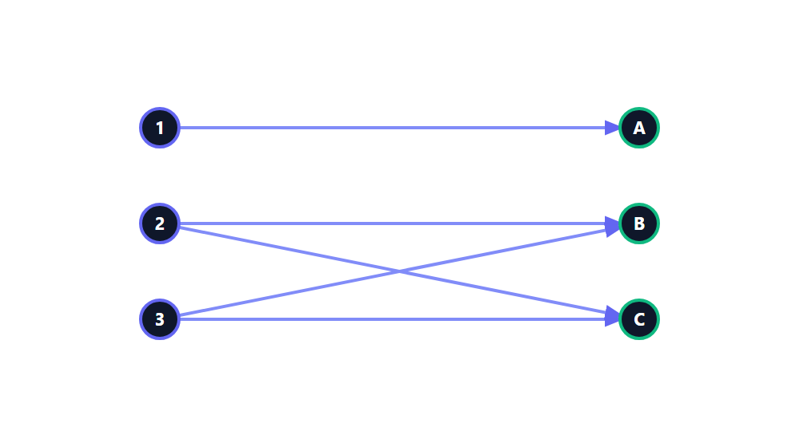

# Discrete Mathematics - Week 10: Relations and Binary Relations

**วิชา:** Discrete Mathematics
**สถาบัน:** มหาวิทยาลัย (Sirasit Lochanachit, PhD)
**Source:** `Resources/Books/Discrete Mathematics/myDiscrete_Week10.pdf` (58 pages, slides)  
**Reference เพิ่มเติม:** `Resources/References/ระบบเรียนรู้เรื่องความสัมพันธ์แบบโต้ตอบ (Relations Interactive Guide).md` (Interactive Guide, noswolf.github.io)

---

## Part 1: Macro Architecture & Overview

```
Week 10: Relations (ความสัมพันธ์)
├── 1. Relations (Basics)
│   ├── Ordered Pair & Cartesian Product (A × B)
│   ├── Relation = Subset of A × B
│   ├── Functions as Relations
│   └── Binary Relations on a Set (A × A)
├── 2. Properties of Relations
│   ├── Reflexive
│   ├── Symmetric
│   ├── Antisymmetric
│   ├── Transitive
│   └── Equivalence Relation + Classes
├── 3. n-ary Relations
│   ├── Degree of Relation
│   ├── n-tuple
│   └── Databases and Tables
└── 4. Representing Relations
    ├── Zero-One Matrices
    └── Directed Graphs (Digraphs)
```

---

## Part 2: Deep Dive

### 1. Relations — พื้นฐาน

#### Cartesian Product (ผลคูณคาร์ทีเชียน)

> **นิยาม:** Cartesian Product ของเซต $A$ และ $B$ เขียนว่า $A \times B$ คือเซตของ ordered pairs $(a, b)$ ที่ $a \in A$ และ $b \in B$

**ตัวอย่าง:** $A = \{a, b\}$, $B = \{1, 2, 3\}$

$$A \times B = \{(a,1),\ (a,2),\ (a,3),\ (b,1),\ (b,2),\ (b,3)\}$$

**ขนาด:** $|A \times B| = |A| \times |B|$

---

#### Relation (ความสัมพันธ์)

> **นิยาม:** **Binary Relation** $R$ จากเซต $A$ ไปยังเซต $B$ คือ subset ใด ๆ ของผลคูณคาร์ทีเซียน $A \times B$ (เขียนแทนด้วย $R \subseteq A \times B$)
> ในกรณีที่ $A = B$ จะเรียก $R$ จาก $A$ ไป $A$ ว่า **ความสัมพันธ์บนเซต $A$** (Relation on set $A$)

```
เปรียบเทียบ:
  A × B  = ทุก ordered pair ที่เป็นไปได้
  R ⊆ A×B = relation = เลือกมาบางคู่ตามเงื่อนไข
```

สำหรับความสัมพันธ์ $R$ ใด ๆ ถ้า $(a, b) \in R$ เราเขียนได้ว่า $aRb$ ซึ่งอ่านว่า "$a$ มีความสัมพันธ์ $R$ กับ $b$"

**ตัวอย่างจากบริบทจริง:**
- $T = \{(5,a),(1,c),(3,d)\}$ เป็นความสัมพันธ์จากเซต $\{1,2,3,4,5\}$ ไปยัง $\{a,b,c,d\}$
- $\alpha = \{(PSCP, A),(ICS, C),(DM, A)\}$ เป็นความสัมพันธ์จากเซตของรายวิชาไปยังเซตของผลการเรียน

---

#### Functions vs. Relations

| | Relation | Function |
|:---|:---:|:---:|
| Input มีหลาย output ได้ไหม? | ✅ ได้ | ❌ ไม่ได้ |
| Input ต้องมี output ไหม? | ❌ ไม่จำเป็น | ✅ ต้องมีเสมอ |
| ทุก function เป็น relation? | — | ✅ ใช่ |
| ทุก relation เป็น function? | ❌ ไม่ใช่ | — |

---

#### Binary Relation

> **นิยาม:** **Binary Relation** $R$ จาก $A$ ไปยัง $B$ คือ subset $R \subseteq A \times B$

> **นิยาม (on a Set):** **Binary Relation บน $A$** คือ $R \subseteq A \times A$

**ตัวอย่าง 1:** $A = \{a, b, c\}$
$$R = \{(a,a),\ (a,b),\ (a,c)\} \subseteq A \times A \quad \checkmark$$

**ตัวอย่าง 2:** $A = \{1, 2, 3, 4\}$, $R = \{(a,b) \mid a \text{ divides } b\}$
$$R = \{(1,1),(1,2),(1,3),(1,4),(2,2),(2,4),(3,3),(4,4)\}$$

**ตัวอย่าง 3:** Relations บนเซตจำนวนเต็ม:

| Relation | นิยาม |
|:---:|:---|
| $R_1$ | $(a,b)$: $a \leq b$ |
| $R_2$ | $(a,b)$: $a > b$ |
| $R_3$ | $(a,b)$: $a = b$ หรือ $a = -b$ |
| $R_4$ | $(a,b)$: $a = b$ |
| $R_5$ | $(a,b)$: $a = b + 1$ |
| $R_6$ | $(a,b)$: $a + b \leq 3$ |

---

### ตัวอย่างความสัมพันธ์ที่กำหนดด้วยเงื่อนไข (Relations Defined by Conditions)

ในทางคณิตศาสตร์และวิทยาการคอมพิวเตอร์ เรามักกำหนดเงื่อนไขเพื่อสร้างเซตความสัมพันธ์ที่มีความหมาย:

#### ความสัมพันธ์ "น้อยกว่า" (Less Than)

$$R = \{(a,b) \in A \times B : a < b\}$$

สมมติ $A = \{1,2,3\}$, $B = \{2,3\}$  
$R = \{(1,2),(1,3),(2,3)\}$

#### ความสัมพันธ์ "หารลงตัว" (Divisibility)

$$R = \{(a,b) \in A \times B : a \mid b\}$$

---

#### แบบจำลองการแสดงความสัมพันธ์ด้วยภาพ (Arrow / Bipartite Matching Diagram)

การแสดงความสัมพันธ์ระหว่างสองเซต $A$ และ $B$ สามารถเขียนเป็นไดอะแกรมลูกศร (Arrow Diagram หรือ Bipartite Matching) เพื่อแสดงให้เห็นคู่อันดับจาก Domain ไปยัง Codomain:


*(ตัวอย่าง: แผนภาพแสดงการจับคู่ $|A|=3, |B|=3, |R|=5$)*

สมมติ $A = \{2,3\}$, $B = \{4,6,9\}$  
$R = \{(2,4),(2,6),(3,6),(3,9)\}$

#### ความสัมพันธ์ "กำลังสอง" (Square of)

$$R = \{(a,b) \in A \times B : b = a^{2}\}$$

สมมติ $A = \{2,3,4\}$, $B = \{4,9,10\}$  
$R = \{(2,4),(3,9)\}$ *(4 ไม่เข้าเงื่อนไขเพราะ $4^2=16 \notin B$)*

---

## Part 3: Quick Reference & Exam Cheat Sheet

| แนวคิด | นิยาม |
|:---|:---|
| $A \times B$ | $\{(a,b) \mid a \in A, b \in B\}$ |
| Relation | subset ของ $A \times B$ |
| Binary Relation บน $A$ | subset ของ $A \times A$ |
| Function | relation ที่ input มีเพียง 1 output |
| ทุก function เป็น relation | ✅ แต่ไม่ใช่กลับกัน |

---

## ⚠️ Common Pitfalls & Exam Traps

- $(a, b)$ ≠ $(b, a)$ — ordered pair มีลำดับ!
- $A \times B \neq B \times A$ (ยกเว้น $A = B$)
- Relation ไม่จำเป็นต้องมีกฎที่ชัดเจน — เซตใด ๆ ที่เป็น subset ของ $A \times B$ ก็เป็น relation
- ระวังสับสนระหว่าง relation **จาก $A$ ไป $B$** กับ relation **บน $A$**

---

## เอกสารเชื่อมโยง (Wiki-Style Backlinks)

- [[Week10 - Properties of Relations]] (ต่อจาก binary relations — Reflexive, Symmetric, Antisymmetric, Transitive, Equivalence)
- [[Week10 - n-ary Relations and Representing Relations]] (ขยาย relation เป็น n sets + database model + Matrix + Digraph)
- [[Week9 - Applications of Congruences]] (Congruence Modulo ใช้ Relation เป็นฐาน)

**แหล่งข้อมูล:**
- Source: `Resources/Books/Discrete Mathematics/myDiscrete_Week10.pdf` (58 pages, slides)
- Reference: ระบบเรียนรู้เรื่องความสัมพันธ์แบบโต้ตอบ — `Resources/References/ระบบเรียนรู้เรื่องความสัมพันธ์แบบโต้ตอบ (Relations Interactive Guide).md` (noswolf.github.io)
