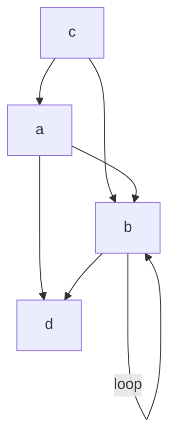
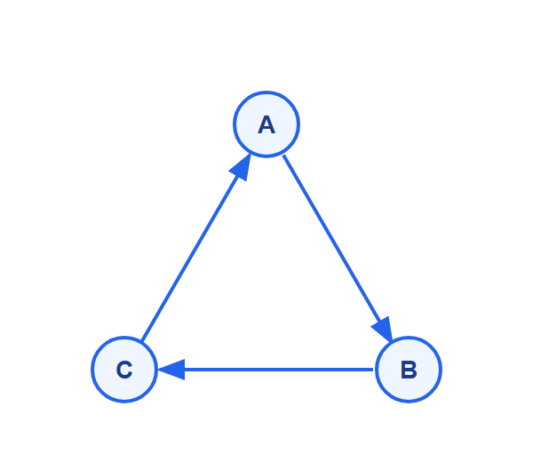
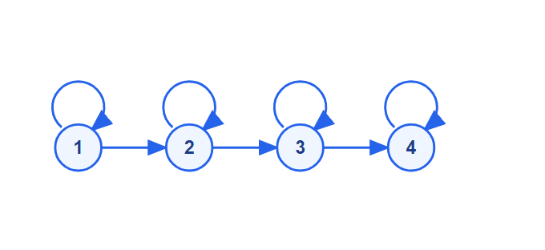

# Discrete Mathematics - Week 10: n-ary Relations and Representing Relations

**วิชา:** Discrete Mathematics
**สถาบัน:** มหาวิทยาลัย (Sirasit Lochanachit, PhD)
**Source:** `Resources/Books/Discrete Mathematics/myDiscrete_Week10.pdf` (58 pages, slides)  
**Reference เพิ่มเติม:** `Resources/References/ระบบเรียนรู้เรื่องความสัมพันธ์แบบโต้ตอบ (Relations Interactive Guide) 3.md` (Interactive Guide, noswolf.github.io)

---

## Part 1: Macro Architecture & Overview

```
n-ary Relations & Representing Relations
├── 3. n-ary Relations
│   ├── นิยาม n-ary relation (subset of A1×A2×...×An)
│   ├── Degree & Domains
│   ├── n-tuple (ordered n-tuples)
│   └── Databases and Relations (Tables, Primary Key)
└── 4. Representing Relations
    ├── Zero-One Matrices
    │   ├── Matrix M_R = [m_ij]
    │   └── Reflexive/Symmetric/Antisymmetric ใน Matrix
    └── Directed Graphs (Digraphs)
        ├── Vertices, Edges, Loops
        └── Properties ใน Digraph
```

---

## Part 2: Deep Dive

### 3. n-ary Relations

> **นิยาม:** ให้ $A_1, A_2, \ldots, A_n$ เป็นเซต
> **n-ary relation** บนเซตเหล่านี้คือ subset ของ $A_1 \times A_2 \times \cdots \times A_n$
> - $A_1, A_2, \ldots, A_n$ เรียกว่า **domains** ของ relation
> - $n$ เรียกว่า **degree** ของ relation

สูตรผลคูณคาร์ทีเซียน n เซต:
$$A_1 \times A_2 \times \cdots \times A_n = \{(a_1, a_2, \ldots, a_n) : a_i \in A_i \text{ สำหรับ } i = 1, 2, \ldots, n\}$$

**คำศัพท์เฉพาะทาง (Terminologies):**

| คำศัพท์ | ความหมาย | ตัวอย่าง |
|:---|:---|:---|
| **Domain** | เซต $A_1, A_2, \ldots, A_n$ — ช่วงชนิดข้อมูลที่ยอมรับได้ในแต่ละ component | ชื่อนักศึกษา, รหัสวิชา, หน่วยกิต |
| **Degree** | ค่า $n$ = จำนวน domain ใน relation | $n=2$ คือ Binary, $n=3$ คือ Ternary |
| **n-tuple** | $(a_1, a_2, \ldots, a_n)$ = ordered collection มี $n$ สมาชิก | $(660101, พีระพงษ์, IT)$ |

---

#### Ordered n-tuples

> $(a_1, a_2, \ldots, a_n)$ คือ ordered collection ที่มีสมาชิก $n$ ตัว

- **2-tuple** = ordered pair (ที่เคยใช้ใน binary relation)
- สอง n-tuples เท่ากัน ↔ ทุก component เท่ากัน

**ตัวอย่าง:**
- 2-tuple: $(1, 2)$
- 3-tuple: $(7, 8, 9)$

---

#### ตัวอย่าง n-ary Relations

**ตัวอย่าง 1:** $R$ บน $\mathbb{N} \times \mathbb{N} \times \mathbb{N}$ ที่ $(a, b, c) \in R$ ถ้า $a < b < c$
- $(1, 2, 3) \in R$ ✅ (1 < 2 < 3)
- $(2, 4, 3) \notin R$ ❌ (4 > 3)
- Degree = **3**, Domains = $\mathbb{N}, \mathbb{N}, \mathbb{N}$

**ตัวอย่าง 2:** Flight relation — 5-tuple $(A, N, S, D, T)$ โดยที่:
- $A$ = Airline
- $N$ = Flight number
- $S$ = Starting point (departure city)
- $D$ = Destination
- $T$ = Departure time

```
(Thai Airways, 924, BKK, MUC, 15:00)
```

Degree = **5**, Domains = {airlines}, {flight numbers}, {cities}, {cities}, {times}

---

### Databases and Relations

> Database ประกอบด้วย **records** ซึ่งก็คือ n-tuples ที่แต่ละ field คือ component

ในทางวิทยาการคอมพิวเตอร์ ทฤษฎีความสัมพันธ์ n-ary ถูกนำมาใช้เป็นรากฐานคณิตศาสตร์ของ **Relational Database System** เสนอโดย E.F. Codd แนวที่เปรียบเทียบ:

| คณิตศาสตร์ | ความหมายใน DB | เพิ่มเติม |
|:---|:---|:---|
| Domain $A_i$ | สดมภ์ / Attribute (Column/Field) | ขอบเขตชนิดข้อมูลที่ยอมรับได้ในคอลัมน์นั้น ๆ |
| n-tuple | แถว / Record (Row) | ข้อมูล 1 แถว |
| Relation | ตารางข้อมูล (Table) | เซตของ n-tuples ทั้งหมด |
| Degree $n$ | จำนวน Column ใน Table | ตาราง 3 คอลัมน์ = Degree 3 |

- **Relational Data Model:** แทน database เป็น n-ary relation
- Relations ที่ใช้แทน database เรียกว่า **tables**
- **Primary Key:** domain ที่ค่าของมันกำหนด n-tuple ได้อย่างเป็นเอกลักษณ์ — ไม่มีสอง n-tuple ที่ค่า domain นี้เหมือนกัน (ค่าไม่ซ้ำกันเลย = Unique)

**ตัวอย่าง:**

| Name | ID | Major |
|:---:|:---:|:---:|
| Ash | 231455 | IT |
| Blue | 888323 | IT |
| Green | 102147 | DSBA |

```
R = {(Ash, 231455, IT), (Blue, 888323, IT), (Green, 102147, DSBA)}
```

- Degree = 3
- Primary Key = **ID** (ทุก ID ต่างกัน)
- Name ไม่ใช่ Primary Key ได้ (อาจมีชื่อซ้ำ)

---

#### ตัวอย่าง: ตารางรายวิชา (Course Database)

จาก Reference: ตารางรายวิชา IT ที่มี Degree = 3 (3 domains):

| รหัสวิชา | ชื่อวิชา | จำนวนหน่วยกิต |
|:---|:---|:---:|
| 06066000 | DISCRETE MATHEMATICS | 3 |
| 06066300 | DATABASE SYSTEM CONCEPTS | 3 |
| 06016403 | MULTIMEDIA TECHNOLOGY | 3 |

- **Primary Key: "รหัสวิชา" และ "ชื่อวิชา"** — แต่ละแถวมีค่าไม่ซ้ำกัน (เป็น Unique)
- **ไม่ใช่ Primary Key: "จำนวนหน่วยกิต"** — มีค่าซ้ำกันหลายแถว

**Primary Key Constraint:** ระบบจะตรวจสอบและบังคับให้ domain ที่เป็น Primary Key ไม่มีค่าซ้ำกันเกิดขึ้นในตาราง (สัมพันธ์กับ **Reflexive property** ย้อนกลับไปได้ในแง่มุมที่ว่าแต่ละ ID สัมพันธ์กับตัวเอง)

---

### 4. Representing Relations

#### 4.1 Zero-One Matrices

> ให้ $R$ เป็น relation จาก $A = \{a_1, \ldots, a_m\}$ ไปยัง $B = \{b_1, \ldots, b_n\}$
> แทน $R$ ด้วย **matrix** $M_R = [m_{ij}]$ ขนาด $m \times n$ โดยที่:

$$m_{ij} = \begin{cases} 1 & \text{ถ้า } (a_i, b_j) \in R \\ 0 & \text{ถ้า } (a_i, b_j) \notin R \end{cases}$$

**ตัวอย่าง:** $A = \{1, 2, 3\}$, $B = \{1, 2\}$, $R = \{(a,b) \mid a > b\}$

$(a,b)$ pairs ที่อยู่ใน $R$: $(2,1), (3,1), (3,2)$

$$M_R = \begin{pmatrix} 0 & 0 \\ 1 & 0 \\ 1 & 1 \end{pmatrix} \quad \begin{matrix} \leftarrow 1 \\ \leftarrow 2 \\ \leftarrow 3 \end{matrix}$$

(column: $b=1$, $b=2$)

---

#### Properties ใน Matrix

| Property | เงื่อนไขใน Matrix $M_R$ |
|:---|:---|
| **Reflexive** | ทุก diagonal entry = 1 ($m_{ii} = 1$ ∀i) |
| **Symmetric** | $m_{ij} = m_{ji}$ ∀i,j (matrix สมมาตร) |
| **Antisymmetric** | ถ้า $m_{ij} = 1$ และ $i \neq j$ แล้ว $m_{ji} = 0$ |

**ตัวอย่าง:** ตรวจสอบ property จาก matrix:
$$M_R = \begin{pmatrix} 1 & 1 & 0 \\ 1 & 1 & 1 \\ 0 & 1 & 1 \end{pmatrix}$$

- **Reflexive?** → diagonal: $m_{11}=1, m_{22}=1, m_{33}=1$ → ✅
- **Symmetric?** → $m_{12}=1=m_{21}$, $m_{13}=0=m_{31}$, $m_{23}=1=m_{32}$ → ✅
- **Antisymmetric?** → $m_{12}=1$ และ $m_{21}=1$ แต่ $1 \neq 2$ → ❌

---

#### 4.2 Directed Graphs (Digraphs)

> **นิยาม:** **Directed graph (digraph)** ประกอบด้วย:
> - **Vertices (nodes):** เซต $V$
> - **Edges (arcs):** เซต $E$ ของ ordered pairs จาก $V$
> - **Initial vertex** ของ $(a,b)$: vertex $a$
> - **Terminal vertex** ของ $(a,b)$: vertex $b$
> - **Loop:** edge $(a, a)$ — จาก vertex ไปตัวเอง

**ตัวอย่างที่ 1:** Vertices $\{a,b,c,d\}$, Edges $\{(a,b),(a,d),(b,b),(b,d),(c,a),(c,b),(d,b)\}$


*(หมายเหตุ: $(b,b)$ คือ loop ที่โหนด $b$)*

**ตัวอย่างที่ 2 (จาก Reference):** เซต $A = \{A, B, C\}$ และ $R = \{(A,B), (B,C), (C,A)\}$


**ตัวอย่างที่ 3 (จาก Reference):** ความสัมพันธ์ $\leq$ บนเซต $A = \{1, 2, 3, 4\}$ ที่ $R = \{(1,1),(1,2),(1,3),(1,4),(2,2),(2,3),(3,3),(3,4),(4,4)\}$

*💡 สังเกต Self-loops บนทุกโหนด (Reflexive) และเส้นทางทิศทางเดียว (Antisymmetric)*

---

#### Properties ใน Digraph

| Property | ลักษณะใน Digraph |
|:---|:---|
| **Reflexive** | มี **loop** ที่ทุก vertex |
| **Symmetric** | ทุก edge $(x,y)$ มี edge $(y,x)$ ด้วย (เส้นคู่ทุกเส้น) |
| **Antisymmetric** | ถ้า $(x,y)$ เป็น edge และ $x \neq y$ แล้วไม่มี $(y,x)$ (ไม่มี edge คู่) |
| **Transitive** | ทุก path ยาว 2 มี shortcut — ถ้า $x \to y$ และ $y \to z$ ต้องมี $x \to z$ |

---

## Part 3: Quick Reference & Exam Cheat Sheet

| แนวคิด | สูตร / กฎสำคัญ |
|:---|:---|
| n-ary relation | subset ของ $A_1 \times \cdots \times A_n$ |
| Degree | จำนวน sets ที่ join กัน |
| Primary Key | domain ที่ identify n-tuple ได้ uniquely |
| Matrix $M_R$ | $m_{ij}=1$ ถ้า $(a_i,b_j) \in R$ |
| Reflexive ใน matrix | diagonal ทั้งหมด = 1 |
| Symmetric ใน matrix | $M_R = M_R^T$ (matrix transpose เท่ากัน) |
| Antisymmetric ใน matrix | ถ้า $i \neq j$: $m_{ij}$ และ $m_{ji}$ ไม่เป็น 1 พร้อมกัน |
| Loop ใน digraph | $(a,a) \in R$ |

---

## ⚠️ Common Pitfalls & Exam Traps

- **Degree ≠ ขนาดของ relation** — degree คือจำนวน domains
- **Primary Key** ต้องไม่มีซ้ำในทุก tuple — Name อาจซ้ำได้ แต่ ID ไม่ได้
- ใน Matrix: ตรวจ **Symmetric** ต้อง check ทุก $m_{ij} = m_{ji}$ ไม่ใช่แค่บางคู่
- ใน Digraph: **Loop คือ reflexive** แต่การไม่มี loop ไม่ใช่หมายความว่า irreflexive เสมอ — ต้องดูทุก vertex
- **Antisymmetric ≠ ไม่มี loop** — loop $(a,a)$ ไม่ขัด antisymmetric เพราะ $a = a$

---

## เอกสารเชื่อมโยง (Wiki-Style Backlinks)

- [[Week10 - Relations and Binary Relations]] (พื้นฐาน — Cartesian product และ binary relation)
- [[Week10 - Properties of Relations]] (Reflexive/Symmetric/Antisymmetric/Transitive ที่นำมาแสดงใน matrix และ digraph)
- [[Week9 - Applications of Congruences]] (Modular arithmetic — ไอเดียเดียวกับ Primary Key / Partition)

**แหล่งข้อมูล:**
- Source: `Resources/Books/Discrete Mathematics/myDiscrete_Week10.pdf` (58 pages, slides)
- Reference: `Resources/References/ระบบเรียนรู้เรื่องความสัมพันธ์แบบโต้ตอบ (Relations Interactive Guide) 3.md` — n-ary Relation, Relational Database, Primary Key (noswolf.github.io)
