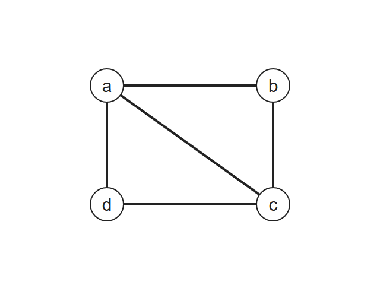
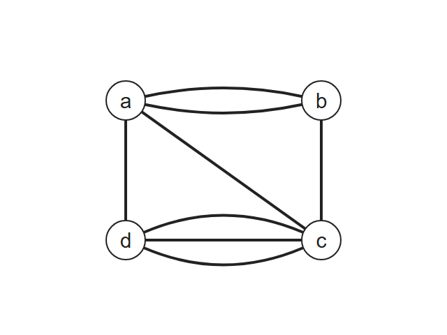
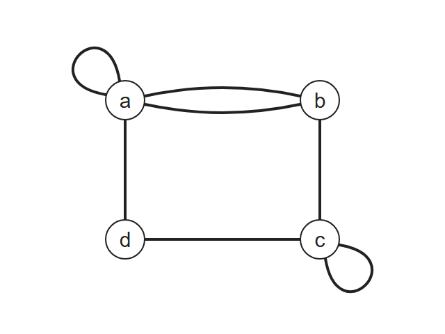
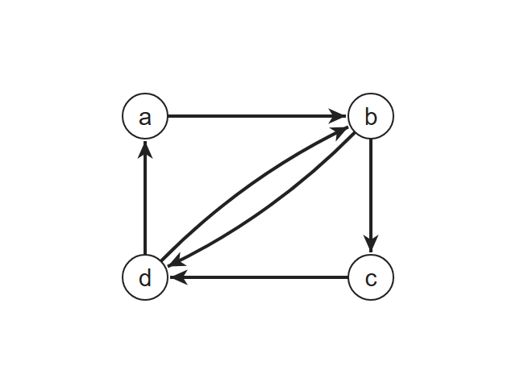
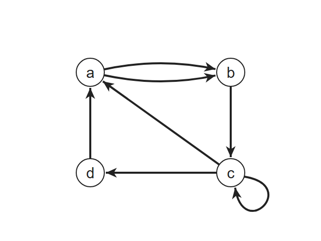
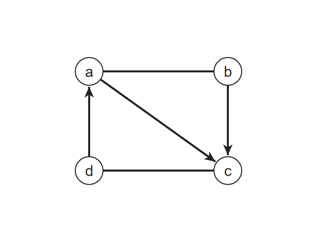

# Discrete Mathematics - Week11: Graphs, Graph Terminology and Representing Graphs

> **วิชา:** Discrete Mathematics | **ผู้สอน:** Dr. Sirasit Lochanachit
> **Source:** `Resources/Books/Discrete Mathematics/DM_Week11.pdf` (55 slides, หัวสไลด์ "Week 12: Graphs Part 1")
> **Source เสริม:** `Resources/References/Graph terminology interactive explorer.md` (Web Clipping — noswolf.github.io/DM_IT)

---

## Part 1: Macro Architecture & Overview

**กราฟ (Graph)** คือโครงสร้างที่ใช้แทน "ความเชื่อมโยงระหว่างวัตถุ" เช่น ความรู้จักกันระหว่างคน, การทำงานร่วมกัน, ลิงก์ระหว่างเว็บไซต์, เครือข่ายคอมพิวเตอร์/อินเทอร์เน็ต, เครือข่ายถนนและรถไฟ บทนี้ปูพื้นตั้งแต่นิยามของกราฟ, ประเภทของกราฟ (จำแนกด้วย 3 คำถาม), ศัพท์ (adjacent, degree, neighborhood), ทฤษฎีบท Handshaking, กราฟพิเศษ (K<sub>n</sub>, C<sub>n</sub>, W<sub>n</sub>, Q<sub>n</sub>, Bipartite) และวิธีแทนกราฟในคอมพิวเตอร์ (Adjacency List / Adjacency Matrix / Incidence Matrix)

ภาพรวมของบท Graphs ทั้งหมด (Chapter Summary):

```text
Graphs (บทกราฟ)
├── 1. Graphs and Graph Models          ← Week11 (โน้ตนี้)
├── 2. Graph Terminology & Special Types ← Week11 (โน้ตนี้)
├── 3. Representing Graphs              ← Week11 (โน้ตนี้)
├── 4. Connectivity                     ← Week12
└── 5. Euler and Hamiltonian Graphs     ← (สัปดาห์ถัดไป)
```

### ตารางเปรียบเทียบประเภทกราฟ (Graph Types Summary)

| Type | Edges | Multiple edges? | Loops? | ตัวอย่างการใช้งาน |
| :--- | :--- | :--- | :--- | :--- |
| Simple graph | Undirected | ❌ | ❌ | เครือข่ายเพื่อน |
| Multigraph | Undirected | ✅ | ❌ | เที่ยวบินหลายเที่ยวระหว่าง 2 เมือง |
| Pseudograph | Undirected | ✅ | ✅ | เส้นทางเดินป่า (มีเส้นวนกลับจุดเดิม) |
| Simple directed graph | Directed | ❌ | ❌ | การ follow ในโซเชียลมีเดีย |
| Directed multigraph | Directed | ✅ | ✅ | สายรถเมล์ |
| Mixed graph | Directed + Undirected | ✅ | ✅ | แผนที่เมือง (ถนนสองทาง + วันเวย์) |

---

## Part 2: Module-by-Module Deep Dive

### 2.1 นิยามของกราฟ (Definition of a Graph)

> **Definition:** กราฟ G ประกอบด้วย V ซึ่งเป็น **เซตไม่ว่างของจุดยอด (vertices / nodes)** และ E ซึ่งเป็น **เซตของเส้นเชื่อม (edges)** เขียนแทนด้วย **G = (V, E)**
> แต่ละ edge เชื่อมจุดยอด 1 หรือ 2 จุด เรียกว่า **endpoints** และกล่าวว่า edge นั้น "connects" endpoints ของมัน

* **Infinite graph:** กราฟที่ vertex set เป็นเซตอนันต์
* **Finite graph:** กราฟที่ vertex set เป็นเซตจำกัด (วิชานี้ศึกษาเป็นหลัก)

**ตัวอย่าง:** กราฟที่มี 4 vertices และ 5 edges

```text
V = {a, b, c, d}
E = {{a, b}, {a, c}, {b, c}, {b, d}, {c, d}}

    a ───── b
     \     /|
      \   / |
       \ /  |
        c ── d
```

| Thai Term | English Term | คำอธิบาย |
| :--- | :--- | :--- |
| จุดยอด | Vertex / Node | สมาชิกของ V |
| เส้นเชื่อม | Edge | สมาชิกของ E |
| จุดปลาย | Endpoints | จุดยอดที่ edge เชื่อมอยู่ |
| วงวน | Loop | edge ที่เชื่อมจุดยอดเข้ากับตัวเอง |
| เส้นเชื่อมขนาน | Multiple / Parallel edges | ≥ 2 edges ที่เชื่อมคู่จุดยอดเดียวกัน |
| เส้นเชื่อมมีทิศ | Directed edge (u, v) | edge ที่เริ่มที่ u และจบที่ v วาดเป็นลูกศร |

---

### 2.2 สามคำถามที่ใช้ตั้งชื่อประเภทกราฟ (Three Questions Name the Type)

จากเอกสาร Interactive Explorer การจำแนกกราฟทำได้ด้วยการถาม 3 ข้อ:

1. Edge เป็นแบบ **undirected**, **directed** หรือ **ทั้งสองแบบ**?
2. อนุญาตให้มี **multiple edges** หรือไม่?
3. อนุญาตให้มี **loops** หรือไม่?

#### Undirected Graphs

**(1) Simple graph** — ทุก edge เชื่อมจุดยอด *ที่ต่างกัน* 2 จุด และไม่มี 2 edges ใดเชื่อมคู่จุดยอดเดียวกัน
* **ตัวอย่าง:** เครือข่ายเพื่อน — สองคนเป็นเพื่อนกันหรือไม่เป็นเท่านั้น



**(2) Multigraph** — อนุญาตให้หลาย edges เชื่อมคู่จุดยอดเดียวกัน ถ้ามี *m* edges เชื่อม u กับ v จะกล่าวว่า {u, v} มี **multiplicity m** แต่ **ไม่มี loop**
* **ตัวอย่าง:** เที่ยวบิน — มีหลายเที่ยวบินระหว่างสองเมืองเดียวกันได้
* **Computer network:** ใช้เมื่อเราสนใจ "จำนวนลิงก์" ระหว่าง data centers



**(3) Pseudograph** — กราฟไม่มีทิศที่ทั่วไปที่สุด อนุญาตทั้ง loops และ multiple edges
* **ตัวอย่าง:** เส้นทางเดินป่า — มีหลายทางเชื่อมสองจุดสังเกต และมีเส้นวงกลมที่กลับมาจุดเริ่ม
* **Computer network:** ใช้เมื่อมี **diagnostic links** (feedback loop) ที่ data center ตัวเอง



#### Directed and Mixed Graphs

> **Definition (Directed graph / Digraph):** G = (V, E) ที่แต่ละ edge สัมพันธ์กับ **คู่อันดับ (ordered pair)** ของจุดยอด — directed edge (u, v) **เริ่มที่ u และจบที่ v**
> กราฟที่ endpoints ไม่มีลำดับ เรียกว่า **undirected graph**

**(4) Simple directed graph** — ทุก edge (u, v) ชี้จาก u ไป v ไม่มี loop และไม่มี multiple directed edges — แต่เนื่องจาก (u, v) กับ (v, u) เป็นคนละ edge จึง **มีทั้งคู่ได้**
* **ตัวอย่าง:** การ follow ในโซเชียลมีเดีย — a follow b ไม่ได้แปลว่า b follow a
* **Computer network:** ใช้ model เครือข่ายที่มีทิศทาง



**(5) Directed multigraph** — กราฟมีทิศที่อาจมีหลาย directed edges จากจุดหนึ่งไปอีกจุด หรือจากจุดหนึ่งกลับหาตัวเอง
* **ตัวอย่าง:** สายรถเมล์ — หลายสายวิ่งจากป้าย a ไปป้าย b และมีสายวงกลมที่จบที่จุดเริ่ม
* **Computer network:** ใช้ model เครือข่ายที่มี **one-way links หลายเส้น**



**(6) Mixed graph** — มีทั้ง directed และ undirected edges, อนุญาต loops และ multiple edges
* **ตัวอย่าง:** แผนที่เมืองที่มีถนนสองทาง (undirected) และถนนวันเวย์ (directed)



> [!TIP]
> **Names nest (ชื่อซ้อนกัน):** Simple graph ทุกอันเป็น multigraph ด้วย (multigraph *อาจ* มี multiple edges แต่ไม่จำเป็นต้องมี) และ multigraph ทุกอันเป็น pseudograph — เวลาจำแนกให้ใช้ **ชื่อที่เฉพาะเจาะจงที่สุด**
>
> **Direction matters:** ใน directed graph, (u, v) และ (v, u) เป็นคนละ edge — การมีทั้งสองเส้น **ไม่นับว่าเป็น multiple edges**

---

### 2.3 แบบฝึกหัด: Graph Models ของเส้นทางการบิน

**Exercise 1:** เที่ยวบินรายวัน: Bangkok→Chiang Mai 4, Chiang Mai→Bangkok 2, Chiang Mai→Krabi 3, Krabi→Chiang Mai 2, Chiang Mai→Loei 1, Loei→Chiang Mai 2, Chiang Mai→Samui 3, Samui→Chiang Mai 2, Samui→Krabi 1

| ข้อ | เงื่อนไขการวาด edge | ประเภทกราฟ |
| :--- | :--- | :--- |
| a) | 1 edge ระหว่างเมืองที่มีเที่ยวบิน (ทิศใดก็ได้) | **Simple graph** |
| b) | 1 edge ต่อ **ทุกเที่ยวบิน** (ไม่สนทิศ) | **Multigraph** (เช่น BKK–CNX มี multiplicity 6) |
| c) | 1 edge จากเมืองต้นทาง → ปลายทาง (ถ้ามีเที่ยวบิน) | **Simple directed graph** |
| d) | 1 edge **ต่อเที่ยวบิน** จากต้นทาง → ปลายทาง | **Directed multigraph** (BKK→CNX 4 เส้น) |

```text
(c) Simple directed graph — CNX เป็น hub

              BKK
               ⇅
   LOE  ⇄    CNX    ⇄  KBV
               ⇅      ↗
              USM ────┘   (USM → KBV ทางเดียว)

(d) Directed multigraph — ใส่จำนวนเส้นตามเที่ยวบิน
   BKK→CNX ×4, CNX→BKK ×2, CNX→KBV ×3, KBV→CNX ×2,
   CNX→LOE ×1, LOE→CNX ×2, CNX→USM ×3, USM→CNX ×2, USM→KBV ×1
```

**การประยุกต์ใช้กราฟอื่นๆ:** Social networks, Communications networks (Call graphs), Information networks (Web pages & links), Software design (Module/Library dependencies), Transportation networks, Biological networks (Species/Protein interaction), Semantic Networks (NLP), Tournaments

---

### 2.4 ศัพท์ของกราฟไม่มีทิศ (Undirected Graph Terminology)

* **Definition 1 — Adjacent (Neighbors):** จุดยอด u, v ใน undirected graph G เรียกว่า **adjacent** (เป็นเพื่อนบ้านกัน) ถ้ามี edge e ระหว่าง u และ v — edge e นั้นเรียกว่า **incident with** u และ v และกล่าวว่า e **connects** u กับ v
* **Definition 2 — Neighborhood:** เซตของเพื่อนบ้านทั้งหมดของ v เขียนแทนด้วย **N(v)** สำหรับเซต A ⊆ V: N(A) = ยูเนียนของ N(v) ทุก v ∈ A
* **Definition 3 — Degree:** **deg(v)** = จำนวน edges ที่ incident กับ v **ยกเว้น loop นับเป็น 2**
  * **Isolated vertex:** deg(v) = 0
  * **Pendant vertex:** deg(v) = 1

**ตัวอย่าง (กราฟใน 2.1):**

| Vertex | N(v) | deg(v) |
| :--- | :--- | :--- |
| a | {b, c} | 2 |
| b | {a, c, d} | 3 |
| c | {a, b, d} | 3 |
| d | {b, c} | 2 |
| **รวม** | | **10 = 2 × 5 edges** ✔ |

---

### 2.5 Handshaking Theorem

> **Theorem 1 (Handshaking Theorem):** ถ้า G = (V, E) เป็น undirected graph ที่มี m edges แล้ว
> $$2m = \sum_{v \in V} \deg(v)$$
> **Proof:** ทุก edge มีส่วนในการนับ degree **2 ครั้ง** (ครั้งละ endpoint — loop ก็นับ 2) ดังนั้นทั้งสองข้างเท่ากับสองเท่าของจำนวน edges

> **Theorem 2:** Undirected graph มีจำนวนจุดยอดที่มี **odd degree เป็นจำนวนคู่เสมอ**
> **Proof:** ให้ V₁ = จุดยอด degree คู่, V₂ = จุดยอด degree คี่ จะได้
> $$2m = \sum_{v \in V_1}\deg(v) + \sum_{v \in V_2}\deg(v)$$
> ผลรวมแรกเป็นเลขคู่ และ 2m เป็นเลขคู่ ⇒ ผลรวมที่สองต้องเป็นเลขคู่ แต่ทุกพจน์เป็นเลขคี่ ⇒ จำนวนพจน์ (|V₂|) ต้องเป็นเลขคู่

#### ตัวอย่างและแบบฝึกหัด (พร้อมเฉลย)

| ข้อ | โจทย์ | วิธีคิด | คำตอบ |
| :--- | :--- | :--- | :--- |
| Ex 1 | 10 vertices แต่ละจุด degree 6 มีกี่ edges? | 2m = 10 × 6 = 60 | **m = 30** |
| Ex 2 | 5 vertices ทุกจุด degree 3 ได้ไหม? | ผลรวม = 15 (คี่) | **ไม่ได้** (ขัด Theorem 1/2) |
| Ex 3 | 4 vertices degree 1, 1, 3, 3 วาด undirected graph ได้ไหม? | ผลรวม = 8 (คู่), odd-degree 4 จุด (คู่) | **ได้** (เป็น multigraph/pseudograph; แต่ simple ไม่ได้ เพราะ 2 จุด degree 3 ต้องต่อกับทุกจุด ทำให้จุด degree 1 กลายเป็น 2) |
| Ex 4 | 4 vertices degree 2, 2, 2, 3? | ผลรวม = 9 (คี่) | **ไม่ได้** |
| Exercise 1 | 4 vertices degree 1, 2, 3, 4 เป็น **simple** graph ได้ไหม? | ผลรวม 10 คู่ แต่ simple graph 4 จุด degree สูงสุด = 3 | **ไม่ได้** |
| Exercise 2 | 8 vertices degree 1,1,2,2,9,1,3,1 เป็น simple graph ได้ไหม? | simple graph 8 จุด degree สูงสุด = 7 แต่มี 9 | **ไม่ได้** |
| Exercise 3 | นักเรียน 15 คน ทุกคนมีเพื่อน **อย่างน้อย** 3 คน ได้ไหม? | *พอดี* 3 คน: 15×3 = 45 คี่ → เป็นไปไม่ได้; แต่ "อย่างน้อย 3" เช่น ทุกคนมีเพื่อน 4 คน: 15×4 = 60 คู่ | **ได้** (แต่ทุกคนมีเพื่อน *พอดี* 3 คนไม่ได้) |
| Exercise 4 | 6 คน จับมือกันทุกคู่ มีกี่ครั้ง? | กราฟ K₆: 2m = 6 × 5 | **m = 15** = C(6,2) |

---

### 2.6 ศัพท์ของกราฟมีทิศ (Directed Graph Terminology)

* **Definition 4:** ถ้า (u, v) เป็น edge ของกราฟมีทิศ กล่าวว่า u **adjacent to** v และ v **adjacent from** u
  * u = **initial vertex**, v = **terminal (end) vertex** ของ (u, v)
  * Loop มี initial vertex และ terminal vertex เป็นจุดเดียวกัน
* **Definition 5:**
  * **In-degree** deg⁻(v) = จำนวน edges ที่มี v เป็น **terminal vertex** (ลูกศรชี้เข้า)
  * **Out-degree** deg⁺(v) = จำนวน edges ที่มี v เป็น **initial vertex** (ลูกศรชี้ออก)
  * Loop ที่ v นับ **+1 ทั้ง in-degree และ out-degree**

**ตัวอย่าง:** ใช้ Directed multigraph ในหัวข้อ 2.2 (a→b ×2, b→c, c→d, d→a, c→a, loop ที่ c)

| Vertex | deg⁻ (in) | deg⁺ (out) |
| :--- | :--- | :--- |
| a | 2 (d→a, c→a) | 2 |
| b | 2 | 1 |
| c | 2 (b→c, loop) | 3 (c→d, c→a, loop) |
| d | 1 | 1 |
| **รวม** | **7** | **7** = \|E\| ✔ |

> **Theorem 3:** ถ้า G = (V, E) เป็นกราฟมีทิศ แล้ว
> $$\sum_{v \in V}\deg^-(v) = \sum_{v \in V}\deg^+(v) = |E|$$
> **Proof:** ทุก edge มี initial vertex 1 จุดและ terminal vertex 1 จุดพอดี

---

### 2.7 กราฟอย่างง่ายแบบพิเศษ (Special Types of Simple Graphs)

| กราฟ | นิยาม | \|V\| | \|E\| | deg |
| :--- | :--- | :--- | :--- | :--- |
| **Complete graph K<sub>n</sub>** | simple graph ที่มี edge **พอดี 1 เส้น** ระหว่างทุกคู่จุดยอด | n | n(n−1)/2 | n−1 ทุกจุด |
| **Cycle C<sub>n</sub>** (n ≥ 3) | v₁,…,vₙ กับ edges {v₁,v₂}, {v₂,v₃}, …, {vₙ₋₁,vₙ}, {vₙ,v₁} | n | n | 2 ทุกจุด |
| **Wheel W<sub>n</sub>** (n ≥ 3) | เพิ่มจุดยอดใหม่ 1 จุดเข้า C<sub>n</sub> แล้วเชื่อมกับทั้ง n จุด | n+1 | 2n | ขอบ 3, ศูนย์กลาง n |
| **n-Cube Q<sub>n</sub>** | จุดยอดแทน bit strings ยาว n ทั้ง 2ⁿ ตัว — adjacent **iff ต่างกันพอดี 1 bit** | 2ⁿ | n·2ⁿ⁻¹ | n ทุกจุด |
| **K<sub>m,n</sub>** | (ดู 2.8) | m+n | m·n | — |

* **Noncomplete graph:** simple graph ที่มีอย่างน้อย 1 คู่จุดยอดที่ไม่มี edge เชื่อม

```text
Q1:  0 ── 1

Q2:  00 ── 01        Q3: เพิ่ม bit หน้าให้ Q2 สองชุด (0xx, 1xx)
      |     |            แล้วเชื่อมจุดที่ตรงกัน → ลูกบาศก์ 8 จุด
     10 ── 11
```

---

### 2.8 กราฟสองส่วน (Bipartite Graphs)

> **Definition 6:** Simple graph เป็น **bipartite** ถ้าแบ่ง V ออกเป็น 2 เซตย่อยที่ไม่มีส่วนร่วม (disjoint) V₁ และ V₂ ได้ โดยทุก edge เชื่อมจุดใน V₁ กับจุดใน V₂ — **ไม่มี edge เชื่อมจุดสองจุดใน V₁ หรือสองจุดใน V₂**

**วิธีทดสอบ (2-Coloring):** ระบายสีจุดยอดด้วย 2 สี โดยจุดที่ adjacent กันต้องต่างสี — ถ้าทำได้ = bipartite
* กราฟเป็น bipartite **iff ไม่มี cycle ความยาวคี่**
* C₆ → bipartite ✅ (สลับสีได้ลงตัว) | K₃ = C₃ → **ไม่** bipartite ❌ (สามเหลี่ยม) | Q<sub>n</sub> → bipartite เสมอ (แบ่งตามจำนวน bit 1 คู่/คี่)

> **Definition 7 (Complete bipartite graph K<sub>m,n</sub>):** bipartite graph ที่ V₁ มี m จุด, V₂ มี n จุด และมี edge **ระหว่างทุกคู่** ที่อยู่ต่างฝั่งกัน

```text
K2,3:   V1:  a     b
             |\ /|\ /|   (a และ b เชื่อมกับ x, y, z ทุกจุด)
        V2:  x   y   z      |E| = 2 × 3 = 6
```

> หมายเหตุ: Example 5–6 และ Exercise 5–6 ในสไลด์เป็นรูปกราฟ — ให้ใช้วิธี 2-Coloring / หา odd cycle ในการตอบ (เนื้อหาต่อเรื่อง Matching อยู่ใน [[Week12 - Bipartite Matching and Graph Connectivity]])

---

### 2.9 การแทนกราฟ (Representing Graphs)

#### Adjacency List
> **Definition 1:** ใช้แทนกราฟที่ **ไม่มี multiple edges** โดยระบุจุดยอดที่ adjacent กับแต่ละจุดยอด

| Vertex | Adjacent vertices (กราฟใน 2.1) |
| :--- | :--- |
| a | b, c |
| b | a, c, d |
| c | a, b, d |
| d | b, c |

สำหรับกราฟมีทิศใช้ **Initial vertex → Terminal vertices**

#### Adjacency Matrix
> **Definition 2:** G = (V, E) เป็น simple graph, |V| = n เรียงจุดยอดเป็น v₁,…,vₙ — **A<sub>G</sub> = [a<sub>ij</sub>]** เป็น n × n zero-one matrix
> $$a_{ij} = \begin{cases} 1 & \text{ถ้า } \{v_i, v_j\} \text{ เป็น edge ของ } G \\ 0 & \text{ถ้าไม่ใช่} \end{cases}$$

```text
      a  b  c  d
  a [ 0  1  1  0 ]
  b [ 1  0  1  1 ]
  c [ 1  1  0  1 ]
  d [ 0  1  1  0 ]
```

* Undirected graph → matrix **สมมาตร** (a<sub>ij</sub> = a<sub>ji</sub>), simple graph → แนวทแยงเป็น 0
* ผลรวมแถว i = deg(v<sub>i</sub>)
* Multigraph/Pseudograph: a<sub>ij</sub> = **จำนวน edges** ระหว่าง v<sub>i</sub>, v<sub>j</sub> (loop ใส่ที่แนวทแยง)
* Directed graph: a<sub>ij</sub> = 1 ถ้ามี (v<sub>i</sub>, v<sub>j</sub>) → **ไม่จำเป็นต้องสมมาตร**

#### Adjacency Matrix vs Adjacency List

| เกณฑ์ | Adjacency Matrix | Adjacency List |
| :--- | :--- | :--- |
| หน่วยความจำ | O(n²) | O(n + m) |
| เหมาะกับ | **Dense graph** (edge เยอะ) | **Sparse graph** (edge น้อย) |
| เช็คว่า u, v adjacent | O(1) | O(deg(u)) |
| ไล่เพื่อนบ้านทั้งหมด | O(n) | O(deg(u)) |

#### Incidence Matrix
> **Definition 3:** G = (V, E) เป็น undirected graph มี vertices v₁,…,vₙ และ edges e₁,…,eₘ — incidence matrix คือ **n × m matrix M = [m<sub>ij</sub>]**
> $$m_{ij} = \begin{cases} 1 & \text{ถ้า edge } e_j \text{ incident กับ } v_i \\ 0 & \text{ถ้าไม่ใช่} \end{cases}$$

```text
ให้ e1={a,b}, e2={a,c}, e3={b,c}, e4={b,d}, e5={c,d}

      e1 e2 e3 e4 e5
  a [ 1  1  0  0  0 ]
  b [ 1  0  1  1  0 ]
  c [ 0  1  1  0  1 ]
  d [ 0  0  0  1  1 ]
```
* แต่ละ **คอลัมน์มี 1 สองตัว** (2 endpoints) — loop มี 1 ตัวเดียว, multiple edges ได้คอลัมน์ซ้ำกัน

---

## Part 3: Quick Reference & Exam Cheat Sheet

### Checklist สรุปหัวใจสำคัญก่อนสอบ
* [ ] **G = (V, E):** V ไม่ว่าง, edge มี 1–2 endpoints
* [ ] **จำแนกกราฟด้วย 3 คำถาม:** ทิศ? multiple edges? loops? → ใช้ชื่อเฉพาะที่สุด
* [ ] **deg(v):** loop นับ 2 (undirected) / นับ 1 ทั้ง in และ out (directed)
* [ ] **Handshaking:** Σdeg = 2m → ผลรวม degree ต้องเป็นเลขคู่
* [ ] **Odd-degree vertices มีจำนวนคู่เสมอ**
* [ ] **Simple graph n จุด:** degree สูงสุด = n − 1
* [ ] **Directed:** Σdeg⁻ = Σdeg⁺ = |E|
* [ ] **K<sub>n</sub>, C<sub>n</sub>, W<sub>n</sub>, Q<sub>n</sub>, K<sub>m,n</sub>:** จำจำนวน vertices/edges
* [ ] **Bipartite:** 2-coloring ได้ ⇔ ไม่มี odd cycle
* [ ] **Adjacency matrix (n×n) vs Incidence matrix (n×m)**

### สรุปสูตร / Notation ที่สำคัญ

| Notation | ความหมาย |
| :--- | :--- |
| `G = (V, E)` | กราฟ |
| `N(v)` | Neighborhood ของ v |
| `deg(v)` | degree (undirected) |
| `deg⁻(v)`, `deg⁺(v)` | in-degree, out-degree |
| `Σ deg(v) = 2m` | Handshaking Theorem |
| `K_n: n(n−1)/2 edges` | Complete graph |
| `C_n: n edges`, `W_n: 2n edges` | Cycle, Wheel |
| `Q_n: 2ⁿ vertices, n·2ⁿ⁻¹ edges` | Hypercube |
| `K_{m,n}: mn edges` | Complete bipartite |

### Concept Map

```text
Graph G = (V, E)
├── Types
│   ├── Undirected: Simple ⊂ Multigraph ⊂ Pseudograph
│   ├── Directed: Simple directed, Directed multigraph
│   └── Mixed
├── Terminology
│   ├── Undirected: adjacent, incident, N(v), deg(v)
│   │   └── Handshaking Theorem → #odd vertices is even
│   └── Directed: initial/terminal, deg⁻, deg⁺ → Σdeg⁻ = Σdeg⁺ = |E|
├── Special Simple Graphs: Kn, Cn, Wn, Qn
│   └── Bipartite → Kmn → (Matching ใน Week12)
└── Representation
    ├── Adjacency List (sparse)
    ├── Adjacency Matrix (dense)
    └── Incidence Matrix (vertex × edge)
```

---

## ⚠️ Common Pitfalls & Exam Traps

* **ลืมนับ loop เป็น 2:** ใน undirected graph loop ทำให้ deg เพิ่ม 2 — แต่ใน directed graph loop เพิ่ม in และ out อย่างละ 1
* **คิดว่า (u, v) กับ (v, u) เป็น multiple edges:** ใน directed graph เป็น **คนละ edge** — simple directed graph มีทั้งคู่ได้
* **ผลรวม degree คู่ = วาด simple graph ได้เสมอ:** ผิด! ต้องเช็ค degree ≤ n − 1 และเงื่อนไขอื่นด้วย (เช่น 1, 2, 3, 4 บน 4 จุด)
* **"อย่างน้อย k" ≠ "พอดี k":** 15 คน เพื่อน *พอดี* 3 คนเป็นไปไม่ได้ แต่ *อย่างน้อย* 3 คนเป็นไปได้
* **ตอบชื่อกราฟกว้างเกินไป:** simple graph เป็น pseudograph ด้วยในทางเทคนิค แต่ต้องตอบชื่อที่ **เฉพาะที่สุด**
* **Wheel W<sub>n</sub> มี n+1 จุด** ไม่ใช่ n จุด และ C<sub>n</sub>, W<sub>n</sub> ต้อง n ≥ 3
* **สับสน Adjacency vs Incidence matrix:** Adjacency = vertex×vertex (สี่เหลี่ยมจัตุรัส), Incidence = vertex×edge

---

## เอกสารเชื่อมโยง (Wiki-Style Backlinks)
* **วิชาและหัวข้อที่เกี่ยวข้อง:**
  * [[Week12 - Bipartite Matching and Graph Connectivity]] (บทต่อเนื่อง — Matching, Hall's Theorem, Paths, Connectivity)
  * [[Week10 - n-ary Relations and Representing Relations]] (Digraph และ zero-one matrix ของ relation คือ directed graph / adjacency matrix)
  * [[Week10 - Properties of Relations]] (Reflexive ↔ loop ทุกจุด, Symmetric ↔ undirected graph / matrix สมมาตร)
  * [[Week10 - Relations and Binary Relations]] (Binary relation บน A ≡ directed graph บน A)

* **แหล่งข้อมูล:**
  * Source: `Resources/Books/Discrete Mathematics/DM_Week11.pdf` (55 slides, Dr. Sirasit Lochanachit)
  * Source: `Resources/References/Graph terminology interactive explorer.md` (Web Clipping, https://noswolf.github.io/DM_IT/Graphs/Graph_terminology_explorer.html)
  * Reference: Rosen, K. H. — *Discrete Mathematics and Its Applications*, Chapter 10 (Graphs)
