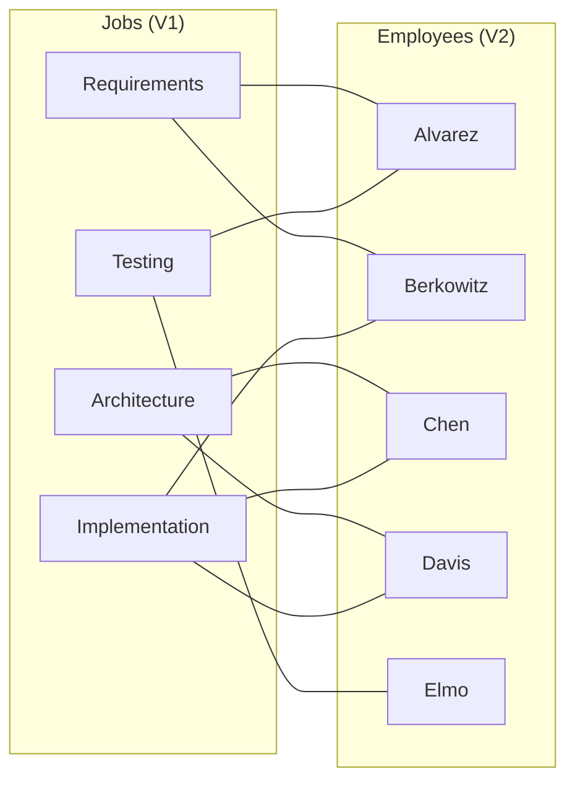
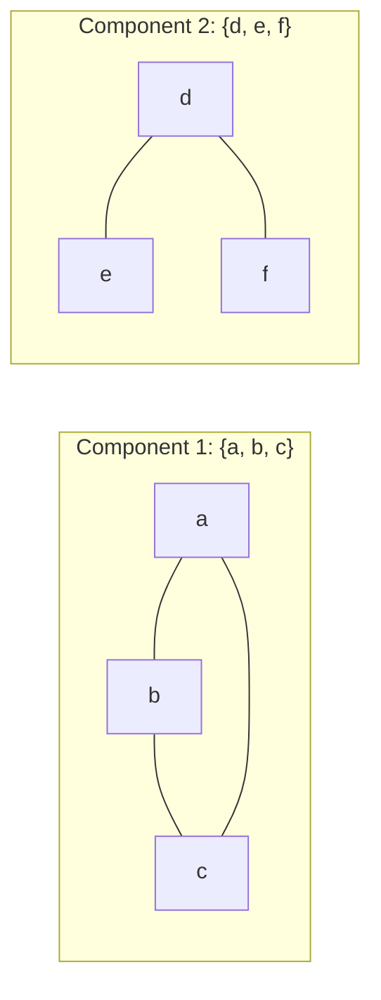
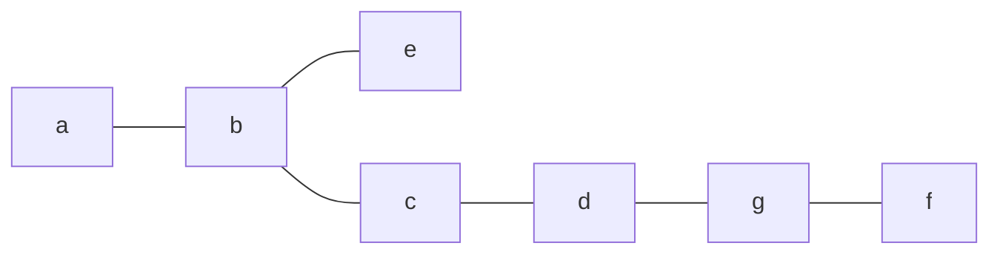

# Discrete Mathematics - Week12: Bipartite Matching and Graph Connectivity

> **วิชา:** Discrete Mathematics | **ผู้สอน:** Dr. Sirasit Lochanachit
> **Source:** `Resources/Books/Discrete Mathematics/DM_Week12.pdf` (51 slides, หัวสไลด์ "Week 13: Graphs Part 2")

---

## Part 1: Macro Architecture & Overview

สัปดาห์นี้ต่อจาก Graphs Part 1 โดยช่วงต้นทบทวน Directed Graph Terminology และ Special Types of Simple Graphs (ดูรายละเอียดใน [[Week11 - Graphs, Graph Terminology and Representing Graphs]]) จากนั้นเข้าสู่เนื้อหาใหม่ 2 เรื่องหลัก: (1) **การจับคู่ในกราฟสองส่วน (Bipartite Matching)** สำหรับโจทย์มอบหมายงาน และ **Hall's Marriage Theorem** และ (2) **ความเชื่อมโยงของกราฟ (Connectivity)** ตั้งแต่ Path, Circuit, Connected Components ไปจนถึง Cut Vertex/Edge และตัววัด κ(G), λ(G) ซึ่งใช้วัด **ความทนทาน (reliability)** ของเครือข่าย

```text
Graphs Part 2
├── ทบทวน: Directed terminology, Kn, Cn, Wn, Qn, Bipartite, Km,n
├── Bipartite Graphs & Matchings
│   ├── Matching → Maximum matching → Complete matching
│   └── Hall's Marriage Theorem: |N(A)| ≥ |A|
└── 4. Connectivity
    ├── Path / Circuit / Simple
    │   └── Six Degrees of Separation, Bacon Number
    ├── Connected / Disconnected / Connected Components
    ├── Cut vertex (articulation point) / Cut edge (bridge)
    ├── Vertex cut → κ(G)  (Vertex connectivity)
    └── Edge cut   → λ(G)  (Edge connectivity)
         └── Applications: Data network, Road network
```

### ตารางเปรียบเทียบตัววัด Connectivity

| Feature | Vertex Connectivity κ(G) | Edge Connectivity λ(G) |
| :--- | :--- | :--- |
| ลบอะไร | จุดยอด (พร้อม edge ที่ติดกัน) | เส้นเชื่อม |
| ชุดที่ลบ | Vertex cut (separating set) | Edge cut |
| ตัวเดียวที่ทำให้ขาด | Cut vertex (articulation point) | Cut edge (bridge) |
| ช่วงค่า (n จุด) | 0 ≤ κ(G) ≤ n − 1 | 0 ≤ λ(G) ≤ n − 1 |
| ค่า 0 เมื่อ | G disconnected | G disconnected หรือมีจุดเดียว |
| ตัวอย่างเครือข่าย | Router เสีย | Link ขาด |

---

## Part 2: Module-by-Module Deep Dive

### 2.1 ทบทวนจาก Part 1 (Review)

* **Directed terminology:** (u, v) → u *adjacent to* v, v *adjacent from* u; u = initial, v = terminal; deg⁻(v) = in-degree, deg⁺(v) = out-degree; loop นับ 1 ทั้งสองฝั่ง
* **Theorem 3:** Σdeg⁻(v) = Σdeg⁺(v) = |E|
* **Special simple graphs:** K<sub>n</sub>, C<sub>n</sub>, W<sub>n</sub>, Q<sub>n</sub>, Bipartite (Definition 6), Complete bipartite K<sub>m,n</sub> (Definition 7)

รายละเอียด นิยาม ตาราง และตัวอย่างทั้งหมดอยู่ใน [[Week11 - Graphs, Graph Terminology and Representing Graphs]]

---

### 2.2 Bipartite Graphs และการจับคู่ (Matchings)

Bipartite graph ใช้ model โจทย์ที่ต้อง **จับคู่สมาชิกของเซตหนึ่งกับอีกเซตหนึ่ง**

**ตัวอย่าง — Job assignments:** มีพนักงาน m คน และงาน n อย่าง (m ≥ n) พนักงานแต่ละคนถูกฝึกให้ทำได้ 1 งานขึ้นไป
* **Task:** มอบหมายพนักงานให้ทุกงาน โดย **ไม่มีพนักงานคนใดได้มากกว่า 1 งาน**
* Model: V₁ = งาน, V₂ = พนักงาน, edge {job, employee} ถ้าพนักงานคนนั้นทำงานนั้นได้


*(ตัวอย่างสไตล์ Rosen เพื่อประกอบการอธิบาย — สไลด์ต้นฉบับเป็นรูปภาพ)*

#### นิยาม

> **Definition 8 — Matching:** Matching M ใน simple graph G = (V, E) คือ **เซตย่อยของ E** ที่ **ไม่มี 2 edges ใด incident กับจุดยอดเดียวกัน**

> **Definition 9 — Maximum matching:** Matching ที่มี **จำนวน edges มากที่สุด**
> → มอบหมายงานให้ได้จำนวนงานมากที่สุด

> **Definition 10 — Complete matching from V₁ to V₂:** Matching M ที่ **ทุกจุดยอดใน V₁ เป็น endpoint ของ edge ใน M** หรือ **|M| = |V₁|**
> → มอบหมายพนักงานให้ **ครบทุกงาน**

**เฉลยตัวอย่างข้างบน:** M = {Requirements–Alvarez, Architecture–Chen, Implementation–Berkowitz, Testing–Elmo} → |M| = 4 = |V₁| จึงเป็นทั้ง **complete matching** และ **maximum matching**

| คำ | ความหมาย | ความสัมพันธ์ |
| :--- | :--- | :--- |
| Matching | ชุด edge ที่ไม่แชร์จุดยอด | — |
| Maximum matching | matching ที่ใหญ่ที่สุด | มีอยู่เสมอ |
| Complete matching (V₁→V₂) | ครอบคลุมทุกจุดใน V₁ | ถ้ามี ⇒ เป็น maximum ด้วย (แต่ maximum ไม่จำเป็นต้อง complete) |

#### Marriages on an Island
มีผู้ชาย m คน (V₁) และผู้หญิง n คน (V₂) บนเกาะ แต่ละคนมีรายชื่อคนต่างเพศที่ยอมรับเป็นคู่ครองได้
* **Maximum matching** = จำนวนคู่แต่งงานที่มากที่สุดที่เป็นไปได้
* **Complete matching ของ V₁** = ผู้ชาย **ทุกคน** ได้แต่งงาน (แต่ผู้หญิงอาจไม่ครบทุกคน)

---

### 2.3 Hall's Marriage Theorem

> **Theorem 4:** Bipartite graph G = (V, E) ที่มี bipartition (V₁, V₂) มี **complete matching จาก V₁ ไป V₂ ก็ต่อเมื่อ (iff)**
> $$|N(A)| \ge |A| \quad \text{สำหรับทุกเซตย่อย } A \subseteq V_1$$

**ความหมายเชิงสัญชาตญาณ:** กลุ่มงานใดๆ k งาน ต้องมีพนักงานที่ทำได้รวมกัน **อย่างน้อย k คน** — ถ้ามีกลุ่มไหนที่ "คนไม่พอ" ก็จับคู่ครบไม่ได้

**ตัวอย่างที่ล้มเหลว:**
```text
V1 = {J1, J2, J3},  N(J1) = {E1}, N(J2) = {E1}, N(J3) = {E2, E3}
A = {J1, J2} → N(A) = {E1} → |N(A)| = 1 < 2 = |A|
⇒ ไม่มี complete matching (J1 กับ J2 แย่ง E1 คนเดียว)
```

---

### 2.4 Paths (เส้นทาง)

**Informal:** Path คือลำดับของ edges ที่เริ่มที่จุดยอดหนึ่ง แล้วเดินจากจุดยอดไปจุดยอดตาม edges ของกราฟ เช่น `Bangkok --- Saraburi --- Korat`
ใช้ model ปัญหาได้มากมาย เช่น การส่งข้อความในเครือข่าย, การวางแผนเส้นทาง

> **Definition 1:** ให้ n เป็นจำนวนเต็มไม่ติดลบ และ G เป็น undirected graph — **path ความยาว n จาก u ไป v** คือลำดับของ n edges e₁,…,eₙ ที่มีลำดับจุดยอด x₀ = u, x₁,…,xₙ₋₁, xₙ = v โดย eᵢ มี endpoints เป็น xᵢ₋₁ และ xᵢ (i = 1,…,n)
> ถ้ากราฟเป็น simple graph เขียน path ด้วยลำดับจุดยอด x₀, x₁,…,xₙ ได้

> **Definition 2:**
> * **Circuit:** path ที่ **เริ่มและจบที่จุดเดียวกัน** (u = v) และมีความยาว > 0
> * **Simple path/circuit:** **ไม่ใช้ edge เดิมซ้ำ**
> * Path/circuit กล่าวว่า **pass through** จุดยอด x₁,…,xₙ₋₁ หรือ **traverse** edges e₁,…,eₙ

**ตัวอย่าง (Path Example ในสไลด์):** กราฟ simple มีจุด a–f

| ลำดับ | ผล | เหตุผล |
| :--- | :--- | :--- |
| a, d, c, f, e | **Simple path** ความยาว 4 | edges {a,d}, {d,c}, {c,f}, {f,e} มีอยู่และไม่ซ้ำ |
| d, e, c, a | **ไม่ใช่ path** | {e, c} ไม่ใช่ edge ของกราฟ |
| b, c, f, e, b | **Simple circuit** ความยาว 4 | เริ่ม-จบที่ b, ไม่มี edge ซ้ำ |
| a, b, e, d, a, b | **Path ความยาว 5 แต่ไม่ simple** | ใช้ edge {a, b} สองครั้ง |

*(ข้อ 2–4 อ้างอิงเฉลยตามรูปกราฟต้นฉบับของ Rosen ที่สไลด์ใช้)*

---

### 2.5 Paths ในกราฟทางสังคม (Acquaintanceship & Collaboration Graphs)

* **Acquaintanceship graph:** มี path ระหว่าง 2 คน ถ้ามี **สายโซ่ของคน** เชื่อมกัน โดยคนที่อยู่ติดกันในโซ่รู้จักกัน
* **Six Degrees of Separation:** นักสังคมศาสตร์คาดว่าคนเกือบทุกคู่บนโลกเชื่อมกันด้วยสายโซ่ไม่เกิน 6 คน → path ระหว่างเกือบทุกคู่จุดยอด **ยาวไม่เกิน 5**
* **Hollywood graph / Bacon Number:** นักแสดง a, b เชื่อมกันถ้ามีโซ่นักแสดงที่คู่ติดกันเคยเล่นหนังเรื่องเดียวกัน
  * **Bacon number** ของนักแสดง c = **ความยาวของ shortest path** ระหว่าง c กับ Kevin Bacon
  * ลองเล่น: https://oracleofbacon.org/graph.php

---

### 2.6 Connectedness in Undirected Graphs

> **Definition 3:** Undirected graph เป็น **connected** ถ้ามี path ระหว่าง **ทุกคู่จุดยอดที่ต่างกัน** — ถ้าไม่ใช่ เรียกว่า **disconnected**

* **Disconnect a graph:** การลบ vertices หรือ edges (หรือทั้งคู่) จนได้ subgraph ที่ disconnected
* ตัวอย่าง: คอมพิวเตอร์ 2 เครื่องใดๆ ในเครือข่ายสื่อสารกันได้ **iff กราฟ connected**

> **Definition 4 — Connected component:** connected subgraph ของ G ที่ **ไม่เป็น proper subgraph ของ connected subgraph อื่น** ของ G (คือ "ก้อนที่เชื่อมกันแบบใหญ่สุด")
> กราฟที่ไม่ connected มี connected components ตั้งแต่ 2 ก้อนขึ้นไป ซึ่ง **disjoint กัน** และยูเนียนกันได้ G



---

### 2.7 Cut Vertices และ Cut Edges

ถ้ากราฟแทนเครือข่ายคอมพิวเตอร์ กราฟ connected = ทุกเครื่องสื่อสารกันได้

> **Definition 5:**
> * **Cut vertex (articulation point):** จุดยอดที่เมื่อลบออก (พร้อม incident edges) แล้วได้ subgraph ที่มี **connected components มากขึ้น** — ตัวอย่างจริง: **Router**
> * **Cut edge (bridge):** edge ที่เมื่อลบออกแล้วได้ components มากขึ้น — ตัวอย่างจริง: **Link**


> **Cut Vertex:** จุด `b` (เมื่อลบจุด `b` จะทำให้กราฟแยกขาดเป็นหลายส่วน)<br>
> **Cut Edges:** เส้น `{a, b}` และ `{b, e}`

* **Complete graph K<sub>n</sub> (n ≥ 3):** ลบจุดยอดใดก็ได้ K<sub>n−1</sub> ซึ่งยัง connected → **K<sub>n</sub> ไม่มี cut vertex**

---

### 2.8 Vertex Cut และ Vertex Connectivity κ(G)

> **Definition 6 — Vertex cut (separating set):** เซตย่อย V′ ⊆ V ที่ทำให้ **G − V′ disconnected** (เช่น {b, c, e} เป็น vertex cut ขนาด 3 ในกราฟตัวอย่างของสไลด์)

> **Definition 7 — Vertex connectivity κ(G):** ของ noncomplete graph = **จำนวนจุดยอดน้อยที่สุดใน vertex cut**
> * Complete graph ไม่มี vertex cut (ลบเท่าไรก็ยังเป็น complete) จึงกำหนด **κ(K<sub>n</sub>) = n − 1** (จำนวนจุดที่ต้องลบให้เหลือจุดเดียว)

**สรุปสำหรับทุกกราฟ:** κ(G) = จำนวนจุดยอดน้อยสุดที่ลบแล้วทำให้ G **disconnected หรือเหลือจุดเดียว**
* ถ้า G มี n จุด: **0 ≤ κ(G) ≤ n − 1**
* **κ(G) = 0 iff G disconnected**
* κ(G) ยิ่งมาก → G ยิ่ง "เชื่อมแน่น"
* มี cut vertex ⇔ κ(G) = 1 (สำหรับกราฟ connected ที่ไม่ใช่ K₂)
* **k-connected:** κ(G) ≥ k

| กราฟ | κ(G) | เหตุผล |
| :--- | :--- | :--- |
| Path / Tree (≥3 จุด) | 1 | มี cut vertex |
| C<sub>n</sub> | 2 | ต้องลบ 2 จุดถึงขาด |
| W<sub>n</sub> | 3 | ลบศูนย์กลาง + 2 จุดบนวง |
| K<sub>n</sub> | n − 1 | ตามนิยาม |
| K<sub>m,n</sub> | min(m, n) | ลบฝั่งที่เล็กกว่าทั้งหมด |

---

### 2.9 Edge Cut และ Edge Connectivity λ(G)

> **Definition 8:** วัด connectivity ของกราฟ connected ด้วย **จำนวน edges น้อยที่สุด** ที่ต้องลบเพื่อให้ disconnected
> * ถ้ามี cut edge → ลบเส้นเดียวพอ
> * ถ้าไม่มี → หาชุด edges ที่เล็กที่สุด
> * **Edge cut:** เซต E′ ที่ทำให้ **G − E′ disconnected**

**Edge connectivity λ(G)** = จำนวน edges น้อยที่สุดใน edge cut ของ G
* **λ(G) = 0** ถ้า G ไม่ connected **หรือ** G มีจุดยอดเดียว
* ถ้า G มี n จุด: **0 ≤ λ(G) ≤ n − 1**
* ความรู้เสริม (Whitney's inequality): **κ(G) ≤ λ(G) ≤ min deg(v)**

| กราฟ | λ(G) |
| :--- | :--- |
| Tree | 1 (ทุก edge เป็น bridge) |
| C<sub>n</sub> | 2 |
| W<sub>n</sub> | 3 |
| K<sub>n</sub> | n − 1 |

---

### 2.10 การประยุกต์ใช้ Vertex/Edge Connectivity

Graph connectivity มีบทบาทสำคัญต่อ **ความน่าเชื่อถือของเครือข่าย (reliability of networks)**
* **Data network:** vertices = routers, edges = links → κ(G) บอกว่าต้อง router เสียกี่ตัวเครือข่ายถึงขาด, λ(G) บอกว่าต้องสายขาดกี่เส้น
* **Road network:** vertices = ทางแยก, edges = ถนนระหว่างทางแยก → cut edge = ถนนที่ถ้าปิดแล้วบางพื้นที่ไปไม่ถึง

---

## Part 3: Quick Reference & Exam Cheat Sheet

### Checklist สรุปหัวใจสำคัญก่อนสอบ
* [ ] **Matching:** ชุด edge ที่ไม่มีจุดยอดร่วม
* [ ] **Maximum vs Complete matching:** ใหญ่สุด vs ครอบคลุมทุกจุดใน V₁ (|M| = |V₁|)
* [ ] **Hall's Theorem:** complete matching V₁→V₂ ⇔ |N(A)| ≥ |A| ทุก A ⊆ V₁
* [ ] **Path ยาว n = n edges** (ไม่ใช่ n จุด)
* [ ] **Circuit:** เริ่ม = จบ, ยาว > 0 | **Simple:** ไม่ใช้ edge ซ้ำ
* [ ] **Connected component:** ก้อน connected ที่ใหญ่สุด, disjoint, ยูเนียน = G
* [ ] **Cut vertex = articulation point, Cut edge = bridge**
* [ ] **κ(K<sub>n</sub>) = n − 1**, κ(G) = 0 ⇔ disconnected
* [ ] **λ(G) = 0** ถ้า disconnected หรือมีจุดเดียว
* [ ] **κ(G) ≤ λ(G) ≤ min deg(v)**

### สรุปสูตร / Notation ที่สำคัญ

#### 1. Bipartite Matching & Hall's Theorem

| สัญลักษณ์ / สูตร | ความหมาย / เงื่อนไข | ตัวอย่าง / คำอธิบาย |
| :--- | :--- | :--- |
| $M \subseteq E$ | **Matching** | เซตของ edges ที่ไม่มี 2 เส้นใดแชร์จุดยอดร่วมกัน |
| $\lvert M \rvert = \lvert V_1 \rvert$ | **Complete Matching** (จาก $V_1 \to V_2$) | ทุกจุดยอดใน $V_1$ เป็นจุดปลายของ edge ใน $M$ |
| $\lvert N(A) \rvert \ge \lvert A \rvert, \; \forall A \subseteq V_1$ | **Hall's Marriage Condition** | เงื่อนไขจำเป็นและพอเพียงให้มี Complete Matching จาก $V_1 \to V_2$ |
| $N(A) = \bigcup_{v \in A} N(v)$ | **Neighborhood ของเซต $A$** | เซตของจุดยอดทั้งหมดใน $V_2$ ที่เชื่อมกับอย่างน้อย 1 จุดใน $A$ |

#### 2. Paths, Circuits & Subgraphs

| สัญลักษณ์ / มโนทัศน์ | นิยาม / กฎสำคัญ | หมายเหตุ |
| :--- | :--- | :--- |
| $\text{Length of path} = n$ | ลำดับ edges $e_1, e_2, \dots, e_n$ (มีจุดยอด $n+1$ จุด) | **ความยาวคิดจากจำนวน edge เสมอ** |
| Circuit | Path ที่จุดเริ่มต้น = จุดสิ้นสุด ($x_0 = x_n$) และยาว $> 0$ | วงปิด |
| Simple Path / Circuit | Path หรือ Circuit ที่ **ไม่ใช้ edge ซ้ำ** | อาจผ่านจุดยอดเดิมได้ถ้าเป็น Circuit |
| $G - V'$ | Subgraph ที่ลบเซตจุดยอด $V'$ และ **incident edges ทั้งหมด** | ใช้หา Vertex Cut |
| $G - E'$ | Subgraph ที่ลบเฉพาะเซตเส้นเชื่อม $E'$ (จุดยอดอยู่ครบ) | ใช้หา Edge Cut |

#### 3. Graph Connectivity & Invariant Bounds

| สัญลักษณ์ / สูตร | ขอบเขต / ค่าเฉพาะ | ความหมาย |
| :--- | :--- | :--- |
| $\kappa(G)$ | $0 \le \kappa(G) \le n - 1$ | **Vertex Connectivity:** จำนวนจุดยอดน้อยสุดใน Vertex Cut ที่ลบแล้วหลุด |
| $\kappa(K_n) = n - 1$ | ค่าเฉพาะของ Complete Graph | ลบจนเหลือจุดเดียว ($K_1$) เพราะไม่มี separating set |
| $\kappa(G) = 0$ | $\iff G \text{ disconnected}$ | กราฟไม่เชื่อมต่อกัน |
| $\lambda(G)$ | $0 \le \lambda(G) \le n - 1$ | **Edge Connectivity:** จำนวนเส้นเชื่อมน้อยสุดใน Edge Cut ที่ลบแล้วหลุด |
| $\lambda(G) = 0$ | $\iff G \text{ disconnected หรือ } \lvert V \rvert = 1$ | กราฟไม่เชื่อมต่อ หรือเป็นจุดเดี่ยว |
| $\kappa(G) \le \lambda(G) \le \min_{v \in V} \deg(v)$ | **Whitney's Inequality** | อสมการความสัมพันธ์ระหว่าง Vertex/Edge Connectivity กับ Degree ต่ำสุด |

#### 4. ตารางเปรียบเทียบค่า $\kappa(G)$ และ $\lambda(G)$ ในกราฟมาตรฐาน

| กราฟมาตรฐาน $G$ | $\kappa(G)$ (Vertex Cut ขั้นต่ำ) | $\lambda(G)$ (Edge Cut ขั้นต่ำ) | $\min \deg(v)$ |
| :--- | :--- | :--- | :--- |
| **Complete Graph $K_n$** | $n - 1$ | $n - 1$ | $n - 1$ |
| **Cycle $C_n$ ($n \ge 3$)** | $2$ | $2$ | $2$ |
| **Wheel $W_n$ ($n \ge 3$)** | $3$ (ลบจุดศูนย์กลาง + 2 จุดบนวง) | $3$ | $3$ |
| **Tree / Path ($n \ge 3$)** | $1$ (มี Cut Vertex) | $1$ (มี Cut Edge / Bridge) | $1$ |
| **Complete Bipartite $K_{m,n}$** | $\min(m, n)$ | $\min(m, n)$ | $\min(m, n)$ |
| **$n$-Cube $Q_n$** | $n$ | $n$ | $n$ |

### Concept Map

```text
Graphs Part 2
├── Bipartite (V1, V2)
│   └── Matching ⊆ E
│       ├── Maximum matching (|M| สูงสุด)
│       └── Complete matching (|M| = |V1|)
│           └── Hall: ∀A⊆V1, |N(A)| ≥ |A|
└── Connectivity
    ├── Path (length = #edges) → Circuit → Simple
    ├── Connected / Disconnected → Components
    ├── ลบจุดยอด: Cut vertex → Vertex cut → κ(G)
    └── ลบเส้น:  Cut edge (bridge) → Edge cut → λ(G)
        └── κ(G) ≤ λ(G) ≤ min deg(v)
```

---

## ⚠️ Common Pitfalls & Exam Traps

* **นับความยาว path เป็นจำนวนจุดยอด:** ความยาว = **จำนวน edges** — path a, d, c, f, e ยาว 4 ไม่ใช่ 5
* **คิดว่า maximum matching ต้องเป็น complete matching:** ไม่จริง — complete ⇒ maximum แต่กลับกันไม่จำเป็น (เช่น งานบางงานไม่มีใครทำได้)
* **ตรวจ Hall's condition แค่ A ที่มีสมาชิกตัวเดียว:** ต้องตรวจ **ทุกเซตย่อย** A ⊆ V₁ — ปัญหามักเกิดกับ A ขนาด 2 ขึ้นไป
* **Circuit ที่ใช้ edge ซ้ำยังเป็น circuit:** แค่ไม่ใช่ *simple* circuit
* **คิดว่า K<sub>n</sub> มี vertex cut:** K<sub>n</sub> ไม่มี vertex cut จึงต้อง *กำหนด* κ(K<sub>n</sub>) = n − 1
* **ลืมกรณี λ(G) = 0 ของกราฟจุดเดียว:** กราฟจุดเดียวถือว่า connected แต่ λ = 0 ตามนิยาม
* **สับสน cut vertex กับ vertex cut:** cut vertex = **จุดเดียว**, vertex cut = **เซตของจุด** ที่ลบแล้วขาด

---

## เอกสารเชื่อมโยง (Wiki-Style Backlinks)
* **วิชาและหัวข้อที่เกี่ยวข้อง:**
  * [[Week11 - Graphs, Graph Terminology and Representing Graphs]] (พื้นฐาน — นิยามกราฟ, degree, N(v), Bipartite, K<sub>m,n</sub> ที่ใช้ในบทนี้)
  * [[Week10 - Properties of Relations]] (Connectivity relation / transitive closure สัมพันธ์กับการมี path ระหว่างจุดยอด)
  * [[Week10 - n-ary Relations and Representing Relations]] (การแทน relation ด้วย digraph — พื้นฐานของ path ในกราฟมีทิศ)

* **แหล่งข้อมูล:**
  * Source: `Resources/Books/Discrete Mathematics/DM_Week12.pdf` (51 slides, Dr. Sirasit Lochanachit)
  * Reference: Rosen, K. H. — *Discrete Mathematics and Its Applications*, Sections 10.2 & 10.4
  * Reference: https://oracleofbacon.org/graph.php (Bacon Number)
