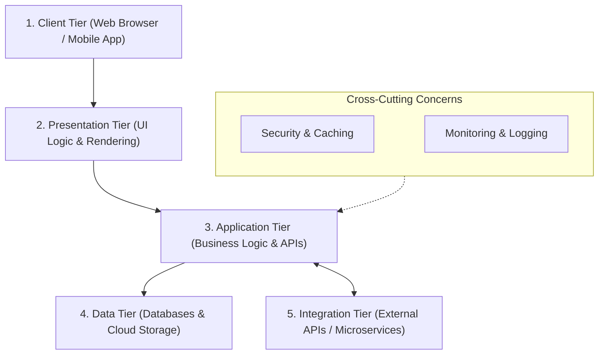
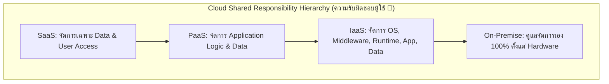

# ISAD - Unit 08: Architecture Design

> **วิชา:** 06066304 Information System Analysis and Design | **สถาบัน:** KMITL (King Mongkut's Institute of Technology Ladkrabang)
> **อาจารย์:** Asst. Prof. Manop Phankokkruad, Ph.D.
> **Source:** `Resources/Books/Information System Analysis and Design/ISAD2026-UNIT08-Architecture Design-v1.pdf` (39 slides)

---

## Part 1: Macro Architecture & Overview

**Architecture Design** คือกระบวนการวางแผนว่าระบบจะถูกกระจาย (Distribute) ไปบน Hardware อย่างไร รวมถึงกำหนด Operating System, Application Software และ Hardware ที่แต่ละเครื่องจะใช้ เป็นหนึ่งใน Output สำคัญของ Design Phase ใน SDLC

จุดเริ่มต้นของ Architecture Design คือ **Non-Functional Requirements** ที่รวบรวมมาตั้งแต่ช่วง Analysis Phase และ Output ของ Architecture Design คือ **Hardware and Software Specification** ซึ่งเป็นเอกสารระบุว่าต้องใช้ Hardware และ Software อะไรบ้างเพื่อรองรับระบบ

```text
SDLC — Design Phase Focus
─────────────────────────────────────────────────────
  Non-Functional Requirements (จาก Analysis Phase)
               │
               ▼
        Architecture Design
         ├── Application Architecture
         │     ├── 3 Software Layers
         │     └── Client-Server Architecture (2/3/N-Tier)
         ├── Advanced Configs
         │     ├── Virtualization
         │     └── Cloud Computing (IaaS / PaaS / SaaS)
         └── Guided by Non-Functional Requirements
               ├── Operational
               ├── Performance
               ├── Security
               └── Cultural & Political
               │
               ▼
     Hardware & Software Specification
       (Document ส่งต่อให้ทีม Implementation)
─────────────────────────────────────────────────────
```

### ตารางเปรียบเทียบ Client-Server Architecture Tiers

| Tier | ชั้น | Presentation Layer | Application Layer | Data Layer | เหมาะกับ |
| :--- | :--- | :--- | :--- | :--- | :--- |
| **Two-Tier** | 2 | Client | — (รวมอยู่ใน Server) | Server | ระบบเล็ก ตรงไปตรงมา |
| **Three-Tier** | 3 | Client | Middleware/API Server | DB Server | ระบบองค์กรทั่วไป |
| **N-Tier** | 4+ | Client + Presentation | Application + Integration | Data + Security/Cache | ระบบซับซ้อน Scale ใหญ่ |

---

## Part 2: Module-by-Module Deep Dive

### 2.1 Elements of an Architecture Design

#### 3 Software Layers (ชั้นซอฟต์แวร์พื้นฐาน)

ระบบซอฟต์แวร์ทุกระบบแบ่งออกเป็น 3 ชั้นพื้นฐาน:

| Layer | หน้าที่ | ตัวอย่าง |
| :--- | :--- | :--- |
| **Presentation Layer** | แสดงผลและรับ Input จากผู้ใช้ (UI Logic) | Web Browser, Mobile App UI |
| **Application Layer** | ประมวลผล Business Logic, APIs | Application Server, REST API |
| **Data Layer** | จัดเก็บและเข้าถึงข้อมูล (Data Storage + Data Access Logic) | Database Server, File Storage |

#### 3 Hardware Components หลัก

| Component | บทบาท | ตัวอย่าง |
| :--- | :--- | :--- |
| **Client Computers** | สร้าง GUI ให้ผู้ใช้โต้ตอบกับระบบ | PC, Laptop, Tablet, Smartphone |
| **Servers** | ให้บริการ Resources, Services, และข้อมูลแก่ Client | Web Server, DB Server, App Server |
| **Networks** | เชื่อมต่อ, สื่อสาร, แชร์ Resource ระหว่างอุปกรณ์ | LAN, Internet, Cloud Network |

---

### 2.2 Client-Server Architectures

> **Client-Server Architecture** ประกอบด้วย 2 ส่วนหลัก:
> - **Client** — โต้ตอบกับผู้ใช้, ส่ง Request ไปยัง Server
> - **Server** — ประมวลผล Request, จัดการ Resource, ส่ง Response กลับ

#### ข้อดีของ Client-Server Architecture

- **Scalable** — สามารถเพิ่ม Client หรือ Server ได้ตามความต้องการ
- **รองรับ Client/Server หลายประเภท** — ผ่าน Middleware
- **3 Layer เป็นอิสระต่อกัน** — Presentation, Application, Data แยกออกจากกัน
- **Fault Isolation** — ถ้า Server เสีย จะกระทบเฉพาะแอปที่ใช้ Server นั้น

> ⚠️ **ข้อจำกัดหลัก:** Client-Server Architecture มีความซับซ้อนสูง (Complexity)

---

#### Two-Tier Architecture

รูปแบบที่ **ง่ายที่สุด** — Client คุยกับ Server โดยตรง ไม่มี Middleware

```text
Two-Tier Architecture
──────────────────────────────────────
  Tier 1: CLIENT (Presentation Layer)
    ├── Front-end interface ที่ผู้ใช้โต้ตอบ
    ├── จัดการ Input/Output
    └── ส่ง Request ไปยัง Server
              │
              ▼  (Direct Connection)
  Tier 2: SERVER (Data Layer)
    ├── Back-end ประมวลผล Request
    ├── มี Business Logic + Database รวมกัน
    └── ส่ง Response กลับ
──────────────────────────────────────
ตัวอย่าง: Web Browser ↔ Database Server
```

---

#### Three-Tier Architecture

เพิ่ม **Application Layer (Middleware)** ระหว่าง Client กับ DB Server

```text
Three-Tier Architecture
──────────────────────────────────────────────
  Tier 1: CLIENT (Presentation Layer)
    └── Web/Mobile UI ส่ง Request และแสดงผล
              │
              ▼
  Tier 2: APPLICATION SERVER (Application Layer)
    ├── Business Logic, APIs, Processing
    └── เป็นตัวกลางระหว่าง Client กับ Database
              │
              ▼
  Tier 3: DATABASE SERVER (Data Layer)
    └── SQL/NoSQL Database จัดการข้อมูล
──────────────────────────────────────────────
เหมาะกับ: ระบบองค์กรส่วนใหญ่
```

---

#### N-Tier Architecture

แบ่งระบบออกเป็น **หลาย Layer** เพื่อรองรับความซับซ้อน, Scalability, และความปลอดภัย



---

### 2.3 Advances in Architecture Configurations

#### A. Virtualization

> **Virtualization** คือการสร้าง Virtual Device หรือ Resource เสมือน เพื่อใช้งาน Physical Hardware ได้อย่างมีประสิทธิภาพมากขึ้น

| ประเภท | ความหมาย |
| :--- | :--- |
| **Server Virtualization** | แบ่ง Physical Server เดียวออกเป็น Virtual Server หลายตัว |
| **Storage Virtualization** | รวม Network Storage หลายตัวให้ดูเหมือนเป็น Storage เดียว |

---

#### B. Cloud Computing

> **Cloud Computing** คือการให้บริการ Computing Resources (Infrastructure, Platform, Software) ผ่าน Remote Servers และ Network โดยสามารถเข้าถึงได้จากทุกที่ ทุกเวลา

##### Cloud Service Models (3 รูปแบบบริการ)

| Model | ย่อว่า | สิ่งที่ให้บริการ | ใครเหมาะใช้ |
| :--- | :--- | :--- | :--- |
| **Infrastructure-as-a-Service** | **IaaS** | Physical/Virtual Servers, Storage, Networking — รากฐานพื้นฐาน | บริษัทที่ต้องการควบคุมทุกอย่างด้วยตนเองและมีทีม IT เชี่ยวชาญ |
| **Platform-as-a-Service** | **PaaS** | IaaS + Middleware, DB, OS, Dev Tools — แพลตฟอร์มสำหรับพัฒนา | Developer ที่ต้องการ Platform สำเร็จรูปโดยไม่ต้องจัดการ Infrastructure |
| **Software-as-a-Service** | **SaaS** | Application สำเร็จรูป เข้าถึงผ่าน Web Browser/App | ผู้ใช้ทั่วไปที่ต้องการแค่ซอฟต์แวร์ ไม่สนใจ Infrastructure |



##### Cloud Deployment Models (3 รูปแบบการ Deploy)

| Model | ลักษณะ | ข้อดี |
| :--- | :--- | :--- |
| **Private Cloud** | ใช้เฉพาะองค์กรเดียว จัดการภายในหรือจ้าง 3rd Party | ปลอดภัยสูง ควบคุมได้เต็มที่ |
| **Public Cloud** | ให้บริการผ่าน Internet สาธารณะ (จ่ายตามใช้ หรือฟรี) | ต้นทุนต่ำ ยืดหยุ่นสูง |
| **Hybrid Cloud** | ผสม Public Cloud + Private Cloud/On-Premise | สมดุลระหว่างความปลอดภัยและความยืดหยุ่น |

---

### 2.4 Creating an Architecture Design

> Architecture Design เริ่มต้นจาก **Non-Functional Requirements** ที่ถูก Refine ให้ละเอียดขึ้น จากนั้นนำมาใช้ออกแบบสถาปัตยกรรมและพัฒนา Hardware/Software Specification

#### Non-Functional Requirements — 4 ประเภท

**Non-Functional Requirements** คือคุณลักษณะของระบบที่ **ไม่ใช่** สิ่งที่ระบบต้องทำ (ไม่ใช่ Functional) แต่เป็นลักษณะที่ระบบต้องมี

| ประเภท | นิยาม | ตัวอย่าง |
| :--- | :--- | :--- |
| **Operational** | สภาพแวดล้อมทางกายภาพและเทคนิคที่ระบบต้องทำงาน | "ระบบสามารถทำงานบน Handheld Device ได้" / "ต้อง Integrate กับระบบ Inventory เดิม" |
| **Performance** | ความเร็ว, Capacity, และ Reliability ของระบบ | "การโต้ตอบระหว่าง User กับระบบต้องไม่เกิน 2 วินาที" / "Download Parameter ใหม่ภายใน 5 นาที" |
| **Security** | การควบคุมการเข้าถึงระบบ | "เฉพาะ Manager โดยตรงเท่านั้นที่ดูข้อมูลพนักงานได้" / "ลูกค้าดูประวัติคำสั่งซื้อได้เฉพาะในเวลาทำการ" |
| **Cultural & Political** | ปัจจัยทางวัฒนธรรม, การเมือง, และกฎหมาย | "ข้อมูลส่วนตัวต้องได้รับการคุ้มครองตาม Data Protection Act" |

---

### 2.5 Hardware & Software Specification

> **Hardware and Software Specification** คือเอกสารที่อธิบายว่าต้องใช้ Hardware และ Software อะไรบ้างเพื่อรองรับระบบที่ออกแบบ

#### ขั้นตอนการสร้าง Specification

```text
ขั้นตอนที่ 1: กำหนด SOFTWARE ก่อน
  ├── ระบุ Operating System และซอฟต์แวร์เฉพาะทาง
  └── พิจารณาค่าใช้จ่ายเพิ่มเติม: Training, Warranty,
      Maintenance, Licensing Agreements

ขั้นตอนที่ 2: สร้างรายการ HARDWARE ที่ต้องการ
  └── Database Servers, Network Servers, Peripheral Devices,
      Clients, Backup Devices, Storage Components, ฯลฯ

ขั้นตอนที่ 3: ระบุ MINIMUM REQUIREMENTS ของแต่ละ Hardware
  └── ตัวอย่าง Web Server Spec:
      ├── CPU: 2.4-GHz 64-bit processor, Compatible x64
      ├── RAM: 32 GB (Server Core) / 32 GB (Desktop Experience)
      ├── Storage: 16 TB
      └── Network: Ethernet ≥ 1 Gbps, PCI Express compliant
```

#### ตัวอย่าง Web Server Scale Specification

| ขนาด | Disk Cache | CPU Cores | RAM | API Requests (7 วัน) |
| :--- | :--- | :--- | :--- | :--- |
| **Small** | 500 GB | 8 cores | 16 GB | 2 ล้าน |
| **Medium** | 4 TB | 12 cores | 32 GB | 6 ล้าน |
| **Large** | 100 TB | 16 cores | 64 GB | 12 ล้าน |

#### 6 ปัจจัยในการเลือก Hardware & Software

| ปัจจัย | คำถามที่ต้องตอบ | ตัวอย่าง |
| :--- | :--- | :--- |
| **1. Functions & Features** | ต้องการฟีเจอร์เฉพาะอะไร? | ขนาดหน้าจอ, ฟีเจอร์ของซอฟต์แวร์ |
| **2. Performance** | Hardware/Software ทำงานได้เร็วแค่ไหน? | ความเร็ว Processor, DB Writes/sec |
| **3. Legacy Systems** | ทำงานร่วมกับระบบเก่าได้ไหม? | เขียนข้อมูลเข้า Database เดิมได้ไหม? |
| **4. Hardware & OS Strategy** | แผน Migration ในอนาคตคืออะไร? | เป้าหมายใช้ Hardware ของ Vendor เดียว |
| **5. Cost of Ownership** | มีค่าใช้จ่ายอื่นนอกจากราคาซื้อ? | License, Maintenance รายปี, Training, Salary |
| **6. Vendor Performance** | Vendor มีชื่อเสียงและอนาคตดีไหม? | ประวัติการซัพพอร์ต, ความมั่นคงของบริษัท |

---

## Part 3: Quick Reference & Exam Cheat Sheet

### Checklist สรุปหัวใจสำคัญก่อนสอบ

- [ ] **Architecture Design:** วางแผนการกระจาย Software ไปบน Hardware — เริ่มจาก Non-Functional Requirements
- [ ] **3 Software Layers:** Presentation → Application → Data (จำ Top-Down)
- [ ] **3 Hardware Components:** Client / Server / Network
- [ ] **Two-Tier:** Client คุยกับ Server โดยตรง — ง่าย แต่ Business Logic อยู่ใน Server ทั้งหมด
- [ ] **Three-Tier:** Client → App Server (Middleware) → DB Server — แยก Business Logic ออกมา
- [ ] **N-Tier:** หลาย Layer เพิ่ม Security, Caching, Monitoring — ซับซ้อนแต่ Scale ได้ดี
- [ ] **Virtualization:** แบ่ง Physical Server → หลาย Virtual Server / รวม Storage หลายตัว → เป็น Storage เดียว
- [ ] **Cloud Models (IaaS/PaaS/SaaS):** IaaS = Infrastructure, PaaS = Platform + Dev Tools, SaaS = Application สำเร็จรูป
- [ ] **Cloud Deployment:** Private (ปลอดภัย) / Public (ถูก ยืดหยุ่น) / Hybrid (ผสม)
- [ ] **4 Non-Functional Req.:** Operational / Performance / Security / Cultural & Political
- [ ] **Hardware Spec Process:** Software ก่อน → รายการ Hardware → Minimum Requirements
- [ ] **6 ปัจจัยเลือก H/W S/W:** Functions, Performance, Legacy, OS Strategy, Cost of Ownership, Vendor

### สรุปเปรียบเทียบ Cloud Service Models

| | IaaS | PaaS | SaaS |
| :--- | :--- | :--- | :--- |
| ผู้ใช้ควบคุม | มากที่สุด | ปานกลาง | น้อยที่สุด |
| ต้องการทักษะ IT | สูงมาก | ปานกลาง | ต่ำ |
| ตัวอย่าง | AWS EC2, GCP Compute | Heroku, Google App Engine | Gmail, Salesforce, Dropbox |

### Concept Map

```text
Architecture Design (Unit 08)
├── 1. Elements
│     ├── Software Layers: Presentation → Application → Data
│     └── Hardware: Client / Server / Network
│
├── 2. Client-Server Architecture
│     ├── Two-Tier (Client ↔ Server)
│     ├── Three-Tier (Client ↔ App Server ↔ DB)
│     └── N-Tier (Client ↔ multiple layers ↔ DB)
│
├── 3. Advanced Configurations
│     ├── Virtualization (Server / Storage)
│     └── Cloud Computing
│           ├── Service Models: IaaS / PaaS / SaaS
│           └── Deployment: Private / Public / Hybrid
│
├── 4. Creating Architecture Design
│     └── Non-Functional Requirements
│           ├── Operational
│           ├── Performance
│           ├── Security
│           └── Cultural & Political
│
└── 5. Hardware & Software Specification
      ├── Define Software → List Hardware → Min Requirements
      └── 6 Selection Factors
```

---

## ⚠️ Common Pitfalls & Exam Traps

- **สับสน Two-Tier กับ Three-Tier:** Two-Tier = Business Logic อยู่ใน Server รวมกับ Database; Three-Tier = แยก Business Logic ออกมาเป็น App Server กลาง
- **คิดว่า N-Tier คือแค่ Three-Tier ที่ใหญ่กว่า:** N-Tier มี Layer เพิ่มจริงๆ เช่น Security Tier, Integration Tier, Monitoring Layer ซึ่ง Three-Tier ไม่มี
- **IaaS vs PaaS สับสน:** IaaS = ให้แค่ Infrastructure ดิบ (VM, Storage, Network); PaaS = ให้ Infrastructure + Dev Platform (DB, OS, Dev Tools) ด้วย
- **Non-Functional Req ≠ Functional Req:** Functional = ระบบต้องทำอะไร; Non-Functional = ระบบต้องมีคุณสมบัติอะไร (เร็ว, ปลอดภัย, รองรับ Mobile)
- **Hardware Spec ต้องกำหนด Software ก่อน Hardware เสมอ** — ลำดับนี้สำคัญ ซอฟต์แวร์กำหนด Requirement ของ Hardware
- **Cost of Ownership ≠ ราคาซื้อ:** ต้องรวม Maintenance, Training, License รายปี และ Salary ด้วย
- **Client-Server Limitation:** ข้อจำกัดหลักคือ "Complexity" ไม่ใช่ Cost หรือ Speed

---

## เอกสารเชื่อมโยง (Wiki-Style Backlinks)

- **วิชาและหัวข้อที่เกี่ยวข้อง:**
  - [[ISAD - Unit 07 Design Strategies]] (Design Phase Overview และ System Acquisition Strategies ที่นำไปสู่ Architecture Design)
  - [[ISAD - Unit 09 UI Design]] (UI/Presentation Layer Design ซึ่งเป็น Layer บนสุดของ Architecture)

- **แหล่งข้อมูล:**
  - Source: `Resources/Books/Information System Analysis and Design/ISAD2026-UNIT08-Architecture Design-v1.pdf` (39 slides, KMITL)
  - อาจารย์: Asst. Prof. Manop Phankokkruad, Ph.D. — School of Information Technology, KMITL
