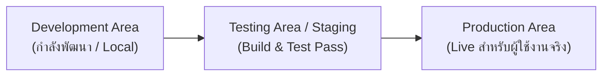
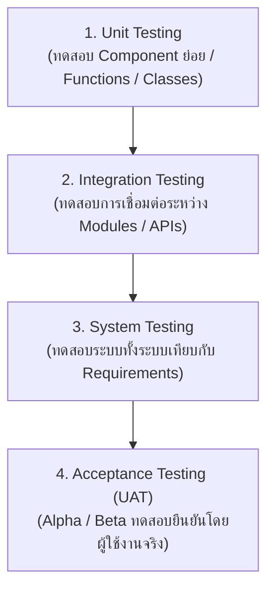

# ISAD - Unit 12: System Development, Testing and Documentation

> **วิชา:** 06066304 Information System Analysis and Design | **สถาบัน:** KMITL (King Mongkut's Institute of Technology Ladkrabang)
> **อาจารย์:** Asst. Prof. Manop Phankokkruad, Ph.D.
> **Source:** `Resources/Books/Information System Analysis and Design/ISAD2026-UNIT12-developing-testing-doc-v2.pdf` (33 slides)
> **Additional Context:** เสริมทฤษฎี Testing Pyramid, Agile Testing, และ Docs-as-Code Pattern

---

## Part 1: Macro Architecture & Overview

**Unit 12** เป็นส่วนหนึ่งของ **Implementation Phase** ซึ่งเกิดขึ้นหลังจากที่ทีมออกแบบระบบใน Unit 10-11 เสร็จสิ้นแล้ว Phase นี้ครอบคลุม 3 ภารกิจหลัก ได้แก่ การจัดการกระบวนการเขียนโปรแกรม การทดสอบระบบ และการจัดทำเอกสาร โดย Project Manager และ Systems Analyst มีบทบาทสำคัญในการประสานงานระหว่าง Programmer, Tester, และ User

**ผลลัพธ์ที่ได้จาก Implementation Phase (Unit 12-13):**

```text
Implementation Phase Outputs:
  Unit 12 Activities                 Deliverables
  Managing Programming        ->     Completed Program
  Testing & Test Planning     ->     Testing Plan
  Developing Documentation    ->     System Doc + User Documentation

  Unit 13 Activities                 Deliverables
  Installation & Conversion   ->     Migration Plan
  Training & Support          ->     Training Plan
  Change Management           ->     Change Mgmt Plan + Change Request
```

### ภาพรวม 3 ส่วนหลักของ Unit 12

```text
Unit 12 Overview:
  1. Managing the Programming Process
     - Assigning Programming Tasks
     - Coordinating Activities
     - Managing the Schedule
  2. Testing and Test Planning
     - Unit Testing (Black-box / White-box)
     - Integration Testing (4 approaches)
     - System Testing (5 sub-types)
     - Acceptance Testing (Alpha / Beta)
  3. Developing Documentation
     - System Documentation
     - User Documentation (3 types)
     - Online Documentation Design
```

---

## Part 2: Core Concepts

### 2.1 Managing the Programming Process

**Implementation Phase** เริ่มต้นเมื่อ Design Phase เสร็จสมบูรณ์ Systems Analyst ต้องทำหน้าที่บริหารกระบวนการเขียนโปรแกรมควบคู่ไปกับการออกแบบชุดทดสอบ

> **นิยาม:** การบริหารกระบวนการโปรแกรม (Managing the Programming Process) คือกลุ่มภารกิจที่ Project Manager รับผิดชอบเพื่อให้มั่นใจว่า Software พัฒนาได้ตรงเวลา ตรงสเปก และมีคุณภาพ

**ภารกิจหลัก 3 อย่างของ Project Manager:**

```text
Managing the Programming Process:
    Project Manager
          |
  --------+----------
  |        |         |
Assign  Coordinate  Manage
Tasks   Activities  Schedule
```

#### A. Assigning Programming Tasks

**หลักการมอบหมายงานโปรแกรม:**
- **จัดกลุ่ม Module** ที่เกี่ยวข้องกันก่อน แล้วมอบทั้งกลุ่มให้ Programmer คนเดียว ไม่แยก Module ที่สัมพันธ์กันไปคนละคน
- **พิจารณาจาก Experience และ Skill Level** ของ Programmer แต่ละคน
- **ทีมที่เล็กที่สุดที่ทำได้** (Smallest Feasible Team) คือทีมที่ดีที่สุด — ลด Communication Overhead
- **บริหาร Skill Mismatch:** จัดการกรณีที่ทักษะที่มีอยู่ไม่ตรงกับที่โปรเจกต์ต้องการ

> **ตัวอย่างจริง:** ในโปรเจกต์ E-Commerce ควรมอบ `Payment` Module ให้ Senior Developer ที่มีประสบการณ์ด้าน Security โดยเฉพาะ

#### B. Coordinating Activities

**3 วิธีการประสานงาน:**

| วิธีการ | รายละเอียด | ตัวอย่างเครื่องมือ |
| :--- | :--- | :--- |
| **Weekly Project Meeting** | ประชุมทีมรายสัปดาห์เพื่อ Sync Progress | Zoom, MS Teams, Google Meet |
| **Standards & Guidelines** | กำหนด Coding Standard, Git Branching Strategy | ESLint, Prettier, GitHub Flow |
| **CASE Tools** | เครื่องมือช่วย Track Status และบริหาร Programmer | Jira, Azure DevOps, Trello |

**3 Environment Areas สำหรับ Programmer:**



**Change Control Techniques:**
- **File/Program Organization:** แยกไฟล์ตาม Completion Status (Dev / Test / Prod)
- **Program Log:** บันทึกการเปลี่ยนแปลงของโปรแกรมทุกครั้ง (คล้าย `git log`)

#### C. Managing the Schedule

**ปัญหาหลักที่ทำให้ Schedule เสีย:**

| ปัญหา | คำอธิบาย | วิธีรับมือ |
| :--- | :--- | :--- |
| **Scope Creep** | ขอบเขตงานขยายโดยไม่ได้วางแผน เช่น ลูกค้าขอ Feature เพิ่มกลางโปรเจกต์ | Change Control Process อย่างเข้มงวด |
| **Day-by-Day Slippage** | งานล่าช้าทีละเล็กน้อยสะสม | Daily Stand-up Meeting |
| **Inaccurate Estimates** | ประมาณเวลาผิดตั้งแต่ต้น | Refine Estimates ระหว่างทางสม่ำเสมอ |

**Risk Assessment:** Project Manager ต้องสร้างและ Update **Risk Register** ที่ track ความเสี่ยงที่อาจกระทบ Schedule และ Cost อยู่ตลอดเวลา

---

### 2.2 Testing and Test Planning

**Testing** คือกระบวนการ Execute Program เพื่อค้นหา Error — ไม่ใช่เพื่อพิสูจน์ว่า Program ถูกต้อง แต่เพื่อ **หา Bug** ให้ได้มากที่สุด

> **Test Plan** คือเอกสารที่ระบุ Scope, Approach, Resources, Schedule ของกิจกรรมการทดสอบ รวมถึง Test Items, ฟีเจอร์ที่จะทดสอบ, Tasks, ผู้รับผิดชอบ, Test Environment, Design Techniques, และ Entry/Exit Criteria

**ลำดับชั้นของการทดสอบ:**



#### 2.2.1 Unit Testing

**Unit Testing** คือการทดสอบ Component ย่อยที่สุดของ Software (Function, Class, Method) แยกกัน

**ดำเนินการโดย:** Developers (ในช่วง Early Development)

**2 Approach ของ Unit Testing:**

| Approach | วิธีการ | แหล่ง Test Plan | เหมาะกับ |
| :--- | :--- | :--- | :--- |
| **Black-box Testing** | ทดสอบโดยไม่เปิดดูโค้ด — ใส่ Input ตรวจ Output | Program Specification | การทดสอบปกติทั่วไป |
| **White-box Testing** | ทดสอบโดยเปิดดูโค้ด — ตรวจ Logic, Branch, Path | Program Source Code | เมื่อ Complexity สูง |

```text
Black-box:  [Input] -> [กล่องดำ] -> [Output]   (จาก Spec ไม่รู้ข้างใน)
White-box:  [Input] -> [if/else/loop] -> [Output] (เปิดโค้ด ทดสอบทุก Branch)
```

> **ตัวอย่างจริง (Black-box):** ทดสอบ `calculate_discount(1000, 'Gold')` ว่า Output = 800 โดยไม่ดูโค้ด
>
> **ตัวอย่างจริง (White-box):** เปิดดูโค้ดพบ `if member_level == 'Gold'` -> เขียน Test Case ครอบทุก Branch

#### 2.2.2 Integration Testing

**Integration Testing** คือการทดสอบว่า Component หลายตัวเมื่อนำมา **รวมกัน** แล้ว ยังทำงานได้ถูกต้องหรือไม่ เน้นหาปัญหาจาก **Interface ระหว่าง Component**

**4 Approach ของ Integration Testing:**

| Approach | วิธีการ | แหล่ง Test Plan | เหมาะกับ |
| :--- | :--- | :--- | :--- |
| **User Interface Testing** | ทดสอบทุก Function บน Interface | Interface Design | การทดสอบ Integration ปกติ |
| **Use Scenario Testing** | ทดสอบตาม Use Case/Scenario จริง | Use Scenario | เมื่อ User Interface สำคัญมาก |
| **Data Flow Testing** | ทดสอบแต่ละ Process ทีละขั้น ตาม Physical DFD | Physical DFDs | เมื่อระบบมีการประมวลผลข้อมูลซับซ้อน |
| **System Interface Testing** | ทดสอบการแลกเปลี่ยนข้อมูลกับระบบภายนอก | Physical DFDs | เมื่อระบบต้องเชื่อมต่อกับ External Systems |

> **ตัวอย่างจริง:** ทดสอบว่าเมื่อ Order สำเร็จ Payment Module ถูก Charge และ Inventory ถูก Deduct พร้อมกัน

#### 2.2.3 System Testing

**System Testing** คือการทดสอบ **ระบบทั้งหมด** เพื่อยืนยันว่าตรงตาม **Business Requirements** — ดำเนินการโดย Systems Analyst

**5 Sub-types ของ System Testing:**

| Sub-type | สิ่งที่ทดสอบ | แหล่ง Test Plan |
| :--- | :--- | :--- |
| **Requirements Testing** | ระบบตอบสนองความต้องการทางธุรกิจได้ครบ | System Design + Unit/Integration Tests |
| **Usability Testing** | ระบบใช้งานได้สะดวกแค่ไหน (User-Friendly) | Interface Design & Use Scenarios |
| **Security Testing** | Disaster Recovery + Unauthorized Access Prevention | Infrastructure Design |
| **Performance Testing** | รับโหลดสูงได้แค่ไหน (Load Test, Stress Test) | System Proposal + Infrastructure Design |
| **Documentation Testing** | เอกสารถูกต้องและสอดคล้องกับระบบจริง | Help System, Procedures, Tutorials |

> **ตัวอย่างจริง (Performance Testing):** ทดสอบว่า Web App รองรับ 10,000 Concurrent Users โดยไม่ Response Time เกิน 2 วินาที (Apache JMeter / Locust)

#### 2.2.4 Acceptance Testing

**Acceptance Testing** ดำเนินการโดย **ผู้ใช้งานจริง** เพื่อยืนยันว่าระบบสมบูรณ์และยอมรับได้

**2 ขั้นตอน:**

| ขั้น | ชื่อ | วิธีการ | ข้อมูลที่ใช้ |
| :--- | :--- | :--- | :--- |
| **A** | **Alpha Testing** | ผู้ใช้ทดสอบในสภาพแวดล้อมที่ควบคุม | Test Data (ข้อมูลสมมุติ) |
| **B** | **Beta Testing** | ผู้ใช้เริ่มใช้จริงพร้อม Monitor หา Error | Real Data (ข้อมูลจริง) |

> **ตัวอย่างจริง:** Release เกมใหม่ — Alpha = QA ภายใน + Early Access Group; Beta = Public บางส่วนก่อน Official Launch

#### 2.2.5 ตาราง Types of Tests สรุปรวม

| Stage | ประเภทการทดสอบ | แหล่ง Test Plan | เมื่อไหร่ใช้ |
| :--- | :--- | :--- | :--- |
| **Unit** | Black-box Testing | Program Specification | ทดสอบปกติทั่วไป |
| **Unit** | White-box Testing | Program Source Code | เมื่อ Complexity สูง |
| **Integration** | User Interface Testing | Interface Design | ทดสอบปกติ |
| **Integration** | Use Scenario Testing | Use Scenario | เมื่อ UI สำคัญ |
| **Integration** | Data Flow Testing | Physical DFDs | เมื่อมีการประมวลผลข้อมูล |
| **Integration** | System Interface Testing | Physical DFDs | เมื่อมีการแลกเปลี่ยนข้อมูลกับระบบนอก |
| **System** | Requirements Testing | System Design, Unit & Integration Tests | ทดสอบปกติ |
| **System** | Usability Testing | Interface Design & Use Scenarios | เมื่อ UI สำคัญ |
| **System** | Security Testing | Infrastructure Design | เมื่อระบบมีความสำคัญสูง |
| **System** | Performance Testing | System Proposal & Infrastructure Design | เมื่อระบบมีความสำคัญสูง |
| **System** | Documentation Testing | Help System, Procedures, Tutorials | ทดสอบปกติ |
| **Acceptance** | Alpha Testing | System Tests | ทดสอบปกติ |
| **Acceptance** | Beta Testing | ไม่มี Test Plan กำหนดล่วงหน้า | เมื่อระบบมีความสำคัญสูง |

---

### 2.3 Developing Documentation

**Documentation** มี 2 ประเภทหลัก:

| ประเภท | กลุ่มเป้าหมาย | จุดประสงค์ |
| :--- | :--- | :--- |
| **System Documentation** | Programmers, Systems Analysts | เข้าใจระบบเพื่อ Build หรือ Maintain |
| **User Documentation** | ผู้ใช้งาน (End Users) | ช่วยให้ใช้งานระบบได้ถูกต้อง |

**ข้อสำคัญ:**
- User Documentation **ต้องไม่ทิ้งไว้ทำทีหลัง** — ต้องวางแผนเวลาไว้ใน Project Plan ตั้งแต่ต้น
- **Online Documentation** กำลังกลายเป็นรูปแบบหลัก แทนที่เอกสาร Paper

**Online Documentation — 4 ข้อได้เปรียบ:**
1. **Searching is simpler** — ค้นหาข้อมูลได้รวดเร็ว
2. **Multiple formats** — นำเสนอได้หลายรูปแบบ (Text, Video, Interactive Demo)
3. **Interactive** — ผู้ใช้โต้ตอบกับ Documentation ได้
4. **Less expensive** — ถูกกว่าเอกสาร Paper อย่างมาก

---

### 2.4 Types of User Documentation

**3 ประเภทหลักของ User Documentation:**

| ประเภท | จุดประสงค์ | ตัวอย่าง |
| :--- | :--- | :--- |
| **Reference Documents** | ผู้ใช้ค้นหาวิธีทำ Function เฉพาะ | API Reference, Help Pages |
| **Procedural Manuals** | อธิบาย Business Task ทีละขั้นตอน | คู่มือการใช้ระบบ, SOP |
| **Tutorials** | สอน Component หลักสำหรับผู้เริ่มต้น | Getting Started Guide, Video Walkthrough |

**Key Elements ใน User Documentation (7 ส่วน):**

| ส่วน | เนื้อหา |
| :--- | :--- |
| **1. Introduction** | แนะนำ Product, เป้าหมาย, System Requirements, Installation, คำศัพท์สำคัญ |
| **2. Getting Started** | Account Creation, Basic Navigation |
| **3. Features & Functionality** | อธิบาย Features ละเอียด — วิธีเข้าถึง ใช้งาน ปรับแต่ง |
| **4. Step-by-Step Instructions** | คำสั่งตามลำดับ พร้อม Screenshot, Diagram |
| **5. Troubleshooting & FAQs** | แก้ปัญหาที่พบบ่อย, Error Messages, Workarounds |
| **6. Best Practices & Tips** | Shortcuts, Optimization, Advanced Scenarios |
| **7. Glossary & Index** | คำศัพท์ + Index สำหรับค้นหาเร็ว |

---

### 2.5 Designing Online Documentation

**Navigation Controls 5 ประเภท:**

| Navigation Control | วิธีการทำงาน | ตัวอย่าง |
| :--- | :--- | :--- |
| **Table of Contents** | โครงสร้างเนื้อหาเป็นลำดับชั้น | Sidebar ใน GitBook, ReadTheDocs |
| **Index** | Keyword เรียงตามตัวอักษรพร้อม Link | ดัชนี Clickable |
| **Text Search** | ค้นหา Keyword ใน Full Text | Search Bar ใน Confluence, Notion |
| **Intelligent Agent** | AI/Chatbot ตอบคำถาม Natural Language | Algolia DocSearch AI |
| **Web-like Links** | Hyperlink ระหว่าง Topics ที่เกี่ยวข้อง | Wiki-Style Internal Links |

**หลักการออกแบบ Topic:**
- เริ่มด้วย **Clear Title** -> **Introductory Text** -> **Step-by-step Instructions**
- ใส่ **Screen Images** และ **Show Me Examples**
- มี **Navigation Controls** และ **Links** ไปยัง Related Topics

---

## Part 3: Quick Reference & Exam Cheat Sheet

### Checklist สรุปหัวใจสำคัญก่อนสอบ

* [ ] **Managing the Programming Process:** 3 ภารกิจ — Assign Tasks, Coordinate Activities, Manage Schedule
* [ ] **Assigning Tasks:** จัดกลุ่ม Related Modules มอบให้คนเดียว; ทีมเล็กสุดที่ทำได้คือดีที่สุด
* [ ] **Coordinating:** 3 Environment Areas = Development -> Testing -> Production
* [ ] **Scope Creep:** ปัญหา Schedule ที่พบบ่อยที่สุด — ขอบเขตงานขยายโดยไม่ตั้งใจ
* [ ] **Testing Levels:** Unit -> Integration -> System -> Acceptance (ลำดับนี้เสมอ)
* [ ] **Unit: Black-box:** ทดสอบจาก Spec, ไม่เปิดโค้ด — ใช้ในกรณีปกติ
* [ ] **Unit: White-box:** เปิดดูโค้ด ทดสอบทุก Branch — ใช้เมื่อ Complexity สูง
* [ ] **Integration: 4 Approaches** = UI Testing, Use Scenario, Data Flow, System Interface
* [ ] **System Testing: 5 Sub-types** = Requirements, Usability, Security, Performance, Documentation
* [ ] **Acceptance: Alpha** = Made-up Data; **Beta** = Real Data
* [ ] **Documentation: 2 ประเภท** = System Doc (Developer) + User Doc (End User)
* [ ] **User Doc: 3 ประเภท** = Reference Documents, Procedural Manuals, Tutorials
* [ ] **Online Doc: 4 ข้อดี** = Easy Search, Multi-format, Interactive, Less Expensive
* [ ] **Navigation Controls: 5 ประเภท** = ToC, Index, Text Search, Intelligent Agent, Web Links

### สรุป: ใครทำอะไร ในแต่ละ Test Level

| Test Level | ผู้ดำเนินการ | จุดมุ่งหมาย |
| :--- | :--- | :--- |
| Unit Testing | Developers | ตรวจสอบ Component ย่อยทำงานถูกต้อง |
| Integration Testing | Developers / QA | ตรวจสอบการเชื่อมต่อระหว่าง Component |
| System Testing | Systems Analysts | ตรวจสอบทั้งระบบ vs. Requirements |
| Acceptance Testing | Users (ผู้ใช้จริง) | ยืนยันว่าระบบตรงความต้องการและยอมรับได้ |

### Concept Map

```text
UNIT 12: System Development, Testing & Documentation
|
+-- 1. Managing Programming
|    +-- Assigning Tasks (Group Modules, Skill Match, Smallest Team)
|    +-- Coordinating (3 Areas: Dev->Test->Prod, Change Control, CASE Tools)
|    +-- Managing Schedule (Scope Creep, Daily Slippage, Risk Register)
|
+-- 2. Testing
|    +-- Test Plan (Scope + Approach + Resources + Schedule)
|    +-- Unit Testing
|    |    +-- Black-box (From Spec, No Code View)
|    |    +-- White-box (From Source Code, Branch Coverage)
|    +-- Integration Testing
|    |    +-- User Interface Testing
|    |    +-- Use Scenario Testing
|    |    +-- Data Flow Testing (Physical DFD)
|    |    +-- System Interface Testing (Physical DFD)
|    +-- System Testing
|    |    +-- Requirements Testing
|    |    +-- Usability Testing
|    |    +-- Security Testing
|    |    +-- Performance Testing
|    |    +-- Documentation Testing
|    +-- Acceptance Testing
|         +-- Alpha (Made-up Data)
|         +-- Beta (Real Data)
|
+-- 3. Documentation
     +-- System Documentation (-> Developers/Analysts)
     +-- User Documentation (-> End Users)
          +-- Types: Reference, Procedural Manual, Tutorial
          +-- Key Elements: Intro, Getting Started, Features,
          |   Steps, Troubleshooting, Best Practices, Glossary
          +-- Online Nav: ToC, Index, Search, AI Agent, Links
```

---

## Backlinks

* **วิชาและหัวข้อที่เกี่ยวข้อง:**
  * [[ISAD - Unit 11 Storage Design]] — Unit ก่อนหน้า: Storage Design เป็น Design Phase ก่อน Implementation Phase
  * [[ISAD - Unit 10 Software Design]] — Software Design สร้าง Architecture ที่ Unit 12 นำมา Implement และ Test
  * [[ISAD - Unit 09 User Interface Design]] — UI Design เป็นแหล่ง Test Plan สำหรับ UI Testing และ Usability Testing
  * [[ISAD - Vault Map]] — แผนที่รวมทุก Unit ของวิชา ISAD

* **แหล่งข้อมูล:**
  * Source: `Resources/Books/Information System Analysis and Design/ISAD2026-UNIT12-developing-testing-doc-v2.pdf` (33 slides, KMITL)
  * Reference: Satzinger, J.W., Jackson, R.B., & Burd, S.D. — *Systems Analysis and Design in a Changing World*
