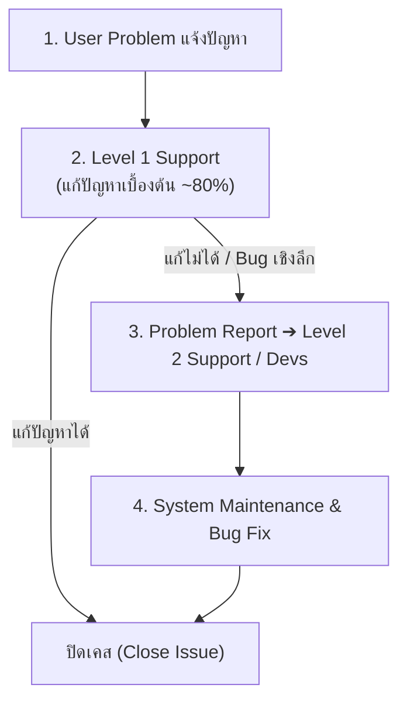
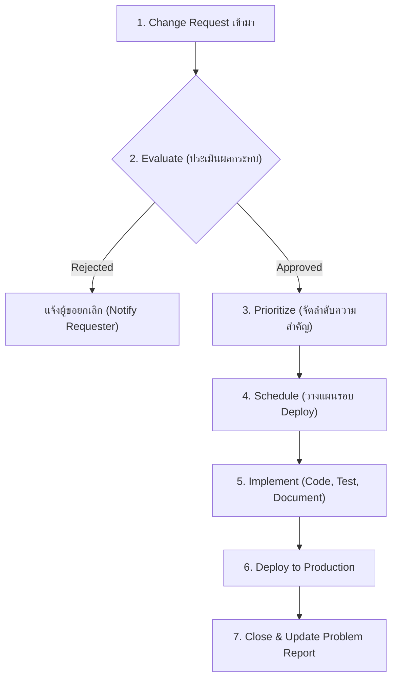

# ISAD - Unit 13: System Transition & Migration

> **วิชา:** 06066304 Information System Analysis and Design | **สถาบัน:** KMITL (King Mongkut's Institute of Technology Ladkrabang)
> **อาจารย์:** Asst. Prof. Manop Phankokkruad, Ph.D.
> **Source:** `Resources/Books/Information System Analysis and Design/ISAD2026-UNIT13-SystemTransition-Migration.pdf` (34 slides)

---

## Part 1: Macro Architecture & Overview

**Unit 13** เป็นบทสุดท้ายของ **Implementation Phase** ต่อจาก Unit 12 (Development, Testing & Documentation) โดยเน้นกระบวนการ **เปลี่ยนผ่านระบบ (System Transition)** จาก As-Is System ไปยัง To-Be System อย่างปลอดภัยและมีแผนรองรับ ความท้าทายหลักไม่ใช่แค่ด้านเทคนิค แต่ยังรวมถึงด้านธุรกิจและด้านคน (People Issues) ซึ่ง Kurt Lewin อธิบายว่าการเปลี่ยนแปลงองค์กรต้องผ่าน 3 ขั้นตอน: **Unfreeze → Move → Refreeze**

### ภาพรวม Implementation Phase (Unit 12 + Unit 13)



**องค์ประกอบของ Problem Report:**

| ฟิลด์ | รายละเอียด |
| :--- | :--- |
| Time & Date of Report | วันเวลาที่รายงาน |
| Reporter Info | ชื่อ อีเมล โทรศัพท์ผู้แจ้ง |
| Support Person Info | ชื่อ อีเมล โทรศัพท์ผู้รับเรื่อง |
| Software/Hardware | Software/Hardware ที่ก่อให้เกิดปัญหา |
| Location | ตำแหน่งที่พบปัญหา |
| Description | คำอธิบายปัญหา |
| Action Taken | สิ่งที่ดำเนินการแล้ว |
| Disposition | ผลลัพธ์ (แก้แล้ว / ส่งต่อ Maintenance) |

---

### 2.9 System Maintenance (การบำรุงรักษาระบบ)

> **System Maintenance** คือกระบวนการตรวจสอบ อัปเดต เฝ้าติดตาม และซ่อมบำรุงระบบคอมพิวเตอร์ เพื่อให้มีความปลอดภัย เชื่อถือได้ และมีประสิทธิภาพต่อเนื่อง

**4 ประเภทของ System Maintenance:**

| ประเภท | จุดประสงค์ | ตัวอย่าง Real-World |
| :--- | :--- | :--- |
| **Preventive Maintenance** | ป้องกันปัญหาก่อนเกิด — ค้นหาและแก้ไข latent faults | ติดตั้ง security patches, clean legacy code, defrag disk |
| **Corrective Maintenance** | แก้ bugs, errors, defects ที่ผู้ใช้พบหลังระบบ go-live | แก้ checkout page crash เมื่อใส่ discount code |
| **Adaptive Maintenance** | ปรับระบบให้รองรับ software/hardware/legal ที่เปลี่ยนไป | อัปเดต app รองรับ iOS ใหม่, ปรับระบบเงินเดือนตามกฎหมายภาษีใหม่ |
| **Perfective Maintenance** | ปรับปรุง performance, UI, หรือเพิ่มฟีเจอร์ที่ขอ | Optimize DB ให้โหลดเร็วขึ้น 50%, เพิ่ม Dark Mode |

#### Change Request (คำร้องขอเปลี่ยนแปลง)

> **Change Request** คือข้อเสนออย่างเป็นทางการเพื่อแก้ไขส่วนใดส่วนหนึ่งของระบบ

**5 แหล่งที่มาของ Change Requests:**
1. **Problem Reports** จาก Operations Group (ที่มาที่พบบ่อยที่สุด)
2. **User Enhancements** — คำขอฟีเจอร์ใหม่จากผู้ใช้
3. **Other System Projects** — ระบบอื่นๆ ที่เชื่อมต่อกัน
4. **Infrastructure Changes** — Software/Network ที่เปลี่ยนแปลง
5. **Senior Management Requests** — นโยบายจากผู้บริหารระดับสูง

**กระบวนการ Processing a Change Request:**



---

### 2.10 Project Assessment (การประเมินผลโครงการ)

> **Project Assessment** คือกลไกประเมินโครงการตลอด Lifecycle ตั้งแต่เริ่มต้นถึงสิ้นสุด — เพื่อเข้าใจว่าอะไรสำเร็จ อะไรต้องปรับปรุง

**ความสำคัญ:**
- เป็นส่วนประกอบสำคัญของ **Organizational Learning**
- สำคัญเป็นพิเศษสำหรับ Junior Staff ที่กำลังสร้างประสบการณ์
- ช่วยให้องค์กรพัฒนาขีดความสามารถในโครงการต่อๆ ไป

**2 ส่วนของ Project Assessment:**

#### A. Project Team Review

> **Project Team Review** (Post-Project Review) คือการประเมินเชิงโครงสร้างว่าทีมทำงานร่วมกัน ปฏิบัติงาน และดำเนินโครงการอย่างไร

**กระบวนการ:**
- สมาชิกแต่ละคนเขียนเอกสารสั้นรายงานและวิเคราะห์ผลงานของตนเอง
- เน้นที่ **การปรับปรุง ไม่ใช่การลงโทษ**
- Project Manager สรุปเอกสารและแจกเวียนให้องค์กรเรียนรู้

#### B. System Review

> **System Review** คือการประเมินอย่างเป็นทางการถึงสถาปัตยกรรม Infrastructure และสุขภาพทางเทคนิคของระบบโดยรวม

**เป้าหมาย:**
- ประเมินว่าต้นทุนและประโยชน์ที่คาดหวังไว้ เกิดขึ้นจริงหรือไม่หลังติดตั้ง
- ช่วยให้องค์กรพัฒนาขีดความสามารถในการบริหารโครงการในอนาคต

| การประเมิน | เน้นที่ | ผู้รับผิดชอบ |
| :--- | :--- | :--- |
| **Project Team Review** | กระบวนการทำงานของทีม, การ collaborate | Project Manager + ทีม |
| **System Review** | ความสำเร็จของระบบ, ROI จริงเทียบกับที่คาด | Management + Analyst |

---

## Part 3: Quick Reference & Exam Cheat Sheet

### Checklist สรุปหัวใจสำคัญก่อนสอบ
* [ ] **Kurt Lewin's 3 Steps:** Unfreeze → Move → Refreeze — กระบวนการเปลี่ยนแปลงองค์กร
* [ ] **Migration Plan มี 3 ส่วน:** Preparing Business / Technology / People
* [ ] **Conversion Strategy 3 มิติ:** Style (ทันที/ค่อยๆ) + Location (ที่ไหน) + Module (เท่าไหร่)
* [ ] **Conversion Styles 4 แบบ:** Direct, Parallel, Phased, Pilot — เปรียบ Risk/Cost/Time
* [ ] **Data Conversion** = ขั้นตอนที่ซับซ้อนที่สุดใน Preparing Technology
* [ ] **3 Key Roles:** Sponsor (ต้องการ), Change Agent (นำ), Potential Adopters (ต้องเปลี่ยน)
* [ ] **4 ขั้นตอน Change Management:** Revise Policy → Assess Cost/Benefit → Motivate → Train
* [ ] **Motivation 2 กลยุทธ์:** Informational (โน้มน้าว) vs Political (ใช้อำนาจ)
* [ ] **3 วิธีได้ทักษะใหม่:** Hiring / Outsourcing / Training
* [ ] **Training Principle:** เน้นงานที่ผู้ใช้ต้องทำ ไม่ใช่ฟีเจอร์ระบบ
* [ ] **Help Desk:** Level 1 แก้ 80%, ที่เหลือ → Problem Report → Level 2
* [ ] **4 ประเภท Maintenance:** Preventive / Corrective / Adaptive / Perfective
* [ ] **5 แหล่ง Change Request:** Operations Problem Reports (ที่พบบ่อยสุด), User, Other Systems, Infrastructure, Management
* [ ] **Project Assessment:** Project Team Review (ทีม) + System Review (ระบบ)

### สรุปตาราง Conversion Strategy

| Strategy | วิธี | Risk | Cost | Time | Use When |
| :--- | :--- | :---: | :---: | :---: | :--- |
| **Direct Cutover** | ปิดเก่า-เปิดใหม่ทันที | 🔴 H | 🟢 L | 🟢 Short | ระบบเล็ก, ไม่ซับซ้อน |
| **Parallel** | รัน 2 ระบบพร้อมกัน | 🟢 L | 🔴 H | 🔴 Long | Critical Systems, ไม่ยอมรับ Downtime |
| **Phased** | เปลี่ยนทีละส่วน | 🟡 M | 🟡 M | 🟡 Medium | ระบบขนาดใหญ่, หลาย Module |
| **Pilot** | ทดสอบกลุ่มเล็กก่อน | 🟡 M | 🟡 M | 🟡 Medium | ต้องการ feedback ก่อนขยาย |

### สรุปตาราง 4 ประเภท System Maintenance

| ประเภท | ทำเมื่อ | จุดประสงค์ |
| :--- | :--- | :--- |
| **Preventive** | Proactive — ก่อนเกิดปัญหา | ป้องกัน Latent Faults |
| **Corrective** | Reactive — หลัง Bug พบ | แก้ไข Bug/Error ที่พบหลัง Go-Live |
| **Adaptive** | เมื่อ Environment เปลี่ยน | ปรับรองรับ OS, Law, Platform ใหม่ |
| **Perfective** | เมื่อต้องการปรับปรุง | เพิ่ม Performance, UI, Features |

### Concept Map — Unit 13

```text
System Transition & Migration (Unit 13)
├── Transition Model (Kurt Lewin)
│   ├── Unfreeze (Analysis & Design)
│   ├── Move (Migration Plan)
│   └── Refreeze (Support & Maintenance)
│
├── Migration Plan
│   ├── 1. Preparing Business
│   │   ├── Conversion Strategy (Direct/Parallel/Phased/Pilot)
│   │   └── Business Contingency Plan
│   ├── 2. Preparing Technology
│   │   ├── Install Hardware
│   │   ├── Install Software
│   │   └── Convert Data ← ซับซ้อนที่สุด
│   └── 3. Preparing People (Change Management)
│       ├── Revise Management Policies
│       ├── Assess Costs & Benefits
│       ├── Motivate Adoption (Informational / Political)
│       └── Conduct Training (Classroom / 1-on-1 / CBT)
│
└── Post-Implementation Activities
    ├── System Support
    │   ├── Online Support
    │   └── Help Desk (L1 → L2 Escalation)
    ├── System Maintenance
    │   ├── Preventive / Corrective / Adaptive / Perfective
    │   └── Change Request (5 Sources)
    └── Project Assessment
        ├── Project Team Review (เน้นทีม)
        └── System Review (เน้น ROI ระบบ)
```

---

## ⚠️ Common Pitfalls & Exam Traps

* **Parallel ≠ Safe ในทุกกรณี:** Parallel Conversion ลด Risk แต่ Cost สูงมาก และต้องรักษาข้อมูลสองระบบให้ Sync — ไม่เหมาะถ้า Resources จำกัด
* **Data Conversion ≠ แค่ Copy ข้อมูล:** ต้องมีการทำ Schema Mapping, Data Cleansing, Validation และ Testing ก่อนใช้งานจริง — เป็นขั้นตอนที่ซับซ้อนที่สุดใน Migration Plan
* **Training ≠ สอนใช้งานระบบ:** หลักการของ ISAD คือ Training ต้องเน้นที่ "งานที่ผู้ใช้ต้องทำ" (Job-Centric) ไม่ใช่ "ฟีเจอร์ที่ระบบมี" (System-Centric)
* **Corrective vs Adaptive ต่างกัน:** Corrective = แก้ Bug ที่มีอยู่แล้ว; Adaptive = ปรับระบบให้รองรับสิ่งแวดล้อมที่เปลี่ยนไป (เช่น OS ใหม่, กฎหมายใหม่)
* **Project Team Review ≠ ลงโทษ:** เป็นกระบวนการเรียนรู้ขององค์กร เน้น Improvement ไม่ใช่ Blame
* **Help Desk Level 1 เป้าหมาย 80%:** ถ้า Level 1 ไม่สามารถแก้ได้ ต้องทำ Problem Report ส่งต่อ Level 2 — ไม่ใช่ส่งตรงไปยัง Developer

---

## เอกสารเชื่อมโยง (Wiki-Style Backlinks)

* **วิชาและหัวข้อที่เกี่ยวข้อง:**
  * [[ISAD - Unit 12 System Development, Testing and Documentation]] (บท System Development ก่อนหน้า — Implementation Phase ส่วนแรก ที่ Unit 13 ต่อยอดจาก)
  * [[ISAD - Unit 11 Storage Design]] (Storage Design ที่เป็นพื้นฐานของ Data Conversion ใน Migration Plan)
  * [[ISAD - Unit 10 Software Design]] (Software Design ที่ถูกนำไปพัฒนาและทดสอบก่อนเข้า Unit 12-13)
  * [[ISAD - Unit 07 Design Strategies]] (Design Strategies ที่กำหนดทิศทางการออกแบบที่ Unit 13 นำไปติดตั้ง)

* **แหล่งข้อมูล:**
  * Source: `Resources/Books/Information System Analysis and Design/ISAD2026-UNIT13-SystemTransition-Migration.pdf` (34 slides, KMITL)
