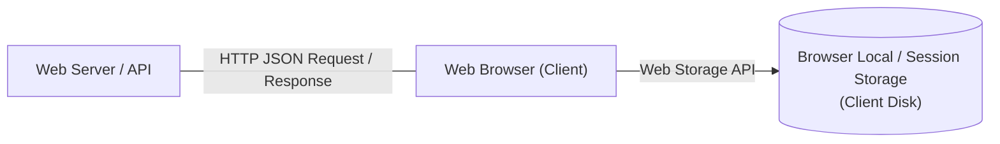

# Web Programming - Unit 06: Web Data with JSON and Local Storage

## Part 1: Macro Architecture & Technology Overview

ในสถาปัตยกรรมเว็บการจัดการข้อมูลฝั่งไคลเอนต์ (Front-End Web Data Management) อาศัยองค์ประกอบหลัก 2 ส่วนในการรับส่งและบันทึกสถานะ (State Persistence):
1. **JSON (JavaScript Object Notation):** มาตรฐานรูปแบบข้อความ (Text Format) น้ำหนักเบา สำหรับแลกเปลี่ยนข้อมูลระหว่าง Client และ Server ผ่าน Web APIs / RESTful Services
2. **Local Storage (Web Storage API):** กลไกการจัดเก็บข้อมูลแบบ Key-Value คู่ขนานบน Web Browser ที่ข้อมูลไม่สูญหายแม้ปิดหน้าต่างเบราว์เซอร์หรือรีสตาร์ตระบบ



### ตารางเปรียบเทียบกลไกการแลกเปลี่ยนและจัดเก็บข้อมูลเว็บ (Data Formats & Storage)

| คุณสมบัติ (Feature) | JSON | XML | Local Storage | Cookies |
| :--- | :--- | :--- | :--- | :--- |
| **ประเภท (Type)** | Data Interchange Format | Data Interchange Format | Client-Side Storage | Client-Side Storage |
| **โครงสร้างข้อมูล** | Key-Value, Arrays | Tree / Tag-based | Key-Value (String) | Key-Value (String) |
| **ความจุ (Capacity)** | ขึ้นกับขนาด HTTP Payload | ขึ้นกับขนาด HTTP Payload | ~5MB - 10MB ต่อ Origin | ~4KB ต่อ Cookie |
| **การหมดอายุ (Expiration)** | N/A (Transient Data) | N/A (Transient Data) | ไม่มีวันหมดอายุ (Persistent) | กำหนดวันหมดอายุได้ |
| **การส่งไป Server** | ส่งผ่าน Fetch / AJAX | ส่งผ่าน Fetch / AJAX | ไม่ถูกส่งไป Server เอง | ถูกส่งไปพร้อม HTTP Request ทุกครั้ง |

---

## Part 2: Module-by-Module Deep Dive

### 2.1 JSON (JavaScript Object Notation) & Data Types
* **มาตรฐานเปิด:** RFC 7159 / ECMA-262 3rd Edition
* **คุณสมบัติหลัก:** เป็น Text-based, Language-independent, และเครื่องประมวลผล (Parse/Generate) ได้ง่าย
* **ประเภทข้อมูลที่รองรับ (7 Data Types):**
  1. `String`: ข้อความในอักขระ Unicode ครอบด้วย Double Quotes (`"..."`)
  2. `Number`: ตัวเลขทศนิยมแบบ Double-precision (ไม่รองรับ Hexadecimal หรือ Octal)
  3. `Boolean`: ค่าความจริง `true` หรือ `false`
  4. `Array`: ลำดับของข้อมูลเรียงต่อกันในเครื่องหมาย `[...]`
  5. `Object`: เซตของคู่ `key: value` ในเครื่องหมาย `{...}` โดย Key ต้องเป็น String เท่านั้น
  6. `null`: ค่าว่างเปล่า
  7. `Whitespace`: ช่องว่างสำหรับจัดรูปแบบ

#### ฟังก์ชันหลักในการทำงานกับ JSON (JSON Methods)
* **`JSON.stringify(object)`:** แปลง JavaScript Native Object ให้เป็นข้อความ JSON String (Serialization)
* **`JSON.parse(jsonString)`:** แปลงข้อความ JSON String ให้กลับเป็น JavaScript Native Object (Deserialization)

### 2.2 Local Storage API (Web Storage)
* **`window.localStorage`:** รหัสคุณสมบัติ Read-only ของ Window Interface ที่ผูกตามจุดกำเนิดโดเมน (**Origin-bounded / Domain-restricted**)
* **ชนิดข้อมูลการจัดเก็บ:** จัดเก็บข้อมูลทุกอย่างในรูปแบบ **UTF-16 DOMString** ( String ทั้ง Key และ Value)

#### เมธอดและคุณสมบัติหลักของ localStorage:
* `localStorage.setItem(key, value)`: เพิ่มหรืออัปเดตข้อมูล Key-Value
* `localStorage.getItem(key)`: ดึงค่าจาก Key (คืนค่า `null` หากไม่พบ Key)
* `localStorage.removeItem(key)`: ลบข้อมูลคู่ Key-Value
* `localStorage.clear()`: ล้างข้อมูลทั้งหมดใน Storage ของ Origin นั้น
* `localStorage.key(index)`: เข้าถึงชื่อ Key ตามลำดับ Index (0 ถึง length - 1)
* `localStorage.length`: คืนค่าจำนวนรายการข้อมูลทั้งหมด

#### การรับฟังเหตุการณ์การเปลี่ยนแปลง Storage (Storage Event)
เมื่อมีการแก้ไข `localStorage` ใน Tab หรือ Window อื่นที่มี Origin เดียวกัน สามารถรับฟังผ่านเหตุการณ์ `storage`:
* **Event Properties:** `key`, `oldValue`, `newValue`, `url`, `storageArea`

---

### 2.3 โค้ดตัวอย่างการใช้งานจริง (Implementation Code)

```javascript
// ==========================================
// 1. การจัดการ JSON (Stringify & Parse)
// ==========================================
const userProfile = {
    id: 101,
    name: "Siravit",
    roles: ["Admin", "Developer"],
    active: true
};

// แปลง Object เป็น JSON String เพื่อเตรียมส่งผ่าน Network หรือบันทึกลง Storage
const jsonString = JSON.stringify(userProfile);
console.log("JSON String:", jsonString); 
// Output: '{"id":101,"name":"Siravit","roles":["Admin","Developer"],"active":true}'

// แปลง JSON String กลับเป็น JS Object
const parsedObject = JSON.parse(jsonString);
console.log("User Name:", parsedObject.name); // Output: Siravit


// ==========================================
// 2. การจัดการ Local Storage CRUD Operations
// ==========================================

// Create / Update: ต้องแปลง Object เป็น String ด้วย JSON.stringify ก่อนเสมอ
function saveUserToLocalStorage(key, userObj) {
    const serializedData = JSON.stringify(userObj);
    localStorage.setItem(key, serializedData);
    console.log(`Saved user under key '${key}' successfully.`);
}

// Read: อ่านค่าและแปลงกลับด้วย JSON.parse
function getUserFromLocalStorage(key) {
    const rawData = localStorage.getItem(key);
    if (!rawData) {
        console.log(`Key '${key}' not found in localStorage.`);
        return null;
    }
    return JSON.parse(rawData);
}

// Delete
function removeUserFromLocalStorage(key) {
    localStorage.removeItem(key);
    console.log(`Removed key '${key}' from localStorage.`);
}

// ทดสอบเรียกใช้งาน CRUD
saveUserToLocalStorage("currentUser", userProfile);
const loadedUser = getUserFromLocalStorage("currentUser");
console.log("Loaded Roles:", loadedUser.roles); // ["Admin", "Developer"]


// ==========================================
// 3. การติดตามการเปลี่ยนแปลงผ่าน Storage Event
// ==========================================
window.addEventListener("storage", (event) => {
    console.log(`[Storage Changed] Key: ${event.key}`);
    console.log(`Old Value: ${event.oldValue}`);
    console.log(`New Value: ${event.newValue}`);
    console.log(`Source URL: ${event.url}`);
});
```

---

### 2.4 การวิเคราะห์โจทย์ตัวอย่าง (Assignment Case Analysis)

**โจทย์:** จงสร้างระบบบันทึกรายการสินค้าในตะกร้าสินค้า (Shopping Cart) ฝั่งไคลเอนต์ โดยมีเงื่อนไขดังนี้:
1. ข้อมูลสินค้าประกอบด้วย `productId`, `name`, `price`, และ `quantity`
2. ตะกร้าสินค้าต้องคงอยู่เมื่อผู้ใช้ปิดหน้าต่างเบราว์เซอร์
3. สามารถเพิ่มสินค้าใหม่ คำนวณราคารวม และล้างตะกร้าสินค้าได้

**การแก้ไขปัญหา (Solution Approach):**
* เนื่องจาก `localStorage` จัดเก็บได้เฉพาะ String ข้อความทั่วไป เราจึงต้องจัดเก็บโครงสร้างตะกร้าสินค้าในรูปแบบ Array of Objects ผ่าน `JSON.stringify()` และ `JSON.parse()`

```javascript
class CartManager {
    constructor(storageKey = "shopping_cart") {
        this.storageKey = storageKey;
    }

    getCart() {
        const data = localStorage.getItem(this.storageKey);
        return data ? JSON.parse(data) : [];
    }

    addItem(product) {
        const cart = this.getCart();
        const existingIndex = cart.findIndex(item => item.productId === product.productId);
        
        if (existingIndex > -1) {
            cart[existingIndex].quantity += product.quantity;
        } else {
            cart.push(product);
        }
        
        localStorage.setItem(this.storageKey, JSON.stringify(cart));
    }

    getTotalPrice() {
        const cart = this.getCart();
        return cart.reduce((total, item) => total + (item.price * item.quantity), 0);
    }

    clearCart() {
        localStorage.removeItem(this.storageKey);
    }
}

// ตัวอย่างการใช้งาน
const cart = new CartManager();
cart.addItem({ productId: "P001", name: "Wireless Mouse", price: 550, quantity: 1 });
cart.addItem({ productId: "P002", name: "Mechanical Keyboard", price: 2200, quantity: 1 });

console.log("Cart Total:", cart.getTotalPrice()); // 2750
```

---

## Part 3: Quick Reference & Exam Cheat Sheet

### Checklist สรุปหัวใจสำคัญก่อนสอบ
* [ ] **JSON Syntax Rules:** Key ต้องเป็นข้อความใน Double Quotes (`"..."`) เสมอ ห้ามใช้ Single Quotes (`'...'`) ในข้อความ JSON
* [ ] **JSON Data Types:** รองรับเพียง 7 ชนิด (String, Number, Boolean, Array, Object, null, Whitespace) **ไม่รองรับ Function, Date, หรือ undefined**
* [ ] **`JSON.stringify()` vs `JSON.parse()`:**
  * Object $\rightarrow$ String = `JSON.stringify()`
  * String $\rightarrow$ Object = `JSON.parse()`
* [ ] **Local Storage Persistence:** ข้อมูลผูกกับ Origin/Domain ไม่ส่งไป Server เองอัตโนมัติ และไม่มีวันหมดอายุจนกว่าจะสั่ง `clear()` หรือ `removeItem()`
* [ ] **`localStorage` Data Type Pitfall:** `localStorage` บันทึกค่าเป็น String เสมอ หากบันทึก Object โดยไม่ใช้ `JSON.stringify()` ค่าจะกลายเป็น `"[object Object]"` ซึ่งไม่สามารถนำกลับมาใช้งานได้

---

## เอกสารเชื่อมโยง (Wiki-Style Backlinks)
* **วิชาและหัวข้อที่เกี่ยวข้อง:**
  * [[Database Normalization Summary]] (การเปรียบเทียบการจัดเก็บข้อมูลแบบ NoSQL / Document Store กับ JSON)
  * [[Data & AI Engineer Skill Matrix]] (การจัดการข้อมูลและ RESTful API Interoperability)
  * [[Discrete Mathematics - Week 10 Relations]] (การทำความเข้าใจโครงสร้างข้อมูลแบบ Key-Value และ Mapping)
