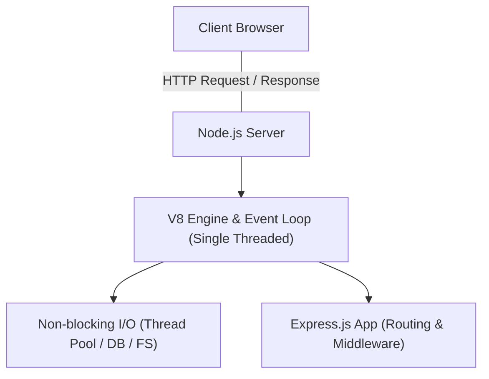

# Web Programming - Unit 07: Back-end Web Development with Node.JS & Express.JS

## Part 1: Macro Architecture & Technology Overview

สถาปัตยกรรมเซิร์ฟเวอร์แบบดั้งเดิม (เช่น Apache/PHP) ใช้รูปแบบ **Thread-per-Request** ซึ่งจะสร้าง Thread ใหม่ทุกครั้งที่มี Request เข้ามา ทำให้สิ้นเปลืองทรัพยากรเมื่อมีทราฟฟิกสูง ในขณะที่ **Node.js** นำเสนอรูปแบบใหม่ผ่าน **Event-driven, Non-blocking I/O Model** บน **Google Chrome V8 Engine** ช่วยให้เซิร์ฟเวอร์แบบ Single-thread สามารถรองรับ Concurrent Requests จำนวนมากได้อย่างมีประสิทธิภาพ



### ตารางเปรียบเทียบการพัฒนาระบบ Back-End: Pure Node.js (`http`) vs Express.js Framework

| คุณสมบัติ (Feature) | Pure Node.js (`http` module) | Express.js Framework |
| :--- | :--- | :--- |
| **ความซับซ้อนของโค้ด** | สูง (ต้องจัดการ Low-level HTTP เอง) | ต่ำ (มี Abstraction Layer ช่วยอ่านง่าย) |
| **ระบบการทำ Routing** | เขียน `if/else` เช็ก `req.url` และ `req.method` เอง | มี `app.get()`, `app.post()`, `app.put()`, `app.delete()` |
| **การให้บริการ Static Files** | ต้องอ่านไฟล์ด้วย `fs.readFile` และตั้ง Content-Type เอง | ใช้บรรทัดเดียว: `app.use(express.static('public'))` |
| **สถาปัตยกรรมแบบ Middleware** | ไม่มี ต้องเขียนฟังก์ชันควบคุมเอง | รองรับ Middleware Chain (`req, res, next`) ในตัว |
| **การส่งตอบกลับ (Response)** | ต้องระบุ `res.writeHead()` และ `res.end()` | มีเมธอดสะดวก เช่น `res.send()`, `res.json()`, `res.status()` |

---

## Part 2: Module-by-Module Deep Dive

### 2.1 สถาปัตยกรรมและมโนทัศน์สำคัญ (Core Concepts)
* **V8 Engine:** เอนจินตีความภาษา JavaScript ประสิทธิภาพสูงจาก Google Chrome นำมาใช้นอกเบราว์เซอร์
* **Non-blocking I/O & Event Loop:** การทำงานแบบ Asynchronous ที่ไม่หยุดรอการอ่าน/เขียนไฟล์ หรือคำสั่งฐานข้อมูล แต่จะมอบหมายงานให้ Background I/O ทำ แล้วกลับมารับผลลัพธ์ผ่าน Callback/Event
* **npm (Node Package Manager):** เครื่องมือจัดการไลบรารีและแพ็กเกจเสริม
  * `package.json`: ไฟล์กำหนดโครงสร้างและ Dependencies ของโปรเจกต์ (สร้างด้วย `npm init -y`)
  * `node_modules`: โฟลเดอร์เก็บไลบรารีที่ดาวน์โหลดจาก npm

### 2.2 โครงสร้าง Express.js และ Middleware Chain
* **Express Architecture:** Framework น้ำหนักเบาที่จัดการ HTTP Pipeline ผ่านฟังก์ชัน **Middleware**
* **โครงสร้างพารามิเตอร์ `callback(req, res, next)`:**
  * **`req` (Request Object):** อ็อบเจกต์เก็บข้อมูลคำขอที่ส่งมาจาก Client
    * `req.query`: อ่าน Query Parameters จาก URL (เช่น `?category=books`)
    * `req.params`: อ่าน Route Parameters (เช่น `/users/:id`)
    * `req.body`: อ่านข้อมูล Body จาก POST/PUT Request (ต้องใช้ Body-parser Middleware)
  * **`res` (Response Object):** อ็อบเจกต์จัดการการส่งคำตอบกลับ
    * `res.send()`: ส่งข้อความ/HTML (กำหนด Content-Type อัตโนมัติ)
    * `res.json()`: ส่งข้อความโครงสร้าง JSON
    * `res.status(code)`: กำหนด HTTP Status Code (เช่น 200, 404, 500)
  * **`next()`:** ฟังก์ชันส่งต่อการทำงานไปยัง Middleware ถัดไปใน Pipeline

---

### 2.3 คำสั่ง Command Line สำหรับการตั้งค่าระบบ (Environment & Setup Commands)

```bash
# 1. สร้างโฟลเดอร์โปรเจกต์และย้ายเข้าไป
mkdir my-backend-app
cd my-backend-app

# 2. เริ่มต้นสร้างไฟล์ package.json
npm init -y

# 3. ติดตั้ง Express Framework
npm install express

# 4. ติดตั้ง nodemon สำหรับการพัฒนา (Auto-restart Server เมื่อโค้ดเปลี่ยน)
npm install -g nodemon

# 5. รันโปรเจกต์
node index.js
# หรือรันผ่าน nodemon
nodemon index.js
```

---

### 2.4 โค้ดตัวอย่างการใช้งานจริง (Implementation Code)

#### แบบที่ 1: Pure Node.js Web Server (`http` + `fs` modules)

```javascript
// server_pure.js
const http = require('http');
const fs = require('fs');
const path = require('path');

const PORT = 3000;

const server = http.createServer((req, res) => {
    console.log(`[Request] Method: ${req.method}, URL: ${req.url}`);

    // Basic Routing
    if (req.url === '/' || req.url === '/home') {
        res.writeHead(200, { 'Content-Type': 'text/html; charset=utf-8' });
        res.end('<h1>ยินดีต้อนรับสู่หน้าหลัก (Pure Node.js)</h1>');
    } 
    else if (req.url === '/about') {
        res.writeHead(200, { 'Content-Type': 'text/html; charset=utf-8' });
        res.end('<h1>หน้าเกี่ยวกับเรา (About Page)</h1>');
    } 
    else if (req.url === '/api/data') {
        res.writeHead(200, { 'Content-Type': 'application/json' });
        res.end(JSON.stringify({ status: 'success', message: 'Hello from Pure Node.js API' }));
    } 
    else {
        res.writeHead(404, { 'Content-Type': 'text/html; charset=utf-8' });
        res.end('<h1>404 Not Found - ไม่พบหน้าที่ต้องการ</h1>');
    }
});

server.listen(PORT, () => {
    console.log(`Pure Node.js Server running on http://localhost:${PORT}`);
});
```

#### แบบที่ 2: Express.js Web Application (Routing + Middleware + Static Files)

```javascript
// server_express.js
const express = require('express');
const path = require('path');

const app = express();
const PORT = 3000;

// 1. Built-in Middleware สำหรับอ่าน JSON และ Form Body
app.use(express.json());
app.use(express.urlencoded({ extended: true }));

// 2. Static File Middleware: ให้บริการไฟล์สถิตจากโฟลเดอร์ 'public'
app.use(express.static(path.join(__dirname, 'public')));

// 3. Custom Logger Middleware
app.use((req, res, next) => {
    console.log(`[${new Date().toISOString()}] ${req.method} ${req.url}`);
    next(); // ส่งต่อไปยัง Route Handler ถัดไป
});

// 4. Express Routes
app.get('/', (req, res) => {
    res.send('<h1>ยินดีต้อนรับสู่ Express.js Web Server</h1>');
});

// GET Route พร้อม Query Parameters (เช่น /search?keyword=laptop)
app.get('/search', (req, res) => {
    const keyword = req.query.keyword || 'All';
    res.json({
        message: "ผลการค้นหา",
        searchKeyword: keyword
    });
});

// GET Route พร้อม Route Parameters (เช่น /products/101)
app.get('/products/:id', (req, res) => {
    const productId = req.params.id;
    res.json({
        status: "success",
        productId: productId,
        productName: `Product Item #${productId}`
    });
});

// 5. 404 Handler Middleware (ต้องไว้ล่างสุดเสมอ)
app.use((req, res) => {
    res.status(404).send('<h2>404 Page Not Found (Express)</h2>');
});

// เริ่มทำงานเซิร์ฟเวอร์
app.listen(PORT, () => {
    console.log(`Express.js App is running on http://localhost:${PORT}`);
});
```

---

### 2.5 การวิเคราะห์โจทย์ตัวอย่าง (Assignment Case Analysis)

**โจทย์:** จงสร้าง RESTful API ด้วย Express.js สำหรับระบบจัดการข้อมูลหนังสือ (Book Inventory) โดยรองรับ:
1. `GET /api/books`: คืนค่ารายการหนังสือทั้งหมด
2. `GET /api/books/:id`: คืนค่าข้อมูลหนังสือตาม ID
3. `POST /api/books`: เพิ่มหนังสือใหม่เข้าระบบ
4. ให้บริการไฟล์สถิตหน้าเว็บ (HTML/CSS) ผ่านโฟลเดอร์ `public`

```javascript
const express = require('express');
const app = express();

app.use(express.json());
app.use(express.static('public'));

// Mock Database
let books = [
    { id: 1, title: "Web Programming Fundamentals", price: 350 },
    { id: 2, title: "Node.js & Express Deep Dive", price: 420 }
];

// 1. GET ทั้งหมด
app.get('/api/books', (req, res) => {
    res.json(books);
});

// 2. GET ตาม ID
app.get('/api/books/:id', (req, res) => {
    const bookId = parseInt(req.params.id);
    const book = books.find(b => b.id === bookId);
    if (!book) {
        return res.status(404).json({ error: "Book not found" });
    }
    res.json(book);
});

// 3. POST เพิ่มหนังสือ
app.post('/api/books', (req, res) => {
    const { title, price } = req.body;
    if (!title || !price) {
        return res.status(400).json({ error: "Title and price are required" });
    }
    const newBook = {
        id: books.length + 1,
        title: title,
        price: Number(price)
    };
    books.push(newBook);
    res.status(201).json(newBook);
});

app.listen(3000, () => console.log("Book API Server ready on port 3000"));
```

---

## Part 3: Quick Reference & Exam Cheat Sheet

### Checklist สรุปหัวใจสำคัญก่อนสอบ
* [ ] **Single Threaded Non-blocking I/O:** Node.js ใช้ Single Thread ในการรัน Event Loop แต่จัดการ Asynchronous I/O ได้ดีเยี่ยมโดยไม่บล็อกการทำงาน
* [ ] **`require()` vs `import`:** Pure Node.js ใช้ CommonJS (`require()`) เป็นค่าเริ่มต้น
* [ ] **`req.query` vs `req.params`:**
  * `req.query`: ดึงค่าจาก Query String เช่น `?id=1` $\rightarrow$ `{ id: '1' }`
  * `req.params`: ดึงค่าจาก Route Path เช่น `/users/:id` $\rightarrow$ `{ id: '1' }`
* [ ] **Middleware Concept:** ฟังก์ชันที่มีพารามิเตอร์ `(req, res, next)` ต้องเรียก `next()` เสมอหากไม่ใช่ฟังก์ชันสุดท้ายที่ส่ง Response
* [ ] **Static File Serving:** Express ใช้ `app.use(express.static('public'))` ในการเปิดให้ไคลเอ็นต์เข้าถึงไฟล์ในโฟลเดอร์ `public` ได้โดยตรง
* [ ] **Status Codes:** `200` (OK), `201` (Created), `400` (Bad Request), `404` (Not Found), `500` (Internal Server Error)

---

## เอกสารเชื่อมโยง (Wiki-Style Backlinks)
* **วิชาและหัวข้อที่เกี่ยวข้อง:**
  * [[Web Programming - Unit 06 Web Data with JSON and Local Storage]] (การสื่อสารผ่าน JSON ระหว่าง Express API และ Client Storage)
  * [[Database Normalization Summary]] (การออกแบบฐานข้อมูลเพื่อนำมาเชื่อมต่อกับ Node.js Back-End)
  * [[Data & AI Engineer Skill Matrix]] (ทักษะ Back-End Development, RESTful APIs, และ Microservices Architecture)
