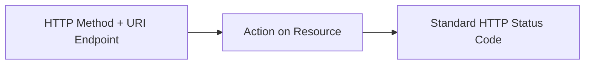

# Web Programming - Unit 10: Web Services and REST API with Node.JS

## Part 1: Macro Architecture & Technology Overview

**Web Service** คือวิธีการมาตรฐานที่ช่วยให้ซอฟต์แวร์หรือแอปพลิเคชันต่างระบบ สามารถสื่อสารและแลกเปลี่ยนข้อมูลระหว่างกันผ่านเครือข่ายอินเทอร์เน็ตโดยไม่ขึ้นกับภาษาโปรแกรมหรือระบบปฏิบัติการ สถาปัตยกรรม Web Services มีโครงสร้างบทบาทหลัก 3 ส่วนตามมาตรฐาน W3C:

```mermaid
flowchart TD
    Reg["Service Registry<br>(UDDI / API Gateway / Directory)"]
    Prov["Service Provider"] -->|1. Publish Service| Reg
    Req["Service Requestor (Client)"] -->|2. Find / Discover Service| Reg
    Req ---|3. Bind & Execute (HTTP REST / SOAP)| Prov
```

1. **Service Provider:** ผู้ให้บริการที่พัฒนาและเผยแพร่เว็บเซิร์ฟเวอร์
2. **Service Requestor:** ไคลเอ็นต์ผู้บริโภคที่เรียกใช้บริการ
3. **Service Registry:** ศูนย์กลางลงทะเบียนสำหรับค้นหาและเผยแพร่บริการ
4. **3 การปฏิบัติการหลัก:** **Publish** (ลงทะเบียนบริการ), **Find** (ค้นหาบริการ), และ **Bind** (เชื่อมต่อผูกสายเพื่อเรียกใช้บริการ)

### ตารางเปรียบเทียบสถาปัตยกรรมเว็บเซิร์ฟเวอร์: SOAP vs REST

| คุณสมบัติ (Feature) | SOAP (Simple Object Access Protocol) | REST (Representational State Transfer) |
| :--- | :--- | :--- |
| **กระบวนทัศน์ (Paradigm)** | โปรโตคอลมาตรฐานเข้มงวด (Web Services 1.0) | รูปแบบสถาปัตยกรรมยืดหยุ่น (Web Services 2.0) |
| **รูปแบบข้อมูล (Data Format)** | **XML เท่านั้น** (ครอบด้วย SOAP Envelope) | รองรับ **JSON (นิยมที่สุด)**, XML, Text, HTML |
| **โปรโตคอลการขนส่ง (Transport)** | HTTP, HTTPS, SMTP, FTP | **HTTP / HTTPS เท่านั้น** |
| **ความอธิบายตนเอง (Description)** | ต้องใช้ไฟล์ **WSDL** ในการอธิบายโครงสร้าง | ใช้จุดบริการ (URIs) และ HTTP Verbs ที่เป็นสากล |
| **น้ำหนักและประสิทธิภาพ** | น้ำหนักมาก (Heavyweight/Verbosity สูง) | น้ำหนักเบา (Lightweight), ปรับขยายขนาดง่าย (Scalable) |

---

## Part 2: Module-by-Module Deep Dive

### 2.1 นิยามและหลักการออกแบบ RESTful API (REST Constraints)
* **Resource (ทรัพยากร):** ข้อมูลหรือเอนทิตีทุกอย่างที่ API สามารถให้บริการได้ เช่น User, Product, Image โดยระบุด้วย **URI (Uniform Resource Identifier)**
* **State (สถานะ):** ข้อมูลหรือเงื่อนไขปัจจุบันของ Resource ณ เวลาใดเวลาหนึ่ง
* **Transfer (การส่งโอน):** การส่งมอบตัวแทนของสถานะ (JSON Representation) จากเซิร์ฟเวอร์ไปยังไคลเอ็นต์

#### 6 กฎเหล็กของสถาปัตยกรรม REST (REST Architectural Constraints):
1. **Client-Server Architecture:** แยกบทบาทการทำงานระหว่าง UI ฝั่งไคลเอ็นต์ และการจัดเก็บข้อมูลฝั่งเซิร์ฟเวอร์ออกจากกันอย่างเด็ดขาด
2. **Statelessness (ไร้สถานะ):** ทุก Request จากไคลเอ็นต์ต้องมีข้อมูลสมบูรณ์ในตัวเอง เซิร์ฟเวอร์จะไม่เก็บ Session Context ของไคลเอ็นต์ไว้ระหว่างคำขอ
3. **Uniform Interface:** ใช้มาตรฐานเดียวกันในการจัดการทรัพยากร (HTTP Verbs + URIs)
4. **Cacheable:** คำตอบรับ (Response) ต้องระบุว่าสามารถแคชข้อมูลได้หรือไม่
5. **Layered System:** ไคลเอ็นต์ไม่จำเป็นต้องทราบว่าเชื่อมต่อกับเซิร์ฟเวอร์ปลายทางโดยตรงหรือผ่าน Proxy/Load Balancer
6. **Code on Demand (Optional):** เซิร์ฟเวอร์สามารถส่งโค้ดมาให้ไคลเอ็นต์รันชั่วคราวได้

---

### 2.2 แมปปิ้ง HTTP Methods กับการจัดการทรัพยากร (CRUD & Endpoint Matrix)



| HTTP Method | การทำงานเทียบเท่า CRUD | ผลลัพธ์บน Collection Endpoint (เช่น `/api/v1/products`) | ผลลัพธ์บน Single Resource Endpoint (เช่น `/api/v1/products/101`) |
| :--- | :--- | :--- | :--- |
| **`GET`** | **Read** (อ่าน) | `200 OK` คืนรายการทรัพยากรทั้งหมด (ควรทำ Pagination) | `200 OK` คืนข้อมูลทรัพยากรชิ้นนั้น หรือ `404 Not Found` |
| **`POST`** | **Create** (สร้าง) | `201 Created` สร้างทรัพยากรใหม่ในชุดข้อมูล | `405 Method Not Allowed` (ห้ามใช้ POST กับ Single Resource) |
| **`PUT`** | **Update / Replace** | `405 Method Not Allowed` (ห้ามใช้แทนที่ทั้ง Collection) | `200 OK` หรือ `204 No Content` อัปเดตแทนที่ข้อมูลเดิม |
| **`DELETE`** | **Delete** (ลบ) | `405 Method Not Allowed` (ป้องกันการลบทั้ง Collection) | `200 OK` หรือ `204 No Content` ลบรายการนั้นออก |

---

### 2.3 คำสั่งตั้งค่าสภาพแวดล้อม (Environment & Setup Commands)

```bash
# 1. ติดตั้ง Express Framework และ CORS Middleware
npm install express cors body-parser

# 2. ติดตั้ง nodemon สำหรับสภาพแวดล้อมการพัฒนา
npm install -g nodemon
```

---

### 2.4 โค้ดตัวอย่างการใช้งานจริง (Implementation Code)

#### การสร้าง RESTful Web API ตามสถาปัตยกรรม REST (`server_api.js`)

```javascript
const express = require('express');
const cors = require('cors');

const app = express();
const PORT = 3000;

// 1. Middlewares
app.use(cors()); // อนุญาต Cross-Origin Resource Sharing
app.use(express.json()); // อ่าน JSON Request Body

// Mock Data Source (In-Memory Resource Collection)
let products = [
    { id: 1, name: "Gaming Mouse", price: 1200, category: "Electronics" },
    { id: 2, name: "Mechanical Keyboard", price: 3500, category: "Electronics" }
];

// =================================================================
// 1. COLLECTION ENDPOINTS: /api/v1/products
// =================================================================

// GET /api/v1/products -> อ่านรายการสินค้าทั้งหมด
app.get('/api/v1/products', (req, res) => {
    // รองรับ Query Parameters สำหรับ Filtering
    const category = req.query.category;
    if (category) {
        const filtered = products.filter(p => p.category.toLowerCase() === category.toLowerCase());
        return res.status(200).json({ status: "success", count: filtered.length, data: filtered });
    }
    
    res.status(200).json({
        status: "success",
        count: products.length,
        data: products
    });
});

// POST /api/v1/products -> สร้างสินค้าใหม่เข้าระบบ
app.post('/api/v1/products', (req, res) => {
    const { name, price, category } = req.body;
    
    // Validation
    if (!name || !price) {
        return res.status(400).json({ status: "error", message: "กรุณาระบุ name และ price" });
    }

    const newProduct = {
        id: products.length > 0 ? products[products.length - 1].id + 1 : 1,
        name: name,
        price: Number(price),
        category: category || "General"
    };

    products.push(newProduct);

    // ส่ง Status 201 Created พร้อมระบุ Location Header
    res.status(201)
       .header('Location', `/api/v1/products/${newProduct.id}`)
       .json({ status: "success", message: "สร้างทรัพยากรใหม่สำเร็จ", data: newProduct });
});

// ห้ามใช้ PUT / DELETE บน Collection
app.put('/api/v1/products', (req, res) => {
    res.status(405).json({ status: "error", message: "405 Method Not Allowed - ห้ามอัปเดตแบบทั้ง Collection" });
});
app.delete('/api/v1/products', (req, res) => {
    res.status(405).json({ status: "error", message: "405 Method Not Allowed - ห้ามลบข้อมูลทั้ง Collection" });
});


// =================================================================
// 2. SINGLE RESOURCE ENDPOINTS: /api/v1/products/:id
// =================================================================

// GET /api/v1/products/:id -> ดึงข้อมูลสินค้าตาม ID
app.get('/api/v1/products/:id', (req, res) => {
    const id = parseInt(req.params.id);
    const product = products.find(p => p.id === id);

    if (!product) {
        return res.status(404).json({ status: "fail", message: "ไม่พบทรัพยากรที่ระบุ" });
    }

    res.status(200).json({ status: "success", data: product });
});

// PUT /api/v1/products/:id -> แทนที่/อัปเดตข้อมูลสินค้า
app.put('/api/v1/products/:id', (req, res) => {
    const id = parseInt(req.params.id);
    const productIndex = products.findIndex(p => p.id === id);

    if (productIndex === -1) {
        return res.status(404).json({ status: "fail", message: "ไม่พบทรัพยากรที่ต้องการอัปเดต" });
    }

    const { name, price, category } = req.body;
    
    // อัปเดตแทนที่ข้อมูล
    products[productIndex] = {
        id: id,
        name: name || products[productIndex].name,
        price: price ? Number(price) : products[productIndex].price,
        category: category || products[productIndex].category
    };

    res.status(200).json({ status: "success", message: "อัปเดตทรัพยากรสำเร็จ", data: products[productIndex] });
});

// DELETE /api/v1/products/:id -> ลบทรัพยากรออก
app.delete('/api/v1/products/:id', (req, res) => {
    const id = parseInt(req.params.id);
    const productIndex = products.findIndex(p => p.id === id);

    if (productIndex === -1) {
        return res.status(404).json({ status: "fail", message: "ไม่พบทรัพยากรที่ต้องการลบ" });
    }

    products.splice(productIndex, 1);
    res.status(200).json({ status: "success", message: "ลบทรัพยากรออกจากระบบเรียบร้อยแล้ว" });
});

// Catch-all Unhandled Routes
app.use((req, res) => {
    res.status(404).json({ status: "error", message: "API Endpoint ไม่ถูกต้อง" });
});

app.listen(PORT, () => console.log(`RESTful API Server is running on http://localhost:${PORT}`));
```

---

### 2.5 การวิเคราะห์โจทย์ตัวอย่าง (Assignment Case Analysis)

**โจทย์:** จงวิเคราะห์ว่าเหตุใดการออกแบบจุดบริการ API ต่อไปนี้จึงผิดหลักการสถาปัตยกรรม RESTful API และเสนอการออกแบบที่ถูกต้องตามสากล

* **การออกแบบที่ผิด (Non-RESTful Endpoint Design):**
  * `GET /api/get_all_products`
  * `POST /api/create_new_product`
  * `POST /api/delete_product_by_id?id=5`

**การวิเคราะห์และการปรับปรุง (RESTful Design Rules):**
1. **สาเหตุที่ผิด:** สถาปัตยกรรม REST ใช้ **Nouns (คำนาม)** ในการระบุชื่อทรัพยากร (Resource) และใช้ **HTTP Verbs (กริยา)** ในการระบุกรรมวิธี การใส่ Verb เช่น `/get_all_` หรือ `/delete_` ใน URI เป็นรูปแบบของ RPC (Remote Procedure Call) ไม่ใช่ REST
2. **การปรับปรุงที่ถูกต้อง (RESTful Design):**
   * อ่านสินค้าทั้งหมด $\rightarrow$ **`GET /api/v1/products`**
   * สร้างสินค้าใหม่ $\rightarrow$ **`POST /api/v1/products`**
   * ลบสินค้า ID 5 $\rightarrow$ **`DELETE /api/v1/products/5`**

---

## Part 3: Quick Reference & Exam Cheat Sheet

### Checklist สรุปหัวใจสำคัญก่อนสอบ
* [ ] **REST Key Concepts:**
  * Resource = ตัวข้อมูล/เอนทิตี (ระบุด้วย Noun URI)
  * State = ข้อมูล ณ ปัจจุบัน
  * Transfer = การส่งโอนตัวแทนสถานะ (JSON)
* [ ] **REST Constraints:** Statelessness (ไร้สถานะ), Client-Server, Uniform Interface, Cacheable
* [ ] **HTTP Status Codes:**
  * `200 OK`: อ่าน/แก้ไข/ลบสำเร็จ
  * `201 Created`: สร้างทรัพยากรใหม่สำเร็จ (คืนค่า `Location` Header)
  * `400 Bad Request`: รูปแบบข้อมูลฝั่งไคลเอ็นต์ไม่ถูกต้อง
  * `404 Not Found`: ไม่พบ URI หรือ Resource ID
  * `405 Method Not Allowed`: ไม่อนุญาตให้ใช้ HTTP Method นั้นกับ Endpoint นั้น
  * `500 Internal Server Error`: ข้อผิดพลาดฝั่งเซิร์ฟเวอร์
* [ ] **SOAP vs REST:** SOAP เป็น Protocol ใช้ XML น้ำหนักมาก / REST เป็น Architectural Style ใช้ JSON น้ำหนักเบา

---

## เอกสารเชื่อมโยง (Wiki-Style Backlinks)
* **วิชาและหัวข้อที่เกี่ยวข้อง:**
  * [[Web Programming - Unit 06 Web Data with JSON and Local Storage]] (การส่งมอบ JSON Representation ใน REST API)
  * [[Web Programming - Unit 07 Back-end Web Development with Node.JS & Express.JS]] (การสร้าง Express Server และ Middleware)
  * [[Web Programming - Unit 08 MySQL Database Integration & EJS Template Engine]] (การนำ REST API ไปเชื่อมต่อกับ RDBMS)
  * [[Data & AI Engineer Skill Matrix]] (ทักษะด้าน RESTful API Design, Microservices, และ HTTP Protocols)
