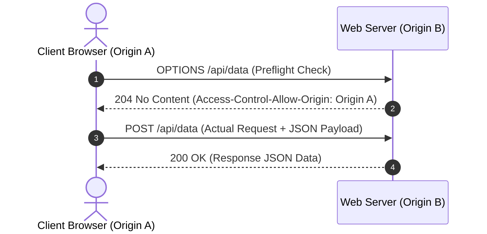

# Web Programming - Unit 11: Web Data Transfer through HTTP Methods and CORS

## Part 1: Macro Architecture & Technology Overview

โปรโตคอล **HTTP (Hypertext Transfer Protocol)** เป็นรากฐานสำคัญของการแลกเปลี่ยนข้อมูลบนเว็บ โดยมีคุณสมบัติพื้นฐานคือ **Stateless Protocol** (ไม่เก็บสถานะของคำขอก่อนหน้าไว้บนเซิร์ฟเวอร์) และทำงานตามสถาปัตยกรรม **Client-Server Model**

ในการรับส่งข้อมูลสำหรับ RESTful Web APIs การเลือกใช้ **HTTP Methods (Verbs)** ที่ถูกต้องเป็นหัวใจสำคัญในการระบุกรรมวิธีบนทรัพยากร (Resource) รวมถึงความเข้าใจเรื่องคุณสมบัติ **Safe**, **Idempotent**, และกลไกความปลอดภัย **CORS (Cross-Origin Resource Sharing)**



### ตารางสรุปเปรียบเทียบคุณสมบัติของ HTTP Methods (Master HTTP Methods Matrix)

| HTTP Method | การทำงาน (Action) | Safe (ไม่เปลี่ยน State) | Idempotent (ผลลัพธ์คงที่) | Request Body | Standard Response Status |
| :--- | :--- | :---: | :---: | :---: | :--- |
| **`GET`** | Read / Fetch Resource | **Yes** | **Yes** | No | `200 OK` |
| **`POST`** | Create New Resource | **No** | **No** | **Yes** (JSON/Form) | `201 Created` |
| **`PUT`** | Full Replace Resource | **No** | **Yes** | **Yes** (Full Object) | `200 OK` / `204 No Content` |
| **`PATCH`** | Partial Update Resource | **No** | **No / Depends** | **Yes** (Partial Data) | `200 OK` / `204 No Content` |
| **`DELETE`** | Remove Resource | **No** | **Yes** | No | `200 OK` / `204 No Content` / `404` |
| **`HEAD`** | Fetch Headers Only | **Yes** | **Yes** | No | `200 OK` (ไม่มี Body) |
| **`OPTIONS`** | CORS Preflight Check | **Yes** | **Yes** | No | `204 No Content` / `200 OK` |

---

## Part 2: Module-by-Module Deep Dive

### 2.1 มโนทัศน์สำคัญ (Core Concepts)
* **Safe Methods:** HTTP Method ที่ไม่ก่อให้เกิดการเปลี่ยนแปลงข้อมูลหรือสถานะบนเซิร์ฟเวอร์ (เช่น `GET`, `HEAD`, `OPTIONS`)
* **Idempotent Methods:** คุณสมบัติที่คำนวณว่า การเรียกใช้เมธอดเดิมซ้ำหลายๆ ครั้งด้วยข้อมูลชุดเดิม จะต้อง **ส่งผลต่อสถานะของเซิร์ฟเวอร์เท่ากับการเรียกใช้เพียงครั้งเดียว** (เช่น `GET`, `PUT`, `DELETE`)
  * `POST` **ไม่เป็น Idempotent** เพราะการยิงซ้ำจะสร้างข้อมูลซ้ำซ้อนขึ้นเรื่อยๆ
  * `PUT` **เป็น Idempotent** เพราะการแทนที่ข้อมูลด้วยชุดเดิม 10 ครั้ง ผลลัพธ์ใน DB ก็ยังคงเป็นข้อมูลชุดนั้น
* **Same-Origin Policy (SOP):** นโยบายความปลอดภัยพื้นฐานของเบราว์เซอร์ที่ห้ามการดึงข้อมูลข้ามจุดกำเนิด (ต่าง Scheme, Host, หรือ Port)
* **CORS Preflight Check (`OPTIONS`):** สำหรับ Request ที่ไม่ใช่ Simple Request (เช่น มีการใช้ `PUT`, `PATCH`, `DELETE` หรือส่ง Header `Authorization`) เบราว์เซอร์จะส่งคำขอ `OPTIONS` ไปถามเซิร์ฟเวอร์ล่วงหน้าเพื่อตรวจสอบสิทธิ์ก่อนส่งคำขอจริง

---

### 2.2 โค้ดตัวอย่างการใช้งานจริง (Implementation Code)

#### 1. การส่ง Request ฝั่ง Client ด้วย Fetch API (JavaScript Async/Await)

```javascript
// client_fetch.js - ฟังก์ชันจัดการ HTTP Methods ฝั่งไคลเอ็นต์

const API_BASE_URL = 'http://localhost:3000/api/users';

// 1. GET: ดึงข้อมูล (Safe, Idempotent, No Body)
async function getUser(id) {
    const res = await fetch(`${API_BASE_URL}/${id}`);
    if (!res.ok) throw new Error(`HTTP error! status: ${res.status}`);
    const data = await res.json();
    return data;
}

// 2. POST: สร้างข้อมูลใหม่ (Not Idempotent, Has Body)
async function createUser(userData) {
    const res = await fetch(API_BASE_URL, {
        method: 'POST',
        headers: { 'Content-Type': 'application/json' },
        body: JSON.stringify(userData)
    });
    if (!res.ok) throw new Error(`Failed to create: ${res.status}`);
    return await res.json(); // คืนค่า Object ที่สร้างเสร็จพร้อม ID
}

// 3. PUT: แทนที่ข้อมูลทั้งหมด (Idempotent, Requires ALL Fields)
async function replaceUser(id, fullUserData) {
    const res = await fetch(`${API_BASE_URL}/${id}`, {
        method: 'PUT',
        headers: { 'Content-Type': 'application/json' },
        body: JSON.stringify(fullUserData) // ต้องส่งทุก ฟิลด์ (name, email, role)
    });
    return await res.json();
}

// 4. PATCH: อัปเดตเฉพาะฟิลด์ที่เปลี่ยน (Partial Update, Bandwidth Efficient)
async function patchUser(id, partialChanges) {
    const res = await fetch(`${API_BASE_URL}/${id}`, {
        method: 'PATCH',
        headers: { 'Content-Type': 'application/json' },
        body: JSON.stringify(partialChanges) // ส่งเฉพาะ { email: "new@ex.com" }
    });
    return await res.json();
}

// 5. DELETE: ลบข้อมูล (Idempotent, Bearer Token Auth)
async function deleteUser(id, token) {
    const res = await fetch(`${API_BASE_URL}/${id}`, {
        method: 'DELETE',
        headers: {
            'Authorization': `Bearer ${token}`
        }
    });
    if (res.status === 204) return true; // Deleted successfully with No Content
    if (res.status === 404) return false; // Already deleted
    throw new Error(`Delete failed: ${res.status}`);
}
```

#### 2. การตั้งค่า CORS และจัด Route รับ HTTP Methods ฝั่ง Express.js Server

```javascript
// server_cors.js - เซิร์ฟเวอร์ Express ที่รองรับ CORS และ HTTP Methods
const express = require('express');
const cors = require('cors');

const app = express();
const PORT = 3000;

// 1. การตั้งค่า CORS แบบละเอียด (Handling Preflight OPTIONS Automatically)
const corsOptions = {
    origin: 'https://myapp.com', // อนุญาตเฉพาะโดเมนนี้ (หรือ '*' สำหรับทุกโดเมน)
    methods: ['GET', 'POST', 'PUT', 'PATCH', 'DELETE', 'OPTIONS'],
    allowedHeaders: ['Content-Type', 'Authorization'],
    maxAge: 86400 // Cache Preflight 24 ชั่วโมง
};

app.use(cors(corsOptions));
app.use(express.json());

// Mock Data Storage
let users = [
    { id: 42, name: "Alice", email: "alice@ex.com", role: "admin" }
];

// GET /api/users/:id
app.get('/api/users/:id', (req, res) => {
    const u = users.find(u => u.id === parseInt(req.params.id));
    u ? res.json(u) : res.status(404).json({ error: "User not found" });
});

// POST /api/users
app.post('/api/users', (req, res) => {
    const newUser = { id: Date.now(), ...req.body };
    users.push(newUser);
    res.status(201).json(newUser);
});

// PUT /api/users/:id (แทนที่ทั้งตัว)
app.put('/api/users/:id', (req, res) => {
    const id = parseInt(req.params.id);
    const index = users.findIndex(u => u.id === id);
    if (index === -1) return res.status(404).json({ error: "User not found" });
    
    // แทนที่ข้อมูลทั้งหมดด้วย req.body
    users[index] = { id, ...req.body };
    res.json(users[index]);
});

// PATCH /api/users/:id (แก้ไขบางฟิลด์)
app.patch('/api/users/:id', (req, res) => {
    const id = parseInt(req.params.id);
    const index = users.findIndex(u => u.id === id);
    if (index === -1) return res.status(404).json({ error: "User not found" });

    // รวมเฉพาะฟิลด์ที่ส่งมาแก้ไข (Merge Changes)
    users[index] = { ...users[index], ...req.body };
    res.json(users[index]);
});

// DELETE /api/users/:id
app.delete('/api/users/:id', (req, res) => {
    const id = parseInt(req.params.id);
    users = users.filter(u => u.id !== id);
    res.status(204).send(); // 204 No Content
});

app.listen(PORT, () => console.log(`CORS-enabled Server running on port ${PORT}`));
```

---

### 2.3 การวิเคราะห์โจทย์ตัวอย่าง (Assignment Case Analysis)

**โจทย์:** จงเปรียบเทียบความแตกต่างระหว่างการใช้ **`PUT`** และ **`PATCH`** ในการอัปเดตข้อมูลผู้ใช้ในระบบฐานข้อมูล พร้อมยกตัวอย่างกรณีการสูญหายของข้อมูล (Data Loss) หากเลือกใช้ผิดประเภท

**การวิเคราะห์เปรียบเทียบ (PUT vs PATCH Analysis):**
* **`PUT` (Full Replacement):**
  * สัญญาของ `PUT` คือการส่ง **ตัวแทนข้อมูลทั้งหมด (Complete Representation)** ไปแทนที่เอกสารเดิม
  * **ความเสี่ยง:** หากส่งข้อมูลเฉพาะฟิลด์ที่เปลี่ยน เช่น `{ email: "new@ex.com" }` ผ่านเมธอด `PUT` เซิร์ฟเวอร์ที่ปฏิบัติตามมาตรฐานจะทำการลบฟิลด์อื่นที่ไม่ได้ส่งมาทิ้งไป (เช่น `name`, `role` จะกลายเป็น `null` หรือหายไป)
* **`PATCH` (Partial Modification):**
  * ส่งเฉพาะ **ส่วนต่างที่แก้ไข (Delta/Changes)** เช่น `{ email: "new@ex.com" }`
  * เซิร์ฟเวอร์จะทำการอัปเดตเฉพาะฟิลด์ `email` โดยคงฟิลด์ `name` และ `role` ไว้ตามเดิม ประหยัดแบนด์วิดท์และป้องกันปัญหาข้อมูลสูญหาย

---

## Part 3: Quick Reference & Exam Cheat Sheet

### Checklist สรุปหัวใจสำคัญก่อนสอบ
* [ ] **Safe vs Idempotent:**
  * **Safe:** `GET`, `HEAD`, `OPTIONS` (ไม่แก้ข้อมูลในเซิร์ฟเวอร์)
  * **Idempotent:** `GET`, `PUT`, `DELETE`, `HEAD`, `OPTIONS` (ยิงซ้ำกี่ครั้ง ผลลัพธ์บน DB ยังเท่าเดิม)
  * **Non-Idempotent:** `POST` (ยิงซ้ำได้ข้อมูลซ้ำซ้อน)
* [ ] **`PUT` vs `PATCH`:** `PUT` แทนที่ทั้งหมด (ต้องส่งทุกฟิลด์) / `PATCH` แก้ไขเฉพาะจุด (ส่งเฉพาะฟิลด์ที่เปลี่ยน)
* [ ] **CORS Preflight Trigger:** เบราว์เซอร์จะส่ง `OPTIONS` อัตโนมัติเมื่อ:
  1. ใช้ HTTP Method นอกเหนือจาก `GET`, `HEAD`, `POST` (เช่น `PUT`, `PATCH`, `DELETE`)
  2. มีการตั้งค่า Custom Headers (เช่น `Authorization: Bearer <token>`)
* [ ] **CORS Key Headers:** `Access-Control-Allow-Origin`, `Access-Control-Allow-Methods`, `Access-Control-Allow-Headers`

---

## เอกสารเชื่อมโยง (Wiki-Style Backlinks)
* **วิชาและหัวข้อที่เกี่ยวข้อง:**
  * [[Web Programming - Unit 10 Web Services and REST API with Node.JS]] (สถาปัตยกรรม RESTful API และการออกแบบ Endpoints)
  * [[Web Programming - Unit 07 Back-end Web Development with Node.JS & Express.JS]] (การจัดการ Express Middleware และ CORS)
  * [[Web Programming - Unit 06 Web Data with JSON and Local Storage]] (การส่งต่อ HTTP Request/Response ด้วย JSON Payload)
  * [[Data & AI Engineer Skill Matrix]] (ทักษะด้าน HTTP Protocols, RESTful API Standards, และ Network Security)
