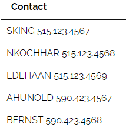

# แบบฝึกหัดและเฉลย SQL Lab 04: Basic SQL SELECT

## ข้อมูลทั่วไป
* **รหัสแบบฝึกหัด:** SQL-Lab-04
* **หัวข้อ:** Basic Querying (SELECT, Column Aliases, Arithmetic Expressions, String Concatenation, DISTINCT, ORDER BY)
* **แหล่งที่มา:** [DB Learning KMITL (Submission #106494)](https://dblearning.it.kmitl.ac.th/quiz/submission/106494)
* **วันที่ทำ:** 2026-08-27 09:44:28
* **ผลคะแนน:** ✅ ผ่าน (Passed) — 6/8 คะแนน
* **สถานที่บันทึก:** `AIOS/01 Learning/Learning Progress/SQL/SQL-Lab-04-SQL SELECT.md`

---

## สรุปภาพรวมหัวข้อที่ใช้ทดสอบ (Skills Matrix)

| ข้อที่ | รหัสโจทย์ | จุดประสงค์ / โจทย์ย่อ | ตารางที่เกี่ยวข้อง | คำสั่ง SQL หลัก | สถานะ |
|:---:|:---:|:---|:---|:---|:---:|
| **1** | #2584 | จงแสดงอีเมลและเบอร์โทรศัพท์ของพนักงานทุกคน (คั่นอีเมลและเ... | `employees` | `SELECT` | ✅ |
| **2** | #308 | จงแสดงชื่อและนามสกุลของพนักงาน (คั่นชื่อและนามสกุลด้วย wh... | `employees` | `SELECT` | ✅ |
| **3** | #2586 | จงแสดงรหัสประเทศ และรหัสภูมิภาคทั้งหมด เรียงผลลัพธ์ด้วยชื... | `countries` | `SELECT` | ✅ |
| **4** | #3101 | จงแสดงชื่อเต็มของพนักงานและเงินคอมมิชชั่นสุทธิของพนักงานค... | `employees` | `SELECT` | ✅ |
| **5** | #3102 | จงแสดงข้อมูลงานทั้งหมดในตาราง และค่าบ่งชี้เงินเดือนของแต่... | `jobs` | `SELECT` | ❌ |
| **6** | #3103 | จงแสดงรหัสงานของพนักงานจากตารางพนักงาน โดยไม่แสดงแถวที่มี... | `employees` | `SELECT` | ❌ |
| **7** | #3104 | เขียน SQL statement แสดงข้อมูลแผนกทั้งหมด เรียงผลลัพธ์ด้ว... | `departments` | `SELECT` | ✅ |
| **8** | #3105 | จงแสดงข้อมูลรายละเอียดโดยย่อของพนักงาน โดยหาจากชื่อจริง ค... | `employees` | `SELECT` | ✅ |

---

## รายการโจทย์ วิธีคิด และคำตอบ

### ข้อที่ 1: จงแสดงอีเมลและเบอร์โทรศัพท์ของพนักงานทุกคน (คั่นอีเมลและเบอร์โทรศัพท์ด้วย whi... (Question #2584)

* **โจทย์:** จงแสดงอีเมลและเบอร์โทรศัพท์ของพนักงานทุกคน (คั่นอีเมลและเบอร์โทรศัพท์ด้วย whitespace) ตั้งชื่อคอลัมน์ว่า Contact

* **ภาพตัวอย่างผลลัพธ์ (Sample Output):**

*([ดูภาพต้นฉบับออนไลน์](https://dblearning.it.kmitl.ac.th/uploads/images/question/2584/Capture.PNG))*

* **SQL Query (คำตอบที่ถูกต้อง):**
```sql
SELECT concat(email, ' ', phone_number) Contact
FROM employees;
```

<details>
<summary>💡 ดูคำตอบที่ส่งตรวจ (User Submission)</summary>

```sql
select concat(email , " " , phone_number)"Contact"
from employees
```

</details>

---

### ข้อที่ 2: จงแสดงชื่อและนามสกุลของพนักงาน (คั่นชื่อและนามสกุลด้วย whitespace) ตั้งชื่อคอ... (Question #308)

* **โจทย์:** จงแสดงชื่อและนามสกุลของพนักงาน (คั่นชื่อและนามสกุลด้วย whitespace) ตั้งชื่อคอลัมน์ว่า full name
**\*ตัวอย่างบางส่วนจากคำตอบ**

* **โครงสร้างตาราง / ตัวอย่างข้อมูล:**

| **full name** |
| --- |
| Steven King |
| Neena Kochhar |
| Lex De Haan |
| Alexander Hunold |
| Bruce Ernst |


* **SQL Query (คำตอบที่ถูกต้อง):**
```sql
select concat(first_name, ' ', last_name) 'full name'
from employees;
```

<details>
<summary>💡 ดูคำตอบที่ส่งตรวจ (User Submission)</summary>

```sql
select concat(first_name , " " , last_name)"full name"
from employees
```

</details>

---

### ข้อที่ 3: จงแสดงรหัสประเทศ และรหัสภูมิภาคทั้งหมด เรียงผลลัพธ์ด้วยชื่อประเทศจาก Z-A (Question #2586)

* **โจทย์:** จงแสดงรหัสประเทศ และรหัสภูมิภาคทั้งหมด เรียงผลลัพธ์ด้วยชื่อประเทศจาก Z-A

* **SQL Query (คำตอบที่ถูกต้อง):**
```sql
SELECT country_id,region_id
FROM countries
ORDER BY country_name DESC;
```

<details>
<summary>💡 ดูคำตอบที่ส่งตรวจ (User Submission)</summary>

```sql
select country_id , region_id
from countries
order by country_name desc
```

</details>

---

### ข้อที่ 4: จงแสดงชื่อเต็มของพนักงานและเงินคอมมิชชั่นสุทธิของพนักงานคนนั้น เรียงผลลัพธ์ด้... (Question #3101)

* **โจทย์:** จงแสดงชื่อเต็มของพนักงานและเงินคอมมิชชั่นสุทธิของพนักงานคนนั้น เรียงผลลัพธ์ด้วย Net Commission จากมากไปน้อย (แสดงผลลัพธ์พนักงานทุกคนที่ได้รับและไม่ได้รับค่าคอมมิชชั่น)
หมายเหตุ ชื่อเต็มคือ ชื่อจริงและนามสกุลคั่นด้วย whitespace และตั้งชื่อคอลัมน์ว่า Employee name
เงินคอมมิชชั่นสุทธิ คำนวณจาก ค่าคอมมิชชั่นคูณเงินเดือนของพนักงานคนนั้น และตั้งชื่อคอลัมน์ว่า Net Commission
ตัวอย่างบางส่วนจากคำตอบ

* **โครงสร้างตาราง / ตัวอย่างข้อมูล:**

| **Employee name** | **Net Commission** |
| --- | --- |
| John Russell | 5600.0000 |
| Karen Partners | 4050.0000 |
| Alberto Errazuriz | 3600.0000 |


* **SQL Query (คำตอบที่ถูกต้อง):**
```sql
select concat(first_name, ' ', last_name) 'Employee name', commission_pct*salary `Net Commission`
from employees
order by `Net Commission` DESC
```

<details>
<summary>💡 ดูคำตอบที่ส่งตรวจ (User Submission)</summary>

```sql
select concat(first_name,' ' ,last_name)"Employee name" , commission_pct * salary as "Net Commission"
from employees
order by commission_pct * salary desc
```

</details>

---

### ข้อที่ 5: จงแสดงข้อมูลงานทั้งหมดในตาราง และค่าบ่งชี้เงินเดือนของแต่ละงาน (Question #3102) *(ต้องทบทวน ⚠️)*

* **โจทย์:** จงแสดงข้อมูลงานทั้งหมดในตาราง และค่าบ่งชี้เงินเดือนของแต่ละงาน
หมายเหตุ ค่าบ่งชี้เงินเดือนคำนวณจากเงินเดือนสูงสุดลบเงินเดือนต่ำสุด หารด้วยค่าน้ำหนัก 1.25 และตั้งชื่อคอลัมน์ว่า index of salary
**\*** **ตัวอย่างบางส่วนจากคำตอบ**

* **โครงสร้างตาราง / ตัวอย่างข้อมูล:**

| **job\_id** | **job\_title** | **min\_salary** | **max\_salary** | **index of salary** |
| --- | --- | --- | --- | --- |
| AC\_ACCOUNT | Public Accountant | 4200 | 9000 | 3840.0000 |
| AC\_MGR | Accounting Manager | 8200 | 16000 | 6240.0000 |
| AD\_ASST | Administration Assistant | 3000 | 6000 | 2400.0000 |


* **SQL Query (คำตอบที่ถูกต้อง):**
```sql
select *, (max_salary-min_salary)/1.25 `index of salary`
from jobs
```

> [!WARNING] **วิเคราะห์ข้อผิดพลาด (Error Analysis):**
> * **ข้อความ Error จากระบบ:** `The result has some missing required columns.
(QID: 3102, UID: 4741)`
> * **สาเหตุและจุดที่ผิด:** ผลลัพธ์ขาดคอลัมน์ที่โจทย์ต้องการ (เช่น โจทย์สั่งให้แสดงคอลัมน์ทั้งหมดของตาราง `SELECT *` ร่วมกับคอลัมน์คำนวณ)
> * **คำตอบเดิมที่ส่ง:**
>   ```sql
>   select job_id , job_title , min_salary , max_salary , (max_salary - min_salary)/1.25 as index_of_salary
>   from jobs
>   ```
> * **แนวทางแก้ไข:** ตรวจสอบข้อกำหนดในโจทย์และคำตอบที่ถูกต้องด้านบนเพื่อเปรียบเทียบ syntax ที่ถูกต้อง

---

### ข้อที่ 6: จงแสดงรหัสงานของพนักงานจากตารางพนักงาน โดยไม่แสดงแถวที่มีข้อมูลซ้ำ (Question #3103) *(ต้องทบทวน ⚠️)*

* **โจทย์:** จงแสดงรหัสงานของพนักงานจากตารางพนักงาน โดยไม่แสดงแถวที่มีข้อมูลซ้ำ

* **SQL Query (คำตอบที่ถูกต้อง):**
```sql
SELECT distinct job_id
from employees;
```

> [!WARNING] **วิเคราะห์ข้อผิดพลาด (Error Analysis):**
> * **ข้อความ Error จากระบบ:** `Student query result missing some necessary rows.
(QID: 3103, UID: 4741)`
> * **สาเหตุและจุดที่ผิด:** คำตอบที่ส่งยังไม่ตรงตามเงื่อนไขหรือชนิดข้อมูลที่โจทย์ระบุ
> * **คำตอบเดิมที่ส่ง:**
>   ```sql
>   select distinct job_id
>   from jobs
>   ```
> * **แนวทางแก้ไข:** ตรวจสอบข้อกำหนดในโจทย์และคำตอบที่ถูกต้องด้านบนเพื่อเปรียบเทียบ syntax ที่ถูกต้อง

---

### ข้อที่ 7: เขียน SQL statement แสดงข้อมูลแผนกทั้งหมด เรียงผลลัพธ์ด้วยรหัสที่ตั้งจากน้อยไ... (Question #3104)

* **โจทย์:** เขียน SQL statement แสดงข้อมูลแผนกทั้งหมด เรียงผลลัพธ์ด้วยรหัสที่ตั้งจากน้อยไปมาก และแถวที่มีรหัสที่ตั้งเหมือนกันให้เรียงผลลัพธ์ด้วยรหัสผู้จัดการจากน้อยไปมาก

* **SQL Query (คำตอบที่ถูกต้อง):**
```sql
SELECT *
from departments
order by location_id,manager_id;
```

<details>
<summary>💡 ดูคำตอบที่ส่งตรวจ (User Submission)</summary>

```sql
select * from departments
order by location_id asc , manager_id asc
```

</details>

---

### ข้อที่ 8: จงแสดงข้อมูลรายละเอียดโดยย่อของพนักงาน โดยหาจากชื่อจริง คั่นด้วย white space ... (Question #3105)

* **โจทย์:** จงแสดงข้อมูลรายละเอียดโดยย่อของพนักงาน โดยหาจากชื่อจริง คั่นด้วย white space ตามหลังด้วยนามสกุล และ white space วงเล็บเปิด อีเมล วงเล็บปิด white space ตามด้วยคำว่า is white space และลงท้ายด้วยชื่อตำแหน่งงานของพนักงานคนนั้น เช่น Joe Joewa (jjoe) is AD\_VP และตั้งชื่อคอลัมน์ว่า short description
\*ตัวย่างบางส่วนจากคำตอบ

* **โครงสร้างตาราง / ตัวอย่างข้อมูล:**

| **short description** |
| --- |
| Steven King (SKING) is AD\_PRES |
| Neena Kochhar (NKOCHHAR) is AD\_VP |


* **SQL Query (คำตอบที่ถูกต้อง):**
```sql
select concat(first_name, ' ',last_name, ' (',email, ') is ',job_id) `short description`
from employees
```

<details>
<summary>💡 ดูคำตอบที่ส่งตรวจ (User Submission)</summary>

```sql
select concat(first_name , ' ' , last_name , ' (',email,') is ' , job_id)"short description"
from employees
```

</details>

---

## เอกสารเชื่อมโยง (Backlinks)
* **เนื้อหาอ้างอิงบทเรียน:**
  * [[LAB 5 - SQL SELECT with Conditions (WHERE, Operators, LIKE, NULL, ORDER BY)]] (การคัดกรองข้อมูลด้วย SELECT และการเรียงลำดับ)
