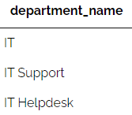
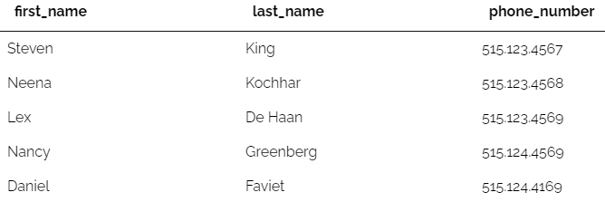
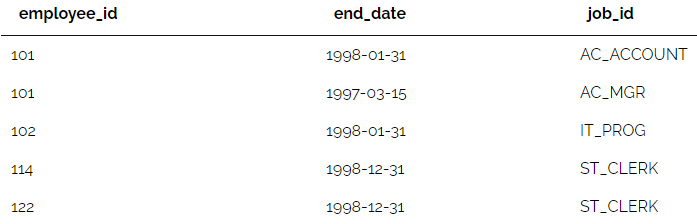
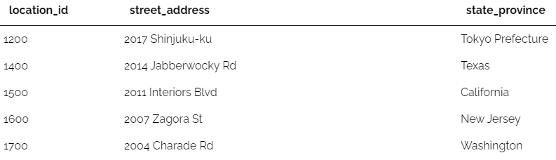
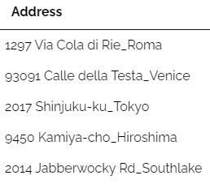

# แบบฝึกหัดและเฉลย SQL Lab 05: SQL SELECT with Conditions

## ข้อมูลทั่วไป
* **รหัสแบบฝึกหัด:** SQL-Lab-05
* **หัวข้อ:** Filtering Data (WHERE, Comparison Operators, Logical Operators AND/OR/NOT, LIKE, BETWEEN, IN, IS NULL)
* **แหล่งที่มา:** [DB Learning KMITL (Submission #106566)](https://dblearning.it.kmitl.ac.th/quiz/submission/106566)
* **วันที่ทำ:** 2026-09-02 15:14:24
* **ผลคะแนน:** ✅ ผ่าน (Passed) — 16/17 คะแนน
* **สถานที่บันทึก:** `AIOS/01 Learning/Learning Progress/SQL/SQL-Lab-05-SQL SELECT Condition.md`

---

## สรุปภาพรวมหัวข้อที่ใช้ทดสอบ (Skills Matrix)

| ข้อที่ | รหัสโจทย์ | จุดประสงค์ / โจทย์ย่อ | ตารางที่เกี่ยวข้อง | คำสั่ง SQL หลัก | สถานะ |
|:---:|:---:|:---|:---|:---|:---:|
| **1** | #1694 | จงแสดงชื่อจริง นามสกุล และเงินเดือนในรอบปีของพนักงาน โดยแ... | `employees` | `SELECT` | ✅ |
| **2** | #1696 | จงแสดงชื่อจริง นามสกุล และเงินเดือนของพนักงานที่ชื่อจริงข... | `employees` | `SELECT` | ✅ |
| **3** | #1697 | จงแสดงชื่อจริง นามสกุล และเงินเดือน ของพนักงานที่ไม่มีหัว... | `employees` | `SELECT` | ✅ |
| **4** | #1698 | จงแสดงชื่อประเทศ รหัสทวีป ของข้อมูลประเทศ โดยแสดงเฉพาะชื่... | `countries` | `SELECT` | ✅ |
| **5** | #1699 | จงแสดงรหัสงาน รหัสแผนก ของประวัติการทำงานที่มีพนักงานที่ส... | `job_history` | `SELECT` | ✅ |
| **6** | #1700 | จงแสดงข้อมูลพนักงานทั้งหมด ที่มีรหัสงานขึ้นต้นด้วย SA\_ ห... | `employees` | `SELECT` | ✅ |
| **7** | #1703 | จงแสดงชื่อถนนและที่อยู่ ชื่อเมือง และรหัสไปรษณีย์ จากข้อม... | `locations` | `SELECT` | ✅ |
| **8** | #1704 | จงแสดงชื่อถนนและที่อยู่ และรหัสประเทศของสถานที่ตั้งสำนักง... | `locations` | `SELECT` | ✅ |
| **9** | #1705 | จงแสดงชื่อเต็ม และเบอร์โทรศัพท์ ของพนักงานที่สามารถระบุค่... | `employees` | `SELECT` | ✅ |
| **10** | #1706 | จงแสดงชื่อจริง นามสกุล และเงินเดือนของพนักงาน แสดงเฉพาะรห... | `employees` | `SELECT` | ✅ |
| **11** | #2585 | จงแสดงชื่อแผนกทั้งหมดที่มีคำว่า IT อยู่ตำแหน่งแรกสุดของชื... | `departments` | `SELECT` | ✅ |
| **12** | #2587 | จงแสดงชื่อจริง นามสกุลและเบอร์โทรศัพท์ของพนักงานที่มีเบอร... | `employees` | `SELECT` | ✅ |
| **13** | #2588 | จงแสดงรหัสพนักงาน วันสุดท้ายที่ทำงานในแผนก และรหัสงานที่ม... | `job_history` | `SELECT` | ✅ |
| **14** | #2589 | จงแสดงรหัสพนักงาน ชื่อ นามสกุลของพนักงานและสัดส่วนค่านายห... | `employees` | `SELECT` | ❌ |
| **15** | #2590 | จงแสดง รหัสที่ตั้ง ชื่อถนนและที่อยู่ รัฐ/จังหวัด ของสถานท... | `locations` | `SELECT` | ✅ |
| **16** | #2591 | จงแสดง ที่อยู่และเมือง(คั่นด้วย underscore เช่น 2017 Shin... | `locations` | `SELECT` | ✅ |
| **17** | #2668 | เเสดงชื่อทางการค้าของยา เเละ เป็นยาสามัญหรือไม่ โดยแสดงเฉ... | `medicine` | `SELECT` | ✅ |

---

## รายการโจทย์ วิธีคิด และคำตอบ

### ข้อที่ 1: จงแสดงชื่อจริง นามสกุล และเงินเดือนในรอบปีของพนักงาน โดยแสดงเฉพาะพนักงานที่มี... (Question #1694)

* **โจทย์:** จงแสดงชื่อจริง นามสกุล และเงินเดือนในรอบปีของพนักงาน โดยแสดงเฉพาะพนักงานที่มีเงินเดือนในรอบปีมีค่ามากกว่า 30000 หมายเหตุเงินเดือนในรอบปีคำนวณจากเงินเดือนคูณ 12 และตั้งชื่อคอลัมน์ว่า Annual Salary
**\*ตัวอย่างบางส่วนจากคำตอบ**

* **โครงสร้างตาราง / ตัวอย่างข้อมูล:**

| **first\_name** | **last\_name** | **Annual Salary** |
| --- | --- | --- |
| Steven | King | 288000.00 |
| Neena | Kochhar | 204000.00 |
| Lex | De Haan | 204000.00 |
| Alexander | Hunold | 108000.00 |
| Bruce | Ernst | 72000.00 |


* **SQL Query (คำตอบที่ถูกต้อง):**
```sql
select first_name, last_name, salary*12 'Annual Salary'
from employees
where salary*12 > 30000;
```

<details>
<summary>💡 ดูคำตอบที่ส่งตรวจ (User Submission)</summary>

```sql
select first_name, last_name, (salary * 12) as "Annual Salary"
from employees
where (salary * 12) > 30000;
```

</details>

---

### ข้อที่ 2: จงแสดงชื่อจริง นามสกุล และเงินเดือนของพนักงานที่ชื่อจริงขึ้นต้นด้วยอักษร S แล... (Question #1696)

* **โจทย์:** จงแสดงชื่อจริง นามสกุล และเงินเดือนของพนักงานที่ชื่อจริงขึ้นต้นด้วยอักษร S และเรียงผลลัพธ์ด้วยชื่อจริงจาก A-Z

* **SQL Query (คำตอบที่ถูกต้อง):**
```sql
select first_name, last_name, salary
from employees
where first_name like 'S%'
ORDER BY first_name;
```

<details>
<summary>💡 ดูคำตอบที่ส่งตรวจ (User Submission)</summary>

```sql
select first_name, last_name, salary
from employees
where first_name like 'S%'
order by first_name asc;
```

</details>

---

### ข้อที่ 3: จงแสดงชื่อจริง นามสกุล และเงินเดือน ของพนักงานที่ไม่มีหัวหน้า (Question #1697)

* **โจทย์:** จงแสดงชื่อจริง นามสกุล และเงินเดือน ของพนักงานที่ไม่มีหัวหน้า
**\*ตัวอย่างคำตอบ**

* **โครงสร้างตาราง / ตัวอย่างข้อมูล:**

| **first\_name** | **last\_name** | **salary** |
| --- | --- | --- |
| Steven | King | 24000.00 |


* **SQL Query (คำตอบที่ถูกต้อง):**
```sql
select first_name, last_name, salary
from employees
where manager_id is null;
```

<details>
<summary>💡 ดูคำตอบที่ส่งตรวจ (User Submission)</summary>

```sql
select first_name , last_name , salary
from employees
where manager_id is null
```

</details>

---

### ข้อที่ 4: จงแสดงชื่อประเทศ รหัสทวีป ของข้อมูลประเทศ โดยแสดงเฉพาะชื่อประเทศที่ขึ้นต้นด้ว... (Question #1698)

* **โจทย์:** จงแสดงชื่อประเทศ รหัสทวีป ของข้อมูลประเทศ โดยแสดงเฉพาะชื่อประเทศที่ขึ้นต้นด้วย United เท่านั้น และเรียงผลลัพธ์ตามรหัสทวีปจากมากไปน้อย

* **SQL Query (คำตอบที่ถูกต้อง):**
```sql
select country_name, region_id
from countries
where country_name like 'United%'
order by region_id desc;
```

---

### ข้อที่ 5: จงแสดงรหัสงาน รหัสแผนก ของประวัติการทำงานที่มีพนักงานที่สิ้นสุดการทำงานก่อนวั... (Question #1699)

* **โจทย์:** จงแสดงรหัสงาน รหัสแผนก ของประวัติการทำงานที่มีพนักงานที่สิ้นสุดการทำงานก่อนวันที่ 30 มกราคม 2541 โดยเรียงผลลัพธ์ตามเลขรหัสพนักงานจากน้อยไปมาก หมายเหตุให้แปลง พ.ศ. เป็น ค.ศ ตามข้อมูลที่อยู่ในฐานข้อมูล

* **SQL Query (คำตอบที่ถูกต้อง):**
```sql
select job_id,department_id
from job_history
where end_date < '1998-01-30'
order by employee_id asc;
```

<details>
<summary>💡 ดูคำตอบที่ส่งตรวจ (User Submission)</summary>

```sql
select job_id, department_id
from job_history
where end_date < '1998-01-30'
order by employee_id asc;
```

</details>

---

### ข้อที่ 6: จงแสดงข้อมูลพนักงานทั้งหมด ที่มีรหัสงานขึ้นต้นด้วย SA\_ หรือ IT\_ (กำหนดให้ใช... (Question #1700)

* **โจทย์:** จงแสดงข้อมูลพนักงานทั้งหมด ที่มีรหัสงานขึ้นต้นด้วย SA\_ หรือ IT\_ (กำหนดให้ใช้ & ในการอ่านอักขระพิเศษ)
**\*ตัวอย่างบางส่วนจากคำตอบ**

* **โครงสร้างตาราง / ตัวอย่างข้อมูล:**

| **employee\_id** | **first\_name** | **last\_name** | **email** | **phone\_number** | **hire\_date** | **job\_id** | **salary** | **commission\_pct** | **manager\_id** | **department\_id** |
| --- | --- | --- | --- | --- | --- | --- | --- | --- | --- | --- |
| 103 | Alexander | Hunold | AHUNOLD | 590.423.4567 | 1990-01-03 | IT\_PROG | 9000.00 | *NULL* | 102 | 60 |
| 104 | Bruce | Ernst | BERNST | 590.423.4568 | 1991-05-21 | IT\_PROG | 6000.00 | *NULL* | 103 | 60 |
| 105 | David | Austin | DAUSTIN | 590.423.4569 | 1997-06-25 | IT\_PROG | 4800.00 | *NULL* | 103 | 60 |
| 106 | Valli | Pataballa | VPATABAL | 590.423.4560 | 1998-02-05 | IT\_PROG | 4800.00 | *NULL* | 103 | 60 |
| 107 | Diana | Lorentz | DLORENTZ | 590.423.5567 | 1999-02-07 | IT\_PROG | 4200.00 | *NULL* | 103 | 60 |


* **SQL Query (คำตอบที่ถูกต้อง):**
```sql
select *
from employees
where job_id like 'SA&_%' escape '&'
or job_id like 'IT&_%' escape '&';
```

<details>
<summary>💡 ดูคำตอบที่ส่งตรวจ (User Submission)</summary>

```sql
select * 
from employees
where job_id like 'IT&_%' escape '&'
   or job_id like 'SA&_%' escape '&';
```

</details>

---

### ข้อที่ 7: จงแสดงชื่อถนนและที่อยู่ ชื่อเมือง และรหัสไปรษณีย์ จากข้อมูลที่สถานที่ตั้งสำนั... (Question #1703)

* **โจทย์:** จงแสดงชื่อถนนและที่อยู่ ชื่อเมือง และรหัสไปรษณีย์ จากข้อมูลที่สถานที่ตั้งสำนักงาน โดยแสดงเฉพาะเมืองที่มีชื่อขึ้นต้นด้วย ตัว S ตามหลังด้วยตัวอักษรอีก 6 ตัวเท่านั้น และแสดงเฉพาะสถานที่ตั้งสำนักงานที่สามารถระบุ รัฐ/จังหวัดได้
**\*ตัวอย่างคำตอบ**

* **โครงสร้างตาราง / ตัวอย่างข้อมูล:**

| **street\_address** | **city** | **postal\_code** |
| --- | --- | --- |
| 2004 Charade Rd | Seattle | 98199 |


* **SQL Query (คำตอบที่ถูกต้อง):**
```sql
SELECT street_address, city, postal_code
from locations
where state_province is not null
and city like 'S______';
```

<details>
<summary>💡 ดูคำตอบที่ส่งตรวจ (User Submission)</summary>

```sql
select street_address, city, postal_code
from locations
where city like 'S______'
  and state_province is not null;
```

</details>

---

### ข้อที่ 8: จงแสดงชื่อถนนและที่อยู่ และรหัสประเทศของสถานที่ตั้งสำนักงาน โดยแสดงเฉพาะสถานท... (Question #1704)

* **โจทย์:** จงแสดงชื่อถนนและที่อยู่ และรหัสประเทศของสถานที่ตั้งสำนักงาน โดยแสดงเฉพาะสถานที่ตั้งสำนักงานที่มีรหัสไปรษณีย์ ขึ้นต้นด้วย 1 และลงท้ายด้วย 0
**\*ตัวอย่างคำตอบ**

* **โครงสร้างตาราง / ตัวอย่างข้อมูล:**

| **street\_address** | **country\_id** |
| --- | --- |
| 20 Rue des Corps-Saints | CH |


* **SQL Query (คำตอบที่ถูกต้อง):**
```sql
select street_address, country_id
from locations
where postal_code like '1%0';
```

---

### ข้อที่ 9: จงแสดงชื่อเต็ม และเบอร์โทรศัพท์ ของพนักงานที่สามารถระบุค่าคอมมิชชั่นได้และค่า... (Question #1705)

* **โจทย์:** จงแสดงชื่อเต็ม และเบอร์โทรศัพท์ ของพนักงานที่สามารถระบุค่าคอมมิชชั่นได้และค่าคอมมิชชั่นที่ได้รับนั้นจะต้องมากกว่าศูนย์
หมายเหตุ ชื่อเต็มคือชื่อจริงและนามสกุลคั่นด้วย whitespace ตั้งชื่อคอลัมน์ว่า full name และเบอร์โทรศัพท์ ตั้งชื่อคอลัมน์ว่า phone
**\*ตัวอย่างบางส่วนจากคำตอบ**

* **โครงสร้างตาราง / ตัวอย่างข้อมูล:**

| **full name** | **phone** |
| --- | --- |
| John Russell | 011.44.1344.429268 |
| Karen Partners | 011.44.1344.467268 |
| Alberto Errazuriz | 011.44.1344.429278 |
| Gerald Cambrault | 011.44.1344.619268 |
| Eleni Zlotkey | 011.44.1344.429018 |


* **SQL Query (คำตอบที่ถูกต้อง):**
```sql
select concat(first_name, ' ', last_name) 'full name', phone_number 'phone'
from employees
where commission_pct is not null and commission_pct > 0;
```

<details>
<summary>💡 ดูคำตอบที่ส่งตรวจ (User Submission)</summary>

```sql
select concat(first_name , ' ' , last_name)'full name' , phone_number as "phone"
from employees
where commission_pct is not null
and commission_pct >0
```

</details>

---

### ข้อที่ 10: จงแสดงชื่อจริง นามสกุล และเงินเดือนของพนักงาน แสดงเฉพาะรหัสงานที่ไม่ใช่ IT_PR... (Question #1706)

* **โจทย์:** จงแสดงชื่อจริง นามสกุล และเงินเดือนของพนักงาน แสดงเฉพาะรหัสงานที่ไม่ใช่ IT_PROG, AD_VP, AD_PRES โดยเรียงด้วยรหัสงานจาก Z-A (กำหนดไม่ให้ใช้ OR)

* **SQL Query (คำตอบที่ถูกต้อง):**
```sql
select first_name, last_name, salary
from employees
where job_id not in ('IT_PROG','AD_VP','AD_PRES')
order by job_id desc;
```

<details>
<summary>💡 ดูคำตอบที่ส่งตรวจ (User Submission)</summary>

```sql
select first_name , last_name , salary 
from employees
where job_id not in('IT_PROG', 'AD_VP', 'AD_PRES')
order by job_id desc;
```

</details>

---

### ข้อที่ 11: จงแสดงชื่อแผนกทั้งหมดที่มีคำว่า IT อยู่ตำแหน่งแรกสุดของชื่อแผนก (Question #2585)

* **โจทย์:** จงแสดงชื่อแผนกทั้งหมดที่มีคำว่า IT อยู่ตำแหน่งแรกสุดของชื่อแผนก

* **ภาพตัวอย่างผลลัพธ์ (Sample Output):**

*([ดูภาพต้นฉบับออนไลน์](https://dblearning.it.kmitl.ac.th/uploads/images/question/2585/Capture.PNG))*

* **SQL Query (คำตอบที่ถูกต้อง):**
```sql
SELECT department_name
FROM departments
WHERE department_name LIKE 'IT%';
```

<details>
<summary>💡 ดูคำตอบที่ส่งตรวจ (User Submission)</summary>

```sql
select department_name
from departments
where department_name like 'IT%'
```

</details>

---

### ข้อที่ 12: จงแสดงชื่อจริง นามสกุลและเบอร์โทรศัพท์ของพนักงานที่มีเบอร์โทรศัพท์ขึ้นต้นด้วย... (Question #2587)

* **โจทย์:** จงแสดงชื่อจริง นามสกุลและเบอร์โทรศัพท์ของพนักงานที่มีเบอร์โทรศัพท์ขึ้นต้นด้วย 515 หรือ นามสกุลมีอักษร e เป็นตัวอักษรที่ 2 ของนามสกุล

* **ภาพตัวอย่างผลลัพธ์ (Sample Output):**

*([ดูภาพต้นฉบับออนไลน์](https://dblearning.it.kmitl.ac.th/uploads/images/question/2587/Capture.PNG))*

* **SQL Query (คำตอบที่ถูกต้อง):**
```sql
SELECT first_name, last_name, phone_number
FROM employees
WHERE phone_number LIKE '515%'
OR last_name LIKE '_e%';
```

<details>
<summary>💡 ดูคำตอบที่ส่งตรวจ (User Submission)</summary>

```sql
select first_name , last_name , phone_number
from employees
where phone_number like '515%'
or last_name like '_e%'
```

</details>

---

### ข้อที่ 13: จงแสดงรหัสพนักงาน วันสุดท้ายที่ทำงานในแผนก และรหัสงานที่มีประวัติทำงานในแผนกว... (Question #2588)

* **โจทย์:** จงแสดงรหัสพนักงาน วันสุดท้ายที่ทำงานในแผนก และรหัสงานที่มีประวัติทำงานในแผนกวันสุดท้ายก่อนปี 2000

* **ภาพตัวอย่างผลลัพธ์ (Sample Output):**

*([ดูภาพต้นฉบับออนไลน์](https://dblearning.it.kmitl.ac.th/uploads/images/question/2588/Capture.PNG))*

* **SQL Query (คำตอบที่ถูกต้อง):**
```sql
SELECT employee_id, end_date, job_id
FROM job_history
WHERE end_date < "2000-01-01";
```

<details>
<summary>💡 ดูคำตอบที่ส่งตรวจ (User Submission)</summary>

```sql
select employee_id , end_date , job_id
from job_history
where end_date < '2000-01-01'
```

</details>

---

### ข้อที่ 14: จงแสดงรหัสพนักงาน ชื่อ นามสกุลของพนักงานและสัดส่วนค่านายหน้าเพิ่มขึ้นคนละ 0.5... (Question #2589) *(ต้องทบทวน ⚠️)*

* **โจทย์:** จงแสดงรหัสพนักงาน ชื่อ นามสกุลของพนักงานและสัดส่วนค่านายหน้าเพิ่มขึ้นคนละ 0.5 ให้กับพนักงานที่ได้รับสัดส่วนค่านายหน้า (ตั้งชื่อคอลัมน์คือ New Commission) โดยแสดงเฉพาะพนักงานที่ได้รับการเพิ่มสัดส่วนค่านายหน้าเพิ่มมากกว่า 0.7 เรียงผลลัพธ์ด้วย New Commission จากมากไปน้อย
\*ตัวอย่างบางส่วนจากคำตอบ

* **โครงสร้างตาราง / ตัวอย่างข้อมูล:**

| **employee\_id** | **first\_name** | **last\_name** | **New Commission** |
| --- | --- | --- | --- |
| 145 | John | Russell | 0.90 |
| 158 | Allan | McEwen | 0.85 |


* **SQL Query (คำตอบที่ถูกต้อง):**
```sql
SELECT employee_id, first_name, last_name, commission_pct + 0.5 AS `New Commission`
FROM employees
WHERE commission_pct + 0.5 > 0.7
ORDER BY `New Commission` DESC;
```

> [!WARNING] **วิเคราะห์ข้อผิดพลาด (Error Analysis):**
> * **ข้อความ Error จากระบบ:** `Incorrect rows order
(QID: 2589, UID: 4741)`
> * **สาเหตุและจุดที่ผิด:** คำตอบที่ส่งยังไม่ตรงตามเงื่อนไขหรือชนิดข้อมูลที่โจทย์ระบุ
> * **คำตอบเดิมที่ส่ง:**
>   ```sql
>   select employee_id , first_name , last_name , commission_pct + 0.5 as "New Commission"
>   from employees
>   where commission_pct is not null and (commission_pct+0.5) > 0.7
>   order by "New Commission" desc
>   ```
> * **แนวทางแก้ไข:** ตรวจสอบข้อกำหนดในโจทย์และคำตอบที่ถูกต้องด้านบนเพื่อเปรียบเทียบ syntax ที่ถูกต้อง

---

### ข้อที่ 15: จงแสดง รหัสที่ตั้ง ชื่อถนนและที่อยู่ รัฐ/จังหวัด ของสถานที่ตั้งสำนักงาน ที่ตั... (Question #2590)

* **โจทย์:** จงแสดง รหัสที่ตั้ง ชื่อถนนและที่อยู่ รัฐ/จังหวัด ของสถานที่ตั้งสำนักงาน ที่ตั้งอยู่ในประเทศที่มีรหัสไม่ใช่ CN และข้อมูล รัฐ/จังหวัด ต้องไม่เป็นค่าว่าง

* **ภาพตัวอย่างผลลัพธ์ (Sample Output):**

*([ดูภาพต้นฉบับออนไลน์](https://dblearning.it.kmitl.ac.th/uploads/images/question/2590/Capture.PNG))*

* **SQL Query (คำตอบที่ถูกต้อง):**
```sql
SELECT location_id, street_address, state_province
FROM locations
WHERE country_id <> 'CN'
AND state_province IS NOT null;
```

<details>
<summary>💡 ดูคำตอบที่ส่งตรวจ (User Submission)</summary>

```sql
select location_id , street_address , state_province
from locations
where country_id not in("CN")
and state_province is not null
```

</details>

---

### ข้อที่ 16: จงแสดง ที่อยู่และเมือง(คั่นด้วย underscore เช่น 2017 Shinjuku-ku_Tokyo และตั้... (Question #2591)

* **โจทย์:** จงแสดง ที่อยู่และเมือง(คั่นด้วย underscore เช่น 2017 Shinjuku-ku_Tokyo และตั้งชื่อใหม่ว่า Address) ของสถานที่ตั้งสำนักงาน ที่มีรหัสประเทศไม่ใช่ CA หรือ CN หรือ CH (ห้ามใช้ OR)

* **ภาพตัวอย่างผลลัพธ์ (Sample Output):**

*([ดูภาพต้นฉบับออนไลน์](https://dblearning.it.kmitl.ac.th/uploads/images/question/2591/Capture.PNG))*

* **SQL Query (คำตอบที่ถูกต้อง):**
```sql
SELECT concat(street_address, '_', city) Address
FROM locations
WHERE country_id NOT IN ('CA','CN','CH');
```

<details>
<summary>💡 ดูคำตอบที่ส่งตรวจ (User Submission)</summary>

```sql
select concat(street_address,'_',city)"Address"
from locations
where country_id not in('CA','CN','CH')
```

</details>

---

### ข้อที่ 17: เเสดงชื่อทางการค้าของยา เเละ เป็นยาสามัญหรือไม่ โดยแสดงเฉพาะชื่อทางการค้าของย... (Question #2668)

* **โจทย์:** เเสดงชื่อทางการค้าของยา เเละ เป็นยาสามัญหรือไม่ โดยแสดงเฉพาะชื่อทางการค้าของยาที่มีคำว่า 2.5% อยู่ท้ายสุดของชื่อ
หมายเหตุ กำหนดให้ใช้ escape identifier
ตาราง Medicine

* **โครงสร้างตาราง / ตัวอย่างข้อมูล:**

| **Field** | **Description** | **Type** | **Key** |
| --- | --- | --- | --- |
| TradeName | ชื่อในทางการค้าของยา | varchar | PRI |
| UnitPrice | ราคาต่อหน่วย | int |  |
| GenericMark | เป็นยาสามัญหรือไม่ | tinyint |  |


* **SQL Query (คำตอบที่ถูกต้อง):**
```sql
SELECT tradeName, GenericMark
FROM Medicine
WHERE tradeName LIKE '%2.5$%' ESCAPE '$';
```

<details>
<summary>💡 ดูคำตอบที่ส่งตรวจ (User Submission)</summary>

```sql
select TradeName , GenericMark from medicine
where Tradename like '%2.5!%' escape '!';
```

</details>

---

## เอกสารเชื่อมโยง (Backlinks)
* **เนื้อหาอ้างอิงบทเรียน:**
  * [[LAB 5 - SQL SELECT with Conditions (WHERE, Operators, LIKE, NULL, ORDER BY)]] (สรุปคำสั่ง WHERE, Operators, LIKE, NULL)
  * [[SQL-Lab-04-SQL SELECT]] (พื้นฐานคำสั่ง SELECT)
