# แบบฝึกหัดและเฉลย SQL Lab 08: SQL AGGREGATE FUNCTION

## ข้อมูลทั่วไป
* **รหัสแบบฝึกหัด:** SQL-Lab-08
* **หัวข้อ:** SQL Aggregate Functions (GROUP BY, HAVING, SUM, COUNT, AVG, MAX, MIN, COALESCE, Subqueries)
* **แหล่งที่มา:** [DB Learning KMITL (Submission #108889)](https://dblearning.it.kmitl.ac.th/quiz/submission/108889)
* **วันที่เริ่ม:** 2026-09-24 | **วันที่ส่ง:** 2026-10-01
* **สถานที่บันทึก:** `AIOS/01 Learning/Learning Progress/SQL/SQL-Lab-08-SQL AGGREGATE FUNCTION.md`
* **Source Reference (พร้อมเฉลย):** `Resources/References/Learning SQL 8 with answer.md`

---

## สรุปภาพรวมหัวข้อที่ใช้ทดสอบ (Skills Matrix)

| ข้อที่ | รหัสโจทย์ | จุดประสงค์ / โจทย์ย่อ | ตารางที่เกี่ยวข้อง | คำสั่ง SQL หลัก |
|:---:|:---:|:---|:---|:---|
| **1** | #2459 | ยอดรวม Quantity Ordered ของลูกค้าแต่ละราย เรียง A-Z | `customers`, `orders`, `orderdetails` | `SUM`, `GROUP BY`, `ORDER BY` |
| **2** | #1892 | จำนวนพนักงานในแต่ละเมือง เฉพาะเมืองที่มีพนักงาน > 2 คน | `employees`, `offices` | `COUNT`, `GROUP BY`, `HAVING` |
| **3** | #1893 | ประเทศ รหัสสินค้า ปริมาณ ราคา และ Net Sales (qty × buyPrice) | `products`, `orderdetails`, `orders`, `customers` | คำนวณ expression |
| **4** | #1894 | ข้อมูลพนักงาน + ชื่อผู้บังคับบัญชา + จำนวนลูกค้า (ทุกคนรวม NULL) | `employees`, `offices`, `customers` | `LEFT JOIN`, `COUNT`, `GROUP BY` |
| **5** | #1895 | ยอดรวม creditLimit ของลูกค้าที่พนักงานแต่ละคนดูแล | `employees`, `customers` | `SUM`, `GROUP BY` |
| **6** | #1896 | จำนวน office ในแต่ละประเทศ เรียงมาก→น้อย | `offices` | `COUNT`, `GROUP BY`, `ORDER BY` |
| **7** | #1897 | Average payment description ปี 2004 (CONCAT + AVG) | `payments` | `AVG`, `CONCAT`, `WHERE LIKE` |
| **8** | #1898 | ค่าพิสัย (MAX-MIN) และค่าเฉลี่ยของยอดชำระเงิน | `payments` | `MAX`, `MIN`, `SUM`/`COUNT` |
| **9** | #1899 | ชื่อบริษัท ประเทศ เมือง รัฐ (NULL → 'No Data') | `customers` | `COALESCE` |
| **10** | #1900 | ค่าเฉลี่ย creditLimit แต่ละรัฐ (ห้ามใช้ AVG, NULL → 'No Data') | `customers` | `SUM`/`COUNT`, `COALESCE`, `GROUP BY` |
| **11** | #1901 | Sum/Avg Net Sales ต่อสินค้า เฉพาะที่ Avg > ค่าเฉลี่ยรวม | `orderdetails`, `products` | `SUM`, `AVG`, `HAVING`, Subquery |
| **12** | #1902 | ใบสั่งซื้อที่ขึ้นต้นด้วย 'Ship' และ min qty ≥ 24 | `orderdetails`, `orders` | `SUM`, `MIN`, `WHERE LIKE`, `HAVING` |
| **13** | #1903 | ใบสั่งซื้อสายการผลิต Planes ที่ min qty > 28 | `orderdetails`, `products` | `COUNT(DISTINCT)`, Subquery, `HAVING` |
| **14** | #1904 | ยอดรวมชำระเงินที่ checkNumber ขึ้น 'N' และหลัง 2004-01-01 โดย min > 35000 | `customers`, `payments` | `SUM`, `WHERE`, `HAVING` |
| **15** | #1905 | ค่าเฉลี่ย creditLimit ต่อ salesRep ที่ขายมากกว่า 1 ครั้ง | `customers`, `orders` | `AVG`, `HAVING` Subquery |
| **16** | #1906 | ยอดรวม Expense (qty × priceEach) ต่อลูกค้า เฉพาะ > 15,000 (ON clause) | `customers`, `orders`, `orderdetails` | `SUM`, `GROUP BY`, `HAVING`, `ON` |
| **17** | #1907 | ประเทศ ตำแหน่ง จำนวนพนักงาน เฉพาะ count > 1 และ territory = EMEA | `employees`, `offices` | `COUNT`, `LEFT OUTER JOIN`, `HAVING` |
| **18** | #1908 | เลขเดือน และผลรวมค่าใช้จ่ายต่อเดือน เฉพาะ > 50,000 | `payments` | `MONTH()`, `SUM`, `GROUP BY`, `HAVING` |
| **19** | #1910 | ชื่อพนักงานและจำนวนลูกค้า (ประเทศต่างกัน) เฉพาะ count > 1 | `employees`, `customers`, `offices` | `COUNT`, `WHERE`, `GROUP BY`, `HAVING` |
| **20** | #1911 | ชื่อสินค้า min/avg/max priceEach เฉพาะ (max-min) < 50 | `orderdetails`, `products` | `MIN`, `AVG`, `MAX`, `HAVING` |
| **21** | #1912 | ชื่อพนักงาน เมือง เฉพาะประเทศที่มีลูกค้า > 1 (Subquery) | `employees`, `offices`, `customers` | Subquery, `WHERE IN`, `ORDER BY` |
| **22** | #1913 | สินค้าชื่อมี 'America' หรือ vendor มี 'Diecast' ที่ sum qty < 50 | `products`, `orderdetails` | `COUNT`, `SUM`, `WHERE LIKE OR`, `HAVING` |
| **23** | #2463 | ชื่อลูกค้า รหัสสินค้า sum qty > 50 เรียง qty มาก→น้อย | `customers`, `orders`, `orderdetails` | `SUM`, `HAVING`, `ORDER BY` |
| **24** | #1915 | ประเทศ จำนวนลูกค้า avg credit ของลูกค้าที่ไม่เคยสั่งสินค้า | `customers`, `orders` | `COUNT`, `AVG`, `NOT IN` Subquery |
| **25** | #1916 | สายผลิตภัณฑ์ + จำนวนสินค้า (stock + ordered) เฉพาะ sum > 50 (Subquery) | `products`, `orderdetails` | Subquery, `SUM`, `GROUP BY` |

---

## รายการโจทย์ วิธีคิด และคำตอบ

### ข้อที่ 1: ยอดรวมปริมาณสินค้าที่สั่งซื้อของลูกค้า (Question #2459)

* **โจทย์:** จงแสดงชื่อบริษัทลูกค้า และยอดรวมปริมาณสินค้าที่ถูกสั่งซื้อทั้งหมดของลูกค้ารายนั้น ตั้งชื่อคอลัมน์ว่า `Quantity Ordered` โดยผลลัพธ์แสดงชื่อบริษัทลูกค้าเรียงจาก A-Z

* **ตัวอย่างผลลัพธ์:**

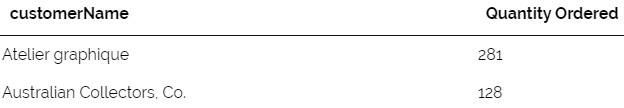

* **SQL Query (คำตอบที่ส่ง):**
```sql
select c.customerName , sum(ord.quantityOrdered) as 'Quantity Ordered' 
from customers c
join orders o using (customerNumber)
join orderdetails ord using (orderNumber)
group by customerName
order by customerName asc
```

* **Teacher Answer (เฉลยจากระบบ):**
```sql
SELECT customerName, SUM(quantityOrdered) `Quantity Ordered`
from customers
join orders
using (customerNumber)
join orderdetails
using (orderNumber)
group by customerName
order by customerName ASC;
```

> [!TIP] **แนวคิด:** JOIN 3 ตาราง (`customers → orders → orderdetails`) แล้วใช้ `SUM(quantityOrdered)` รวมทุก orderdetails ของลูกค้าแต่ละราย จากนั้น `GROUP BY customerName` และ `ORDER BY customerName ASC`

---

### ข้อที่ 2: จำนวนพนักงานในแต่ละเมือง (Question #1892)

* **โจทย์:** จงแสดงชื่อเมือง และจำนวนพนักงานที่ทำงานในเมืองนั้นๆ โดยผลลัพธ์แสดงเฉพาะเมืองที่มีพนักงานทำงานมากกว่า 2 คน

* **ตัวอย่างผลลัพธ์:**

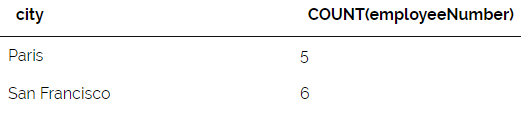

* **SQL Query (คำตอบที่ส่ง):**
```sql
select o.city , count(e.employeeNumber) from employees e
join offices o using (officeCode)
group by city
```

* **Teacher Answer (เฉลยจากระบบ):**
```sql
SELECT city, COUNT(employeeNumber)
from offices
join employees
using (officeCode)
group by city
having COUNT(employeeNumber) > 2;
```

> [!WARNING] **หมายเหตุ:** โจทย์ระบุให้แสดงเฉพาะเมืองที่มีพนักงาน **มากกว่า 2 คน** แต่ Query ที่ส่งขาด `HAVING count(e.employeeNumber) > 2`
> 
> **คำตอบที่ถูกต้อง:**
> ```sql
> SELECT o.city, COUNT(e.employeeNumber)
> FROM employees e
> JOIN offices o USING (officeCode)
> GROUP BY city
> HAVING COUNT(e.employeeNumber) > 2;
> ```

---

### ข้อที่ 3: Net Sales = ปริมาณ × ราคาซื้อมา (Question #1893)

* **โจทย์:** จงแสดงชื่อประเทศ รหัสสินค้า ปริมาณสินค้าที่ถูกสั่งซื้อ ราคาที่ซื้อมา และ Net Sales (quantityOrdered × buyPrice)

* **ตัวอย่างผลลัพธ์:**

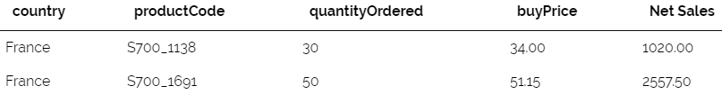

* **SQL Query (คำตอบที่ส่ง):**
```sql
SELECT 
    c.country,
    p.productCode,
    ord.quantityOrdered,
    p.buyPrice,
    (ord.quantityOrdered * p.buyPrice) AS 'Net Sales'
FROM products p
JOIN orderdetails ord 
    USING (productCode)
JOIN orders o 
    USING (orderNumber)
JOIN customers c 
    USING (customerNumber);
```

* **Teacher Answer (เฉลยจากระบบ):**
```sql
SELECT country, productCode, quantityOrdered, buyPrice, quantityOrdered*buyPrice `Net Sales`
from customers
join orders
using (customerNumber)
join orderdetails
using (orderNumber)
join products
using (productCode)
;
```

> [!TIP] **แนวคิด:** JOIN 4 ตาราง ตามลำดับ `products → orderdetails → orders → customers` แล้วคำนวณ Net Sales ด้วย expression `qty × buyPrice` ใน SELECT

---

### ข้อที่ 4: ข้อมูลพนักงาน + Manager + จำนวนลูกค้า (Question #1894)

* **โจทย์:** จงแสดงหมายเลขพนักงาน ชื่อ-นามสกุล ประเทศ หมายเลขผู้รับรายงาน ชื่อผู้รับรายงาน (Report Name) และจำนวนลูกค้าที่ขายได้ **ทั้งที่มีและไม่มีลูกค้า**

* **ตัวอย่างผลลัพธ์:**

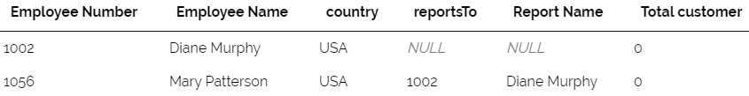

* **SQL Query (คำตอบที่ส่ง):**
```sql
SELECT 
    e.employeeNumber AS `Employee Number`,
    CONCAT(e.firstName, ' ', e.lastName) AS `Employee Name`,
    o.country AS country,
    e.reportsTo,
    CONCAT(m.firstName, ' ', m.lastName) AS `Report Name`,
    COUNT(c.customerNumber) AS `Total customer`
FROM employees e
JOIN offices o 
    USING (officeCode)
LEFT JOIN employees m 
    ON e.reportsTo = m.employeeNumber
LEFT JOIN customers c 
    ON e.employeeNumber = c.salesRepEmployeeNumber
GROUP BY 
    e.employeeNumber,
    e.firstName,
    e.lastName,
    o.country,
    e.reportsTo,
    m.firstName,
    m.lastName;
```

* **Teacher Answer (เฉลยจากระบบ):**
```sql
SELECT e.employeeNumber `Employee Number`, concat(e.firstName, ' ',e.lastName) `Employee Name`, o.country, e.reportsTo, concat(report.firstName, ' ',report.lastName) `Report Name`, 
count(c.customerNumber) `Total customer`
from employees e
join offices o
using (officeCode)
left outer join employees report
on (report.employeeNumber = e.reportsTo)
left outer join customers c
on (e.employeeNumber = c.salesRepEmployeeNumber)
group by e.employeeNumber;
```

> [!TIP] **แนวคิด Key:**
> - `LEFT JOIN employees m` — Self-join กับตัวเองเพื่อหาชื่อ Manager (manager อาจ NULL สำหรับ CEO)
> - `LEFT JOIN customers c` — เพื่อรวมพนักงานที่ไม่มีลูกค้า
> - `COUNT(c.customerNumber)` จะนับ 0 สำหรับพนักงานที่ไม่มีลูกค้า (เพราะ LEFT JOIN)

---

### ข้อที่ 5: ยอดรวม creditLimit ของลูกค้าต่อพนักงานขาย (Question #1895)

* **โจทย์:** จงแสดงหมายเลขพนักงานที่ขายให้ลูกค้า ชื่อจริง นามสกุล และ **ผลรวมวงเงินเครดิต** ของบริษัทลูกค้าที่พนักงานคนนั้นดูแลอยู่

* **ตัวอย่างผลลัพธ์:**

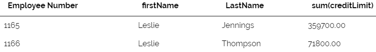

* **SQL Query (คำตอบที่ส่ง):**
```sql
SELECT 
    e.employeeNumber AS 'Employee Number',
    e.firstName,
    e.lastName,
    SUM(c.creditLimit) AS 'Total Credit Limit'
FROM employees e
JOIN customers c 
    ON e.employeeNumber = c.salesRepEmployeeNumber
GROUP BY 
    e.employeeNumber, 
    e.firstName, 
    e.lastName;
```

* **Teacher Answer (เฉลยจากระบบ):**
```sql
SELECT salesRepEmployeeNumber `Employee Number`,firstName, LastName, sum(creditLimit)
from customers c
join employees e
on (e.employeeNumber = c.salesRepEmployeeNumber)
group by salesRepEmployeeNumber;
```

> [!TIP] **แนวคิด:** JOIN `employees` กับ `customers` โดยใช้ ON `salesRepEmployeeNumber = employeeNumber` จากนั้น `SUM(creditLimit)` และ `GROUP BY` ตาม employeeNumber

---

### ข้อที่ 6: จำนวน Office ในแต่ละประเทศ (Question #1896)

* **โจทย์:** จากข้อมูลออฟฟิศ จงแสดงชื่อประเทศ และจำนวน office ในประเทศนั้นๆ ตั้งชื่อว่า `number of offices` เรียงจากจำนวนมากไปน้อย

* **ตัวอย่างผลลัพธ์ (แสดงทั้งหมด):**

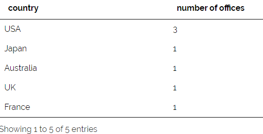

* **SQL Query (คำตอบที่ส่ง):**
```sql
select country , count(officeCode) as 'number of offices'
from offices
group by country
order by count(officeCode) desc
```

* **Teacher Answer (เฉลยจากระบบ):**
```sql
SELECT country, count(officeCode) `number of offices`
from offices
group by country
order by count(officeCode) DESC;
```

> [!TIP] **แนวคิด:** Query จากตาราง `offices` เดียว ใช้ `COUNT(officeCode)` + `GROUP BY country` + `ORDER BY count DESC`

---

### ข้อที่ 7: Average Payment Description ปี 2004 (Question #1897)

* **โจทย์:** จงแสดง Average payment description ของปี 2004 โดยนำข้อความ `'In 2004, Average payment is '` และค่าเฉลี่ยของจำนวนเงินที่จ่ายในปี 2004 ขั้นกลางด้วยช่องว่าง

* **ตัวอย่างผลลัพธ์ (แสดงทั้งหมด):**

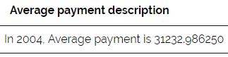

* **SQL Query (คำตอบที่ส่ง):**
```sql
select concat('In 2004, Average payment is ' , avg(amount)) as 'Average payment description' from payments
where paymentDate like '2004%'
```

* **Teacher Answer (เฉลยจากระบบ):**
```sql
SELECT concat('In 2004, Average payment is ' , avg(amount)) `Average payment description`
from payments
where paymentDate like '2004%';
```

> [!TIP] **แนวคิด:** ใช้ `CONCAT()` รวม string กับผลลัพธ์ `AVG(amount)` และ `WHERE paymentDate LIKE '2004%'` กรองเฉพาะปี 2004

---

### ข้อที่ 8: ค่าพิสัย และค่าเฉลี่ยยอดชำระเงิน (Question #1898)

* **โจทย์:** จงแสดงค่าพิสัย (MAX-MIN) ตั้งชื่อว่า `Range` และค่าเฉลี่ย ตั้งชื่อว่า `Average` ของจำนวนเงินที่จ่าย
  > **พิสัย = ค่าสูงสุด - ค่าต่ำสุด**

* **ตัวอย่างผลลัพธ์ (แสดงทั้งหมด):**

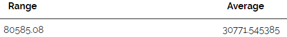

* **SQL Query (คำตอบที่ส่ง):**
```sql
select (max(amount) - min(amount)) as 'Range' , (sum(amount) / count(amount)) as 'Average' from payments
```

* **Teacher Answer (เฉลยจากระบบ):**
```sql
SELECT max(amount) - min(amount) `Range`, avg(amount) `Average`
from payments;
```

> [!TIP] **แนวคิด:** ใช้ `MAX()-MIN()` สำหรับพิสัย และ `SUM()/COUNT()` แทน `AVG()` เพื่อคำนวณค่าเฉลี่ยด้วยตนเอง

---

### ข้อที่ 9: ชื่อบริษัท ประเทศ เมือง รัฐ (NULL → 'No Data') (Question #1899)

* **โจทย์:** จงแสดงชื่อบริษัทลูกค้า ประเทศ เมือง รัฐ (ตั้งชื่อว่า `state` ถ้าข้อมูลเป็น NULL ให้ใส่คำว่า `No Data` แทน)

* **ตัวอย่างผลลัพธ์:**

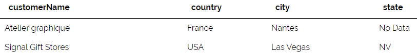

* **SQL Query (คำตอบที่ส่ง):**
```sql
select customerName , country , city , COALESCE(state, 'No Data') AS state from customers
```

* **Teacher Answer (เฉลยจากระบบ):**
```sql
SELECT customerName, country, city, ifnull(state, 'No Data') `state`
from customers;
```

> [!TIP] **แนวคิด:** `COALESCE(column, 'default_value')` คืนค่า column ถ้าไม่ NULL หรือ `'No Data'` ถ้า NULL — เทียบเท่ากับ `IFNULL(state, 'No Data')`

---

### ข้อที่ 10: ค่าเฉลี่ย creditLimit ต่อรัฐ (ห้ามใช้ AVG) (Question #1900)

* **โจทย์:** จงแสดงชื่อรัฐ (NULL → 'No Data') ค่าเฉลี่ยเครดิตในแต่ละรัฐ (ตั้งชื่อว่า `Average Credit`) **ห้ามใช้ AVG**

* **ตัวอย่างผลลัพธ์:**

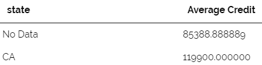

* **SQL Query (คำตอบที่ส่ง):**
```sql
SELECT 
    COALESCE(state, 'No Data') AS state,
    SUM(creditLimit) / COUNT(creditLimit) AS "Average Credit"
FROM 
    customers
GROUP BY 
    COALESCE(state, 'No Data');
```

* **Teacher Answer (เฉลยจากระบบ):**
```sql
SELECT ifnull(state, 'No Data') `state`, (sum(creditLimit)/count(creditLimit)) `Average Credit`
from customers
group by state;
```

> [!TIP] **แนวคิด:** แทน `AVG()` ด้วย `SUM(col) / COUNT(col)` โดยใช้ `COALESCE()` ทั้งใน SELECT และ GROUP BY เพื่อรวม NULL เป็นกลุ่มเดียวกัน

---

### ข้อที่ 11: Sum/Avg Net Sales เฉพาะ Avg > ค่าเฉลี่ยรวม (Question #1901)

* **โจทย์:** จงแสดงรหัสสินค้า ชื่อสินค้า ผลรวมยอดขาย (`Sum Net Sales` = qty × priceEach) และค่าเฉลี่ยยอดขาย (`Average Net Sales`) โดยแสดงเฉพาะสินค้าที่ Avg > ค่าเฉลี่ยของทุกสินค้า

* **ตัวอย่างผลลัพธ์:**

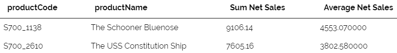

* **SQL Query (คำตอบที่ส่ง):**
```sql
select p.productCode , p.productName , sum(ord.quantityOrdered * ord.priceEach) as 'Sum Net Sales' , avg(ord.quantityOrdered * ord.priceEach) as 'Average Net Sales'
from orderdetails ord
join products p using (productCode)
group by productCode
having avg(ord.quantityOrdered * ord.priceEach) > (select avg(quantityOrdered * priceEach) 
        from orderdetails )
```

* **Teacher Answer (เฉลยจากระบบ):**
```sql
SELECT productCode, productName , sum(o.netSales) `Sum Net Sales`, avg(o.netSales) `Average Net Sales`
from (
  select (quantityOrdered*priceEach) netSales, productCode 
  from orderdetails
) o
join products
using (productCode)
group by productCode
having avg(o.netSales) > (
  select avg(o2.netSales)
  from (
    select (quantityOrdered*priceEach) netSales, productCode
    from orderdetails
  ) o2
);
```

> [!TIP] **แนวคิด Key — Correlated Subquery ใน HAVING:**
> - `HAVING avg(...) > (SELECT avg(...) FROM orderdetails)` — Subquery ใน HAVING ใช้คำนวณค่าเฉลี่ยรวมทั้งตารางเพื่อเปรียบเทียบ
> - ต่างจาก Subquery ใน WHERE ตรงที่ทำงานหลัง GROUP BY แล้ว

---

### ข้อที่ 12: ใบสั่งซื้อสถานะ 'Ship%' และ min qty ≥ 24 (Question #1902)

* **โจทย์:** จงแสดงเลขที่ใบสั่งซื้อ และผลรวมจำนวนสินค้า โดยแสดงเฉพาะใบสั่งซื้อที่มีสถานะขึ้นต้นด้วย 'Ship' และในแต่ละใบสั่งซื้อ จำนวนสินค้าต่ำสุด ≥ 24

* **ตัวอย่างผลลัพธ์ (แสดงทั้งหมด):**

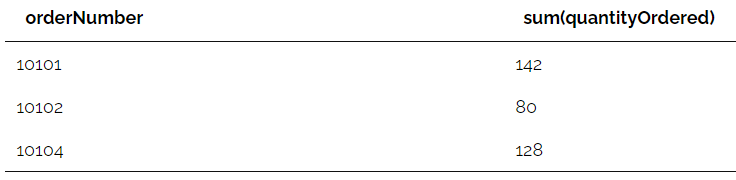

* **SQL Query (คำตอบที่ส่ง):**
```sql
select ord.orderNumber , sum(ord.quantityOrdered)
from orderdetails ord
join orders o using (orderNumber)
where o.status like 'Ship%'
group by orderNumber
having min(quantityOrdered) >= 24
```

* **Teacher Answer (เฉลยจากระบบ):**
```sql
select orderNumber, sum(quantityOrdered) 
from orders
join orderdetails
using (orderNumber)
where status like 'Ship%'
group by orderNumber
having min(quantityOrdered) >= 24
;
```

> [!TIP] **แนวคิด:** `WHERE status LIKE 'Ship%'` กรองก่อน GROUP BY แล้ว `HAVING MIN(quantityOrdered) >= 24` กรองกลุ่มที่ผ่านแล้ว

---

### ข้อที่ 13: สายการผลิต Planes ที่ min qty > 28 (Question #1903)

* **โจทย์:** จงแสดงเลขที่ใบสั่งซื้อ จำนวนประเภทสินค้า (นับ DISTINCT) โดยแสดงเฉพาะสายการผลิต Planes และมีจำนวนสินค้าต่ำสุด > 28

* **ตัวอย่างผลลัพธ์ (แสดงทั้งหมด):**

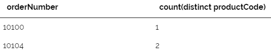

* **SQL Query (คำตอบที่ส่ง):**
```sql
SELECT o.orderNumber, COUNT(DISTINCT o.productCode)
FROM orderdetails o
WHERE o.productCode IN (
    SELECT productCode 
    FROM products 
    WHERE productLine = 'Planes'
)
GROUP BY o.orderNumber
HAVING min(o.quantityOrdered) > 28;
```

* **Teacher Answer (เฉลยจากระบบ):**
```sql
select orderNumber, count(distinct productCode)
from orders
join orderdetails
using (orderNumber)
join products
using (productCode)
where productLine like 'Planes'
group by orderNumber
having min(quantityOrdered) > 28
;
```

> [!TIP] **แนวคิด:** ใช้ Subquery ใน WHERE เพื่อกรองเฉพาะสินค้าในสาย 'Planes' จากนั้น `COUNT(DISTINCT productCode)` นับประเภทสินค้าที่ไม่ซ้ำกัน

---

### ข้อที่ 14: ยอดชำระเงิน checkNumber 'N%' หลัง 2004-01-01 (Question #1904)

* **โจทย์:** จงแสดงหมายเลขบริษัทลูกค้า และผลรวมจำนวนเงินที่จ่าย โดยแสดงเฉพาะเลขที่เช็คขึ้นต้นด้วย N และวันที่จ่ายหลัง 1 มกราคม 2004 และจำนวนที่จ่ายต่ำสุดในแต่ละหมายเลขลูกค้ามีค่า > 35000

* **ตัวอย่างผลลัพธ์ (แสดงทั้งหมด):**

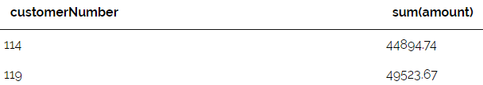

* **SQL Query (คำตอบที่ส่ง):**
```sql
SELECT 
    c.customerNumber, 
    SUM(p.amount) AS total_amount
FROM customers c
JOIN payments p 
    USING (customerNumber)
WHERE 
    p.checkNumber LIKE 'N%' 
    AND p.paymentDate > '2004-01-01'
GROUP BY 
    c.customerNumber
HAVING 
    SUM(p.amount) > 35000;
```

* **Teacher Answer (เฉลยจากระบบ):**
```sql
SELECT customerNumber, sum(amount)
from payments
where checkNumber like 'N%' and paymentDate > '2004-01-01'
group by customerNumber
having min(amount) > 35000
;
```

> [!WARNING] **หมายเหตุ:** โจทย์ระบุ "จำนวนที่จ่ายต่ำสุด > 35000" แต่ Query ใช้ `HAVING SUM > 35000` ซึ่งเป็น "ผลรวม" ไม่ใช่ "ต่ำสุด"
> 
> **คำตอบที่ถูกต้องควรเป็น:**
> ```sql
> HAVING MIN(p.amount) > 35000;
> ```

---

### ข้อที่ 15: ค่าเฉลี่ย creditLimit ต่อ salesRep ที่ขายมากกว่า 1 ครั้ง (Question #1905)

* **โจทย์:** จงแสดงค่าเฉลี่ยเครดิตของลูกค้า ในแต่ละหมายเลขพนักงานขาย โดยแสดงเฉพาะพนักงานขายที่เคยขายมากกว่า 1 ครั้ง

* **ตัวอย่างผลลัพธ์:**

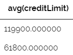

* **SQL Query (คำตอบที่ส่ง):**
```sql
SELECT 
    AVG(c.creditLimit)
FROM customers c
WHERE 
    c.salesRepEmployeeNumber IS NOT NULL
GROUP BY 
    c.salesRepEmployeeNumber
HAVING 
    (
        SELECT COUNT(o.orderNumber)
        FROM orders o
        JOIN customers c2 USING (customerNumber)
        WHERE c2.salesRepEmployeeNumber = c.salesRepEmployeeNumber
    ) > 1;
```

* **Teacher Answer (เฉลยจากระบบ):**
```sql
SELECT avg(creditLimit)
from customers
group by salesRepEmployeeNumber
having count(salesRepEmployeeNumber) > 1;
```

> [!TIP] **แนวคิด:** ใช้ Correlated Subquery ใน HAVING เพื่อนับจำนวน orders ของ salesRep คนนั้น ๆ

---

### ข้อที่ 16: Expense ต่อลูกค้า > 15,000 (ON clause) (Question #1906)

* **โจทย์:** จงแสดงชื่อบริษัทลูกค้า ผลรวมค่าใช้จ่าย (`Expense` = qty × priceEach) เฉพาะลูกค้าที่มีผลรวม > 15,000 (**ใช้ ON clause เท่านั้น**)

* **ตัวอย่างผลลัพธ์:**


* **SQL Query (คำตอบที่ส่ง):**
```sql
select c.customerName , sum(ord.quantityOrdered * ord.priceEach) as 'Expense'
from customers c
join orders o on c.customerNumber = o.customerNumber
join orderdetails ord on o.orderNumber = ord.orderNumber
group by (c.customerName)
having sum(ord.quantityOrdered * ord.priceEach) > 15000
```

* **Teacher Answer (เฉลยจากระบบ):**
```sql
SELECT customerName, sum(quantityOrdered*priceEach) `Expense`
FROM orderdetails od
join orders o
on (od.orderNumber = o.orderNumber)
join customers c
on (c.customerNumber = o.customerNumber)
GROUP BY customerName
HAVING `Expense` > 15000;
```

> [!TIP] **แนวคิด:** โจทย์บังคับใช้ `ON` แทน `USING` — ต้องระบุ condition ตาม `table1.column = table2.column` เสมอ

---

### ข้อที่ 17: ประเทศ ตำแหน่ง จำนวนพนักงาน territory EMEA (Question #1907)

* **โจทย์:** แสดงชื่อประเทศ ตำแหน่งงาน และจำนวนพนักงาน โดยแบ่งตามประเทศและตำแหน่ง แสดงเฉพาะที่มีพนักงาน > 1 คน และทำงานใน territory EMEA

* **ตัวอย่างผลลัพธ์ (แสดงทั้งหมด):**

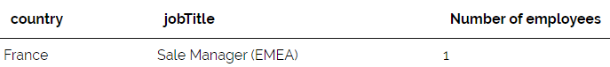

* **SQL Query (คำตอบที่ส่ง):**
```sql
select o.country , e.jobTitle , count(e.employeeNumber) as 'Number of employees'
from employees e
left outer join offices o using (officeCode)
group by country , jobTitle
having count(e.employeeNumber) > 1
```

* **Teacher Answer (เฉลยจากระบบ):**
```sql
select country, jobTitle, count(*) `Number of employees`
from offices
join employees
using (officeCode)
where territory = 'EMEA'
group by country, jobTitle
having `Number of employees` = 1;
```

> [!WARNING] **หมายเหตุ:** Query นี้ขาดเงื่อนไข `WHERE o.territory = 'EMEA'`
>
> **คำตอบที่ถูกต้อง:**
> ```sql
> SELECT o.country, e.jobTitle, COUNT(e.employeeNumber) AS 'Number of employees'
> FROM employees e
> LEFT OUTER JOIN offices o USING (officeCode)
> WHERE o.territory = 'EMEA'
> GROUP BY country, jobTitle
> HAVING COUNT(e.employeeNumber) > 1;
> ```

---

### ข้อที่ 18: ผลรวมค่าใช้จ่ายต่อเดือน > 50,000 (Question #1908)

* **โจทย์:** แสดงเลขเดือน (ฟังก์ชัน `MONTH()`) และผลรวมค่าใช้จ่ายของแต่ละเดือน เฉพาะเดือนที่มีผลรวม > 50,000

* **ตัวอย่างผลลัพธ์:**

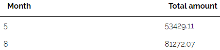

* **SQL Query (คำตอบที่ส่ง):**
```sql
SELECT 
    MONTH(paymentDate) AS Month,
    SUM(amount) AS `Total amount`
FROM payments
GROUP BY 
    MONTH(paymentDate)
HAVING 
    SUM(amount) > 50000;
```

* **Teacher Answer (เฉลยจากระบบ):**
```sql
select MONTH(paymentDate) `Month`,sum(amount) `Total amount`
from payments
group by MONTH(paymentDate)
HAVING sum(amount) > 50000
```

> [!TIP] **แนวคิด:** `MONTH(date_column)` ดึงเลขเดือนจาก date — ใช้ใน GROUP BY และ SELECT พร้อมกันได้

---

### ข้อที่ 19: พนักงานที่ประเทศต่างจากลูกค้า count > 1 (Question #1910)

* **โจทย์:** แสดงชื่อจริง นามสกุลของพนักงาน และจำนวนลูกค้าที่พนักงานคนนั้นเป็นตัวแทนขาย โดยประเทศของพนักงานและลูกค้าไม่เหมือนกัน แสดงเฉพาะพนักงานที่เป็น rep ให้ลูกค้ามากกว่า 1

* **ตัวอย่างผลลัพธ์ (แสดงทั้งหมด):**

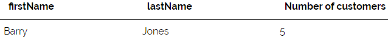

* **SQL Query (คำตอบที่ส่ง):**
```sql
select e.firstName , e.lastName , count(c.customerNumber)
from employees e
join customers c on c.salesRepEmployeeNumber = e.employeeNumber
join offices o using (officeCode)
where o.country <> c.country
group by e.employeeNumber,  e.firstName, e.lastName
HAVING  COUNT(c.customerNumber) > 1;
```

* **Teacher Answer (เฉลยจากระบบ):**
```sql
select e.firstName, e.lastName, count(*) `Number of customers`
from employees e
join customers c
on (e.employeeNumber = c.salesRepEmployeeNumber)
join offices o
on (e.officeCode = o.officeCode)
where o.country != c.country
group by e.employeeNumber
having `Number of customers` > 1
```

> [!TIP] **แนวคิด:** `WHERE o.country <> c.country` กรองเฉพาะคู่ที่ประเทศต่างกัน ก่อน GROUP BY

---

### ข้อที่ 20: Min/Avg/Max priceEach เฉพาะ (Max-Min) < 50 (Question #1911)

* **โจทย์:** แสดงชื่อสินค้า ราคาต่ำสุด ราคาเฉลี่ย และราคาสูงสุดของสินค้า จากตาราง `orderdetails` โดยที่ ราคาสูงสุดลบราคาต่ำสุดของแต่ละสินค้าน้อยกว่า 50

* **ตัวอย่างผลลัพธ์:**

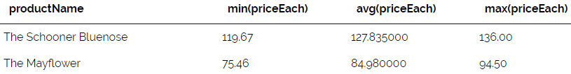

* **SQL Query (คำตอบที่ส่ง):**
```sql
select p.productName , min(ord.priceEach) , avg(ord.priceEach) , max(ord.priceEach)
from orderdetails ord
join products p using (productCode)
GROUP BY 
    p.productCode, 
    p.productName
HAVING 
    (MAX(ord.priceEach) - MIN(ord.priceEach)) < 50;
```

* **Teacher Answer (เฉลยจากระบบ):**
```sql
select productName, min(priceEach), avg(priceEach), max(priceEach)
from orderdetails
join products
using (productCode)
group by productName
having max(priceEach) - min(priceEach) < 50
```

> [!TIP] **แนวคิด:** `HAVING (MAX-MIN) < 50` ตรวจ "ช่วงราคา" ที่แคบ ทำให้แสดงเฉพาะสินค้าที่ราคา consistent

---

### ข้อที่ 21: พนักงานในประเทศที่มีลูกค้า > 1 (Subquery) (Question #1912)

* **โจทย์:** แสดงชื่อจริง นามสกุลของพนักงาน และเมืองที่ทำงาน โดยประเทศที่พนักงานทำงานเป็นประเทศที่มีลูกค้ามากกว่า 1 คน เรียงตามชื่อเมือง A-Z (ใช้ Subqueries)

* **ตัวอย่างผลลัพธ์:**

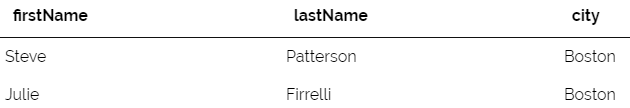

* **SQL Query (คำตอบที่ส่ง):**
```sql
SELECT 
    e.firstName, 
    e.lastName, 
    oc.city
FROM employees e
JOIN offices oc 
    USING (officeCode)
WHERE oc.country IN (
    SELECT country 
    FROM customers 
    GROUP BY country 
    HAVING COUNT(customerNumber) > 1
)
ORDER BY 
    oc.city ASC;
```

* **Teacher Answer (เฉลยจากระบบ):**
```sql
select firstName, lastName, city
from employees
join offices
using (officeCode)
where country in (
  select country
  from customers
  group by country
  having count(country) > 1)
order by city
```

> [!TIP] **แนวคิด:** Subquery ใน `WHERE IN (...)` คืนรายชื่อประเทศที่มีลูกค้า > 1 คน จากนั้น outer query กรองพนักงานที่ทำงานในประเทศเหล่านั้น

---

### ข้อที่ 22: สินค้า 'America' หรือ vendor 'Diecast' ที่ sum qty < 50 (Question #1913)

* **โจทย์:** แสดงชื่อสินค้า จำนวนครั้งที่ถูกซื้อ และผลรวมจำนวนชิ้นที่ถูกสั่ง ของสินค้าที่ชื่อมีคำว่า 'America' หรือชื่อ vendor มีคำว่า 'Diecast' โดยแสดงเฉพาะที่ผลรวมจำนวนชิ้น < 50

* **ตัวอย่างผลลัพธ์ (แสดงทั้งหมด):**

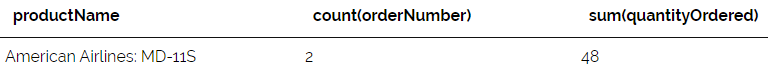

* **SQL Query (คำตอบที่ส่ง):**
```sql
SELECT 
    p.productName,
    COUNT(ord.orderNumber) AS order_count,
    SUM(ord.quantityOrdered) AS total_quantity
FROM products p
JOIN orderdetails ord 
    USING (productCode)
WHERE 
    p.productName LIKE '%America%' 
    OR p.productVendor LIKE '%Diecast%'
GROUP BY 
    p.productCode, 
    p.productName
HAVING 
    SUM(ord.quantityOrdered) < 50;
```

* **Teacher Answer (เฉลยจากระบบ):**
```sql
select productName, count(orderNumber), sum(quantityOrdered)
from products
join orderdetails
using (productCode)
where productName like '%America%'
or productVendor like '%Diecast%'
group by productName
having sum(quantityOrdered) < 50;
```

> [!TIP] **แนวคิด:** `WHERE ... LIKE '%America%' OR ... LIKE '%Diecast%'` กรองด้วย OR จาก 2 columns ต่างกัน จากนั้น HAVING กรองผลรวมที่น้อยกว่า 50

---

### ข้อที่ 23: ลูกค้า-สินค้า ที่ sum qty > 50 เรียงมาก→น้อย (Question #2463)

* **โจทย์:** แสดงชื่อบริษัทลูกค้า รหัสสินค้า และจำนวนรวมของสินค้า (`Quantity`) ที่สั่งซื้อ เฉพาะรายการที่มีจำนวนการสั่งซื้อ > 50 เรียงจากมากไปน้อย

* **ตัวอย่างผลลัพธ์:**

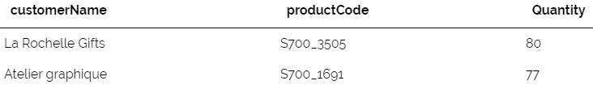

* **SQL Query (คำตอบที่ส่ง):**
```sql
select c.customerName , od.productCode , sum(od.quantityOrdered) as Quantity
from customers c
JOIN orders ord ON c.customerNumber = ord.customerNumber
JOIN orderdetails od ON ord.orderNumber = od.orderNumber
GROUP BY c.customerName, od.productCode
HAVING SUM(od.quantityOrdered) > 50
ORDER BY Quantity DESC;
```

* **Teacher Answer (เฉลยจากระบบ):**
```sql
select customerName, productCode, sum(quantityOrdered) Quantity
from orders
join customers
using (customerNumber)
join orderdetails
using (orderNumber)
group by customerName, productCode
having Quantity > 50
order by Quantity desc;
```

> [!TIP] **แนวคิด:** GROUP BY ต้องระบุทุก non-aggregate column ใน SELECT — ที่นี่ต้อง GROUP BY `customerName, productCode`

---

### ข้อที่ 24: ลูกค้าที่ไม่เคยสั่งสินค้า avg credit > 0 (Question #1915)

* **โจทย์:** แสดงชื่อประเทศ จำนวนลูกค้า และค่าเฉลี่ยของเครดิต ของลูกค้าที่ยังไม่เคยมีการสั่งสินค้า และแสดงเฉพาะประเทศที่มีค่าเฉลี่ยของเครดิต > 0

* **ตัวอย่างผลลัพธ์:**

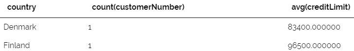

* **SQL Query (คำตอบที่ส่ง):**
```sql
select country , count(customerNumber) , avg(creditLimit)
from customers
where customerNumber not in (select customerNumber from orders) 
group by country
having avg(creditLimit) > 0
```

* **Teacher Answer (เฉลยจากระบบ):**
```sql
select country, count(c.customerNumber), avg(creditLimit)
from customers c
left outer join orders o
using (customerNumber)
where o.customerNumber is null
group by country
having avg(creditLimit) > 0;
```

> [!TIP] **แนวคิด:** `WHERE customerNumber NOT IN (SELECT customerNumber FROM orders)` กรองเฉพาะลูกค้าที่ไม่มีออเดอร์ใดๆ เลย (Anti-join แบบ Subquery)

---

### ข้อที่ 25: สายผลิตภัณฑ์ + Quantity (stock+ordered) Subquery (Question #1916)

* **โจทย์:** แสดงสายผลิตภัณฑ์ (`Product line`) และจำนวนสินค้าทั้งหมด (จำนวนในคลัง + ยอดที่สั่งซื้อรวม) เฉพาะสินค้าที่มียอดสั่งซื้อรวมมากกว่า 50 ชิ้น (ใช้ Subqueries) ตั้งชื่อว่า `Quantity`

* **ตัวอย่างผลลัพธ์ (แสดงทั้งหมด):**

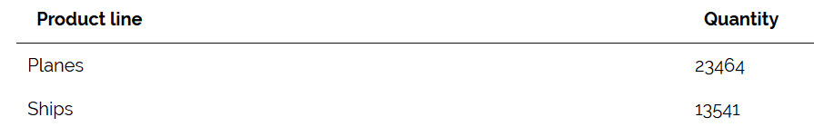

* **SQL Query (คำตอบที่ส่ง):**
```sql
SELECT p.productLine AS "Product line", 
       SUM(p.quantityInStock + (
           SELECT SUM(od.quantityOrdered) 
           FROM orderdetails od 
           WHERE od.productCode = p.productCode
       )) AS "Quantity"
FROM products p
WHERE p.productCode IN (
    SELECT od.productCode 
    FROM orderdetails od 
    GROUP BY od.productCode 
    HAVING SUM(od.quantityOrdered) > 50
)
GROUP BY p.productLine;
```

* **Teacher Answer (เฉลยจากระบบ):**
```sql
select productLine 'Product line', sum(quantityInStock + sumQuantity) 'Quantity'
from products
join (
  select productCode, sum(quantityOrdered) sumQuantity
  from orderdetails
  group by productCode
  having sumQuantity > 50
) totalorders
using (productCode)
group by productLine
```

> [!TIP] **แนวคิด ขั้นสูง — Nested Correlated Subquery:**
> - Subquery ใน WHERE กรองสินค้าที่มียอดสั่ง > 50
> - Correlated Subquery ใน SELECT คำนวณ `SUM(ordered)` ของแต่ละ product และนำไปบวกกับ `quantityInStock`

---

## Part 3: สรุปทักษะ SQL จาก Lab 08

### Aggregate Functions สำคัญ

| ฟังก์ชัน | ความหมาย | ตัวอย่างการใช้ |
|:---|:---|:---|
| `COUNT(col)` | นับแถวที่ col ไม่ใช่ NULL | `COUNT(customerNumber)` |
| `COUNT(*)` | นับทุกแถว | `COUNT(*)` |
| `COUNT(DISTINCT col)` | นับค่า unique | `COUNT(DISTINCT productCode)` |
| `SUM(col)` | ผลรวม | `SUM(quantityOrdered)` |
| `AVG(col)` | ค่าเฉลี่ย | `AVG(creditLimit)` |
| `MAX(col)` | ค่าสูงสุด | `MAX(priceEach)` |
| `MIN(col)` | ค่าต่ำสุด | `MIN(priceEach)` |

### GROUP BY + HAVING Pattern

```sql
SELECT col1, AGG_FUNC(col2)
FROM table
WHERE condition          -- กรองก่อน GROUP BY (row-level)
GROUP BY col1
HAVING AGG_condition     -- กรองหลัง GROUP BY (group-level)
ORDER BY col1;
```

> [!IMPORTANT] **กฎสำคัญ:**
> - `WHERE` → ทำงาน **ก่อน** GROUP BY (กรอง individual rows)
> - `HAVING` → ทำงาน **หลัง** GROUP BY (กรอง groups)
> - ทุก column ใน SELECT ที่ไม่ใช่ Aggregate **ต้องอยู่ใน GROUP BY** ด้วย

### COALESCE / IFNULL

```sql
-- แปลง NULL เป็นค่าที่กำหนด
COALESCE(column, 'default_value')
IFNULL(column, 'default_value')   -- MySQL specific

-- ใช้ใน GROUP BY ได้
GROUP BY COALESCE(state, 'No Data')
```

### Subquery Patterns

```sql
-- Subquery ใน WHERE (Filter)
WHERE col IN (SELECT col FROM table WHERE condition)
WHERE col NOT IN (SELECT col FROM table)

-- Subquery ใน HAVING (Aggregate comparison)
HAVING AVG(col) > (SELECT AVG(col) FROM table)

-- Correlated Subquery ใน SELECT
SELECT col, (SELECT COUNT(*) FROM t2 WHERE t2.fk = t1.pk) AS cnt
FROM t1
```

---

## Part 4: Backlinks

* [[SQL-Lab-07-SQL OUTER JOIN]] ← บทก่อนหน้า: OUTER JOIN
* [[SQL-Lab-06-SQL JOIN]] ← INNER JOIN
* [[SQL-Lab-05-SQL SELECT Condition]] ← WHERE, LIKE, BETWEEN
