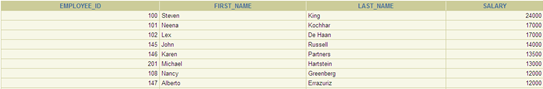
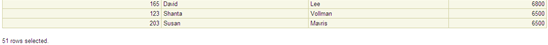
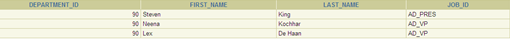
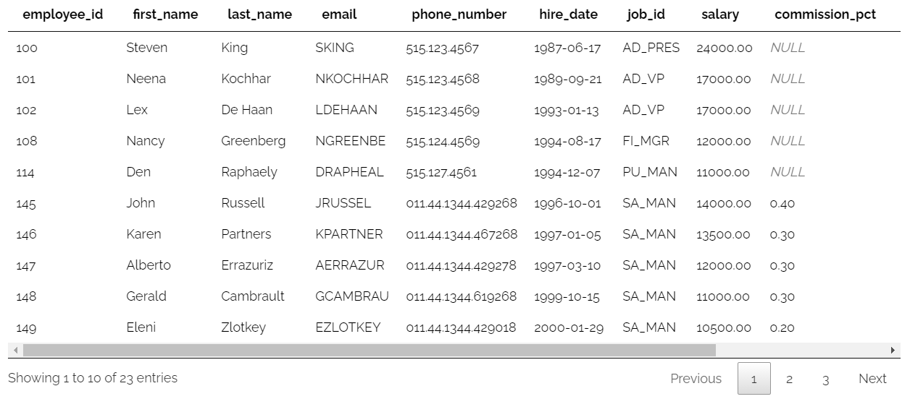

# แบบฝึกหัดและเฉลย SQL Lab 09: SQL SUBQUERIES

## ข้อมูลทั่วไป
* **รหัสแบบฝึกหัด:** SQL-Lab-09
* **หัวข้อ:** SQL Subqueries (Single-row Subqueries, Multiple-row Subqueries, IN, ANY, ALL, Subqueries in HAVING)
* **แหล่งที่มา:** [DB Learning KMITL (Submission #108890)](https://dblearning.it.kmitl.ac.th/quiz/submission/108890)
* **วันที่เริ่ม:** 2026-09-24 09:52:14 | **วันที่ส่ง:** 2026-10-02 21:40:41
* **สถานที่บันทึก:** `AIOS/01 Learning/Learning Progress/SQL/SQL-Lab-09-SQL SUBQUERIES.md`
* **Source Reference:** `Resources/References/Learning SQL 9.md`

---

## Part 1: Macro Architecture & Overview

Subquery (หรือ Nested Query / Inner Query) คือคำสั่ง SQL `SELECT` ที่ซ้อนอยู่ภายในคำสั่ง SQL อื่น (Outer Query) เช่น ใน `WHERE`, `HAVING`, หรือ `FROM` clause โดยทำหน้าที่ประมวลผลคำตอบชั่วคราวเพื่อส่งต่อไปให้ Main Query ใช้ตัดสินใจหรือกรองข้อมูล โครงสร้างของ Subquery แบ่งออกเป็นกลุ่มใหญ่ตามประเภทข้อมูลที่ส่งคืน ได้แก่ **Single-row Subquery** (คืนค่าเดียว 1 แถว 1 คอลัมน์) ซึ่งใช้กับ Comparison Operators พื้นฐาน ( = , `>`, `<`, `>=`, `<=`, `!=`) และ **Multiple-row Subquery** (คืนค่าหลายแถว) ซึ่งจำเป็นต้องใช้กับ Multiple-row Operators (`IN`, `ANY`/`SOME`, `ALL`)

```text
┌────────────────────────────────────────────────────────┐
│                      OUTER QUERY                       │
│  SELECT first_name, salary FROM employees              │
│  WHERE salary > ( ──────────────┐ )                   │
└─────────────────────────────────│──────────────────────┘
                                  ▼
┌────────────────────────────────────────────────────────┐
│                   INNER (SUBQUERY)                     │
│  SELECT AVG(salary) FROM employees                     │
│  (คำนวณค่าเฉลี่ย = 6461.83 แล้วส่งค่าคืนให้ Outer)     │
└────────────────────────────────────────────────────────┘
```

### ตารางเปรียบเทียบประเภทของ Subquery

| คุณสมบัติ (Feature)     | Single-Row Subquery                                | Multiple-Row Subquery                                     | Subquery in HAVING                              |
| :---------------------- | :------------------------------------------------- | :-------------------------------------------------------- | :---------------------------------------------- |
| **จำนวนค่าที่คืน**      | 1 แถว 1 คอลัมน์ (Scalar Value)                     | หลายแถว 1 คอลัมน์ (List of Values)                        | 1 ค่า หรือหลายค่า เพื่อเทียบกับ Group Aggregate |
| **Operators ที่รองรับ** | `=`, `>`, `<`, `>=`, `<=`, `<>`, `!=`              | `IN`, `NOT IN`, `ANY`, `ALL`                              | ใช้ตามผลลัพธ์ของฟังก์ชัน (`>`, `=`, `IN`)       |
| **ตำแหน่งที่ใช้บ่อย**   | `WHERE`, `SELECT`, `HAVING`                        | `WHERE`, `HAVING`                                         | `HAVING` (หลัง `GROUP BY`)                      |
| **ข้อควรระวัง**         | ห้ามคืนค่ามากกว่า 1 แถว มิฉะนั้นจะเกิด Error ทันที | หากใช้กับ `NOT IN` และผลลัพธ์มี `NULL` จะไม่ได้ผลลัพธ์ใดๆ | ต้องเปรียบเทียบกับ Aggregate Function ของกลุ่ม  |

---

## สรุปภาพรวมหัวข้อที่ใช้ทดสอบ (Skills Matrix)

| ข้อที่ | รหัสโจทย์ | จุดประสงค์ / โจทย์ย่อ                                     | ตารางที่เกี่ยวข้อง                      | คำสั่ง SQL / Operator หลัก       | ประเภท Subquery         |
| :----: | :-------: | :-------------------------------------------------------- | :-------------------------------------- | :------------------------------- | :---------------------- |
| **1**  |   #933    | พนักงานที่รับเข้าทำงานวันเดียวกับ Baer (ยกเว้น Baer)      | `employees`                             | `=`, `!=`                        | Single-row              |
| **2**  |   #934    | เงินเดือนสูงกว่าค่าเฉลี่ย เรียงจากมากไปน้อย               | `employees`                             | `>`, `AVG()`, `ORDER BY`         | Single-row              |
| **3**  |   #935    | ข้อมูลพนักงานที่ทำงานในแผนก Executive                     | `employees`, `departments`              | `=`                              | Single-row              |
| **4**  |   #936    | เงินเดือนมากกว่า IT_PROG ทุกคน และไม่ใช่ IT_PROG          | `employees`                             | `> ALL`, `!=`                    | Multiple-row (`ALL`)    |
| **5**  |   #937    | พนักงานในเมืองที่ชื่อขึ้นต้นด้วย 'T'                      | `employees`, `departments`, `locations` | `IN`, `JOIN USING`, `LIKE`       | Multiple-row (`IN`)     |
| **6**  |   #938    | เงินเดือนน้อยกว่าค่าเฉลี่ยของแผนก 60 เรียงตามแผนก         | `employees`                             | `<`, `AVG()`, `ORDER BY`         | Single-row              |
| **7**  |   #940    | เงินเดือนเท่ากับเงินเดือนสูงสุดของแผนก 50 (ไม่รวมแผนก 50) | `employees`                             | `=`, `MAX()`, `!=`, `ORDER BY`   | Single-row              |
| **8**  |   #941    | พนักงานที่ไม่ใช่ผู้จัดการ (The NOT IN NULL Trap)          | `employees`                             | `NOT IN`, `IS NOT NULL`          | Multiple-row (`NOT IN`) |
| **9**  |   #942    | เข้าทำงานหลังพนักงานทุกคนในแผนก 30 เรียงจากอดีต→ล่าสุด    | `employees`                             | `> ALL`, `!=`, `ORDER BY`        | Multiple-row (`ALL`)    |
| **10** |   #943    | เงินเดือนน้อยกว่าพนักงานตำแหน่ง FI_ACCOUNT บางคน          | `employees`                             | `< ANY`, `!=`                    | Multiple-row (`ANY`)    |
| **11** |   #944    | แผนกที่มีจำนวนคนมากกว่าแผนก 60                            | `employees`                             | `COUNT()`, `HAVING > (Subquery)` | Subquery in HAVING      |
| **12** |   #945    | รหัสงานที่มี Max Salary น้อยกว่า Max Salary ของ HR_REP    | `employees`                             | `MAX()`, `HAVING < (Subquery)`   | Subquery in HAVING      |

---

## Part 2: Module-by-Module Deep Dive

### ข้อที่ 1: พนักงานที่รับเข้าทำงานวันเดียวกับ Baer (Question #933)

* **โจทย์:** แสดงชื่อ นามสกุล และวันที่รับเข้าทำงานของพนักงานที่รับเข้าทำงานวันเดียวกับพนักงานที่นามสกุลคือ Baer และไม่ต้องแสดงข้อมูลของนามสกุล Baer (ใช้ subquery)

* **SQL Query (คำตอบที่ส่งตรวจ):**
```sql
select first_name , last_name , hire_date from employees
where hire_Date = (select hire_date from employees where last_name = 'Baer') and last_name != 'Baer'
```

* **คำตอบแบบ Standardized Formatting:**
```sql
SELECT first_name, last_name, hire_date
FROM employees
WHERE hire_date = (
    SELECT hire_date 
    FROM employees 
    WHERE last_name = 'Baer'
)
  AND last_name <> 'Baer';
```

> [!TIP] **แนวคิด:**
> 1. สร้าง Subquery หา `hire_date` ของพนักงานที่มี `last_name = 'Baer'` ซึ่งเป็น Single-row Subquery
> 2. นำผลลัพธ์มาเทียบใน Main Query ด้วยเครื่องหมาย `=`
> 3. เติมเงื่อนไข `last_name != 'Baer'` (หรือ `<> 'Baer'`) เพื่อตัดตัว Baer เองออกตามข้อกำหนด

---

### ข้อที่ 2: พนักงานที่ได้รับเงินเดือนสูงกว่าค่าเฉลี่ยเงินเดือน (Question #934)

* **โจทย์:** แสดงรหัสพนักงาน ชื่อ นามสกุลและเงินเดือนของพนักงานทุกคน ที่ได้รับเงินเดือนสูงกว่าค่าเฉลี่ยเงินเดือน และเรียงลำดับผลลัพธ์ด้วยเงินเดือนจากมากไปน้อย (ใช้ subquery)

* **ตัวอย่างผลลัพธ์:**





* **SQL Query (คำตอบที่ส่งตรวจ):**
```sql
select employee_id , first_name , last_name , salary from employees
where salary > (select avg(salary) from employees)
order by salary desc
```

* **คำตอบแบบ Standardized Formatting:**
```sql
SELECT employee_id, first_name, last_name, salary
FROM employees
WHERE salary > (
    SELECT AVG(salary) 
    FROM employees
)
ORDER BY salary DESC;
```

> [!NOTE] **ข้อสังเกตเชิงลึก:**
> ไม่สามารถเขียน `WHERE salary > AVG(salary)` ตรงๆ ใน Outer Query ได้ เนื่องจาก Aggregate Function ไม่ได้รับอนุญาตให้ประเมินใน `WHERE` clause จึงจำเป็นต้องใช้ Subquery คำนวณ `AVG(salary)` ออกมาเป็น Scalar Value ก่อน

---

### ข้อที่ 3: พนักงานที่ทำงานในแผนกชื่อ Executive (Question #935)

* **โจทย์:** แสดงรหัสแผนก ชื่อ นามสกุล และรหัสงานของพนักงานทุกคนทำงานอยู่ในแผนกชื่อ Executive (ใช้ subquery)

* **ตัวอย่างผลลัพธ์:**



* **SQL Query (คำตอบที่ส่งตรวจ):**
```sql
select department_id , first_name , last_name , job_id
from employees
where department_id = (select department_id from departments where department_name = 'Executive' )
```

* **คำตอบแบบ Standardized Formatting:**
```sql
SELECT department_id, first_name, last_name, job_id
FROM employees
WHERE department_id = (
    SELECT department_id 
    FROM departments 
    WHERE department_name = 'Executive'
);
```

> [!TIP] **แนวคิด:**
> ใช้ Subquery ค้นหา `department_id` จากตาราง `departments` โดยอ้างอิงจาก `department_name = 'Executive'` เพื่อนำรหัสแผนกมาใช้กรองพนักงานในตาราง `employees` แทนการใช้ `INNER JOIN`

---

### ข้อที่ 4: พนักงานที่เงินเดือนมากกว่าพนักงาน IT_PROG ทุกคน (Question #936)

* **โจทย์:** แสดงข้อมูลพนักงานที่ได้รับเงินเดือนมากกว่าเงินเดือนของ IT Programmer (คือ JOB_ID เป็น IT_PROG) ทุกคน และต้องไม่ใช่ IT Programmer (IT_PROG) (ใช้ subquery)

* **ตัวอย่างผลลัพธ์:**



* **SQL Query (คำตอบที่ส่งตรวจ):**
```sql
select * from employees
where 
salary > all(select salary from employees where job_id = 'IT_PROG') 
and job_id != "IT_PROG"
```

* **คำตอบที่ถูกต้องและปลอดภัยตามมาตรฐาน SQL (ANSI Standards):**
```sql
SELECT *
FROM employees
WHERE salary > ALL (
    SELECT salary 
    FROM employees 
    WHERE job_id = 'IT_PROG'
)
  AND job_id <> 'IT_PROG';
```

> [!WARNING] **จุดที่ต้องระวังเรื่อง Quotes:**
> ในโค้ดที่ส่งตรวจใช้ `job_id != "IT_PROG"` (Double Quotes) ซึ่งในฐานข้อมูลบางระบบ เช่น Oracle หรือ ANSI-compliant SQL นั้น Double Quotes จะถูกมองเป็น **Identifier (ชื่อคอลัมน์/ตาราง)** ไม่ใช่ String Literal ค่าข้อความจึงต้องใช้ **Single Quotes (`'IT_PROG'`)** เสมอ
> 
> **หลักการของ `> ALL`:**
> `salary > ALL (1000, 2000, 3000)` หมายถึงต้องมากกว่าค่าทุกค่าใน List ซึ่งเทียบเท่ากับ **`salary > MAX(salary)`** ของกลุ่มนั้น

---

### ข้อที่ 5: พนักงานที่ทำงานในเมืองที่ชื่อขึ้นต้นด้วยตัว T (Question #937)

* **โจทย์:** แสดงรหัสพนักงาน ชื่อและนามสกุลพนักงาน รหัสแผนก ของพนักงานที่ทำงานในเมืองที่มีชื่อเมืองขึ้นต้นด้วยอักษร T (ใช้ subquery)

* **SQL Query (คำตอบที่ส่งตรวจ):**
```sql
select employee_id , first_name , last_name , department_id from employees
where department_id in 
(select department_id from departments
join locations using (location_id)
where city like 'T%')
```

* **คำตอบแบบ Standardized Formatting:**
```sql
SELECT employee_id, first_name, last_name, department_id
FROM employees
WHERE department_id IN (
    SELECT department_id
    FROM departments
    JOIN locations USING (location_id)
    WHERE city LIKE 'T%'
);
```

> [!TIP] **แนวคิด:**
> เนื่องจากเมืองที่ขึ้นต้นด้วย 'T' อาจมีหลายเมือง (เช่น Toronto, Tokyo) และมีหลายแผนกตั้งอยู่ ผลลัพธ์ของ Inner Query จึงส่งคืนได้หลายแถว (Multiple Rows) จึงต้องใช้ **`IN`** ในการเปรียบเทียบ

---

### ข้อที่ 6: พนักงานที่ได้เงินเดือนน้อยกว่าค่าเฉลี่ยของแผนก 60 (Question #938)

* **โจทย์:** แสดงชื่อ นามสกุล และรหัสแผนกของพนักงาน ที่ได้รับเงินเดือนน้อยกว่าค่าเฉลี่ยเงินเดือนของแผนกรหัส 60 เรียงลำดับด้วยรหัสแผนกจากน้อยไปมาก (ใช้ subquery)

* **SQL Query (คำตอบที่ส่งตรวจ):**
```sql
select first_name , last_name , department_id from employees
where salary < (select avg(salary) from employees where department_id = 60)
order by department_id asc
```

* **คำตอบแบบ Standardized Formatting:**
```sql
SELECT first_name, last_name, department_id
FROM employees
WHERE salary < (
    SELECT AVG(salary) 
    FROM employees 
    WHERE department_id = 60
)
ORDER BY department_id ASC;
```

> [!NOTE] **แนวคิด:**
> Inner Query กรองเฉพาะ `department_id = 60` เพื่อหาค่าเฉลี่ยเงินเดือนของแผนก IT (รหัส 60) ได้ผลลัพธ์เป็นตัวเลขเดียว แล้วนำไปเปรียบเทียบกับพนักงานทุกคนในตาราง

---

### ข้อที่ 7: พนักงานที่ได้เงินเดือนเท่ากับเงินเดือนสูงสุดของแผนก 50 (Question #940)

* **โจทย์:** แสดงชื่อ นามสกุล และรหัสแผนกของพนักงาน ที่ได้รับเงินเดือนเท่ากับเงินเดือนสูงสุดของแผนกรหัส 50 โดยไม่ต้องแสดงพนักงานของแผนกรหัส 50 เรียงลำดับด้วยชื่อพนักงานจาก A-Z (ใช้ subquery)

* **SQL Query (คำตอบที่ส่งตรวจ):**
```sql
select first_name , last_name , department_id from employees
where salary >= (select max(salary) from employees where department_id = 50)
and department_id != 50
order by first_name asc
```

* **จุดแก้ไขที่ถูกต้องตามโจทย์:**
```sql
SELECT first_name, last_name, department_id
FROM employees
WHERE salary = (
    SELECT MAX(salary) 
    FROM employees 
    WHERE department_id = 50
)
  AND department_id <> 50
ORDER BY first_name ASC;
```

> [!WARNING] **จุดผิดพลาดสำคัญ (Semantic Bug):**
> โจทย์ระบุว่า **"ได้รับเงินเดือนเท่ากับ"** เงินเดือนสูงสุดของแผนก 50 แต่ในคำตอบที่ส่งใช้ **`salary >=`** (มากกว่าหรือเท่ากับ) แม้ผลลัพธ์ในระบบตรวจอาจจะผ่านหากไม่มีพนักงานนอกแผนก 50 ที่ได้เงินเดือนสูงกว่านั้น แต่ในเชิงทฤษฎีและข้อสอบจริง ต้องใช้เครื่องหมาย **`=`** เท่านั้น

---

### ข้อที่ 8: พนักงานที่ไม่ใช่ผู้จัดการ — The NOT IN NULL Trap (Question #941)

* **โจทย์:** แสดงรหัสพนักงาน ชื่อและนามสกุลพนักงาน และรหัสผู้จัดการของพนักกงานของคนนั้นๆ โดยแสดงเฉพาะพนักงานที่ไม่ใช่ผู้จัดการ (ใช้ subquery)

* **SQL Query (คำตอบที่ส่งตรวจ):**
```sql
select employee_id , first_name , last_name , manager_id from employees
where employee_id not in (select manager_id from employees where manager_id is not null )
```

* **คำตอบแบบ Standardized Formatting:**
```sql
SELECT employee_id, first_name, last_name, manager_id
FROM employees
WHERE employee_id NOT IN (
    SELECT manager_id 
    FROM employees 
    WHERE manager_id IS NOT NULL
);
```

> [!IMPORTANT] **Masterclass Highlight: The `NOT IN` NULL Trap**
> ข้อนี้คุณ Siravit จัดการได้อย่างยอดเยี่ยม! กฎเหล็กของ SQL คือ:
> ถ้าค่าใน Set ของ `NOT IN` มีค่า `NULL` ปนอยู่แม้แต่ค่าเดียว เช่น `val NOT IN (100, 101, NULL)`
> การเปรียบเทียบจะกลายเป็น `val <> 100 AND val <> 101 AND val <> NULL`
> ซึ่ง `val <> NULL` จะได้ผลลัพธ์เป็น **`UNKNOWN`** เสมอ ทำให้ทั้งเงื่อนไขประเมินเป็น `FALSE` หรือ `UNKNOWN` ส่งผลให้ Query **ไม่แสดงข้อมูลใดๆ ออกมาเลย (0 rows)**
> การใส่ **`WHERE manager_id IS NOT NULL`** ใน Subquery จึงเป็นการป้องกันบั๊กนี้ได้อย่างสมบูรณ์แบบ!

---

### ข้อที่ 9: พนักงานที่เข้าทำงานหลังพนักงานทุกคนในแผนก 30 (Question #942)

* **โจทย์:** แสดงชือ นามสกุลพนักงาน เงินเดือน วันที่รับเข้าทำงาน รหัสแผนก ที่เข้าทำงานหลังพนักงานทุกคนในแผนกรหัส 30 และไม่ต้องแสดงข้อมูลพนักงานในแผนกรหัส 30 เรียงลำดับข้อมูลด้วยวันที่รับเข้าทำงานจากอดีตมาล่าสุด (ใช้ subquery)

* **SQL Query (คำตอบที่ส่งตรวจ):**
```sql
select first_name , last_name , salary , hire_date , department_id from employees
where hire_date > all(select hire_date from employees where department_id = 30)
and department_id != 30
order by hire_date asc
```

* **คำตอบแบบ Standardized Formatting:**
```sql
SELECT first_name, last_name, salary, hire_date, department_id
FROM employees
WHERE hire_date > ALL (
    SELECT hire_date 
    FROM employees 
    WHERE department_id = 30
)
  AND department_id <> 30
ORDER BY hire_date ASC;
```

> [!TIP] **แนวคิด:**
> `hire_date > ALL(...)` สำหรับวันที่ หมายถึง "วันที่ใหม่กว่า (เกิดขึ้นทีหลัง) วันที่ทุกคนในแผนก 30 เข้าทำงาน" หรือเทียบเท่ากับการเข้าทำงานหลังวันรับเข้าทำงานล่าสุด (`> MAX(hire_date)`) ของแผนก 30

---

### ข้อที่ 10: พนักงานที่เงินเดือนน้อยกว่าพนักงานตำแหน่ง FI_ACCOUNT บางคน (Question #943)

* **โจทย์:** แสดงรหัสพนักงาน ชื่อนามสกุลพนักงาน รหัสงานและเงินเดือน ที่ได้รับเงินเดือนน้อยกว่าเงินเดือนของพนักงานที่มีรหัสงานเป็น FI_ACCOUNT บางคน และไม่ต้องแสดงพนักงานที่มีรหัสงาน FI_ACCOUNT (ใช้ subquery)

* **SQL Query (คำตอบที่ส่งตรวจ):**
```sql
select employee_id , first_name , last_name , job_id , salary from employees
where salary < any(select salary from employees where job_id = 'FI_ACCOUNT')
and job_id != 'FI_ACCOUNT'
```

* **คำตอบแบบ Standardized Formatting:**
```sql
SELECT employee_id, first_name, last_name, job_id, salary
FROM employees
WHERE salary < ANY (
    SELECT salary 
    FROM employees 
    WHERE job_id = 'FI_ACCOUNT'
)
  AND job_id <> 'FI_ACCOUNT';
```

> [!NOTE] **ความแตกต่างระหว่าง ANY กับ ALL:**
> * `< ANY (List)` → น้อยกว่าค่าใดค่าหนึ่งใน List (เทียบเท่ากับ **`< MAX(List)`**)
> * `> ANY (List)` → มากกว่าค่าใดค่าหนึ่งใน List (เทียบเท่ากับ **`> MIN(List)`**)
> * `< ALL (List)` → น้อยกว่าทุกค่าใน List (เทียบเท่ากับ **`< MIN(List)`**)
> * `> ALL (List)` → มากกว่าทุกค่าใน List (เทียบเท่ากับ **`> MAX(List)`**)

---

### ข้อที่ 11: แผนกที่มีจำนวนคนมากกว่าแผนก 60 (Question #944)

* **โจทย์:** แสดงรหัสแผนกและจำนวนคนในแผนกเดียวกัน(ตั้งชื่อเป็นคอลัมน์ number of employees) เฉพาะกลุ่มที่มีจำนวนคนในแผนกมากกว่าจำนวนคนในแผนกรหัส 60 (ใช้ subquery)

* **SQL Query (คำตอบที่ส่งตรวจ):**
```sql
SELECT 
    department_id, 
    COUNT(department_id) AS 'number of employees'
FROM employees
WHERE 
    department_id IS NOT NULL
GROUP BY 
    department_id
HAVING 
    COUNT(department_id) > (
        SELECT COUNT(department_id) 
        FROM employees 
        WHERE department_id = 60
    );
```

> [!TIP] **แนวคิดการใช้ Subquery ใน HAVING:**
> เมื่อต้องการเปรียบเทียบผลลัพธ์ของการจัดกลุ่ม (`COUNT(department_id)`) กับค่าสถิติของกลุ่มอ้างอิงอื่น เราจะต้องนำ Subquery ไปวางไว้ใน **`HAVING`** clause ไม่ใช่ใน `WHERE` clause เพราะการนับจำนวนคนเป็น Aggregate Operation ที่เกิดขึ้นหลังการจัดกลุ่มแล้ว

---

### ข้อที่ 12: รหัสงานที่มี Max Salary น้อยกว่า Max Salary ของ HR_REP (Question #945)

* **โจทย์:** แสดงรหัสงานและค่าเงินเดือนสูงสุดในรหัสงานเดียวกันของพนักงาน เฉพาะกลุ่มที่มีค่าเงินเดือนสูงสุดในรหัสงานน้อยกว่าค่าเงินเดือนสูงสุดในรหัสงาน HR_REP (ใช้ subquery)

* **SQL Query (คำตอบที่ส่งตรวจ):**
```sql
select job_id , max(salary) from employees
group by job_id 
having max(salary) < (select max(salary) from employees where job_id = 'HR_REP')
```

* **คำตอบแบบ Standardized Formatting:**
```sql
SELECT job_id, MAX(salary) AS max_salary
FROM employees
GROUP BY job_id
HAVING MAX(salary) < (
    SELECT MAX(salary) 
    FROM employees 
    WHERE job_id = 'HR_REP'
);
```

> [!NOTE] **แนวคิด:**
> 1. จัดกลุ่มพนักงานตาม `job_id` แล้วหาเงินเดือนสูงสุดของแต่ละตำแหน่งด้วย `MAX(salary)`
> 2. กรองเฉพาะกลุ่มที่ `MAX(salary) <` ค่าสูงสุดของพนักงานที่มี `job_id = 'HR_REP'` โดยคำนวณผ่าน Subquery ใน `HAVING`

---

## Part 3: Quick Reference & Exam Cheat Sheet

### Checklist สรุปหัวใจสำคัญก่อนสอบ
- [ ] **Single-row Operators:** ใช้ `=`, `>`, `<`, `>=`, `<=`, `<>`, `!=` เท่านั้น หาก Subquery ส่งค่ากลับมามากกว่า 1 แถว จะเกิด Error `ORA-01427` ทันที
- [ ] **Multiple-row Operators:** ถ้า Subquery มีโอกาสคืนหลายแถว ต้องใช้ `IN`, `NOT IN`, `ANY`, หรือ `ALL`
- [ ] **The NOT IN NULL Trap:** ตรวจสอบเสมอว่าผลลัพธ์ของ `NOT IN (Subquery)` มี `NULL` หรือไม่ หากมีโอกาสมี ให้ใส่ `WHERE col IS NOT NULL` ใน Subquery เสมอ
- [ ] **String Literals:** ใน SQL มาตรฐาน ให้ครอบสตริงด้วย Single Quotes (`'...'`) เท่านั้น อย่าเผลอใช้ Double Quotes (`"..."`)
- [ ] **WHERE vs HAVING:** การเปรียบเทียบระดับบุคคล/แถวเดี่ยวใช้ `WHERE` แต่ถ้าเป็นการเปรียบเทียบผลสรุปกลุ่ม (`COUNT`, `AVG`, `MAX`, `MIN`) ต้องวาง Subquery ใน `HAVING`

### สรุปความหมายของ Multiple-row Operators

| Operator | ความหมายเชิงตรรกะ | เทียบเท่ากับคำสั่ง Aggregate |
| :--- | :--- | :--- |
| `> ANY (10, 20, 30)` | มากกว่าค่าใดค่าหนึ่ง (มากกว่าค่าน้อยสุด) | `> (SELECT MIN(...) ...)` |
| `< ANY (10, 20, 30)` | น้อยกว่าค่าใดค่าหนึ่ง (น้อยกว่าค่ามากสุด) | `< (SELECT MAX(...) ...)` |
| `= ANY (10, 20, 30)` | มีค่าตรงกับค่าใดค่าหนึ่ง | มีค่าเทียบเท่ากับ **`IN`** |
| `> ALL (10, 20, 30)` | มากกว่าทุกค่าในกลุ่ม (มากกว่าค่ามากสุด) | `> (SELECT MAX(...) ...)` |
| `< ALL (10, 20, 30)` | น้อยกว่าทุกค่าในกลุ่ม (น้อยกว่าค่าน้อยสุด) | `< (SELECT MIN(...) ...)` |
| `<> ALL (10, 20, 30)`| ไม่ตรงกับค่าใดๆ เลย | มีค่าเทียบเท่ากับ **`NOT IN`** |

### Concept Map: การเลือกใช้งาน Subquery

```text
Subquery Placement & Logic
├── 1. WHERE Clause (Row-level Filtering)
│   ├── Returns 1 value  ──► Single-row Operators (=, >, <, !=)
│   └── Returns >1 value ──► Multiple-row Operators (IN, ANY, ALL)
├── 2. HAVING Clause (Group-level Filtering)
│   └── Compare Group Aggregate with Subquery scalar/set
├── 3. FROM Clause (Inline View / Derived Table)
│   └── Treat Subquery result as a temporary table (Requires Table Alias)
└── 4. SELECT Clause (Scalar Subquery)
    └── Returns exactly 1 row, 1 column for each outer row
```

---

## ⚠️ Common Pitfalls & Exam Traps

* **Single-row Subquery returns multiple rows:** เกิดเมื่อใช้เครื่องหมาย = หรือ `>` กับ Subquery ที่ส่งค่ากลับมามากกว่า 1 ค่า (เช่น แผนกมีหลายคน หรือชื่อซ้ำ) — **วิธีแก้:** เปลี่ยนไปใช้ `IN`, `ANY`, `ALL` หรือจำกัดผลลัพธ์ด้วย Aggregate function เช่น `MAX()`, `MIN()`
* **The NOT IN NULL Trap:** เมื่อ Subquery ส่งค่าที่มี `NULL` ออกมา ผลลัพธ์ของ `NOT IN` จะกลายเป็น `UNKNOWN` และไม่แสดงข้อมูลอะไรเลย — **วิธีแก้:** บังคับใส่ `WHERE column IS NOT NULL` ใน Subquery ทุกครั้ง
* **การใช้เครื่องหมายผิด (Semantic Bug):** เมื่อโจทย์สั่งว่า "เท่ากับ" แต่เขียน `>=` หรือ `<=` เพราะเห็นว่าผลลัพธ์ของข้อมูลตัวอย่างได้ตรงกัน — **วิธีแก้:** ยึดตามเงื่อนไขตรรกะของโจทย์ หากโจทย์ระบุว่า "เท่ากับ" ต้องใช้ = เท่านั้น
* **Quotes Confusion:** ใช้ Double Quotes `"text"` แทนที่จะเป็น Single Quotes `'text'` ซึ่งทำให้ Database ตีความเป็น Column Name แทนที่จะเป็น String Literal
* **Subquery ใน WHERE พยายามใช้ Aggregate:** เช่น เขียน `WHERE salary > AVG(salary)` ซึ่งรันไม่ผ่าน — **วิธีแก้:** ต้องแปลงเป็น Subquery `WHERE salary > (SELECT AVG(salary) FROM employees)`

---

## เอกสารเชื่อมโยง (Wiki-Style Backlinks)

* **วิชาและหัวข้อที่เกี่ยวข้อง:**
  * [[SQL-Lab-08-SQL AGGREGATE FUNCTION]] (บทก่อนหน้า: การใช้งาน Aggregate Functions, GROUP BY และ HAVING)
  * [[SQL-Lab-07-SQL OUTER JOIN]] (บทก่อนหน้า: การเชื่อมโยงตารางแบบ LEFT / RIGHT OUTER JOIN)
  * [[SQL-Lab-06-SQL JOIN]] (บทก่อนหน้า: การเชื่อมโยงตารางแบบ INNER JOIN ด้วย ON และ USING)
  * [[SQL-Lab-05-SQL SELECT Condition]] (พื้นฐานการเขียนเงื่อนไข WHERE, Comparison Operators และ Pattern Matching)

* **แหล่งข้อมูล:**
  * Source Reference: `Resources/References/Learning SQL 9.md` (โจทย์และโค้ดส่งตรวจ Submission #108890, KMITL DB Learning)
  * Reference Book: Alan Beaulieu (2020) — *Learning SQL: Generate, Manipulate, and Retrieve Data (3rd Edition)*
