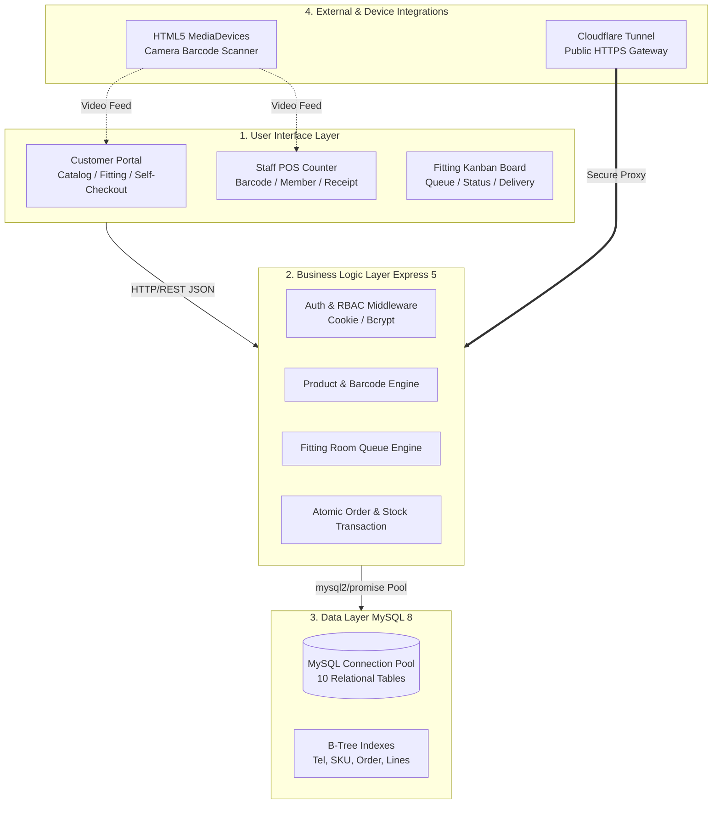
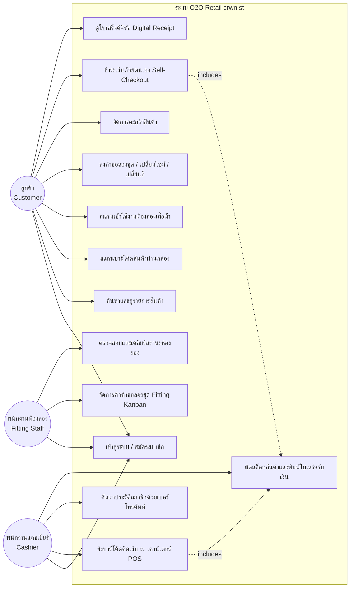
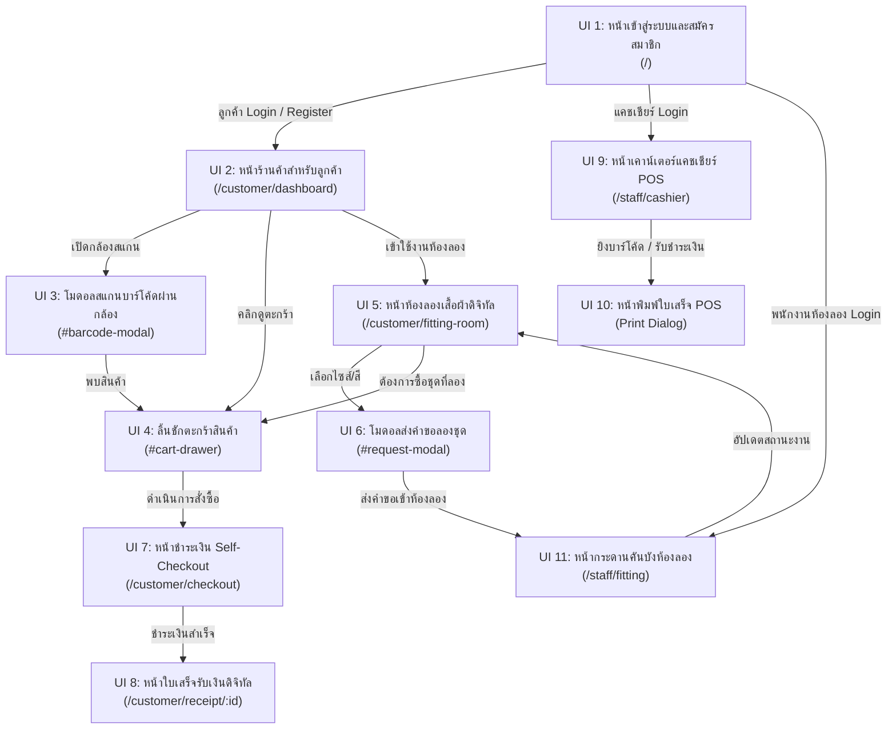
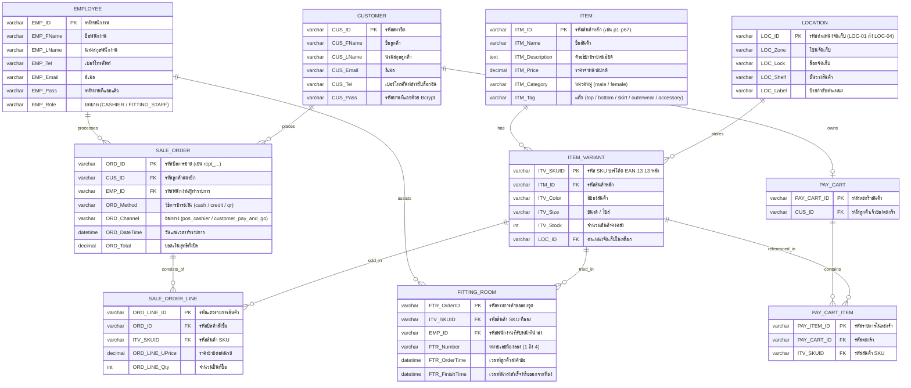
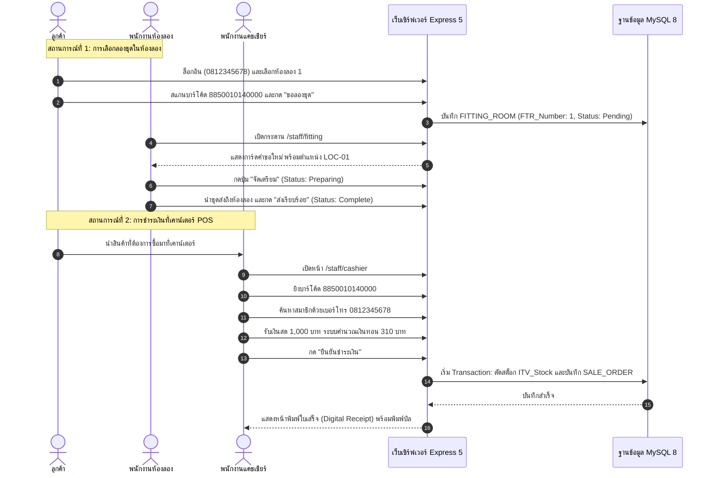

# รายงานสถาปัตยกรรมและการพัฒนาระบบ crwn.st
## ระบบ Point-of-Sale (POS) และระบบจัดการห้องลองชุดอัจฉริยะ (Seamless O2O Retail Experience)

---

## สารบัญ (Table of Contents)
1. [องค์ประกอบสถาปัตยกรรมของเว็บไซต์ (System Architecture)](#1-องค์ประกอบสถาปัตยกรรมของเว็บไซต์-system-architecture)
   - 1.1 [User Interface (UI)](#11-user-interface-ui)
   - 1.2 [Business Logic Layer](#12-business-logic-layer)
   - 1.3 [Data Layer](#13-data-layer)
   - 1.4 [Payment & Checkout System](#14-payment--checkout-system)
   - 1.5 [Reporting & Analytics](#15-reporting--analytics)
   - 1.6 [Administration & Staff Dashboard](#16-administration--staff-dashboard)
   - 1.7 [กระบวนการทำงานของระบบ (System Workflows)](#17-กระบวนการทำงานของระบบ-system-workflows)
2. [แผนภาพยูสเคส (Use Case Diagram & Actor Specifications)](#2-แผนภาพยูสเคส-use-case-diagram--actor-specifications)
   - 2.1 [แผนภาพ Mermaid Use Case Diagram](#21-แผนภาพ-mermaid-use-case-diagram)
   - 2.2 [รายละเอียดกลุ่มผู้ใช้งาน (Actor Descriptions)](#22-รายละเอียดกลุ่มผู้ใช้งาน-actor-descriptions)
   - 2.3 [คำอธิบายฟังก์ชัน Use Case ทั้งหมด](#23-คำอธิบายฟังก์ชัน-use-case-ทั้งหมด)
3. [ข้อกำหนดหน้าเว็บและฟังก์ชันการทำงาน (Website Features by Role)](#3-ข้อกำหนดหน้าเว็บและฟังก์ชันการทำงาน-website-features-by-role)
   - 3.1 [หน้าเว็บไซต์สำหรับลูกค้าทั่วไป (Customer Portal)](#31-หน้าเว็บไซต์สำหรับลูกค้าทั่วไป-customer-portal)
   - 3.2 [หน้าเว็บไซต์สำหรับพนักงานแคชเชียร์ (POS Counter)](#32-หน้าเว็บไซต์สำหรับพนักงานแคชเชียร์-pos-counter)
   - 3.3 [หน้าเว็บไซต์สำหรับพนักงานห้องลองเสื้อ (Fitting Room Kanban)](#33-หน้าเว็บไซต์สำหรับพนักงานห้องลองเสื้อ-fitting-room-kanban)
4. [เทคนิคและเครื่องมือที่ใช้ในการพัฒนา (Technology Stack)](#4-เทคนิคและเครื่องมือที่ใช้ในการพัฒนา-technology-stack)
   - 4.1 [Frontend Technologies](#41-frontend-technologies)
   - 4.2 [Backend Technologies](#42-backend-technologies)
   - 4.3 [Database Engine & Data Management](#43-database-engine--data-management)
   - 4.4 [Security, Networking & Performance Optimization](#44-security-networking--performance-optimization)
5. [แผนผังเว็บไซต์และโครงสร้างหน้าจอ (Sitemap & Interface Structure)](#5-แผนผังเว็บไซต์และโครงสร้างหน้าจอ-sitemap--interface-structure)
   - 5.1 [แผนผังภาพรวมการนำทาง (Site Navigation Flow)](#51-แผนผังภาพรวมการนำทาง-site-navigation-flow)
   - 5.2 [Interface Structure Diagram (Mermaid Flowchart)](#52-interface-structure-diagram-mermaid-flowchart)
6. [การออกแบบฐานข้อมูล (Entity Relationship Diagram - ERD)](#6-การออกแบบฐานข้อมูล-entity-relationship-diagram---erd)
   - 6.1 [แผนภาพความสัมพันธ์ข้อมูล (Mermaid ER Diagram)](#61-แผนภาพความสัมพันธ์ข้อมูล-mermaid-er-diagram)
   - 6.2 [พจนานุกรมข้อมูล (Data Dictionary - 10 Tables Schema)](#62-พจนานุกรมข้อมูล-data-dictionary---10-tables-schema)
7. [รายละเอียดการพัฒนาส่วนหน้า (Frontend Deep-Dive)](#7-รายละเอียดการพัฒนาส่วนหน้า-frontend-deep-dive)
   - 7.1 [โครงสร้าง Layout และ EJS Partial Templates](#71-โครงสร้าง-layout-และ-ejs-partial-templates)
   - 7.2 [ธีมการออกแบบและสไตล์ชีต (Quiet Luxury Palette & Glassmorphism)](#72-ธีมการออกแบบและสไตล์ชีต-quiet-luxury-palette--glassmorphism)
   - 7.3 [ระบบตรวจจับบาร์โค้ดผ่านกล้องอุปกรณ์ (Barcode Scanner Integration)](#73-ระบบตรวจจับบาร์โค้ดผ่านกล้องอุปกรณ์-barcode-scanner-integration)
8. [รายละเอียดการพัฒนาส่วนหลังและระบบความปลอดภัย (Backend Implementation & Security)](#8-รายละเอียดการพัฒนาส่วนหลังและระบบความปลอดภัย-backend-implementation--security)
   - 8.1 [โครงสร้างการตั้งค่าเซิร์ฟเวอร์ Express 5](#81-โครงสร้างการตั้งค่าเซิร์ฟเวอร์-express-5)
   - 8.2 [การบริหารจัดการฐานข้อมูลด้วย Connection Pool และ Transaction](#82-การบริหารจัดการฐานข้อมูลด้วย-connection-pool-และ-transaction)
   - 8.3 [การยืนยันตัวตนและการควบคุมสิทธิ์ (Role-Based Access Control)](#83-การยืนยันตัวตนและการควบคุมสิทธิ์-role-based-access-control)
   - 8.4 [การตัดสต็อกสินค้าแบบปลอดภัย (Atomic Stock Deduction)](#84-การตัดสต็อกสินค้าแบบปลอดภัย-atomic-stock-deduction)
   - 8.5 [รายการ RESTful API Reference](#85-รายการ-restful-api-reference)
9. [คู่มือการใช้งานระบบและข้อมูลทดสอบ (User Manual & Test Scenarios)](#9-คู่มือการใช้งานระบบและข้อมูลทดสอบ-user-manual--test-scenarios)
   - 9.1 [บัญชีผู้ใช้งานสำหรับทดสอบระบบ (Test Credentials)](#91-บัญชีผู้ใช้งานสำหรับทดสอบระบบ-test-credentials)
   - 9.2 [ชุดรหัสบาร์โค้ดสินค้าตัวอย่าง (Test Barcodes EAN-13 13 หลัก)](#92-ชุดรหัสบาร์โค้ดสินค้าตัวอย่าง-test-barcodes-ean-13-13-หลัก)
   - 9.3 [ขั้นตอนการทดสอบฟังก์ชันสำคัญตามบทบาทผู้ใช้](#93-ขั้นตอนการทดสอบฟังก์ชันสำคัญตามบทบาทผู้ใช้)
   - 9.4 [การทดสอบผ่านอุปกรณ์เคลื่อนที่ด้วย Cloudflare Tunnel](#94-การทดสอบผ่านอุปกรณ์เคลื่อนที่ด้วย-cloudflare-tunnel)

---

## 1. องค์ประกอบสถาปัตยกรรมของเว็บไซต์ (System Architecture)

ระบบ **crwn.st** ได้รับการออกแบบสถาปัตยกรรมซอฟต์แวร์เพื่อรองรับการค้าปลีกแฟชั่นแบบผสมผสานออนไลน์และออฟไลน์ (Online-to-Offline: O2O) โดยเชื่อมต่อการบริการในร้านค้าจริงเข้ากับแพลตฟอร์มดิจิทัลแบบไร้รอยต่อ ระบบรองรับผู้ใช้งาน 3 กลุ่มหลัก ได้แก่ **ลูกค้า (Customer)**, **พนักงานแคชเชียร์ (Cashier)**, และ **พนักงานดูแลห้องลองชุด (Fitting Staff)** โดยแบ่งสถาปัตยกรรมออกเป็นเลเยอร์ต่างๆ ดังต่อไปนี้:



### 1.1 User Interface (UI)
* **การออกแบบตามแนวคิด Quiet Luxury:** ใช้วิจิตรศิลป์แบบเรียบหรู คุมโทนสีธรรมชาติ Ecru (`#F5F2EB`), Forest Noir (`#1F2421`), Muted Taupe (`#A3907C`) ร่วมกับเทคนิค Glassmorphism และ Micro-interactions
* **Responsive Design & Device Optimization:** ออกแบบให้ยืดหยุ่นรองรับสมาร์ตโฟน แท็บเล็ตหน้าห้องลอง และหน้าจอคอมพิวเตอร์ประจำเคาน์เตอร์ POS
* **กล้องสแกนบาร์โค้ดในตัว:** ใช้งาน Web Camera API สแกนบาร์โค้ดสินค้าได้ทันทีโดยไม่ต้องใช้อุปกรณ์สแกนภายนอก

### 1.2 Business Logic Layer
* **ระบบจัดการสต็อกสินค้าแบบเรียลไทม์:** ตรวจสอบและหักจำนวนสต็อกตาม SKU (Color, Size) โดยตรง
* **ระบบจัดการคิวห้องลองอัจฉริยะ (Fitting Queue Engine):** ลูกค้าสามารถส่งคำขอลองชุด ขอเปลี่ยนไซส์ หรือเปลี่ยนสีชุดได้จากภายในห้องลอง ระบบจะส่งคำขอขึ้นกระดาน Kanban ของพนักงานแบบเรียลไทม์
* **ระบบความสมบูรณ์ของธุรกรรม (Transaction Integrity):** รองรับ Database Transaction แบบสมบูรณ์ ป้องกันปัญหาสต็อกติดลบหรือการแย่งซื้อสินค้าพร้อมกัน (Concurrency / Race Condition)

### 1.3 Data Layer
* **ฐานข้อมูลแบบ Relational Database (MySQL 8):** จัดเก็บข้อมูลในรูปแบบตารางที่เชื่อมโยงกันอย่างถูกต้อง (10 ตารางหลัก)
* **Connection Pooling:** ใช้ Connection Pool (สูงสุด 10 connections) พร้อมกลไก KeepAlive นำการเชื่อมต่อกลับมาใช้ซ้ำ ลดภาระการเปิด-ปิด Connection
* **Indexing Strategy:** วาง B-Tree Index บน Foreign Keys และคอลัมน์ที่มีการสืบค้นบ่อยครั้ง เช่น เบอร์โทรศัพท์ลูกค้า (`CUS_Tel`), รหัส SKU (`ITV_SKUID`)

### 1.4 Payment & Checkout System
* **รองรับ 2 ช่องทางการขาย (Omnichannel):**
  1. *POS Cashier Counter:* ชำระผ่านเงินสด (พร้อมระบบคำนวณเงินทอนอัตโนมัติ), บัตรเครดิต, หรือสแกน QR Code
  2. *Customer Self-Checkout (Pay & Go):* สแกนสินค้าใส่ตะกร้าและชำระเงินด้วยตนเองผ่านมือถือ
* **การสร้างใบเสร็จดิจิทัล (Digital Receipt):** จัดทำบิลการขายพร้อมรหัสตรวจสอบ สามารถพิมพ์เป็นกระดาษหรือบันทึกเป็น PDF ได้ทันที

### 1.5 Reporting & Analytics
* **สรุปรายการคำสั่งซื้อ (Sale Orders):** ตรวจสอบประวัติการขาย วันที่-เวลา ยอดเงินรวม และผู้ทำรายการ
* **ตรวจสอบอัตราการเข้าใช้งานห้องลอง:** ติดตามระยะเวลาในการลองชุดของลูกค้า เพื่อวิเคราะห์ความสนใจในสินค้าแต่ละรุ่น

### 1.6 Administration & Staff Dashboard
* **หน้าจอ POS สำหรับพนักงานแคชเชียร์:** ยิงบาร์โค้ด ค้นหาสมาชิก คำนวณยอดเงิน และพิมพ์ใบเสร็จ
* **หน้าจอกระดาน Kanban สำหรับพนักงานห้องลอง:** จัดลำดับความสำคัญของคำขอลองชุด (รอดำเนินการ -> กำลังจัดเตรียม -> นำส่งเรียบร้อย) พร้อมแสดงสถานะห้องว่าง

### 1.7 กระบวนการทำงานของระบบ (System Workflows)
1. **การยืนยันตัวตนและการเข้าสู่ระบบ:** สมาชิกใช้เบอร์โทรศัพท์และรหัสผ่าน พนักงานใช้รหัสพนักงาน โดยระบบจะแยกบทบาท (Role) และสิทธิ์การเข้าถึงให้อัตโนมัติ
2. **การเลือกสินค้าและขอลองชุด:** ลูกค้าเลือกดูสินค้า สแกนเข้าห้องลอง (เช่น ห้อง 1 ถึง 4) และส่งคำขอให้พนักงานนำชุดไปส่งในห้องลอง
3. **การประมวลผลคำขอลองชุด:** พนักงานรับคำขอ จัดเตรียมชุดตามตำแหน่งจัดเก็บ (Location: LOC-01 ถึง LOC-04) และเปลี่ยนสถานะงานในระบบ
4. **การสั่งซื้อและชำระเงิน:** ลูกค้าสามารถนำชุดมาชำระเงินที่แคชเชียร์ หรือชำระด้วยตนเองผ่าน Self-checkout
5. **การตัดสต็อกสินค้าและออกใบเสร็จ:** ระบบเริ่ม Database Transaction ตรวจสอบสต็อก ตัดยอด และสร้างเรคอร์ดใบเสร็จ
6. **การตรวจสอบสิทธิ์การเข้าถึง (RBAC):** Middleware คอยคุ้มครอง URL ไม่ให้ผู้ใช้เข้าถึงหน้าการทำงานที่ตนเองไม่มีสิทธิ์

---

## 2. แผนภาพยูสเคส (Use Case Diagram & Actor Specifications)

### 2.1 แผนภาพ Mermaid Use Case Diagram



### 2.2 รายละเอียดกลุ่มผู้ใช้งาน (Actor Descriptions)

| Actor | รหัสประจำบทบาท | ขอบเขตหน้าที่และความรับผิดชอบ |
|---|---|---|
| **ลูกค้า (Customer)** | `CUSTOMER` | เข้าชมสินค้า, สแกนบาร์โค้ด, สแกนเข้าห้องลอง, ร้องขอชุดลอง/เปลี่ยนไซส์, จัดการตะกร้า, ชำระเงินแบบ Self-Checkout และดูใบเสร็จ |
| **พนักงานห้องลอง (Fitting Staff)** | `FITTING_STAFF` | ดูแลกระดาน Kanban จัดเตรียมชุดตามตำแหน่งจัดเก็บ (Location) นำส่งชุดเข้าห้องลอง และอัปเดตสถานะห้องลอง |
| **พนักงานแคชเชียร์ (Cashier)** | `CASHIER` | ยิงบาร์โค้ดสินค้าที่เคาน์เตอร์ POS, ค้นหาสมาชิกด้วยเบอร์โทรศัพท์, รับชำระเงินสด/บัตร, คำนวณเงินทอน, และพิมพ์ใบเสร็จ |

### 2.3 คำอธิบายฟังก์ชัน Use Case ทั้งหมด

1. **เข้าสู่ระบบ / สมัครสมาชิก (Authentication & Registration):**
   - ผู้ใช้กรอกเบอร์โทรศัพท์หรือรหัสพนักงานในฟอร์มเดียว ระบบตรวจสอบประเภทผู้ใช้และนำทางไปยังหน้าที่เหมาะสม
2. **สแกนบาร์โค้ดสินค้าผ่านกล้อง (Camera Barcode Scanner):**
   - ใช้กล้องของโทรศัพท์หรือคอมพิวเตอร์สแกนบาร์โค้ด EAN-13 เพื่อดึงรายละเอียดสินค้า ไซส์ สี และสต็อกคงเหลือ
3. **ระบบจัดการห้องลองชุด (Fitting Room Interaction):**
   - ลูกค้าสามารถสแกนเลือกห้องลอง (ห้อง 1-4) และส่งคำขอชุดที่ต้องการลองพร้อมระบุสีและไซส์ไปยังพนักงาน
4. **กระดานคันบังห้องลอง (Fitting Kanban Board):**
   - พนักงานดูคำขอที่เข้ามา จัดการเปลี่ยนสถานะจาก "Pending" เป็น "Preparing" และ "Complete" เมื่อส่งชุดแล้ว
5. **ระบบแคชเชียร์จุดขาย (POS Checkout Counter):**
   - แคชเชียร์ยิงสแกนสินค้า ค้นหาสมาชิกเพื่อสะสมยอด ชำระเงินด้วยเงินสดหรือบัตร และพิมพ์ใบเสร็จ
6. **การตัดสต็อกสินค้าและบันทึกใบเสร็จ (Atomic Inventory Deduction):**
   - ปฏิบัติการร่วมกันผ่าน Database Transaction ตัดยอดสต็อกคงเหลือใน `ITEM_VARIANT` ทันทีที่การชำระเงินสำเร็จ

---

## 3. ข้อกำหนดหน้าเว็บและฟังก์ชันการทำงาน (Website Features by Role)

### 3.1 หน้าเว็บไซต์สำหรับลูกค้าทั่วไป (Customer Portal)
* **หน้าเข้าสู่ระบบ & สมัครสมาชิก (`/`):** รองรับการสลับแท็บระหว่าง "เข้าสู่ระบบ" และ "สมัครสมาชิกใหม่" ตรวจสอบข้อมูลก่อนส่ง (Validation)
* **หน้าหลักและรายการสินค้า (`/customer/dashboard`):** 
  - แสดงแคตตาล็อกสินค้า 67 รายการ จัดแบ่งหมวดหมู่ ชาย/หญิง (Category) และประเภทสินค้า (Tags: Tops, Bottoms, Skirts, Outerwear, Accessories)
  - ช่องค้นหาแบบเรียลไทม์ พร้อมปุ่มเปิดกล้องสแกนบาร์โค้ด
  - ปุ่มเรียกลิ้นชักตะกร้าสินค้า (Cart Drawer)
* **หน้าห้องลองเสื้อผ้าดิจิทัล (`/customer/fitting-room`):**
  - แสดงสถานะห้องลองที่ลูกค้ากำลังใช้งาน (Room 1-4)
  - รายการชุดที่สั่งลอง พร้อมสถานะแบบเรียลไทม์ (รอดำเนินการ / กำลังนำส่ง)
  - แคตตาล็อกสินค้าสำหรับส่งคำขอลองเพิ่มหรือขอเปลี่ยนไซส์ได้ทันที
* **หน้าชำระเงินด้วยตนเอง (`/customer/checkout`):**
  - สรุปรายการสินค้า ยอดรวม การเลือกวิธีชำระเงิน (QR PromptPay / Credit Card)
* **หน้าใบเสร็จรับเงินดิจิทัล (`/customer/receipt/:id`):**
  - แสดงบิลการขายพร้อมรหัสออเดอร์ วันที่ รายการสินค้า และปุ่มสั่งพิมพ์/บันทึก PDF

### 3.2 หน้าเว็บไซต์สำหรับพนักงานแคชเชียร์ (POS Counter)
* **หน้าจอขายหน้าร้าน (`/staff/cashier`):**
  - ช่องยิงบาร์โค้ดสินค้าด่วน (Numeric Input & Barcode Scanner)
  - ค้นหาข้อมูลสมาชิกด้วยเบอร์โทรศัพท์เพื่อผูกบิล
  - ตารางสรุปรายการสินค้าที่กำลังสแกน พร้อมปุ่มปรับเพิ่ม-ลดจำนวน
  - ระบบรับเงินสดและคำนวณเงินทอนอัตโนมัติ
  - ปุ่มยืนยันชำระเงินพร้อมเปิดหน้าพิมพ์ใบเสร็จ

### 3.3 หน้าเว็บไซต์สำหรับพนักงานห้องลองเสื้อ (Fitting Room Kanban)
* **หน้าจอกระดานจัดการคิว (`/staff/fitting`):**
  - แสดงสถานะห้องลองทั้ง 4 ห้อง (ว่าง / กำลังลอง)
  - การ์ดคำขอลองชุดแบ่ง 3 คอลัมน์:
    1. *Pending (รอดำเนินการ):* แสดงหมายเลขห้อง, ชื่อสินค้า, สี, ไซส์, และตำแหน่งชั้นวางสินค้า (Location เช่น `LOC-01`)
    2. *Preparing (กำลังจัดเตรียม):* พนักงานกดรับงานเพื่อเริ่มจัดชุด
    3. *Complete (นำส่งแล้ว):* ชุดถูกนำส่งถึงห้องลองเรียบร้อยแล้ว
  - ปุ่มสั่งเคลียร์สถานะห้องลอง (Release Room) เมื่อลูกค้าใช้งานเสร็จ

---

## 4. เทคนิคและเครื่องมือที่ใช้ในการพัฒนา (Technology Stack)

```mermaid
graph LR
    subgraph Client_Side [Frontend Web Tech]
        HTML5[HTML5 & Semantic Markup]
        CSS_TW[Tailwind CSS & Quiet Luxury Custom CSS]
        JS_Vanilla[Vanilla JS & Lucide Icons]
        Camera_API[HTML5 MediaDevices Camera API]
    end

    subgraph Server_Side [Backend Application Node.js]
        Express[Node.js & Express 5]
        EJS[EJS Template Engine]
        Security[BcryptJS & Cookie-Parser]
        Optim[Compression Gzip & Static Cache]
    end

    subgraph Data_Storage [Database Management]
        MySQL[MySQL 8 Engine]
        Driver[mysql2/promise Pool]
        Indexes[B-Tree Composite Indexes]
    end

    Client_Side <-->|HTTP/HTTPS REST| Server_Side
    Server_Side <-->|Connection Pool| Data_Storage
```



### 4.1 Frontend Technologies
* **HTML5:** โครงสร้างเว็บแบบ Semantic รองรับการทำงานของโมดอล ลิ้นชักตะกร้าสินค้า และฟอร์มรับข้อมูล
* **Tailwind CSS & Custom CSS:** ผสมผสานคลาสยูทิลิตีของ Tailwind เข้ากับสไตล์ชีตเฉพาะตัว (`/public/css/styles.css`) สร้างสรรค์ความหรูหราด้วยเอฟเฟกต์กระจกเบลอ (Glassmorphism: `.glass`, `.glass-heavy`)
* **Typography:** ใช้ชุดฟอนต์ระดับพรีเมียมจาก Google Fonts ได้แก่ **Outfit** สำหรับเนื้อหาทั่วไป และ **Playfair Display** สำหรับหัวข้อหลัก
* **JavaScript & Lucide Icons:** ใช้ JavaScript ฝั่งไคลเอนต์ (`app.js`, `cart.js`) ควบคุมการตอบสนอง การค้นหาแบบ Debounce 300ms และไอคอนเวกเตอร์ Lucide

### 4.2 Backend Technologies
* **Node.js (>= 22.0.0):** สภาพแวดล้อมรันไทม์ประสิทธิภาพสูงสำหรับประมวลผลแบบ Non-blocking I/O
* **Express.js (Version 5.2.1):** เว็บเฟรมเวิร์กจัดการ Routing, Middleware, และ REST API
* **EJS (Embedded JavaScript Templates):** เทมเพลตเอนจินสำหรับการเรนเดอร์หน้าเว็บฝั่งเซิร์ฟเวอร์แบบแยกส่วน (Header, Navbar, Footer, Modals)
* **BcryptJS:** ไลบรารีเข้ารหัสและแฮชรหัสผ่านของผู้ใช้งานก่อนบันทึกลงฐานข้อมูล

### 4.3 Database Engine & Data Management
* **MySQL 8 (Enterprise Database):** โฮสต์บนเซิร์ฟเวอร์ `webdev.it.kmitl.ac.th`
* **mysql2/promise:** ไลบรารีเชื่อมต่อฐานข้อมูล รองรับการทำงานแบบ Async/Await และ Transaction
* **Connection Pooling:** กำหนด `connectionLimit: 10`, `waitForConnections: true`, และ `charset: 'utf8mb4'` เพื่อเสถียรภาพสูงสุด

### 4.4 Security, Networking & Performance Optimization
* **Gzip Payload Compression:** ติดตั้งมิดเดิลแวร์ `compression()` เพื่อบีบอัดข้อมูลที่ส่งผ่านเครือข่าย
* **Static Asset Caching:** ตั้งค่า `maxAge: '1d'` และเปิดใช้ `ETag` สำหรับไฟล์สถิต
* **Cloudflare Tunnel:** เชื่อมต่อระบบ Local ออกสู่อินเทอร์เน็ตสาธารณะด้วยโปรโตคอล HTTPS ช่วยให้ทดสอบการสแกนผ่านกล้องมือถือได้ทันที

---

## 5. แผนผังเว็บไซต์และโครงสร้างหน้าจอ (Sitemap & Interface Structure)

### 5.1 แผนผังภาพรวมการนำทาง (Site Navigation Flow)

ระบบ crwn.st แบ่งสายการทำงานออกเป็น 3 เส้นทางหลักตามสิทธิ์ของผู้ใช้งาน:

```text
[ หน้าหลัก / เข้าสู่ระบบ (UI 1: /) ]
       │
       ├───> [ ลูกค้ายืนยันตัวตนสำเร็จ ] ────> [ Customer Dashboard (UI 2) ]
       │                                           │
       │                                           ├───> [ กล้องสแกนบาร์โค้ด (UI 3) ]
       │                                           ├───> [ ลิ้นชักตะกร้าสินค้า (UI 4) ]
       │                                           ├───> [ หน้าห้องลองชุด (UI 5) ]
       │                                           │         └───> [ คำขอลองชุด / เปลี่ยนไซส์ (UI 6) ]
       │                                           ├───> [ ชำระเงิน Self-Checkout (UI 7) ]
       │                                           └───> [ ใบเสร็จดิจิทัล (UI 8) ]
       │
       ├───> [ พนักงานแคชเชียร์ยืนยันตัวตน ] ─> [ POS Counter Screen (UI 9) ]
       │                                           │
       │                                           ├───> [ สแกนบาร์โค้ด / ค้นหาสมาชิก ]
       │                                           ├───> [ คำนวณเงินทอน / ชำระเงิน ]
       │                                           └───> [ พิมพ์ใบเสร็จรับเงิน (UI 10) ]
       │
       └───> [ พนักงานห้องลองยืนยันตัวตน ] ───> [ Fitting Room Kanban (UI 11) ]
                                                   │
                                                   ├───> [ ติดตามคิว Pending / Preparing ]
                                                   ├───> [ ส่งมอบชุด Complete ]
                                                   └───> [ เคลียร์สถานะห้องลอง Release ]
```

### 5.2 Interface Structure Diagram (Mermaid Flowchart)



---

## 6. การออกแบบฐานข้อมูล (Entity Relationship Diagram - ERD)

### 6.1 แผนภาพความสัมพันธ์ข้อมูล (Mermaid ER Diagram)

ฐานข้อมูลของ crwn.st ประกอบด้วย **10 ตารางหลัก** ที่ออกแบบตามหลักการ Normalized Database (3NF):



### 6.2 พจนานุกรมข้อมูล (Data Dictionary - 10 Tables Schema)

#### 1. ตาราง `EMPLOYEE` (ข้อมูลพนักงาน)
| ชื่อคอลัมน์ | ชนิดข้อมูล | คุณสมบัติ | ความหมาย / คำอธิบาย |
|---|---|---|---|
| `EMP_ID` | VARCHAR(50) | PRIMARY KEY | รหัสพนักงาน (เช่น `68070254`, `68070056`) |
| `EMP_FName` | VARCHAR(100) | NOT NULL | ชื่อจริงพนักงาน |
| `EMP_LName` | VARCHAR(100) | NOT NULL | นามสกุลพนักงาน |
| `EMP_Tel` | VARCHAR(20) | NULL | เบอร์โทรศัพท์พนักงาน |
| `EMP_Email` | VARCHAR(100) | NULL | อีเมลพนักงาน |
| `EMP_Pass` | VARCHAR(255) | NOT NULL | รหัสผ่านพนักงาน |
| `EMP_Role` | VARCHAR(50) | NULL | บทบาทหน้าที่ (`CASHIER` หรือ `FITTING_STAFF`) |

#### 2. ตาราง `CUSTOMER` (ข้อมูลลูกค้าสมาชิก)
| ชื่อคอลัมน์ | ชนิดข้อมูล | คุณสมบัติ | ความหมาย / คำอธิบาย |
|---|---|---|---|
| `CUS_ID` | VARCHAR(50) | PRIMARY KEY | รหัสสมาชิก (เช่น `u1`, `u2`, `u_123456`) |
| `CUS_FName` | VARCHAR(100) | NOT NULL | ชื่อลูกค้า |
| `CUS_LName` | VARCHAR(100) | NOT NULL | นามสกุลลูกค้า |
| `CUS_Email` | VARCHAR(100) | NULL | อีเมลสำหรับติดต่อ |
| `CUS_Tel` | VARCHAR(20) | INDEX | หมายเลขโทรศัพท์ที่ใช้ล็อกอิน (เช่น `0812345678`) |
| `CUS_Pass` | VARCHAR(255) | NOT NULL | รหัสผ่านที่เข้ารหัสด้วย Bcrypt Hash |

#### 3. ตาราง `ITEM` (สินค้าหลัก)
| ชื่อคอลัมน์ | ชนิดข้อมูล | คุณสมบัติ | ความหมาย / คำอธิบาย |
|---|---|---|---|
| `ITM_ID` | VARCHAR(50) | PRIMARY KEY | รหัสสินค้าหลัก (เช่น `p1`, `p2`, ..., `p67`) |
| `ITM_Name` | VARCHAR(255) | NOT NULL | ชื่อเรียกสินค้า |
| `ITM_Description` | TEXT | NULL | คำอธิบายรายละเอียดสินค้าและเนื้อผ้า |
| `ITM_Price` | DECIMAL(10,2) | NOT NULL | ราคาจำหน่ายมาตรฐาน (บาท) |
| `ITM_Category` | VARCHAR(100) | NULL | หมวดหมู่หลัก (`male`, `female`) |
| `ITM_Tag` | VARCHAR(100) | NULL | กลุ่มย่อย (`top`, `bottom`, `skirt`, `outerwear`, `accessory`) |

#### 4. ตาราง `LOCATION` (ตำแหน่งจัดเก็บสินค้าในร้าน)
| ชื่อคอลัมน์ | ชนิดข้อมูล | คุณสมบัติ | ความหมาย / คำอธิบาย |
|---|---|---|---|
| `LOC_ID` | VARCHAR(50) | PRIMARY KEY | รหัสตำแหน่งจัดเก็บ (`LOC-01` ถึง `LOC-04`) |
| `LOC_Zone` | VARCHAR(50) | NULL | โซนจัดเก็บ |
| `LOC_Lock` | VARCHAR(50) | NULL | แถวหรือล็อกจัดเก็บ |
| `LOC_Shelf` | VARCHAR(50) | NULL | หมายเลขชั้นวาง |
| `LOC_Label` | VARCHAR(50) | NULL | ป้ายกำกับสำหรับพนักงานค้นหาสินค้า |

#### 5. ตาราง `ITEM_VARIANT` (สินค้าแยกตามสี ไซส์ และสต็อก)
| ชื่อคอลัมน์ | ชนิดข้อมูล | คุณสมบัติ | ความหมาย / คำอธิบาย |
|---|---|---|---|
| `ITV_SKUID` | VARCHAR(50) | PRIMARY KEY | รหัสบาร์โค้ด EAN-13 13 หลัก (เช่น `8850010140000`) |
| `ITM_ID` | VARCHAR(50) | FK -> ITEM | รหัสสินค้าหลักที่เชื่อมโยง |
| `ITV_Color` | VARCHAR(50) | NULL | สีของสินค้า (เช่น `Black`, `Navy`, `White`) |
| `ITV_Size` | VARCHAR(50) | NULL | ขนาด/ไซส์ (เช่น `S`, `M`, `L`, `XL`, `30`, `32`, `OS`) |
| `ITV_Stock` | INT | DEFAULT 0 | จำนวนสินค้าคงคลังในร้าน |
| `LOC_ID` | VARCHAR(50) | FK -> LOCATION | ตำแหน่งจัดเก็บสินค้าชิ้นนี้ |

#### 6. ตาราง `PAY_CART` (หัวตะกร้าสินค้า)
| ชื่อคอลัมน์ | ชนิดข้อมูล | คุณสมบัติ | ความหมาย / คำอธิบาย |
|---|---|---|---|
| `PAY_CART_ID` | VARCHAR(50) | PRIMARY KEY | รหัสตะกร้า (เช่น `cart_u1`) |
| `CUS_ID` | VARCHAR(50) | FK -> CUSTOMER | รหัสลูกค้าเจ้าของตะกร้า |

#### 7. ตาราง `PAY_CART_ITEM` (รายการสินค้าในตะกร้า)
| ชื่อคอลัมน์ | ชนิดข้อมูล | คุณสมบัติ | ความหมาย / คำอธิบาย |
|---|---|---|---|
| `PAY_ITEM_ID` | VARCHAR(50) | PRIMARY KEY | รหัสรายการชิ้นสินค้า |
| `PAY_CART_ID` | VARCHAR(50) | FK -> PAY_CART | รหัสตะกร้าที่บรรจุสินค้า |
| `ITV_SKUID` | VARCHAR(50) | FK -> ITEM_VARIANT | รหัส SKU สินค้าในตะกร้า |

#### 8. ตาราง `SALE_ORDER` (หัวบิลการขาย)
| ชื่อคอลัมน์ | ชนิดข้อมูล | คุณสมบัติ | ความหมาย / คำอธิบาย |
|---|---|---|---|
| `ORD_ID` | VARCHAR(50) | PRIMARY KEY | รหัสบิลใบเสร็จ (เช่น `rcpt_1728000000000`) |
| `CUS_ID` | VARCHAR(50) | FK -> CUSTOMER | รหัสลูกค้าสมาชิก (อนุญาตให้เป็น NULL สำหรับลูกค้าทั่วไป) |
| `EMP_ID` | VARCHAR(50) | FK -> EMPLOYEE | รหัสพนักงานแคชเชียร์ผู้ทำรายการ |
| `ORD_Method` | VARCHAR(50) | NULL | วิธีชำระเงิน (`cash`, `credit`, `qr`) |
| `ORD_Channel` | VARCHAR(50) | NULL | ช่องทางขาย (`pos_cashier`, `customer_pay_and_go`) |
| `ORD_DateTime` | DATETIME | DEFAULT NOW() | วันเวลาที่ทำรายการขายเสร็จสมบูรณ์ |
| `ORD_Total` | DECIMAL(12,2) | NOT NULL | ยอดเงินรวมสุทธิของคำสั่งซื้อ |

#### 9. ตาราง `SALE_ORDER_LINE` (รายละเอียดแถวสินค้าในบิลการขาย)
| ชื่อคอลัมน์ | ชนิดข้อมูล | คุณสมบัติ | ความหมาย / คำอธิบาย |
|---|---|---|---|
| `ORD_LINE_ID` | VARCHAR(50) | PRIMARY KEY | รหัสรายการในบิล (เช่น `line_rcpt_1728000000_0`) |
| `ORD_ID` | VARCHAR(50) | FK -> SALE_ORDER | รหัสบิลใบเสร็จที่อ้างอิง |
| `ITV_SKUID` | VARCHAR(50) | FK -> ITEM_VARIANT | รหัสสินค้า SKU |
| `ORD_LINE_UPrice` | DECIMAL(10,2) | NOT NULL | ราคาขายจริงต่อหน่วย ณ เวลาสั่งซื้อ |
| `ORD_LINE_Qty` | INT | NOT NULL | จำนวนชิ้นที่สั่งซื้อ |

#### 10. ตาราง `FITTING_ROOM` (การใช้งานห้องลองชุด)
| ชื่อคอลัมน์ | ชนิดข้อมูล | คุณสมบัติ | ความหมาย / คำอธิบาย |
|---|---|---|---|
| `FTR_OrderID` | VARCHAR(50) | PRIMARY KEY | รหัสคำขอลองชุด (เช่น `ftr_1728000000`) |
| `ITV_SKUID` | VARCHAR(50) | FK -> ITEM_VARIANT | รหัสสินค้า SKU ที่ลูกค้าต้องการลอง |
| `EMP_ID` | VARCHAR(50) | FK -> EMPLOYEE | รหัสพนักงานห้องลองที่รับผิดชอบ |
| `FTR_Number` | VARCHAR(20) | NOT NULL | หมายเลขห้องลอง (เช่น `1`, `2`, `3`, `4`) |
| `FTR_OrderTime` | DATETIME | DEFAULT NOW() | เวลาที่ลูกค้ากดส่งคำขอลองชุด |
| `FTR_FinishTime` | DATETIME | NULL | เวลาที่พนักงานนำส่งสำเร็จ หรือเสร็จสิ้นการใช้งาน |

---

## 7. รายละเอียดการพัฒนาส่วนหน้า (Frontend Deep-Dive)

### 7.1 โครงสร้าง Layout และ EJS Partial Templates
เว็บแอปพลิเคชัน crwn.st นำสถาปัตยกรรม EJS Component-based มาใช้เพื่อความง่ายในการบำรุงรักษาและการนำกลับมาใช้ซ้ำ (DRY Principle):

* `views/partials/header.ejs`: จัดการส่วน `<head>` การเชื่อมต่อ Google Fonts, Tailwind CDN, Lucide Icons, และ Custom CSS
* `views/partials/navbar.ejs`: แถบนำทางด้านบนแบบ Sticky แสดงโลโก้, เมนูสลับหมวดหมู่, ตัวระบุสถานะผู้ใช้, และปุ่มเปิดตะกร้า
* `views/partials/cart-drawer.ejs`: แผงลิ้นชักสไลด์ข้างสำหรับตรวจสอบสินค้าในตะกร้าและคิดเงิน
* `views/partials/barcode-modal.ejs`: หน้าต่างป็อปอัปพร้อมตัวแสดงภาพจากกล้องเว็บแคมสำหรับสแกนบาร์โค้ด
* `views/partials/request-modal.ejs`: หน้าต่างส่งคำขอเปลี่ยนไซส์และสีชุดในห้องลอง
* `views/partials/footer.ejs`: ส่วนท้ายของหน้าเว็บแสดงข้อมูลลิขสิทธิ์และนโยบายร้าน

### 7.2 ธีมการออกแบบและสไตล์ชีต (Quiet Luxury Palette & Glassmorphism)

การจัดแต่งสไตล์ในไฟล์ `public/css/styles.css` ใช้ตัวแปร CSS Variables ในการคุมโทนสีทั่วทั้งระบบ:

```css
:root {
  --color-base: #F5F2EB;          /* สีพื้นผิวกระดาษสาธรรมชาติ (Ecru) */
  --color-primary: #1F2421;       /* สีเขียวเข้มรัตติกาล (Forest Noir) */
  --color-secondary: #A3907C;     /* สีกากีพรีเมียม (Muted Taupe) */
  --color-muted: #8A8177;         /* สีเทาเอิร์ธโทน */
  --color-accent-warm: #D4C5B2;    /* สีครีมอบอุ่น */
  --color-border: rgba(163, 144, 124, 0.22);
}

/* Glassmorphism Classes */
.glass-heavy {
  background: rgba(245, 242, 235, 0.88);
  backdrop-filter: blur(24px);
  -webkit-backdrop-filter: blur(24px);
  border: 1px solid rgba(255, 255, 255, 0.8);
  box-shadow: 0 12px 40px 0 rgba(31, 36, 33, 0.07);
}

/* Luxury Round Buttons */
.btn-primary {
  background: #1F2421;
  color: #F5F2EB;
  border-radius: 9999px;
  font-weight: 500;
  padding: 0.75rem 1.5rem;
  transition: all 0.25s cubic-bezier(0.16, 1, 0.3, 1);
  box-shadow: 0 4px 14px rgba(31, 36, 33, 0.12);
}
.btn-primary:hover {
  background: #2C332F;
  transform: translateY(-1px);
  box-shadow: 0 6px 20px rgba(31, 36, 33, 0.18);
}
```

### 7.3 ระบบตรวจจับบาร์โค้ดผ่านกล้องอุปกรณ์ (Barcode Scanner Integration)
ในไฟล์ `public/js/app.js` มีการนำ BarcodeDetector API หรือ Video Stream จากกล้องของอุปกรณ์มาวิเคราะห์รหัสบาร์โค้ด EAN-13:
* ขอสิทธิ์เข้าถึงกล้องผ่าน `navigator.mediaDevices.getUserMedia({ video: { facingMode: 'environment' } })`
* นำส่งผลลัพธ์รหัสบาร์โค้ด 13 หลัก ไปค้นหาผ่าน API `/api/products/barcode/:code`
* เพิ่มสินค้าลงในตะกร้าสินค้าหรือเปิดหน้าเลือกไซส์ให้ลูกค้าโดยอัตโนมัติ

---

## 8. รายละเอียดการพัฒนาส่วนหลังและระบบความปลอดภัย (Backend Implementation & Security)

### 8.1 โครงสร้างการตั้งค่าเซิร์ฟเวอร์ Express 5
ไฟล์ `server.js` เป็นจุดเริ่มต้นของแอปพลิเคชัน (Entry Point) โดยมีการกำหนดค่ามิดเดิลแวร์เพื่อประสิทธิภาพและความปลอดภัย:

```javascript
const express = require('express');
const compression = require('compression');
const cookieParser = require('cookie-parser');
const cors = require('cors');
const { initDb } = require('./database/db');

const app = express();
const PORT = process.env.PORT || 3000;

// View engine setup
app.set('view engine', 'ejs');
app.set('views', path.join(__dirname, 'views'));

// Middlewares
app.use(compression());  // Gzip compression เพื่อความรวดเร็วในการส่งข้อมูล
app.use(cors());
app.use(express.json());
app.use(express.urlencoded({ extended: true }));
app.use(cookieParser());

// Camera permission policy for barcode scanning
app.use((req, res, next) => {
  res.setHeader('Permissions-Policy', 'camera=*');
  next();
});

// Static assets caching (1 day)
app.use(express.static(path.join(__dirname, 'public'), {
  maxAge: '1d',
  etag: true
}));
```

### 8.2 การบริหารจัดการฐานข้อมูลด้วย Connection Pool และ Transaction
ในไฟล์ `database/db.js` ได้สร้างฟังก์ชันครอบคลุมการทำงานของฐานข้อมูล MySQL เพื่อความทนทานต่อการขัดข้อง:

```javascript
const mysql = require('mysql2/promise');
require('dotenv').config();

const pool = mysql.createPool({
  host: process.env.DB_HOST,
  user: process.env.DB_USER,
  password: process.env.DB_PASSWORD,
  database: process.env.DB_NAME,
  port: process.env.DB_PORT || 3306,
  waitForConnections: true,
  connectionLimit: 10,
  charset: 'utf8mb4'
});

// ฟังก์ชัน Transaction รองรับ Rollback อัตโนมัติเมื่อเกิดข้อผิดพลาด
async function withTransaction(callback) {
  const connection = await pool.getConnection();
  await connection.beginTransaction();
  const tx = {
    query: async (sql, params = []) => {
      const [rows] = await connection.execute(sql, params);
      return rows;
    },
    get: async (sql, params = []) => {
      const [rows] = await connection.execute(sql, params);
      return rows[0] || null;
    },
    run: async (sql, params = []) => {
      const [result] = await connection.execute(sql, params);
      return { changes: result.affectedRows, insertId: result.insertId };
    }
  };
  try {
    const result = await callback(tx);
    await connection.commit();
    return result;
  } catch (err) {
    await connection.rollback();
    throw err;
  } finally {
    connection.release();
  }
}
```

### 8.3 การยืนยันตัวตนและการควบคุมสิทธิ์ (Role-Based Access Control)
ใน `routes/views.js` มี Middleware คอยควบคุมสิทธิ์ตามบทบาทอย่างเคร่งครัด:

```javascript
// ตรวจสอบสิทธิ์เฉพาะลูกค้าสมาชิก
function requireCustomer(req, res, next) {
  const user = getCurrentUser(req);
  if (!user) return res.redirect(`/?redirect=${encodeURIComponent(req.originalUrl)}`);
  if (user.role !== 'CUSTOMER') {
    if (user.role === 'CASHIER') return res.redirect('/staff/cashier');
    if (user.role === 'FITTING_STAFF') return res.redirect('/staff/fitting');
    return res.redirect('/');
  }
  req.user = user;
  next();
}

// ตรวจสอบสิทธิ์เฉพาะพนักงานแคชเชียร์
function requireCashier(req, res, next) {
  const user = getCurrentUser(req);
  if (!user) return res.redirect(`/?redirect=${encodeURIComponent(req.originalUrl)}`);
  if (user.role !== 'CASHIER') return res.redirect('/customer/dashboard');
  req.user = user;
  next();
}
```

### 8.4 การตัดสต็อกสินค้าแบบปลอดภัย (Atomic Stock Deduction)
เพื่อป้องกันปัญหาการสั่งซื้อสินค้าชิ้นเดียวกันในเวลาเดียวกัน (Race Condition) ระบบใช้คำสั่ง SQL ตรวจสอบและตัดยอดสต็อกในคำสั่งเดียวกันภายใน Transaction:

```sql
UPDATE ITEM_VARIANT 
SET ITV_Stock = ITV_Stock - ? 
WHERE ITV_SKUID = ? AND ITV_Stock >= ?;
```
หาก `affectedRows` มีค่าเป็น 0 แสดงว่าสต็อกคงเหลือไม่เพียงพอในขณะนั้น ระบบจะทำการ Rollback คำสั่งซื้อทั้งหมดทันทีและแจ้งเตือนผู้ใช้งาน

### 8.5 รายการ RESTful API Reference

| Endpoint | Method | คำอธิบาย | พารามิเตอร์หลัก / Body |
|---|---|---|---|
| `/api/auth/register` | `POST` | สมัครสมาชิกใหม่สำหรับลูกค้า | `firstName, lastName, phone, email, password` |
| `/api/auth/login` | `POST` | เข้าสู่ระบบ (ลูกค้า / พนักงาน) | `identifier, password` |
| `/api/auth/logout` | `POST` | ออกจากระบบและเคลียร์คุกกี้เซสชัน | - |
| `/api/products` | `GET` | ดึงรายการสินค้าทั้งหมด (รองรับ Pagination) | `?page=1&limit=12&category=male&search=shirt` |
| `/api/products/barcode/:code` | `GET` | ค้นหาสินค้าจากรหัสบาร์โค้ด EAN-13 | `code` (เช่น 8850010140000) |
| `/api/cart` | `GET` | ดึงรายการสินค้าในตะกร้าของลูกค้า | จาก Authentication Cookie |
| `/api/cart/items` | `POST` | เพิ่มสินค้าลงในตะกร้า | `{ sku: string, quantity: number }` |
| `/api/cart/items/:sku` | `DELETE` | ลบสินค้าออกจากตะกร้า | `sku` |
| `/api/fitting-rooms` | `GET` | ดึงสถานะห้องลองทั้ง 4 ห้อง | - |
| `/api/fitting-rooms/:id/release` | `POST` | ปลดปล่อยสถานะห้องลองให้เป็นห้องว่าง | `id` (หมายเลขห้อง) |
| `/api/fitting-orders` | `GET` | ดึงรายการคำขอลองชุดทั้งหมด | `?roomId=1` |
| `/api/fitting-orders` | `POST` | ลูกค้าส่งคำขอลองชุดเข้าห้องลอง | `{ roomId, sku, productName, size, color }` |
| `/api/fitting-orders/:id` | `PATCH` | พนักงานอัปเดตสถานะคำขอลองชุด | `{ status: 'preparing' \| 'complete' }` |
| `/api/receipts` | `POST` | บันทึกการชำระเงินและตัดสต็อกสินค้า | `{ paymentMethod, items, memberId, channel }` |
| `/api/receipts/:id` | `GET` | เรียกดูข้อมูลบิลใบเสร็จรับเงิน | `id` (รหัสบิล) |

---

## 9. คู่มือการใช้งานระบบและข้อมูลทดสอบ (User Manual & Test Scenarios)

### 9.1 บัญชีผู้ใช้งานสำหรับทดสอบระบบ (Test Credentials)

สามารถใช้ข้อมูลบัญชีที่จัดเตรียมไว้ล่วงหน้าเพื่อทดสอบการทำงานของระบบ:

| บทบาท (Role) | บัญชีผู้ใช้ (Identifier) | รหัสผ่าน (Password) | สิทธิ์และการใช้งาน |
|---|---|---|---|
| **แคชเชียร์ (Cashier)** | `68070254` | `68070254` | หน้า POS Counter ยิงบาร์โค้ด, ค้นหาสมาชิก, คิดเงิน, ตัดสต็อก, พิมพ์บิล |
| **พนักงานห้องลอง (Fitting Staff)** | `68070056` | `68070056` | หน้า Fitting Kanban ติดตามคิวคำขอ นำส่งชุด และเคลียร์สถานะห้องลอง |
| **ลูกค้าทดสอบ 1 (Customer 1)** | `0812345678` | `123456` | (สมชาย ใจดี) เลือกลองชุด, สั่งซื้อสินค้า, ดูประวัติใบเสร็จ |
| **ลูกค้าทดสอบ 2 (Customer 2)** | `0899999999` | `123456` | (สมหญิง ใจงาม) เลือกลองชุด, สั่งซื้อสินค้า, ดูประวัติใบเสร็จ |

### 9.2 ชุดรหัสบาร์โค้ดสินค้าตัวอย่าง (Test Barcodes EAN-13 13 หลัก)

ระบบมีสินค้าหลัก 67 รายการ (p1-p67) และมีรหัสบาร์โค้ดย่อย 96 SKU โดยสามารถคัดลอกรหัสบาร์โค้ดตัวอย่างด้านล่างไปใช้ทดสอบได้ทันที:

#### 1. กลุ่มเสื้อยืด & เสื้อเชิ้ต (Tops)
* `8850010140000` : Classic Cotton Crewneck T-Shirt (฿690) - Size XL / Black [LOC-01]
* `8850010310001` : Classic Cotton Crewneck T-Shirt (฿690) - Size S / Navy [LOC-01]
* `8850020640002` : Vintage Wash Graphic T-Shirt (฿840) - Size XL / Beige [LOC-03]
* `8850030220004` : Oversized Heavyweight T-Shirt (฿990) - Size M / White [LOC-04]
* `8850110320020` : Classic Oxford Cotton Shirt (฿690) - Size M / Navy [LOC-01]

#### 2. กลุ่มเสื้อแจ็คเก็ต & เสื้อคลุม (Outerwear)
* `8850160440030` : Chunky Knit Wool Cardigan (฿1,990) - Size XL / Navy [LOC-03]
* `8850170540032` : Fleece Zip-Up Jacket (฿2,290) - Size XL / Khaki [LOC-02]
* `8850180110033` : Classic Trench Coat (฿2,590) - Size S / Black [LOC-04]
* `8850380420063` : Oversized Denim Jacket (฿2,590) - Size M / Navy [LOC-02]

#### 3. กลุ่มกางเกง & ขาสั้น (Bottoms)
* `8850410332068` : High-Waist Wide Leg Trousers (฿990) - Size 30 / DarkGrey [LOC-04]
* `8850420434069` : Slim Fit Stretch Chinos (฿1,140) - Size 32 / Beige [LOC-01]
* `8850430110071` : Relaxed Fit Denim Jeans (฿1,290) - Size S / Black [LOC-04]
* `8850460510074` : High-Waist Denim Shorts (฿990) - Size S / Khaki [LOC-03]

#### 4. กลุ่มกระโปรง (Skirts)
* `8850510332079` : Pleated Tennis Mini Skirt (฿990) - Size 30 / Navy [LOC-01]
* `8850520432080` : A-Line Denim Mini Skirt (฿1,140) - Size 30 / Brown [LOC-03]
* `8850570320085` : Satin Slip Midi Skirt (฿1,140) - Size M / Navy [LOC-02]

#### 5. กลุ่มเครื่องประดับ (Accessories)
* `8850610500089` : Classic Ribbed Crew Socks (฿390) - Size OS / Charcoal [LOC-01]
* `8850660300094` : Cashmere Feel Winter Scarf (฿390) - Size OS / Grey [LOC-02]
* `8850670400095` : Silk Twill Neck Scarf (฿490) - Size OS / Brown [LOC-02]

### 9.3 ขั้นตอนการทดสอบฟังก์ชันสำคัญตามบทบาทผู้ใช้



### 9.4 การทดสอบผ่านอุปกรณ์เคลื่อนที่ด้วย Cloudflare Tunnel
สำหรับการทดสอบบนสมาร์ตโฟนผ่านสัญญาณมือถือจริง (เพื่อให้ใช้งานกล้องของโทรศัพท์สแกนบาร์โค้ดได้โดยมี HTTPS รองรับ):

1. **เปิดเซิร์ฟเวอร์ใน Terminal 1:**
   ```bash
   npm run dev
   ```
2. **เปิด Quick Tunnel ใน Terminal 2:**
   ```bash
   cloudflared tunnel --url http://localhost:3000
   ```
3. ระบบจะสร้างลิงก์ HTTPS สาธารณะ เช่น:
   ```text
   https://random-assigned-name.trycloudflare.com
   ```
4. เปิดลิงก์ดังกล่าวบนสมาร์ตโฟน สามารถทดสอบระบบกล้องสแกนบาร์โค้ดและสัมผัสประสบการณ์ O2O แบบสมบูรณ์แบบได้ทันที

---

**จัดทำโดย:** ทีมพัฒนาสถาปัตยกรรมระบบ crwn.st  
**เทคโนโลยีหลัก:** Node.js, Express 5, EJS, Tailwind CSS, MySQL 8
