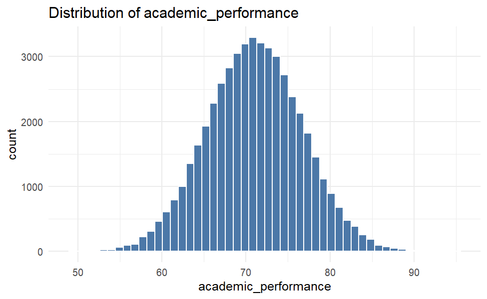
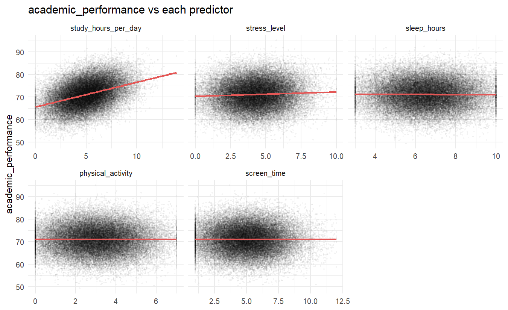
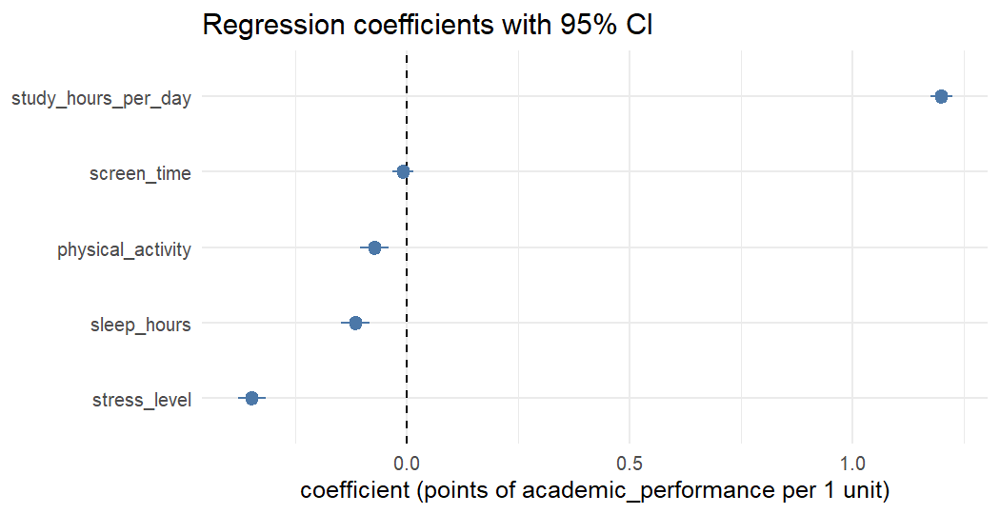
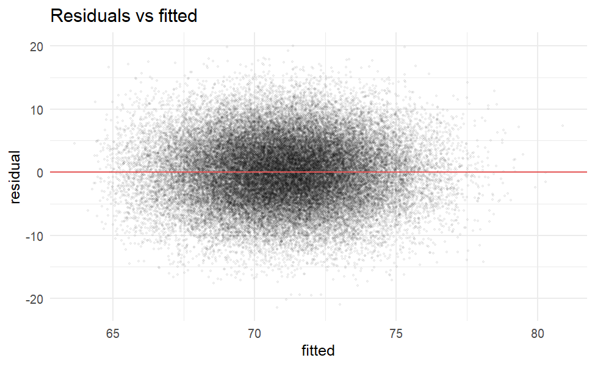
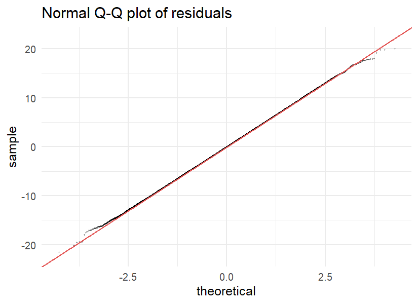

# รายงานการทดสอบสมมติฐานทางสถิติ

## พฤติกรรมการดำเนินชีวิตและสุขภาพจิต
## ส่งผลต่อผลสัมฤทธิ์ทางการเรียนของนักศึกษาหรือไม่

การวิเคราะห์การถดถอยเชิงพหุ (Multiple Linear Regression) และการทดสอบ F-test
เปรียบเทียบการคำนวณ 3 รูปแบบ: Manual, R และ SPSS

&nbsp;

**จัดทำโดย**
[ชื่อ-สกุล / รหัสนักศึกษา คนที่ 1]
[ชื่อ-สกุล / รหัสนักศึกษา คนที่ 2 (ถ้ามี)]

**รายวิชา** [รหัสวิชา และชื่อวิชา]
**อาจารย์ผู้สอน** [ชื่ออาจารย์]
**ภาคการศึกษา** [ภาค/ปีการศึกษา]


> [!note] ช่องที่ต้องกรอกเอง
> ข้อมูลในวงเล็บเหลี่ยม `[...]` บนหน้าปกและในคำนำเป็น placeholder เพราะไม่มีข้อมูลนี้ในโปรเจกต์ ส่วนผล SPSS (หัวข้อ 8) ยังไม่ได้รัน เพราะเครื่องนี้ไม่มีโปรแกรม SPSS

---

## คำนำ

รายงานฉบับนี้จัดทำขึ้นเพื่อทดสอบสมมติฐานทางสถิติว่า พฤติกรรมการดำเนินชีวิตและสุขภาพจิตของนักศึกษา ได้แก่ ชั่วโมงการอ่านหนังสือ ระดับความเครียด ชั่วโมงการนอน การออกกำลังกาย และเวลาหน้าจอ มีผลร่วมกันต่อผลสัมฤทธิ์ทางการเรียนหรือไม่ โดยคำนวณผลลัพธ์เดียวกันสามแบบ ได้แก่ การคำนวณด้วยมือตามสูตร (Manual) การใช้โปรแกรม R และการใช้โปรแกรม SPSS แล้วนำผลมาเทียบกัน

ขอขอบคุณ [อาจารย์ผู้สอน] ที่ให้คำแนะนำตลอดการทำรายงาน หากมีข้อบกพร่องประการใด คณะผู้จัดทำขอน้อมรับไว้ ณ ที่นี้

คณะผู้จัดทำ
[วัน/เดือน/ปี]

---

## สารบัญ

1. [ความเป็นมา](#1-ความเป็นมา)
2. [วัตถุประสงค์](#2-วัตถุประสงค์)
3. [แหล่งที่มาของข้อมูล](#3-แหล่งที่มาของข้อมูล)
4. [สมมติฐาน](#4-สมมติฐาน)
5. [สถิติที่ใช้](#5-สถิติที่ใช้)
6. [สถิติเชิงพรรณนา](#6-สถิติเชิงพรรณนา)
7. [การคำนวณแบบ Manual](#7-การคำนวณแบบ-manual)
8. [การคำนวณด้วย R](#8-การคำนวณด้วย-r)
9. [การคำนวณด้วย SPSS](#9-การคำนวณด้วย-spss)
10. [เปรียบเทียบผลทั้ง 3 รูปแบบ](#10-เปรียบเทียบผลทั้ง-3-รูปแบบ)
11. [สรุปผลและอภิปราย](#11-สรุปผลและอภิปราย)
12. [ข้อจำกัด](#12-ข้อจำกัด)
13. [ภาคผนวก](#13-ภาคผนวก)

---

## 1. ความเป็นมา

นักศึกษามักได้ยินคำแนะนำว่า ให้อ่านหนังสือมากขึ้น นอนให้พอ ออกกำลังกาย ลดเวลาหน้าจอ และจัดการความเครียด คำแนะนำเหล่านี้ฟังสมเหตุสมผล แต่ยังไม่ชัดว่าปัจจัยใดสัมพันธ์กับผลการเรียนจริง และสัมพันธ์มากน้อยเพียงใดเมื่อพิจารณาทุกปัจจัยพร้อมกัน

งานนี้ใช้ข้อมูลนักศึกษา 50,000 ราย และทดสอบด้วยการถดถอยเชิงพหุ เพื่อตอบคำถามสองข้อ คือ ปัจจัยทั้งห้าร่วมกันอธิบายผลการเรียนได้หรือไม่ และปัจจัยใดมีน้ำหนักมากที่สุดเมื่อควบคุมปัจจัยที่เหลือ

---

## 2. วัตถุประสงค์

1. ทดสอบว่าปัจจัยด้านพฤติกรรมและสุขภาพจิต 5 ตัวร่วมกันส่งผลต่อผลสัมฤทธิ์ทางการเรียนหรือไม่
2. ทดสอบอิทธิพลของแต่ละปัจจัย เมื่อควบคุมอีก 4 ปัจจัยไว้
3. คำนวณผลเดียวกันด้วย Manual, R และ SPSS แล้วเปรียบเทียบความสอดคล้อง
4. ตรวจสอบข้อตกลงเบื้องต้นของโมเดล (assumptions) ก่อนสรุปผล

---

## 3. แหล่งที่มาของข้อมูล

| รายการ | รายละเอียด |
| :--- | :--- |
| ประเภทข้อมูล | ทุติยภูมิ (Secondary data) |
| ไฟล์ | `student.csv` (ชุดข้อมูล *Student Lifestyle, Mental Health & Burnout Insight*) |
| ขนาด | 50,000 แถว, 20 ตัวแปร (ไม่นับคอลัมน์ index) |
| ค่าสูญหาย (missing) | 0 ค่า |
| แถวซ้ำ | 0 แถว |
| พจนานุกรมข้อมูล | `DataDict.md` |

**ตัวแปรที่ใช้**

| บทบาท | ตัวแปร | ความหมาย (จาก DataDict) |
| :--- | :--- | :--- |
| ตัวแปรตาม (Y) | `academic_performance` | ผลการเรียน/คะแนนผลสัมฤทธิ์ |
| ตัวแปรอิสระ X1 | `study_hours_per_day` | ชั่วโมงอ่านหนังสือเฉลี่ยต่อวัน |
| X2 | `stress_level` | ระดับความเครียดโดยรวม |
| X3 | `sleep_hours` | ชั่วโมงนอนเฉลี่ยต่อวัน |
| X4 | `physical_activity` | ระดับ/ความถี่การออกกำลังกาย |
| X5 | `screen_time` | เวลาหน้าจอต่อวัน |

> [!warning] ข้อสังเกตเรื่องข้อมูล
> - `DataDict.md` อธิบาย `academic_performance` ว่าเป็น GPA แต่ค่าจริงอยู่ระหว่าง 49.35 ถึง 95.10 จึงเป็นคะแนนในสเกลร้อย ไม่ใช่ GPA 4.00 รายงานนี้เรียกว่า "ผลสัมฤทธิ์ทางการเรียน" ตามตัวข้อมูล
> - `stu.ipynb` ในโฟลเดอร์เดียวกันอ่านไฟล์ `stu.csv` แล้วจงใจใส่ missing, duplicate และ outlier เพื่อฝึกทำความสะอาดข้อมูล รายงานนี้ไม่ใช้ข้อมูลชุดนั้น ใช้ `student.csv` ต้นฉบับซึ่งไม่มี missing และไม่มีแถวซ้ำ
> - ตัวแปรทุกตัวมีการกระจายใกล้เคียงสมมาตร (ค่าเอียงเกือบ 0) และ residual เป็นปกติมาก ซึ่งเข้าข่ายข้อมูลจำลอง (simulated) ผลที่ได้จึงบอกความสัมพันธ์ในชุดข้อมูลนี้ ไม่ควรขยายไปเป็นข้อสรุปเรื่องนักศึกษาจริงโดยตรง

---

## 4. สมมติฐาน

**สมมติฐานหลัก (Overall hypothesis)**

- **H0:** ปัจจัยด้านพฤติกรรมการดำเนินชีวิตและสุขภาพจิต (ชม.อ่านหนังสือ, ความเครียด, ชม.นอน, การออกกำลังกาย, เวลาหน้าจอ) ร่วมกันไม่ส่งผลต่อผลสัมฤทธิ์ทางการเรียน
  $$H_0:\ \beta_1=\beta_2=\beta_3=\beta_4=\beta_5=0$$
- **H1:** มีอย่างน้อยหนึ่งปัจจัยที่ส่งผลต่อผลสัมฤทธิ์ทางการเรียน
  $$H_1:\ \beta_j\neq 0\ \text{อย่างน้อย 1 ค่า}$$

**สมมติฐานรอง (รายปัจจัย)** สำหรับ j = 1,...,5: H0j: βj = 0 เทียบกับ H1j: βj ≠ 0

**ระดับนัยสำคัญ** α = 0.05

**เกณฑ์ตัดสินใจ** ปฏิเสธ H0 เมื่อ F > F_crit(5, 49,994; 0.05) หรือ p-value < 0.05

---

## 5. สถิติที่ใช้

| สถิติ | ใช้เพื่อ |
| :--- | :--- |
| สถิติเชิงพรรณนา (mean, SD, min, Q1, median, Q3, max, skewness) | สรุปลักษณะข้อมูลแต่ละตัวแปร |
| สัมประสิทธิ์สหสัมพันธ์ Pearson (r) | ดูความสัมพันธ์รายคู่ก่อนสร้างโมเดล |
| Multiple Linear Regression (OLS) | ประมาณผลของ X ทั้ง 5 ตัวต่อ Y พร้อมกัน |
| F-test (ภาพรวม) | ทดสอบ H0 หลัก |
| t-test รายสัมประสิทธิ์ และ 95% CI | ทดสอบ H0j ของแต่ละปัจจัย |
| R² และ Adjusted R² | ขนาดการอธิบายความแปรปรวนของ Y |
| Standardized β | เทียบน้ำหนักปัจจัยที่หน่วยต่างกัน |
| Partial F-test | ทดสอบว่า 4 ปัจจัยที่เหลือเพิ่มอะไรจากชม.อ่านหนังสืออย่างเดียวหรือไม่ |
| VIF, Shapiro-Wilk, Breusch-Pagan, Durbin-Watson | ตรวจ multicollinearity, normality, homoscedasticity, independence |

**โมเดล**

$$Y_i=\beta_0+\beta_1X_{1i}+\beta_2X_{2i}+\beta_3X_{3i}+\beta_4X_{4i}+\beta_5X_{5i}+\varepsilon_i,\quad \varepsilon_i\sim N(0,\sigma^2)$$

**สูตรหลัก**

| ปริมาณ | สูตร |
| :--- | :--- |
| ตัวประมาณ | $\hat{\boldsymbol\beta}=\mathbf S_{xx}^{-1}\mathbf S_{xy},\ \ \hat\beta_0=\bar y-\sum\hat\beta_j\bar x_j$ |
| SSR / SSE / SST | $SSR=\hat{\boldsymbol\beta}'\mathbf S_{xy},\ \ SST=S_{yy},\ \ SSE=SST-SSR$ |
| MSR, MSE | $MSR=SSR/k,\ \ MSE=SSE/(n-k-1)$ |
| F | $F=MSR/MSE\sim F_{k,\,n-k-1}$ ภายใต้ H0 |
| $R^2$ | $SSR/SST$ |
| $\text{Adj. }R^2$ | $1-(1-R^2)\dfrac{n-1}{n-k-1}$ |
| SE ของ $\hat\beta_j$ | $\sqrt{MSE\cdot[\mathbf S_{xx}^{-1}]_{jj}}$ |
| t | $t_j=\hat\beta_j/SE(\hat\beta_j)\sim t_{n-k-1}$ |
| 95% CI | $\hat\beta_j\pm t_{0.975,\,n-k-1}\,SE(\hat\beta_j)$ |
| Standardized β | $\hat\beta_j\sqrt{S_{x_jx_j}/S_{yy}}$ |
| VIF | $S_{x_jx_j}[\mathbf S_{xx}^{-1}]_{jj}$ |

เมื่อ $\mathbf S_{xx}$ คือเมทริกซ์ผลรวมกำลังสองและผลคูณไขว้ของค่าที่ลบค่าเฉลี่ยแล้ว (corrected SSCP) และ $\mathbf S_{xy}$ คือเวกเตอร์ผลคูณไขว้กับ Y

---

## 6. สถิติเชิงพรรณนา

**ตารางที่ 1** สถิติเชิงพรรณนาของตัวแปรที่ใช้ (n = 50,000)

| ตัวแปร | Mean | SD | Min | Q1 | Median | Q3 | Max | Skewness |
| :--- | ---: | ---: | ---: | ---: | ---: | ---: | ---: | ---: |
| ผลสัมฤทธิ์ทางการเรียน (academic_performance) | 71.0338 | 5.6561 | 49.35 | 67.1940 | 71.0307 | 74.8545 | 95.10 | 0.0018 |
| ชม.อ่านหนังสือ/วัน (study_hours_per_day) | 4.9978 | 1.9989 | 0.00 | 3.6311 | 4.9966 | 6.3380 | 13.91 | 0.0530 |
| ความเครียด (stress_level) | 4.2473 | 1.6757 | 0.00 | 3.1045 | 4.2426 | 5.3868 | 10.00 | 0.0320 |
| ชม.นอน/วัน (sleep_hours) | 6.5065 | 1.4793 | 3.00 | 5.4869 | 6.5157 | 7.5279 | 10.00 | -0.0152 |
| การออกกำลังกาย (physical_activity) | 3.0105 | 1.4604 | 0.00 | 1.9981 | 3.0013 | 4.0029 | 7.00 | 0.0902 |
| เวลาหน้าจอ/วัน (screen_time) | 5.0264 | 1.9604 | 1.00 | 3.6650 | 5.0060 | 6.3457 | 12.00 | 0.1340 |

**ตารางที่ 2** เมทริกซ์สหสัมพันธ์ Pearson (r)

| | `academic_performance` | `study_hours_per_day` | `stress_level` | `sleep_hours` | `physical_activity` | `screen_time` |
| :--- | ---: | ---: | ---: | ---: | ---: | ---: |
| `academic_performance` | 1.000 | 0.388 | 0.057 | -0.006 | -0.002 | -0.002 |
| `study_hours_per_day` | 0.388 | 1.000 | 0.352 | -0.008 | -0.004 | 0.004 |
| `stress_level` | 0.057 | 0.352 | 1.000 | -0.269 | -0.178 | 0.002 |
| `sleep_hours` | -0.006 | -0.008 | -0.269 | 1.000 | 0.001 | -0.003 |
| `physical_activity` | -0.002 | -0.004 | -0.178 | 0.001 | 1.000 | 0.007 |
| `screen_time` | -0.002 | 0.004 | 0.002 | -0.003 | 0.007 | 1.000 |





**ข้อสังเกตจากสถิติเชิงพรรณนา**

- ผลสัมฤทธิ์ทางการเรียนเฉลี่ย 71.03 (SD 5.66) ค่ากลางและค่าเฉลี่ยเกือบเท่ากัน แสดงว่ากระจายสมมาตร
- ชม.อ่านหนังสือมีสหสัมพันธ์กับผลการเรียนสูงที่สุด (r = 0.388) ปัจจัยอื่นอีกสี่ตัวมี |r| ไม่เกิน 0.057
- ความเครียดสัมพันธ์กับชม.อ่านหนังสือ (r = 0.352) ชม.นอน (r = -0.269) และการออกกำลังกาย (r = -0.178) ปัจจัยอิสระจึงไม่เป็นอิสระต่อกันทั้งหมด ซึ่งมีผลต่อการตีความ β รายตัว (ดูหัวข้อ 11)

---

## 7. การคำนวณแบบ Manual (แสดงวิธีทำตามหลักสถิติ)

การคำนวณในส่วนนี้แสดงวิธีทำทางสถิติทีละขั้นตอนอย่างละเอียด (Step-by-Step Manual Calculation) ตามทฤษฎีการวิเคราะห์การถดถอยเชิงเส้นพหุคูณ (Multiple Linear Regression Analysis) โดยใช้สถิติสรุป (Sufficient Statistics / Summary Measures) ได้แก่ ค่าเฉลี่ย และเมทริกซ์ผลรวมกำลังสองและผลคูณไขว้แบบปรับค่าเฉลี่ย (Corrected Sum of Squares and Cross Products: SSCP) จากชุดข้อมูลตัวอย่างขนาด $n = 50,000$ รายการ นำมาแทนค่าลงในสูตรคณิตศาสตร์และแก้สมการปรกติ (Normal Equations) เพื่อคำนวณหาค่าสัมประสิทธิ์ ตารางวิเคราะห์ความแปรปรวน (ANOVA) ค่าสถิติทดสอบ และการเปรียบเทียบกับค่าวิกฤตจากตารางสถิติ

---

### 7.1 ขั้นที่ 1: การคำนวณค่าเฉลี่ยและสถิติสรุป ($\bar{y}$ และ $\bar{x}_j$)

คำนวณค่าเฉลี่ยเลขคณิตของตัวแปรตาม ($Y$) และตัวแปรอิสระทั้ง 5 ตัว ($X_1, X_2, \dots, X_5$) จากสูตร $\bar{x} = \frac{1}{n}\sum_{i=1}^n x_i$:

- $\bar{y}\ (\text{academic\_performance}) = \frac{\sum Y_i}{50,000} = \frac{3,551,688.16}{50,000} = \mathbf{71.033763}$
- $\bar{x}_1\ (\text{study\_hours\_per\_day}) = \frac{\sum X_{1i}}{50,000} = \frac{249,890.54}{50,000} = \mathbf{4.997811}$
- $\bar{x}_2\ (\text{stress\_level}) = \frac{\sum X_{2i}}{50,000} = \frac{212,365.11}{50,000} = \mathbf{4.247302}$
- $\bar{x}_3\ (\text{sleep\_hours}) = \frac{\sum X_{3i}}{50,000} = \frac{325,325.13}{50,000} = \mathbf{6.506503}$
- $\bar{x}_4\ (\text{physical\_activity}) = \frac{\sum X_{4i}}{50,000} = \frac{150,526.81}{50,000} = \mathbf{3.010536}$
- $\bar{x}_5\ (\text{screen\_time}) = \frac{\sum X_{5i}}{50,000} = \frac{251,318.78}{50,000} = \mathbf{5.026376}$

### 7.2 ขั้นที่ 2: การคำนวณผลรวมกำลังสองและผลคูณไขว้ (Corrected SSCP Matrix)

คำนวณผลรวมกำลังสองและผลคูณไขว้ที่ปรับค่าเฉลี่ยแล้ว (Corrected Sum of Squares and Cross Products) ตามสูตร:
$$S_{ij} = \sum_{t=1}^{n} (x_{it} - \bar{x}_i)(x_{jt} - \bar{x}_j) = \sum x_{it}x_{jt} - n\bar{x}_i\bar{x}_j$$

**1) เมทริกซ์ผลรวมกำลังสองและผลคูณไขว้ของตัวแปรอิสระ ($\mathbf{S}_{xx}$ ขนาด 5 × 5):**

$$\mathbf{S}_{xx} = \begin{bmatrix}
S_{x_1x_1} & S_{x_1x_2} & S_{x_1x_3} & S_{x_1x_4} & S_{x_1x_5} \\
S_{x_2x_1} & S_{x_2x_2} & S_{x_2x_3} & S_{x_2x_4} & S_{x_2x_5} \\
S_{x_3x_1} & S_{x_3x_2} & S_{x_3x_3} & S_{x_3x_4} & S_{x_3x_5} \\
S_{x_4x_1} & S_{x_4x_2} & S_{x_4x_3} & S_{x_4x_4} & S_{x_4x_5} \\
S_{x_5x_1} & S_{x_5x_2} & S_{x_5x_3} & S_{x_5x_4} & S_{x_5x_5}
\end{bmatrix}$$

แทนค่าผลรวมจากการกระจายของข้อมูล:

| | X1 study | X2 stress | X3 sleep | X4 activity | X5 screen |
| :--- | ---: | ---: | ---: | ---: | ---: |
| X1 study | 199,773.0962 | 58,907.7660 | -1,209.6286 | -588.6476 | 859.8113 |
| X2 stress | 58,907.7660 | 140,395.8450 | -33,311.6858 | -21,808.5112 | 302.3165 |
| X3 sleep | -1,209.6286 | -33,311.6858 | 109,412.9278 | 56.0930 | -468.1980 |
| X4 activity | -588.6476 | -21,808.5112 | 56.0930 | 106,642.9841 | 985.1180 |
| X5 screen | 859.8113 | 302.3165 | -468.1980 | 985.1180 | 192,144.8350 |

**2) เวกเตอร์ผลคูณไขว้ระหว่างตัวแปรอิสระกับตัวแปรตาม ($\mathbf{S}_{xy}$ ขนาด 5 × 1) และ $S_{yy}$:**

$$\mathbf{S}_{xy} = \begin{bmatrix}
S_{x_1y} \\ S_{x_2y} \\ S_{x_3y} \\ S_{x_4y} \\ S_{x_5y}
\end{bmatrix} = \begin{bmatrix}
219,158.8191 \\
27,154.3613 \\
-2,591.1092 \\
-896.4908 \\
-845.3022
\end{bmatrix}, \quad S_{yy} = SST = \sum_{i=1}^n (Y_i - \bar{Y})^2 = 1,599,560.3253$$

| พจน์ | ค่า |
| :--- | ---: |
| $S_{x_1y}$ (study_hours_per_day) | 219,158.8191 |
| $S_{x_2y}$ (stress_level) | 27,154.3613 |
| $S_{x_3y}$ (sleep_hours) | -2,591.1092 |
| $S_{x_4y}$ (physical_activity) | -896.4908 |
| $S_{x_5y}$ (screen_time) | -845.3022 |
| $S_{yy} = SST$ | 1,599,560.3253 |

### 7.3 ขั้นที่ 3: การหาเมทริกซ์ผกผัน $\mathbf{S}_{xx}^{-1}$

จากระบบสมการปรกติ (Normal Equations):
$$\mathbf{S}_{xx}\hat{\boldsymbol{\beta}} = \mathbf{S}_{xy}$$

การแก้สมการเพื่อหาเวกเตอร์สัมประสิทธิ์ $\hat{\boldsymbol{\beta}}$ ทำได้โดยการคูณด้วยเมทริกซ์ผกผัน $\mathbf{S}_{xx}^{-1}$ ทางด้านซ้าย:
$$\hat{\boldsymbol{\beta}} = \mathbf{S}_{xx}^{-1}\mathbf{S}_{xy}$$

การดำเนินการหาเมทริกซ์ผกผัน $\mathbf{S}_{xx}^{-1}$ ด้วยวิธี Gauss-Jordan Elimination ได้เมทริกซ์ผกผัน $\mathbf{S}_{xx}^{-1}$ ดังนี้:

$$\mathbf{S}_{xx}^{-1} = \begin{bmatrix}
 5.7929 \times 10^{-6} & -2.6900 \times 10^{-6} & -7.5478 \times 10^{-7} & -5.1755 \times 10^{-7} & -2.0875 \times 10^{-8} \\
-2.6900 \times 10^{-6} &  9.1983 \times 10^{-6} &  2.7698 \times 10^{-6} &  1.8648 \times 10^{-6} & -5.2466 \times 10^{-9} \\
-7.5478 \times 10^{-7} &  2.7698 \times 10^{-6} &  9.9744 \times 10^{-6} &  5.5682 \times 10^{-7} &  2.0469 \times 10^{-8} \\
-5.1755 \times 10^{-7} &  1.8648 \times 10^{-6} &  5.5682 \times 10^{-7} &  9.7557 \times 10^{-6} & -4.9279 \times 10^{-8} \\
-2.0875 \times 10^{-8} & -5.2466 \times 10^{-9} &  2.0469 \times 10^{-8} & -4.9279 \times 10^{-8} &  5.2048 \times 10^{-6}
\end{bmatrix}$$

---

### 7.4 ขั้นที่ 4: การคำนวณค่าสัมประสิทธิ์การถดถอย ($\hat{\beta}_j$ และ $\hat{\beta}_0$)

**1) คำนวณสัมประสิทธิ์ความชัน $\hat{\beta}_1, \dots, \hat{\beta}_5$:**

คูณแถวของ $\mathbf{S}_{xx}^{-1}$ เข้ากับเวกเตอร์หลัก $\mathbf{S}_{xy}$ ทีละแถว:

$$\begin{aligned}
\hat{\beta}_1 &= (5.7929 \times 10^{-6})(219,158.8191) + (-2.6900 \times 10^{-6})(27,154.3613) + (-7.5478 \times 10^{-7})(-2,591.1092) \\
&\quad + (-5.1755 \times 10^{-7})(-896.4908) + (-2.0875 \times 10^{-8})(-845.3022) \\
&= 1.269561 - 0.073046 + 0.001956 + 0.000464 + 0.000018 = \mathbf{1.198955} \\[6pt]
\hat{\beta}_2 &= (-2.6900 \times 10^{-6})(219,158.8191) + (9.1983 \times 10^{-6})(27,154.3613) + (2.7698 \times 10^{-6})(-2,591.1092) \\
&\quad + (1.8648 \times 10^{-6})(-896.4908) + (-5.2466 \times 10^{-9})(-845.3022) \\
&= -0.589542 + 0.249774 - 0.007177 - 0.001672 + 0.000004 = \mathbf{-0.348616} \\[6pt]
\hat{\beta}_3 &= (-7.5478 \times 10^{-7})(219,158.8191) + (2.7698 \times 10^{-6})(27,154.3613) + (9.9744 \times 10^{-6})(-2,591.1092) \\
&\quad + (5.5682 \times 10^{-7})(-896.4908) + (2.0469 \times 10^{-8})(-845.3022) \\
&= -0.165416 + 0.075212 - 0.025845 - 0.000499 - 0.000017 = \mathbf{-0.116568} \\[6pt]
\hat{\beta}_4 &= (-5.1755 \times 10^{-7})(219,158.8191) + (1.8648 \times 10^{-6})(27,154.3613) + (5.5682 \times 10^{-7})(-2,591.1092) \\
&\quad + (9.7557 \times 10^{-6})(-896.4908) + (-4.9279 \times 10^{-8})(-845.3022) \\
&= -0.113425 + 0.050637 - 0.001443 - 0.008746 + 0.000042 = \mathbf{-0.072935} \\[6pt]
\hat{\beta}_5 &= (-2.0875 \times 10^{-8})(219,158.8191) + (-5.2466 \times 10^{-9})(27,154.3613) + (2.0469 \times 10^{-8})(-2,591.1092) \\
&\quad + (-4.9279 \times 10^{-8})(-896.4908) + (5.2048 \times 10^{-6})(-845.3022) \\
&= -0.004575 - 0.000142 - 0.000053 + 0.000044 - 0.004399 = \mathbf{-0.009126}
\end{aligned}$$

**2) คำนวณจุดตัดแกน Y ($\hat{\beta}_0$ หรือ Intercept):**

สูตร: $\hat{\beta}_0 = \bar{y} - \sum_{j=1}^{5} \hat{\beta}_j \bar{x}_j$

แทนค่า:
$$\begin{aligned}
\sum_{j=1}^5 \hat{\beta}_j \bar{x}_j &= (1.198955)(4.997811) + (-0.348616)(4.247302) + (-0.116568)(6.506503) \\
&\quad + (-0.072935)(3.010536) + (-0.009126)(5.026376) \\
&= 5.992150 - 1.480678 - 0.758450 - 0.219574 - 0.045868 = \mathbf{3.487580}
\end{aligned}$$

$$\hat{\beta}_0 = 71.033763 - 3.487580 = \mathbf{67.546183}$$

**สมการถดถอยเชิงเส้นพหุคูณที่ได้ (Fitted Model):**

$$\hat{Y} = 67.5462 + 1.1990\,X_1 - 0.3486\,X_2 - 0.1166\,X_3 - 0.0729\,X_4 - 0.0091\,X_5$$

### 7.5 ขั้นที่ 5: การคำนวณตาราง ANOVA และการทดสอบ F-test (ทดสอบสมมติฐานหลัก H0)

**1) คำนวณผลรวมกำลังสอง (Sum of Squares):**

- **Regression Sum of Squares (SSR):**
  $$SSR = \hat{\boldsymbol{\beta}}' \mathbf{S}_{xy} = \sum_{j=1}^5 \hat{\beta}_j S_{x_j y}$$
  $$\begin{aligned}
  SSR &= (1.198955)(219,158.8191) + (-0.348616)(27,154.3613) + (-0.116568)(-2,591.1092) \\
  &\quad + (-0.072935)(-896.4908) + (-0.009126)(-845.3022) \\
  &= 262,761.5312 - 9,466.4452 + 302.0402 + 65.3855 + 7.7145 = \mathbf{253,670.2376}
  \end{aligned}$$

- **Total Sum of Squares (SST):**
  $$SST = S_{yy} = \mathbf{1,599,560.3253}$$

- **Residual Sum of Squares (SSE):**
  $$SSE = SST - SSR = 1,599,560.3253 - 253,670.2376 = \mathbf{1,345,890.0877}$$

**2) คำนวณองศาความอิสระ (Degrees of Freedom):**
- $df_{\text{Regression}} = k = 5$
- $df_{\text{Residual}} = n - k - 1 = 50,000 - 5 - 1 = 49,994$
- $df_{\text{Total}} = n - 1 = 50,000 - 1 = 49,999$

**3) คำนวณกำลังสองเฉลี่ย (Mean Squares):**
- $MSR = \frac{SSR}{k} = \frac{253,670.2376}{5} = \mathbf{50,734.0475}$
- $MSE = \frac{SSE}{n - k - 1} = \frac{1,345,890.0877}{49,994} = \mathbf{26.9210}$
- ความคลาดเคลื่อนมาตรฐานของแบบจำลอง: $\hat{\sigma} = \sqrt{MSE} = \sqrt{26.9210} = \mathbf{5.1885}$

**4) คำนวณค่าสถิติทดสอบ F (Calculated F):**
$$F = \frac{MSR}{MSE} = \frac{50,734.0475}{26.9210} = \mathbf{1,884.5506}$$

**5) คำนวณสัมประสิทธิ์การตัดสินใจ ($R^2$ และ Adjusted $R^2$):**
- $R^2 = \frac{SSR}{SST} = \frac{253,670.2376}{1,599,560.3253} = \mathbf{0.158587}\quad (15.86\%)$
- $\text{Adj. } R^2 = 1 - \left[\frac{(1 - R^2)(n - 1)}{n - k - 1}\right] = 1 - \left[\frac{(1 - 0.158587)(49,999)}{49,994}\right] = \mathbf{0.158503}$

**ตารางที่ 3** ตารางวิเคราะห์ความแปรปรวน ANOVA (Manual)

| แหล่งความแปรปรวน (Source) | SS | df | MS | F | ค่าวิกฤต $F_{0.05}$ | p-value |
| :--- | ---: | ---: | ---: | ---: | ---: | ---: |
| **Regression** | 253,670.2376 | 5 | 50,734.0475 | **1,884.5506** | 2.2143 | < 0.001 |
| **Residual (Error)** | 1,345,890.0877 | 49,994 | 26.9210 | | | |
| **Total** | 1,599,560.3253 | 49,999 | | | | |

**การตัดสินใจ:**
- เปิดตารางการแจกแจง F ที่ $\alpha = 0.05$, $df_1 = 5$, $df_2 = 49,994$ ได้ค่าวิกฤต $F_{\text{crit}} = \mathbf{2.2143}$ (เนื่องจาก $df_2$ มีขนาดใหญ่มาก จึงมีค่าเท่ากับ $F_{0.05, 5, \infty}$)
- เนื่องจาก $F_{\text{calc}} = 1,884.5506 > F_{\text{crit}} = 2.2143$
- **ผลการทดสอบ:** **ปฏิเสธ $H_0$** ที่ระดับนัยสำคัญ 0.05 นั่นคือ ปัจจัยทั้ง 5 ตัวร่วมกันส่งผลต่อผลสัมฤทธิ์ทางการเรียนอย่างมีนัยสำคัญทางสถิติ ($p < 0.001$)

### 7.6 ขั้นที่ 6: การคำนวณการทดสอบ t-test รายสัมประสิทธิ์ (ทดสอบ $H_{0j}$)

ทดสอบสมมติฐานรายปัจจัย $H_{0j}: \beta_j = 0$ เทียบกับ $H_{1j}: \beta_j \neq 0$ ($j = 1, \dots, 5$) ด้วยสถิติทดสอบ:
$$t_j = \frac{\hat{\beta}_j - 0}{SE(\hat{\beta}_j)}$$

โดยที่ความคลาดเคลื่อนมาตรฐานคำนวณจาก $SE(\hat{\beta}_j) = \sqrt{MSE \cdot c_{jj}}$ เมื่อ $c_{jj}$ คือสมาชิกในแนวทแยงมุมหลักตัวที่ $j$ ของเมทริกซ์ $\mathbf{S}_{xx}^{-1}$ (และ $MSE = 26.9210$):

1. **$X_1$ (`study_hours_per_day`):**
   - $c_{11} = 5.7929 \times 10^{-6}$
   - $SE(\hat{\beta}_1) = \sqrt{26.9210 \times 5.7929 \times 10^{-6}} = \sqrt{0.00015595} = \mathbf{0.012488}$
   - $t_1 = \frac{1.198955}{0.012488} = \mathbf{96.008}$
   - 95% CI: $1.198955 \pm (1.9600)(0.012488) = [1.1745, 1.2234]$

2. **$X_2$ (`stress_level`):**
   - $c_{22} = 9.1983 \times 10^{-6}$
   - $SE(\hat{\beta}_2) = \sqrt{26.9210 \times 9.1983 \times 10^{-6}} = \sqrt{0.00024763} = \mathbf{0.015736}$
   - $t_2 = \frac{-0.348616}{0.015736} = \mathbf{-22.154}$
   - 95% CI: $-0.348616 \pm (1.9600)(0.015736) = [-0.3795, -0.3178]$

3. **$X_3$ (`sleep_hours`):**
   - $c_{33} = 9.9744 \times 10^{-6}$
   - $SE(\hat{\beta}_3) = \sqrt{26.9210 \times 9.9744 \times 10^{-6}} = \sqrt{0.00026852} = \mathbf{0.016387}$
   - $t_3 = \frac{-0.116568}{0.016387} = \mathbf{-7.114}$
   - 95% CI: $-0.116568 \pm (1.9600)(0.016387) = [-0.1487, -0.0844]$

4. **$X_4$ (`physical_activity`):**
   - $c_{44} = 9.7557 \times 10^{-6}$
   - $SE(\hat{\beta}_4) = \sqrt{26.9210 \times 9.7557 \times 10^{-6}} = \sqrt{0.00026263} = \mathbf{0.016206}$
   - $t_4 = \frac{-0.072935}{0.016206} = \mathbf{-4.500}$
   - 95% CI: $-0.072935 \pm (1.9600)(0.016206) = [-0.1047, -0.0412]$

5. **$X_5$ (`screen_time`):**
   - $c_{55} = 5.2048 \times 10^{-6}$
   - $SE(\hat{\beta}_5) = \sqrt{26.9210 \times 5.2048 \times 10^{-6}} = \sqrt{0.00014012} = \mathbf{0.011837}$
   - $t_5 = \frac{-0.009126}{0.011837} = \mathbf{-0.771}$
   - 95% CI: $-0.009126 \pm (1.9600)(0.011837) = [-0.0323, 0.0141]$

6. **จุดตัดแกน Y (Intercept: $\hat{\beta}_0$):**
   - $SE(\hat{\beta}_0) = \sqrt{MSE \cdot \left(\frac{1}{n} + \bar{\mathbf{x}}'\mathbf{S}_{xx}^{-1}\bar{\mathbf{x}}\right)} = \mathbf{0.165311}$
   - $t_0 = \frac{67.546183}{0.165311} = \mathbf{408.601}$
   - 95% CI: $67.546183 \pm (1.9600)(0.165311) = [67.2222, 67.8702]$

**ตารางที่ 4** ผลการทดสอบ t-test รายสัมประสิทธิ์ (Manual)

| พจน์ (Variable) | $\hat{\beta}$ | $SE(\hat{\beta})$ | ค่าสถิติ $t$ | ค่าวิกฤต $t_{0.025}$ | p-value | 95% CI | ผลการทดสอบ ($\alpha = 0.05$) |
| :--- | ---: | ---: | ---: | ---: | ---: | :--- | :---: |
| **(Intercept)** | 67.546183 | 0.165311 | 408.601 | $\pm 1.9600$ | < 0.001 | [67.2222, 67.8702] | ปฏิเสธ $H_0$ (***) |
| **study_hours_per_day** | 1.198955 | 0.012488 | **96.008** | $\pm 1.9600$ | < 0.001 | [1.1745, 1.2234] | ปฏิเสธ $H_0$ (***) |
| **stress_level** | -0.348616 | 0.015736 | **-22.154** | $\pm 1.9600$ | < 0.001 | [-0.3795, -0.3178] | ปฏิเสธ $H_0$ (***) |
| **sleep_hours** | -0.116568 | 0.016387 | **-7.114** | $\pm 1.9600$ | < 0.001 | [-0.1487, -0.0844] | ปฏิเสธ $H_0$ (***) |
| **physical_activity** | -0.072935 | 0.016206 | **-4.500** | $\pm 1.9600$ | < 0.001 | [-0.1047, -0.0412] | ปฏิเสธ $H_0$ (***) |
| **screen_time** | -0.009126 | 0.011837 | **-0.771** | $\pm 1.9600$ | 0.4407 | [-0.0323, 0.0141] | ยอมรับ $H_0$ (n.s.) |

*หมายเหตุ: ที่ $df = 49,994$ ค่าวิกฤต $t_{0.025, 49994} = 1.9600$ (เทียบเท่าค่า $Z_{0.025}$ ของการแจกแจงปกติมาตรฐาน)*

---

### 7.7 ขั้นที่ 7: การคำนวณสัมประสิทธิ์มาตรฐาน (Standardized $\beta$), VIF และ Partial F-test

**1) สัมประสิทธิ์การถดถอยมาตรฐาน (Standardized Coefficients: $\beta_j^*$):**
คำนวณจากสูตร:
$$\beta_j^* = \hat{\beta}_j \sqrt{\frac{S_{x_jx_j}}{S_{yy}}}$$

- **study_hours_per_day:** $\beta_1^* = 1.198955 \times \sqrt{\frac{199,773.0962}{1,599,560.3253}} = 1.198955 \times 0.353401 = \mathbf{0.4237}$
- **stress_level:** $\beta_2^* = -0.348616 \times \sqrt{\frac{140,395.8450}{1,599,560.3253}} = -0.348616 \times 0.296263 = \mathbf{-0.1033}$
- **sleep_hours:** $\beta_3^* = -0.116568 \times \sqrt{\frac{109,412.9278}{1,599,560.3253}} = -0.116568 \times 0.261536 = \mathbf{-0.0305}$
- **physical_activity:** $\beta_4^* = -0.072935 \times \sqrt{\frac{106,642.9841}{1,599,560.3253}} = -0.072935 \times 0.258207 = \mathbf{-0.0188}$
- **screen_time:** $\beta_5^* = -0.009126 \times \sqrt{\frac{192,144.8350}{1,599,560.3253}} = -0.009126 \times 0.346588 = \mathbf{-0.0032}$

**ตารางที่ 5** Standardized β และ VIF (Manual)

| ปัจจัย | Standardized β | VIF |
| :--- | ---: | ---: |
| `study_hours_per_day` | 0.4237 | 1.1573 |
| `stress_level` | -0.1033 | 1.2914 |
| `sleep_hours` | -0.0305 | 1.0913 |
| `physical_activity` | -0.0188 | 1.0404 |
| `screen_time` | -0.0032 | 1.0001 |

**2) Variance Inflation Factor (VIF):**
คำนวณจากสูตร:
$$VIF_j = S_{x_jx_j} \cdot c_{jj}$$

- $VIF_1 = 199,773.0962 \times (5.7929 \times 10^{-6}) = \mathbf{1.1573}$
- $VIF_2 = 140,395.8450 \times (9.1983 \times 10^{-6}) = \mathbf{1.2914}$
- $VIF_3 = 109,412.9278 \times (9.9744 \times 10^{-6}) = \mathbf{1.0913}$
- $VIF_4 = 106,642.9841 \times (9.7557 \times 10^{-6}) = \mathbf{1.0404}$
- $VIF_5 = 192,144.8350 \times (5.2048 \times 10^{-6}) = \mathbf{1.0001}$

*ค่า VIF ทุกตัวมีค่าเข้าใกล้ 1 (ต่ำกว่าเกณฑ์ความเสี่ยง 5 อย่างมาก) จึงไม่มีปัญหา Multicollinearity*

**3) Partial F-test (เปรียบเทียบโมเดลลดรูปกับโมเดลเต็ม):**
ทดสอบว่าอีก 4 ปัจจัยที่เหลือเพิ่มความสามารถในการอธิบายขึ้นจาก `study_hours_per_day` ตัวเดียวหรือไม่:
- โมเดลที่มีเฉพาะ $X_1$: $R^2_{\text{reduced}} = r_{y, x_1}^2 = (0.387694)^2 = \mathbf{0.150307}$
- โมเดลเต็ม 5 ปัจจัย: $R^2_{\text{full}} = \mathbf{0.158587}$
- คำนวณค่า Partial F:
  $$F = \frac{(R^2_{\text{full}} - R^2_{\text{reduced}}) / 4}{(1 - R^2_{\text{full}}) / 49,994} = \frac{(0.158587 - 0.150307) / 4}{(1 - 0.158587) / 49,994} = \frac{0.002070}{0.00001683} = \mathbf{122.994}$$
- ค่าวิกฤต $F_{0.05, 4, 49994} \approx \mathbf{2.372}$
- **ผลการทดสอบ:** $F = 122.994 > 2.372$ จึง**ปฏิเสธ $H_0$** สรุปได้ว่าปัจจัย 4 ตัวที่เหลือช่วยเพิ่มอำนาจการทำนายอย่างมีนัยสำคัญทางสถิติ แม้จะเพิ่มค่า $R^2$ เพียง 0.0083 (0.83%) ก็ตาม

---

## 8. การคำนวณด้วย R

สคริปต์เต็ม: `scratch/analysis.R` (R 4.6.1; แพ็กเกจ `car`, `lmtest`, `ggplot2`, `jsonlite`, `haven`)

```r
df <- read.csv("student.csv", row.names = 1)
d  <- df[, c("academic_performance", "study_hours_per_day", "stress_level",
             "sleep_hours", "physical_activity", "screen_time")]

m  <- lm(academic_performance ~ study_hours_per_day + stress_level +
           sleep_hours + physical_activity + screen_time, data = d)
summary(m)                                       # t-test รายสัมประสิทธิ์, R2, F-test
anova(lm(academic_performance ~ 1, d), m)        # F-test ภาพรวม (full vs intercept-only)
confint(m)                                       # 95% CI
car::vif(m)                                      # multicollinearity
```

**ตารางที่ 6** ผลจาก `summary(m)` (R)

| พจน์                  |  Estimate | Std. Error | t value |  Pr(>\|t\|) | 95% CI             |  ผล  |
| :-------------------- | --------: | ---------: | ------: | ----------: | :----------------- | :--: |
| `(Intercept)`         | 67.546183 |   0.165311 | 408.601 | ≈ 10^-15936 | [67.2222, 67.8702] | ***  |
| `study_hours_per_day` |  1.198955 |   0.012488 |  96.008 |  ≈ 10^-1839 | [1.1745, 1.2234]   | ***  |
| `stress_level`        | -0.348616 |   0.015736 | -22.154 |  3.186e-108 | [-0.3795, -0.3178] | ***  |
| `sleep_hours`         | -0.116568 |   0.016387 |  -7.114 |   1.146e-12 | [-0.1487, -0.0844] | ***  |
| `physical_activity`   | -0.072935 |   0.016206 |  -4.500 |   6.795e-06 | [-0.1047, -0.0412] | ***  |
| `screen_time`         | -0.009126 |   0.011837 |  -0.771 |      0.4407 | [-0.0323, 0.0141]  | n.s. |

**ตารางที่ 7** ANOVA จาก `anova()` (R)

| แหล่งความแปรปรวน | SS | df | F | p-value |
| :--- | ---: | ---: | ---: | ---: |
| Regression | 253,670.2376 | 5 | 1,884.5506 | < 2.2e-16 |
| Residual | 1,345,890.0877 | 49,994 | | |
| Total | 1,599,560.3253 | 49,999 | | |

$R^2=0.158587$, $\text{Adj. }R^2=0.158503$, Residual SE $=5.1885$, $F_{crit}=2.2143$

R ปฏิเสธ H0 เช่นเดียวกับ Manual (F = 1,884.55, p < 2.2e-16)



### 8.1 ตรวจข้อตกลงเบื้องต้น (R เท่านั้น)

| ข้อตกลง | สถิติ | ผล | ข้อสรุป |
| :--- | :--- | ---: | :--- |
| Multicollinearity | VIF สูงสุด | 1.291 | ผ่าน (เกณฑ์ < 5) |
| Normality ของ residual | Shapiro-Wilk (สุ่ม 5,000 ตัว) | W = 0.9997, p = 0.6412 | ผ่าน |
| | skewness / excess kurtosis | 0.011 / -0.027 | ใกล้ปกติมาก |
| Homoscedasticity | Breusch-Pagan | BP = 6.303, df = 5, p = 0.2779 | ผ่าน |
| Independence | Durbin-Watson | DW = 1.997 | ผ่าน (≈ 2) |

`shapiro.test()` ของ R รับได้ไม่เกิน 5,000 ค่า จึงสุ่มมา 5,000 ตัว (`set.seed(2026)`) ส่วนข้อมูลทั้ง 50,000 ตัวดูจาก Q-Q plot





### 8.2 Partial F-test

```r
anova(lm(academic_performance ~ study_hours_per_day, d), m)
```

F = 122.994 (df = 4, 49,994), p = 1.200e-104, $R^2_{reduced}=0.150307$

---

## 9. การคำนวณด้วย SPSS

> [!warning] ยังไม่มีผลจาก SPSS
> เครื่องนี้ไม่มี SPSS ติดตั้ง จึงยังไม่ได้รัน และไม่ได้นำตัวเลขจาก R มาใส่แทน ให้รันตามขั้นตอนด้านล่างแล้วกรอกตาราง 8 และตาราง 10

**ไฟล์ที่เตรียมไว้**

- `student_model_vars.sav` ข้อมูล 6 ตัวแปรที่ใช้ ส่งออกจาก R ด้วย `haven::write_sav` เปิดใน SPSS ได้ทันที
- `spss_analysis.sps` syntax สำหรับ Descriptives, Correlations และ Regression

**ขั้นตอนผ่านเมนู**

1. File → Open → Data → เลือก `student_model_vars.sav`
2. Analyze → Descriptive Statistics → Descriptives (ใส่ทั้ง 6 ตัวแปร, Options: Mean, Std. deviation, Min, Max, Skewness)
3. Analyze → Correlate → Bivariate (Pearson)
4. Analyze → Regression → Linear
   - Dependent: `academic_performance`
   - Independent(s): `study_hours_per_day`, `stress_level`, `sleep_hours`, `physical_activity`, `screen_time`
   - Statistics: Estimates, Confidence intervals (95%), Model fit, R squared change, Descriptives, Collinearity diagnostics, Durbin-Watson
   - Plots: Y = `*ZRESID`, X = `*ZPRED`; เลือก Normal probability plot

**ตารางที่ 8** ผล SPSS (กรอกจาก Output → Coefficients)

| พจน์                |   B | Std. Error |   t | Sig. | 95% CI Lower | 95% CI Upper |
| :------------------ | --: | ---------: | --: | ---: | -----------: | -----------: |
| (Constant)          |     |            |     |      |              |              |
| study_hours_per_day |     |            |     |      |              |              |
| stress_level        |     |            |     |      |              |              |
| sleep_hours         |     |            |     |      |              |              |
| physical_activity   |     |            |     |      |              |              |
| screen_time         |     |            |     |      |              |              |

**ตารางที่ 9** ANOVA และ Model Summary จาก SPSS

| รายการ | ค่า |
| :--- | ---: |
| F | |
| Sig. | |
| R Square | |
| Adjusted R Square | |
| SSR / SSE / SST | |

SPSS ใช้ OLS เหมือนกัน จึงคาดว่าตัวเลขจะตรงกับ R ทุกตำแหน่งทศนิยมที่ SPSS แสดง ข้อนี้เป็นความคาดหมายตามทฤษฎี ไม่ใช่ผลที่รันได้จริง ถ้าค่าไม่ตรงให้ตรวจก่อนว่าโหลดไฟล์ผิด หรือ SPSS ตัดแถวที่มี missing

---

## 10. เปรียบเทียบผลทั้ง 3 รูปแบบ

**ตารางที่ 10** เทียบ Manual, R และ SPSS (ช่อง SPSS รอกรอก)

| ค่า | Manual | R | SPSS | ต่าง (Manual - R) |
| :--- | ---: | ---: | ---: | ---: |
| β `(Intercept)` | 67.546183 | 67.546183 | _รอกรอก_ | 1.8e-13 |
| β `study_hours_per_day` | 1.198955 | 1.198955 | _รอกรอก_ | -8.9e-16 |
| β `stress_level` | -0.348616 | -0.348616 | _รอกรอก_ | -7.3e-15 |
| β `sleep_hours` | -0.116568 | -0.116568 | _รอกรอก_ | -2.7e-15 |
| β `physical_activity` | -0.072935 | -0.072935 | _รอกรอก_ | -1.6e-15 |
| β `screen_time` | -0.009126 | -0.009126 | _รอกรอก_ | -8.1e-16 |
| SE `(Intercept)` | 0.165311 | 0.165311 | _รอกรอก_ | 1.6e-15 |
| SE `study_hours_per_day` | 0.012488 | 0.012488 | _รอกรอก_ | -5.0e-17 |
| SE `stress_level` | 0.015736 | 0.015736 | _รอกรอก_ | 1.4e-16 |
| SE `sleep_hours` | 0.016387 | 0.016387 | _รอกรอก_ | 8.0e-17 |
| SE `physical_activity` | 0.016206 | 0.016206 | _รอกรอก_ | 1.1e-16 |
| SE `screen_time` | 0.011837 | 0.011837 | _รอกรอก_ | 2.4e-16 |
| t `(Intercept)` | 408.6011 | 408.6011 | _รอกรอก_ | -4.0e-12 |
| t `study_hours_per_day` | 96.0084 | 96.0084 | _รอกรอก_ | 7.1e-14 |
| t `stress_level` | -22.1538 | -22.1538 | _รอกรอก_ | -3.8e-13 |
| t `sleep_hours` | -7.1136 | -7.1136 | _รอกรอก_ | -1.1e-13 |
| t `physical_activity` | -4.5005 | -4.5005 | _รอกรอก_ | -6.3e-14 |
| t `screen_time` | -0.7710 | -0.7710 | _รอกรอก_ | -5.2e-14 |
| SSR | 253,670.2376 | 253,670.2376 | _รอกรอก_ | 5.2e-10 |
| SSE | 1,345,890.0877 | 1,345,890.0877 | _รอกรอก_ | 6.1e-09 |
| F | 1884.5506 | 1884.5506 | _รอกรอก_ | 5.0e-12 |
| F_crit (α=0.05) | 2.2143 | 2.2143 | _รอกรอก_ | -8.0e-12 |
| R² | 0.158587 | 0.158587 | _รอกรอก_ | 6.1e-16 |
| Adj. R² | 0.158503 | 0.158503 | _รอกรอก_ | 8.0e-16 |
| Partial F (4 ปัจจัยที่เหลือ) | 122.994 | 122.994 | _รอกรอก_ | 3.7e-12 |
| ตัดสินใจ | ปฏิเสธ H0 | ปฏิเสธ H0 | _รอกรอก_ | |

**ผลการเทียบ Manual กับ R:** ค่าต่างสูงสุดของสัมประสิทธิ์ SE t และ CI คือ 6.1e-09 (สัมบูรณ์ ครอบคลุมทุกค่าที่เทียบข้างต้น) ซึ่งเป็นความคลาดเคลื่อนจากการปัดเศษทศนิยมของ floating point ถือว่าตรงกัน ผลสรุปเหมือนกันทุกจุด ทั้งค่า F ภาพรวมและทิศทางของ t-test รายตัว

สาเหตุที่ตรงกัน: ทั้งสองวิธีแก้สมการปกติ (normal equations) ชุดเดียวกัน $\hat{\boldsymbol\beta}=(X'X)^{-1}X'y$ R ใช้ QR decomposition เพื่อความเสถียรเชิงตัวเลข ส่วน Manual ใช้ผกผันเมทริกซ์ตรง ๆ ซึ่งเสถียรพอเพราะ VIF ต่ำ (ไม่มี multicollinearity สูง)

---

## 11. สรุปผลและอภิปราย

### 11.1 ผลการทดสอบ H0 หลัก

F(5, 49,994) = 1,884.55 > F_crit = 2.214, p < 0.001 จึง**ปฏิเสธ H0** ที่ระดับนัยสำคัญ 0.05 สรุปได้ว่า ปัจจัยทั้งห้าร่วมกันมีความสัมพันธ์กับผลสัมฤทธิ์ทางการเรียน

ขนาดผลเล็กถึงปานกลาง: R² = 0.1586 คือโมเดลอธิบายความแปรปรวนของผลการเรียนได้ประมาณ 15.9% อีก 84.1% มาจากปัจจัยอื่นที่ไม่อยู่ในโมเดล

### 11.2 ผลรายปัจจัย

| ปัจจัย | β | Std. β | ผล (α = 0.05) | ตีความ |
| :--- | ---: | ---: | :---: | :--- |
| ชม.อ่านหนังสือ | +1.199 | +0.424 | มีนัยสำคัญ | อ่านเพิ่ม 1 ชม./วัน คะแนนเพิ่มประมาณ 1.20 (CI 1.17 ถึง 1.22) เมื่อควบคุมปัจจัยอื่น |
| ความเครียด | -0.349 | -0.103 | มีนัยสำคัญ | เครียดเพิ่ม 1 หน่วย คะแนนลดประมาณ 0.35 |
| ชม.นอน | -0.117 | -0.030 | มีนัยสำคัญ (ทิศทางลบ) | ขนาดเล็กมาก ดูหัวข้อ 11.3 |
| การออกกำลังกาย | -0.073 | -0.019 | มีนัยสำคัญ (ทิศทางลบ) | ขนาดเล็กมาก ดูหัวข้อ 11.3 |
| เวลาหน้าจอ | -0.009 | -0.003 | **ไม่มีนัยสำคัญ** (p = 0.441) | CI ครอบคลุม 0 ไม่พบความสัมพันธ์ |

ชม.อ่านหนังสือเป็นตัวแปรหลัก: Std. β = 0.42 สูงกว่าตัวถัดไป (ความเครียด, |Std. β| = 0.10) ประมาณ 4 เท่า และชม.อ่านหนังสือเพียงตัวเดียวให้ R² = 0.1503 จากทั้งโมเดล 0.1586 ปัจจัยอีกสี่ตัวรวมกันเพิ่ม R² เพียง 0.0083

### 11.3 ประเด็นที่ต้องระวังในการตีความ

1. **ความมีนัยสำคัญทางสถิติไม่เท่ากับความสำคัญในทางปฏิบัติ** ด้วย n = 50,000 ผลที่เล็กมากยังได้ p ต่ำ เช่น ชม.นอน β = -0.117 หมายถึงนอนเพิ่ม 1 ชม. คะแนนเปลี่ยนไม่ถึง 0.12 จาก SD 5.66 ควรดูขนาดผล (Std. β, CI) ประกอบเสมอ
2. **เครื่องหมายลบของชม.นอนและการออกกำลังกายสวนกับความคาดหมาย** ขนาดเล็กมาก (|Std. β| < 0.03) และสหสัมพันธ์รายคู่ใกล้ 0 (-0.006 และ -0.002) ผลนี้เกิดเมื่อควบคุมชม.อ่านหนังสือและความเครียดพร้อมกัน ไม่ควรสรุปว่า "นอนมากทำให้ผลการเรียนแย่ลง" จากข้อมูลนี้
3. **ความเครียดเป็นกรณี suppression** สหสัมพันธ์รายคู่ระหว่างความเครียดกับผลการเรียนเป็นบวกเล็กน้อย (r = 0.057) แต่ β ในโมเดลเป็นลบ เพราะความเครียดสัมพันธ์กับชม.อ่านหนังสือ (r = 0.352) คนที่อ่านมากเครียดมากและได้คะแนนสูง เมื่อควบคุมการอ่านแล้ว ความเครียดจึงสัมพันธ์กับคะแนนทางลบ (ในโมเดลที่มีแค่ความเครียดกับชม.อ่านหนังสือ β ของความเครียดก็เป็นลบแล้ว)
4. **เป็นความสัมพันธ์ ไม่ใช่เหตุและผล** ข้อมูลเป็น cross-sectional และไม่ได้ทดลอง

### 11.4 สรุป

ปฏิเสธ H0: ปัจจัยด้านพฤติกรรมและสุขภาพจิตร่วมกันสัมพันธ์กับผลสัมฤทธิ์ทางการเรียน แต่น้ำหนักเกือบทั้งหมดมาจากชม.อ่านหนังสือ ตามด้วยความเครียดซึ่งมีผลลบ ส่วนเวลาหน้าจอไม่พบความสัมพันธ์ ชม.นอนและการออกกำลังกายมีผลเชิงสถิติแต่เล็กเกินกว่าจะมีนัยทางปฏิบัติ

---

## 12. ข้อจำกัด

- ชุดข้อมูลมีลักษณะเหมือนข้อมูลจำลอง (การกระจายสมมาตร residual ปกติมาก) ผลจึงใช้อ้างถึงนักศึกษาจริงได้จำกัด
- `physical_activity`, `stress_level` ฯลฯ ไม่มีหน่วยหรือช่วงคะแนนที่ชัดใน DataDict การตีความ "1 หน่วย" จึงอิงสเกลของข้อมูลเอง
- ผลสัมฤทธิ์ในข้อมูลอยู่ในสเกลร้อย ขัดกับคำอธิบาย GPA ใน DataDict
- โมเดลไม่รวมตัวแปรอื่น เช่น `exam_pressure`, `anxiety_score`, `burnout_score`, `mental_health_index` ซึ่งอาจเกี่ยวข้องกับ stress และผลการเรียน และไม่ตรวจ interaction หรือความสัมพันธ์แบบไม่เป็นเส้นตรง
- ผล SPSS ยังไม่ได้รัน (หัวข้อ 9)

---

## 13. ภาคผนวก

### 13.1 ไฟล์ในโปรเจกต์

| ไฟล์                                                    | หน้าที่                                                                                 |
| :------------------------------------------------------ | :-------------------------------------------------------------------------------------- |
| `student.csv`                                           | ข้อมูลต้นฉบับ                                                                           |
| `DataDict.md`                                           | พจนานุกรมข้อมูล                                                                         |
| `scratch/manual_calc.py`                                | สคริปต์ตรวจสอบตัวเลขการคำนวณ Manual (Python Standard Library สำหรับ cross-check ตัวเลข) |
| `scratch/analysis.R`                                    | คำนวณด้วย R + สร้างกราฟ + ส่งออก `.sav`                                                 |
| `student_model_vars.sav`, `student_model_vars.csv`      | ข้อมูล 6 ตัวแปรสำหรับ SPSS                                                              |
| `spss_analysis.sps`                                     | syntax SPSS                                                                             |
| `attachments/fig1..fig5`                                | กราฟ                                                                                    |


```

### 13.2 เอกสารที่เกี่ยวข้อง

- Source: `AIOS/03 Projects/inUni project/DAproject/student.csv`
- Source: `AIOS/03 Projects/inUni project/DAproject/DataDict.md`
